#+title: AT4 - Work Placement Diary
#+AUTHOR: Baley Eccles - 652137
#+STARTUP: latexpreview
#+LATEX_HEADER: \usepackage[a4paper, margin=2cm]{geometry}
#+LATEX_HEADER_EXTRA: \usepackage{minted}
#+LATEX_HEADER_EXTRA: \usepackage{fontspec}
#+LATEX_HEADER_EXTRA: \setmonofont{Iosevka}
#+LATEX_HEADER_EXTRA: \setminted{fontsize=\small, frame=single, breaklines=true}
#+LATEX_HEADER_EXTRA: \usemintedstyle{emacs}
#+LATEX_HEADER: \usepackage[style=apa, backend=biber]{biblatex}
#+LATEX_HEADER: \addbibresource{Project_Plan.bib}
#+LATEX_HEADER: \DeclareLanguageMapping{english}{english-apa}
#+LATEX_HEADER: \usepackage{graphicx}
#+LATEX_HEADER_EXTRA: \usepackage{float}
#+LATEX_HEADER_EXTRA: \fontsize{12pt}{15pt}\selectfont
#+LATEX_HEADER_EXTRA: \usepackage[utf8]{inputenc}
#+LATEX_HEADER_EXTRA: \usepackage{pgfgantt}
#+LATEX_HEADER_EXTRA: \usepackage{xcolor}
#+LATEX_HEADER_EXTRA: \usepackage{amssymb}
#+LATEX_HEADER_EXTRA: \setlength{\parindent}{0em}
#+OPTIONS: toc:nil

*Student Name*: Baley Eccles \\
*Student ID*: 652137 \\
*Unit*: ENG303 Work Placement B 2026 – Semester 1 \\
*Company Name*: SAGE Automation \\
*Employment Date*: From 01/12/2025 to 06/03/2026 \\
*Your role/position*: Engineering Intern

\newpage

* Week 1
- From 01/12/2025 to 05/12/2025

** Task you Did This Week
*** Day 1
**** Tour
 - 1hr
 - Just a tour of the building
   
**** Laptop Setup
 - 2hr
 - Log into laptop, email, Teams etc.
 - Learn about their intranet
   
**** Knife Safety Quiz
 - 1hr
 - WHS quiz required to use the kitchen
   
**** CAD Exercises
 - 4hr
 - Recreate drawings in Fusion360
   
*** Day 2
**** Virtual Machine Setup
 - 3hr
 - Download virtual machine
 - Install VScode, git and Python
   
**** Python Exercises
 - 5hr
 - Intro to how we are expected to use Python
   - Code quality plugins etc.
     
*** Day 3
**** Git/Gitlab Exerise
 - 5hr
 - Learn how to use Git and GitLab
 - Expectation for branch names how to make commits, push and pull
   
**** AI Quiz
 - 3hr
 - How to use AI effectively
   
*** Day 4
**** Excel Exercises
 - 6hr
 - Lean how to use Excel effectively
 - Learn VBA
   
**** TEP Presentation + Quiz
 - 2hr
 - Learn how to use TEP for our projects
   
*** Day 5
**** Ignition Exercises
 - 8hr
 - Learn how to create HMI in SCADA using Ignition
   
** What You Learn From These Tasks
I already knew Python and Git, but did not know much to do with Excel and Ignition. The CAD stuff was a good referesher, as my project is about CAD. Overall, it was just a nice week to learn about the other interns and the engineers in my office.

** Evidence
#+ATTR_LATEX: :placement [H]
#+CAPTION: Some Python code
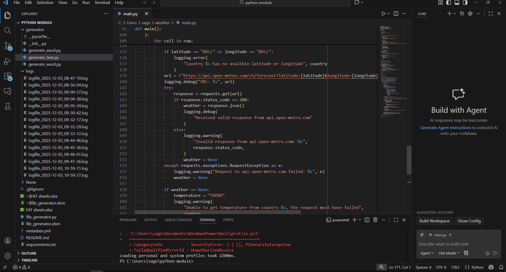

#+ATTR_LATEX: :placement [H]
#+CAPTION: My final Ignition HMI
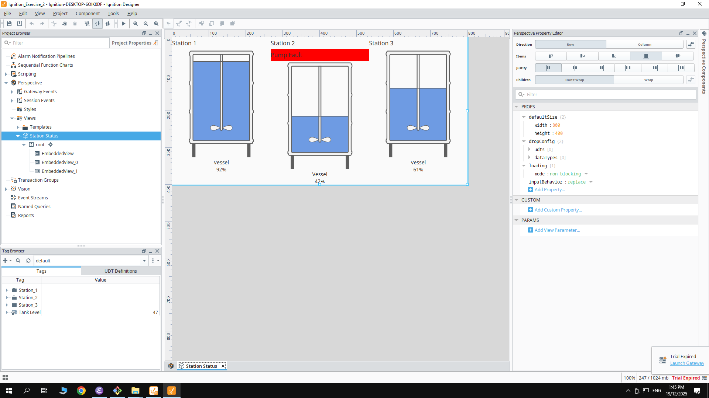

* Week 2
- From 08/12/2025 to 12/12/2025
** Task you Did This Week
*** Day 1
**** Research Quiz
 - 4hr
 - Learn how to research effectivly for our project
   
**** Comparison Matrix Quiz
 - 4hr
 - Learn how to use a comparison matrix for our project
   
*** Day 2
**** Project Kickoff
 - 30min
 - Felix Clark, Melisa Jones and Amy Liddy
 - Describe my project and what is expected of me
 - This will be done for the rest of my time at SAGE
 - My project is about automating AutoCAD
   
**** Project Research
 - 5.5hr
 - Research the project
   
**** Work Breakdown Structure Workshop + Quiz
 - 2hr
 - Learn about WBS and how to use them
   
*** Day 3
Sick :(

*** Day 4
**** Project Research
 - 4hr
 - Research the project

**** Create Project Presentation
 - 4hr
 - Create a presentation that describes my project
   
*** Day 5
**** Project Presentation
 - 4hr
 - Finish presntation and present it
   
**** Jira Setup
 - 4hr
 - A project managment tool that will be used
   - Learnt how to use it
     
** What You Learn From These Tasks
Learnt about the project itself. I will be creating a program that automates the job of engineers, I will be required to create a VBA/python/AutoLISP program that automatically modifies an AutoCAD drawing based on an Excel spread sheet. The presentation was nice because it let me learn about the other interns projects.\\

A lot of project managment tools that will be useful for the project; being able to effectively manage my time will be crucial in producing a good final program.

** Evidence
#+ATTR_LATEX: :placement [H]
#+CAPTION: My first presentation
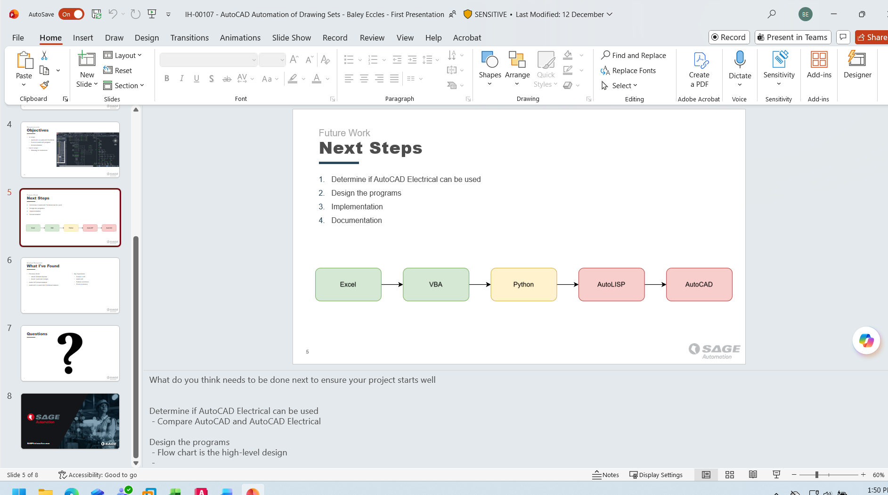

#+ATTR_LATEX: :placement [H]
#+CAPTION: Image of Jira, will be used for project management
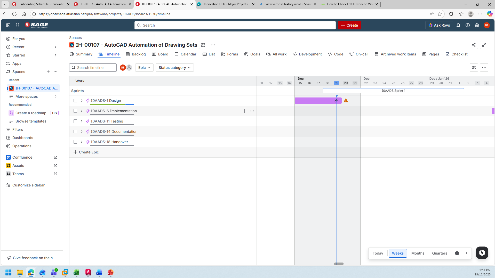

* Week 3
- From 15/12/2025 to 19/12/2025
** Task you Did This Week
*** Day 1
**** Project Check-in
 - 30min
 - Felix Clark
 - Check how Im going with the project
   - Verify that I know what I am doing
     
**** Project Research
 - 8hr
 - More project research
   
*** Day 2
**** Compare AutoCAD and AutoCAD Electrical
 - 4hr
 - For the project they need to know if can use AutoCAD Electrical or if they have to use AutoCAD
 - SAGE typically uses AutoCAD Electrical, but their clients use AutoCAD
   
**** Determine Feature Requirements
 - 4hr
 - Before begining on the project I need to know what I am doing
 - Make a list of what is required for the program
   
*** Day 3
**** Learn AutoLISP
 - 8hr
 - AutoCAD and AutoCAD Electrical uses AutoLISP to do its scripting
 - I need to use AutoLISP in my project to automate tasks in AutoCAD
 - I made some scripts to do things
   
*** Day 4
**** Become Familiar With SAGE Scripts
 - 4hr
 - SAGE has AutoLISP scripts
 - I went through and understood what they have previously done to automate things
   - There were small things, nothing too major or that I could incorporate into my project.
     
*** Day 5
**** Program Flow Chart
 - 8hr
 - Create a program flow chart so when I get back from a two week break I know what I am doing

** What You Learn From These Tasks
This week provided a good introduction to the implementation of my project. Understanding what AutoLISP is capable of is crucial in developing my understanding of how I will implement my project.\\

The program flow chart provides a great overview of what I need to accomplish over the coming weeks. It shows me how things will be done and it tells me why.

** Evidence
#+ATTR_LATEX: :placement [H]
#+CAPTION: My completed flow chart
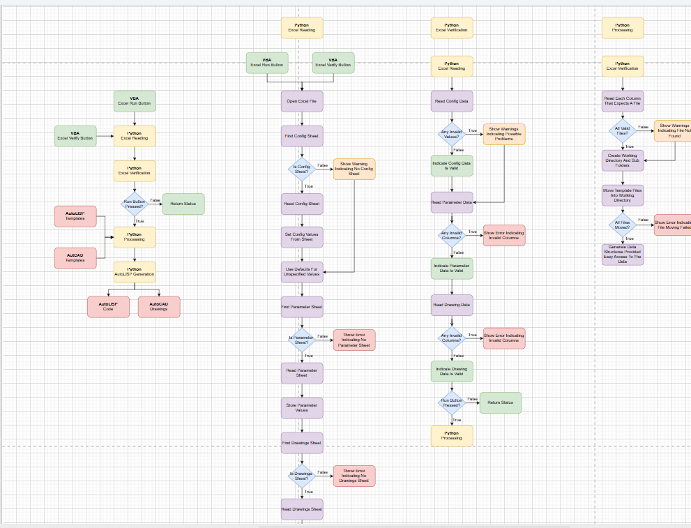

#+ATTR_LATEX: :placement [H]
#+CAPTION: Some CAD drawings Felix sent me
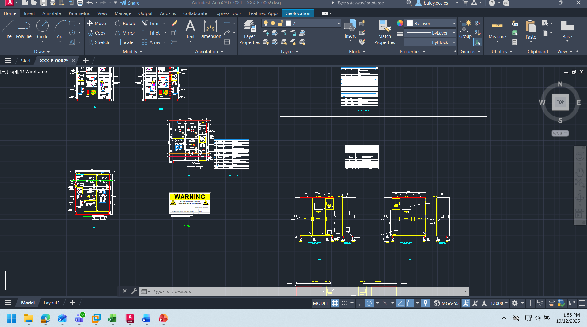

* Week 4
- From 5/01/2026 to 9/01/2026
** Task you Did This Week
*** Day 1
**** Project Check-in
 - 30min
 - Felix Clark
 - Update on what I am doing for my project.
 - Said that I this week will be delayed because I have PLC training to do
   
**** Project Development
 - 7.5hr
 - Start on reading the Excel template in Python
   - Successfully read configuration sheet
   - Successfully read parameters and sheetList sheets
 - VBA buttons in Excel to start and verify the sheet
   
*** Day 2
**** Project Development
 - 1.5hr
 - Fix sheetList dictionary bug
 - Add debug logging and formatting changes from pylint
 - Add docstrings to classes
   
**** PLC Training - CAPS 1: ITIA
 - 6.5hr
 - Training course on Rockwell PLC's
   - Learnt how PLC's work
   - Learnt how PLC's interact with inputs/outputs
     
*** Day 3
**** Project Development
 - 1.5hr
 - Start verification of the sheets
   - Small start on configuration verification
     
**** PLC Training - CAPS 1: ITIA
 - 6.5hr
 - Relay logic
   - Used timers and relays to build a circuit that turns on/off lights at specific times
 - Learnt ladder diagrams
   - How to implement them in Logix5000 (the PLC programming program used)

*** Day 4
**** Project Development
 - 1.5hr
 - Finish configuration sheet verification
 - Finish parameters sheet verification

**** PLC Training - CAPS 1: ITIA
 - 6.5hr
 - Integration Project
   - A project that takes place on a conveyer belt.
     - Objects are put through the conveyer
     - Depending on the object type do different things
     - Read sensors to determine object type
     - Write to actuators at specific times to move the objects
   - Create a ladder logic program to complete the following
     1. Tall plastic objects go all the way though
     2. Tall metal objects get stoped by linear gate
     3. Short objects get pushed off the conveyer

*** Day 5
**** Project Development
 - 1.5hr
 - Finish SheetList sheet verification
 - Add error handling

**** PLC Training - CAPS 1: ITIA
 - 6.5hr
 - Integration Project Testing
 - PLC Fault Finding

** What You Learn From These Tasks
Most of the week was spent learning how PLC's work and how to use them effectivly. I learnt Logix5000, a piece of design software for Rockwell PCL's, I implemented a ladder program in it that completes a complex task. This is a PLC's are used in industry all the time, hence learning them is a critical experience in my eningeering journey.

** Evidence
#+ATTR_LATEX: :placement [H]
#+CAPTION: Logix5000 ladder program
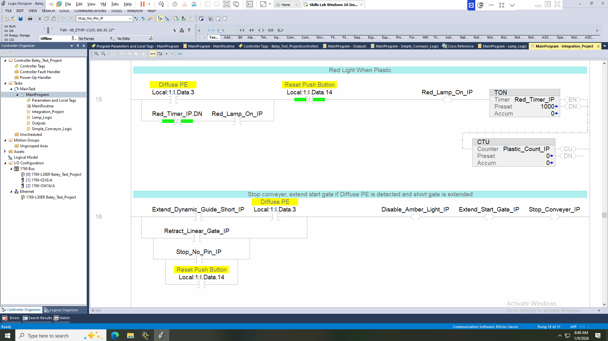

#+ATTR_LATEX: :placement [H]
#+CAPTION: The conveyer setup for me to automate
[[./SAGE_Integration_Project_Conveyer.png]]

#+ATTR_LATEX: :placement [H]
#+CAPTION: More Logix5000 ladder programs
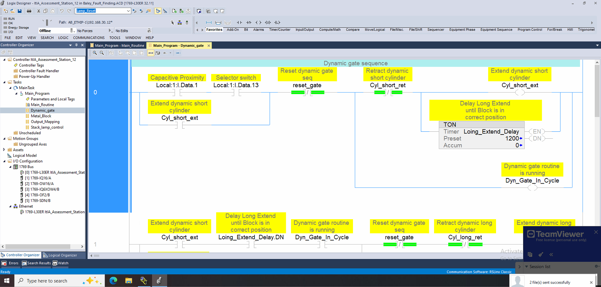

#+ATTR_LATEX: :placement [H]
#+CAPTION: The real world conveyer with lights being switched on/off
[[./SAGE_Conveyer.png]]

* Week 5
- From 12/01/2026 to 16/01/2026
** Task you Did This Week
*** Day 1
**** Project Check-in
 - 30min
 - Talked to Felix Clark about how my project is going
   
**** Project Work
 - 7.5hr
 - Start implementing automatic text replacement
   
*** Day 2
**** Project Work
 - 8hr
 - Finish implementing automatic text replacement
 - Start automatic drawing generation

*** Day 3
**** Project Work
 - 8hr
 - Continue with automatic drawing generation
   
*** Day 4
**** Project Work
 - 7.5hr
 - Finish automatic drawing generation
 - Made an example on how to use the developed program so far
   
**** Sprint Review
 - 30min
 - Made a plan for the following week
 - Talked to Angello De Ionno about how my project is coming along
 - Need more info on what is needed for this to be useful for SAGE
   
*** Day 5
**** Project Work
 - 8hr
 - Code cleanup
 - Documentation

** What You Learn From These Tasks
How to effectivly combine programing languages together to complete a more compicated task. It is not possible to complete my project in just one programming language, Python does the heavy lifting, AutoLISP interacts with AutoCAD and VBA handles the Excel side of things.

** Evidence
#+ATTR_LATEX: :placement [H]
#+CAPTION: My commits to the GitLab repository
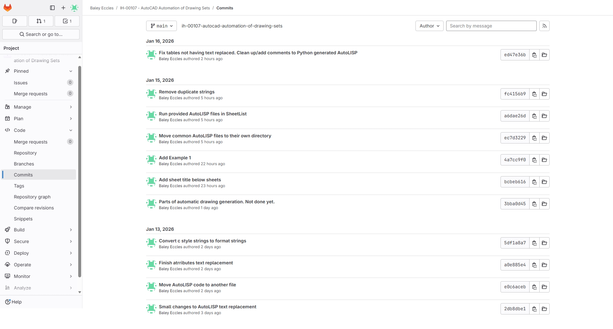

#+ATTR_LATEX: :placement [H]
#+CAPTION: Image of my Confluence page used for documentation
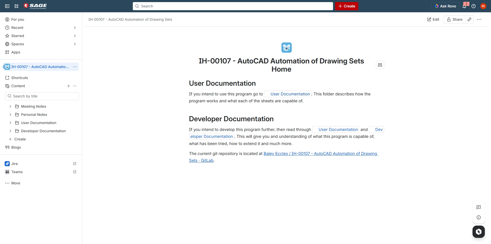

#+ATTR_LATEX: :placement [H]
#+CAPTION: The first AutoCAD example
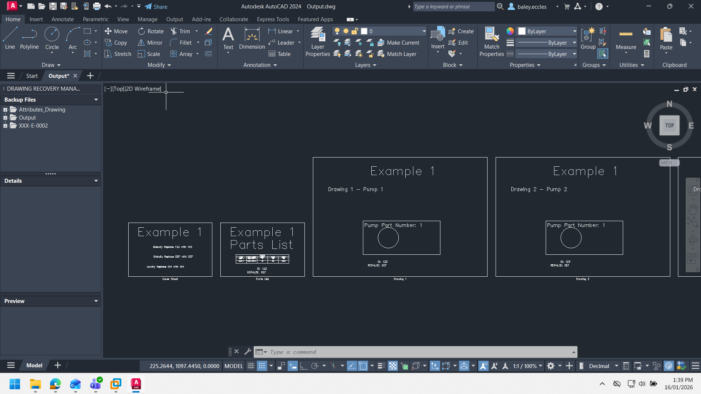

* Week 6
- From 19/01/2026 to 23/01/2026
** Task you Did This Week
*** Day 1
**** Project Check-in
 - 30min
 - Talked to Felix Clark about how my project is going
   - Gave me a bunch more stuff to do
     
**** Project Work
 - 7.5hr
 - Small suggestions that Felix Clark gave me
   - Replace __TEXT__ with <<TEXT>> for text replacement
   - Minor attribute modification in AutoCAD

*** Day 2
**** Lunch and Learn
 - 1hr
 - Presentation that happens over lunch
 - NHP - Stratix Switches Overview
   - Talked about switches and stuff
     
**** Project Work
 - 7hr
 - Smarter reading of config sheet.
 - Better reading logic for Parameters and SheetList

*** Day 3
**** Project Work
 - 8hr
 - Update the first example
 - Run AutoLISP per dwg file
   
*** Day 4
**** Project Work
 - 7.5hr
 - Get ready for inital release.
 - Add release generation script and update Excel template
 - Release version v0.0.1 of the program
   
**** Sprint Review
 - 30min
 - Made a plan for the following week
 - Talked to Angello De Ionno about how my project is coming along

*** Day 5
**** Project Work
 - 8hr
 - Code cleanup
 - Documentation

** What You Learn From These Tasks
The Lunch and Learn was interesting, learning about how switches are used in industry made me recall the networking class I did in my second year at UTAS. The meeting with Felix gave me more undertstanding of how my project can/will be used to automate SAGE's processes.

** Evidence
#+ATTR_LATEX: :placement [H]
#+CAPTION: Commits for my project in Emacs
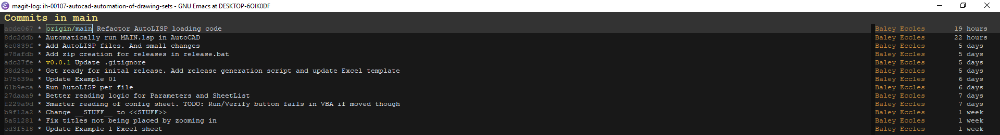

#+ATTR_LATEX: :placement [H]
#+CAPTION: The first AutoCAD example with blocks
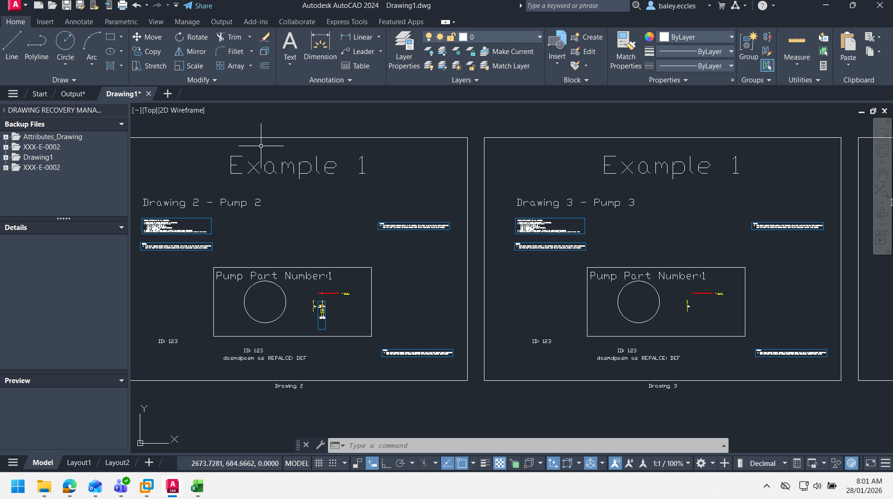

#+ATTR_LATEX: :placement [H]
#+CAPTION: My Jira for the week
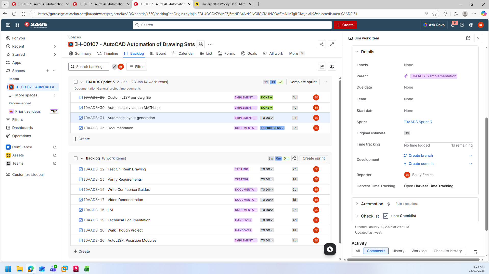

* Week 7
- From 26/01/2026 to 30/01/2026
** Task you Did This Week
*** Day 1
 - Public Holiday
 - Austrlia Day
   
*** Day 2
**** Project Work
 - 7.5hr
 - Python code to open a new dwg file and run the AutoLISP
 - Refactor AutoLISP loading code
   
**** Project Check-in
 - 30min
 - Feix Clark and Melissa Jones
 - Talked about next steps
 - Gave me things to do
 - Investigated attribute modification methods
 - Showcase my project to Melissa Jones
   
*** Day 3
**** Project Work
 - 8hr
 - Started automatic layout generation

*** Day 4
**** Project Work
 - 7.5hr
 - Cleaned up the code that generates layouts

**** Sprint Review
 - With Amy Liddy and Angello De Ionno
 - Talked about how my project is going
 - Disscussed what is in the plan for the following week
 - Showcase my project to Amy Liddy

*** Day 5
**** Project Work
 - 8hr
 - Layout generation work
   - Renaming layouts
   - Producing pdfs

** What You Learn From These Tasks
The project check-in was very productive, it gave me better insight to how the project will be used and what is required of me. Melisa Jones has much more experience in AutoCAD, she helped with ideas about attribute modification.

** Evidence
#+ATTR_LATEX: :placement [H]
#+CAPTION: Email Melissa Jones sent regarding attribute modifications
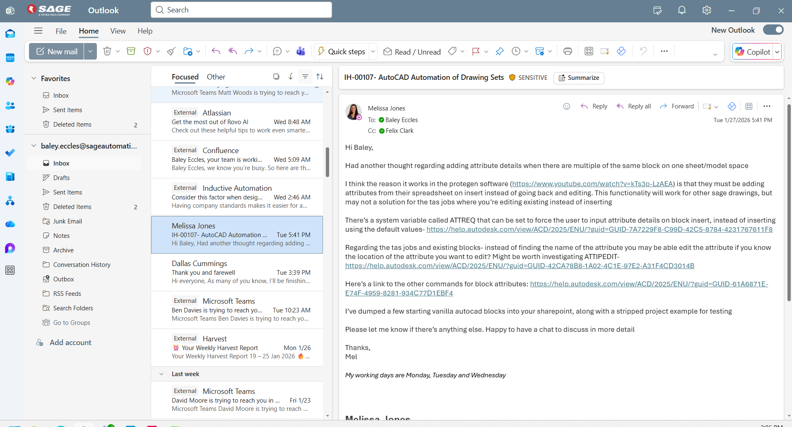

#+ATTR_LATEX: :placement [H]
#+CAPTION: Drawing space for the first AutoCAD example
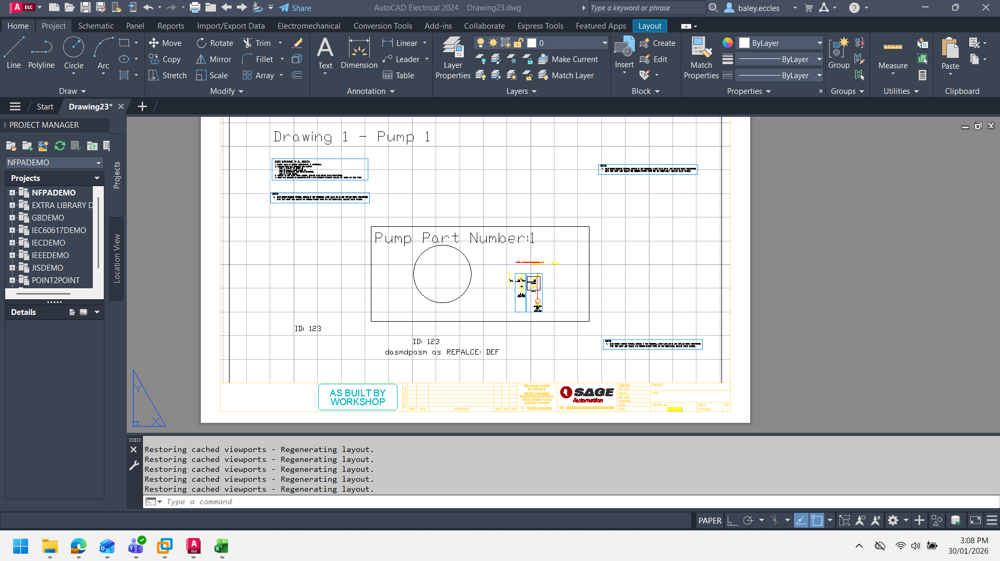

* Week 8
- From 02/02/2026 to 06/02/2026
** Task you Did This Week
*** Day 1
**** Project Work
 - 8hr
 - Refactor the way Python loads the AutoLISP scripts into AutCAD
 - Minor bug fixes that were not addressed last week
   
*** Day 2
**** Project Work
 - 7.5hr
 - Modify the text in the layout
   - Now when exported to pdf it has titles and stuff
 - Create a second example
   
**** Project Check-in
 - 30min
 - Talked with Felix Clark about how my project is going
 - Gave me extra work to do for this week
   
*** Day 3
**** Project Work
 - 8hr
 - Add support for multiple dwg files
   - Instead of putting all the drawings into one file
 - Small code changes
 - Documentation
   
*** Day 4
**** Sprint review
 - 30min
 - Organised work to be done for the next week
   
**** Critical Thinking Exercise
 - 2hr
 - Got into a group with other interns and solved problems
   
**** Project Work
 - 5.5hr
 - Execel sheet for example 3
   - Uses the up and coming feature of block placement
 - Documentation
   
*** Day 5
**** Project Work
 - 8hr
 - Block placment work
   - Automatically build drawings using an Excel spreadsheet
     
** What You Learn From These Tasks
The critical thinking exercise allowed me to meet new interns that I have not talked to yet. The project work has been more of the same stuff compared to the last few weeks, but it still has been enjoyable.

** Evidence
#+ATTR_LATEX: :placement [H]
#+CAPTION: The Execl Spreadsheet being used to automate the AutoCAD
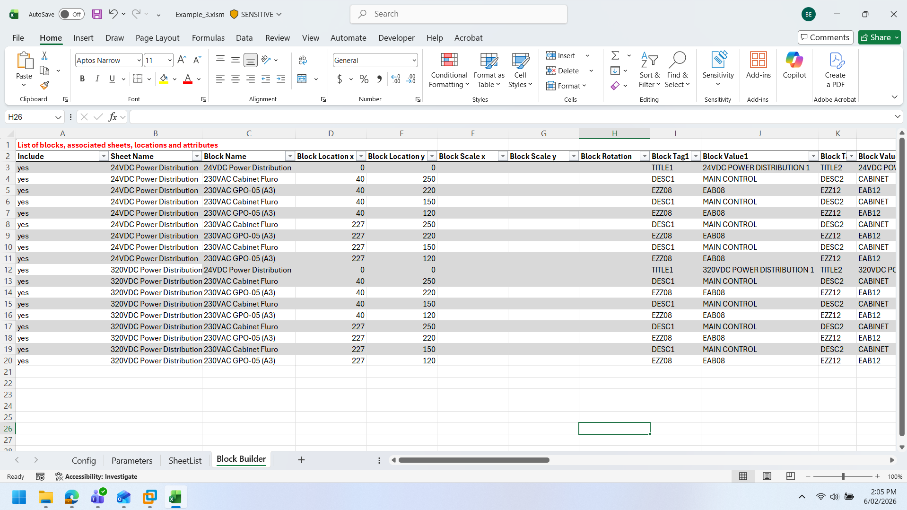

#+ATTR_LATEX: :placement [H]
#+CAPTION: Image of the critical thinking exercise
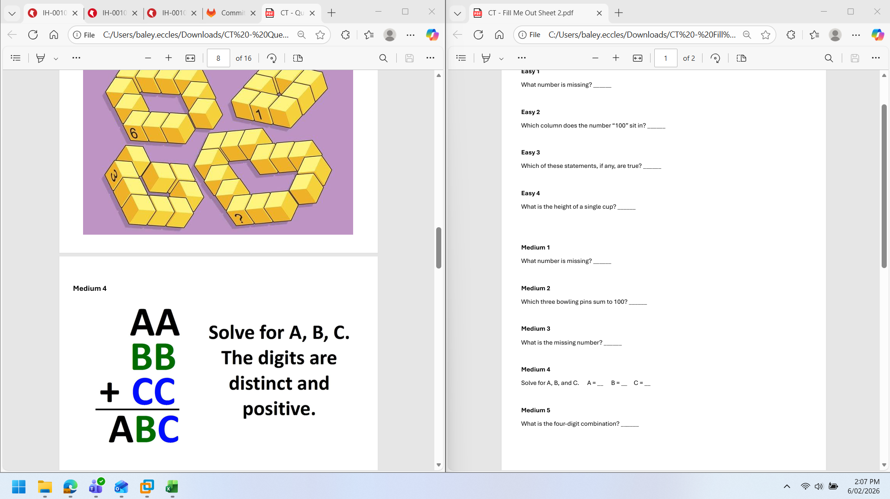

* Week 9
- From 09/02/2026 to 13/02/2026
** Task you Did This Week
*** Day 1
**** Project Check-in
 - 30min
 - Talked with Felix Clark about my project
 - Said that I will do block placment this week
 - Melissa Jones will join next week

**** Project Work
 - 7.5hr
 - Block placement work
   - Implement reading the Excel sheet in Python
   - Finish the third example

*** Day 2
**** Project Work
 - 4hr
 - More block placement work
   - Implement AutoLISP code to place blocks
   - It works as intended
     
**** AI Hackathon
 - 4hr
 - Presentation on how to use AI effectively
 - Designed and built a space invaders clone
   
*** Day 3
**** Project Work
 - 8hr
 - Combine pdfs
   - When the drawings are plotted they are individual
   - Now they are joined into one pdf
 - A bunch of code cleanup
   
*** Day 4
**** Project work
 - 7hr
 - Release v0.0.3
   - Includes block placemnt
   - and combining pdfs
   - Testing to ensure everything works

**** Final Presentations
 - 1hr
 - Watched other interns final presentations

**** Sprint Review
 - 1hr
 - Amy Liddy was late, had to wait an extra hour for her
 - She wasn't able to make it
 - Has to be reschedualed to next week

*** Day 5
**** Project Work
 - 7hr
 - Code cleanup
 - Implement TODOs that are scattered around the code base
   
** What You Learn From These Tasks
The other interns final presentations were interesting, one involved PowerCAD and the other WinCC OA. The AI hackathon highlighted what AI is capabale of and how to use it effectivly to develop things, although I have not been using it in my project.

** Evidence
#+ATTR_LATEX: :placement [H]
#+CAPTION: Finished AI hackathon
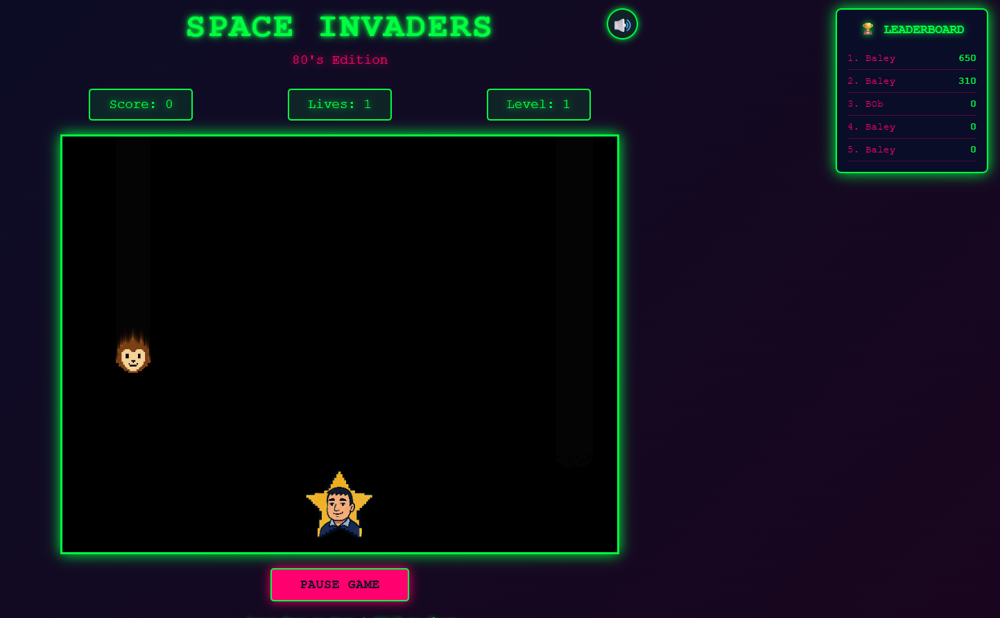

#+ATTR_LATEX: :placement [H]
#+CAPTION: My Jira for the week
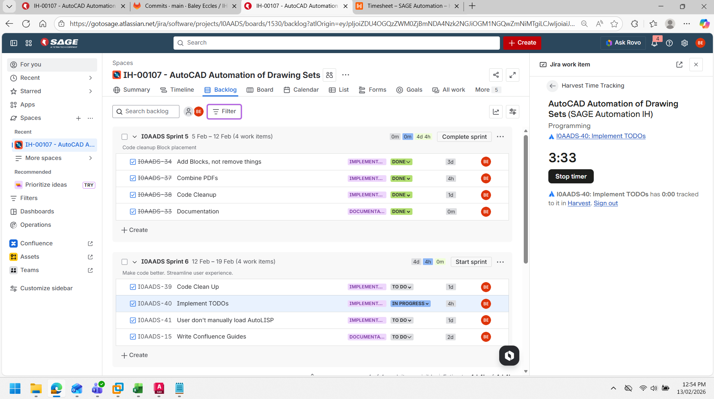

#+ATTR_LATEX: :placement [H]
#+CAPTION: AutoCAD example three, uses the block builder to place everything
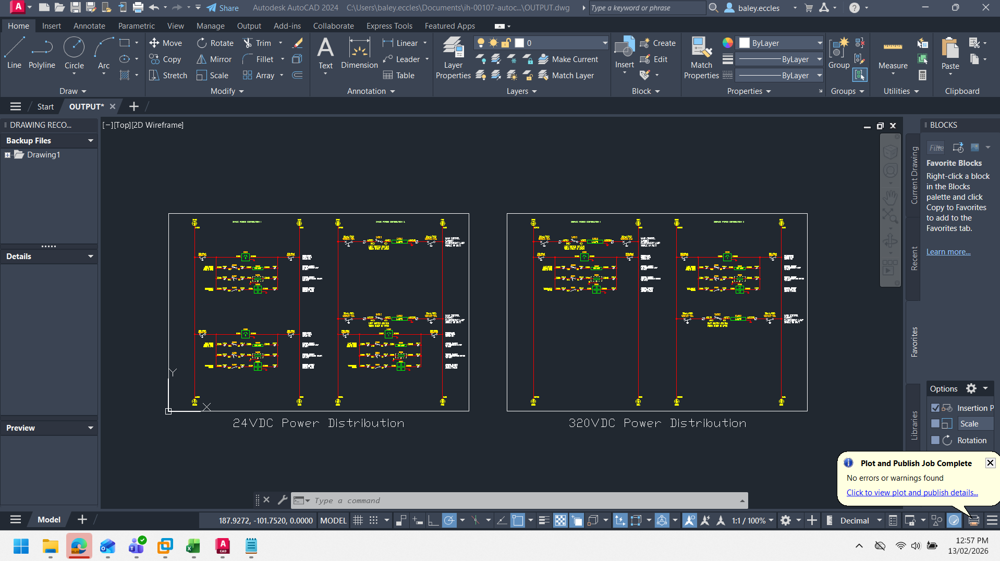

* Week 10
- From 16/02/2026 to 20/02/2026
** Task you Did This Week
*** Day 1
**** Project Work
 - 8hr
 - Code cleanup
   - Change how Excel is read
   - Automaticcally load the MAIN.lsp into AutoCAD

*** Day 2
**** Project Work
 - 7.5hr
 - More code cleanup
   - Trust paths each time a LISP file is loaded
     - This took forever

**** Project Check-in
 - 30min
 - Talked with Melissa and Felix about what needs to be done for my project to be done
   - Mostly just code cleanup and documentation

*** Day 3
**** Project Work
 - 8hr
 - Add dynamic block support
 - Create Example 4
   - Uses dynamic blocks to create PLC's

*** Day 4
**** Project Work
 - 6hr
 - Bunch of code cleanup
   - Docstrings
   - More Example 4 stuff
 - Documentation

**** Sprint Review
 - 30min
 - Talked with Angello about what needs to be done for my project to be finished
 - He will organise a code review
 - Gave me things to do to ensure the code is up to SAGE standards
   
**** Lunch and Learn
 - 1hr
 - Siemens Lunch and Learn-TIA Portal v21 Update and Redundancy
   - This was kind of last minute and I joined late
     
**** Final Presentations
 - 30min
 - Another intern is finishing soon
 - It was on their AI Functional Design Specification Generation project
   
*** Day 5
Sick :(

** What You Learn From These Tasks
The expectations for me on handover. Also the standards of what SAGE needs when it comes to code quality. Overall, provided me valuable insight into how SAGE operates each of their projects.

** Evidence
/I forgot to take pictures/

* Week 11
- From 25/02/2026 to 27/02/2026
** Task you Did This Week
*** Day 1
**** Project Work
 - 8hr
 - Developer documentation
   - How to setup an enviroment to continue development
 - More dynamic block support
   - Add support for boolean values

*** Day 2
**** Project Work
 - 5hr
 - More documentation
 - Code security review
   
**** Sprint Review
 - 30min
 - With Angello De Ionno
 - Talked about how handover will go
   - Need to organise a handover meeting

**** Project Check-in
 - 30min
 - With Felix Clark and Alexander Hurley
 - Alex is the person I will be handing over my project to
 - This was kind of the handover meeting
 - Another meeting will happen next week
 - Showed Alex my project
   
*** Day 3
**** Project Work
 - 8hr
 - Documentation and code cleanup
 - Some handover preparation stuff

** What You Learn From These Tasks
Similar to last week, I learnt about how handover is supposed to go. I will have a presentation next week where I will showcase everthing that I have done.

** Evidence
#+ATTR_LATEX: :placement [H]
#+CAPTION: Teams meeting with Felix and Alex
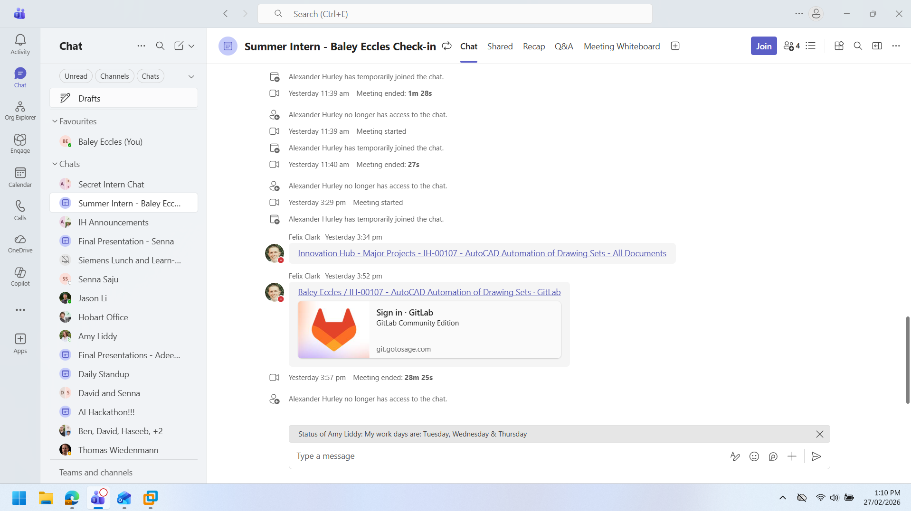

#+ATTR_LATEX: :placement [H]
#+CAPTION: More commit messages in GitLab
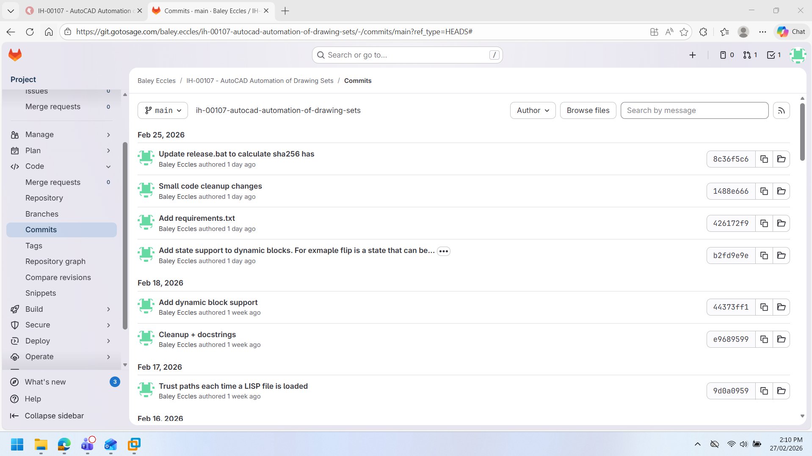

* Week 12
- From 03/03/2026 to 06/03/2026
** Task you Did This Week
*** Day 1
**** Project Work
 - 4hr
 - Documentation
   - Angello De Ionno went through my documenatation and told me stuff that should be cleaned/changed
     
*** Day 2
**** Project Work
- 8hr
- Bunch more documentation
  - Same stuff Angello sent yesterday
- Code cleanup
  - Angello also ran pylint and bandit on my code
  - He said pylint must be >7.0
  - And bandit was fine
    
**** Project Check-in
- Less than 10min
- Brief check in to verify that I dont need anything and that Felix doesnt either
  
*** Day 3
**** Presentation Creation
 - 3hr
 - Create my final presentation to show what I have done during my 12 weeks at SAGE
   
**** Other Intern Presentations
 - 3hr
 - Watched other interns present what they have done
   
**** My Presentation
 - 10min
 - Present what I have done
   
**** Project Work
 - 2hr
 - Small documenatation changes
 - Get access to new GitLab repo and make pull request

*** Day 4
**** Project Work
 - 8hr
 - A bunch of small tasks to finalise the project
 - Fix up documentation
   - Fix GitLab links
   - Add trouble shooting page
   - etc
 - Reach out to Felix to ensure he doesn't need anything more from me
 - Handover meeting

** What You Learn From These Tasks
Having Angello look over my documentation gave me a better understanding of what is required and how to meet SAGE standards. The project has been completed successfully, everything major was implemented. The other interns presentations were interesting.

** Evidence
#+ATTR_LATEX: :placement [H]
#+CAPTION: pylint being ran on my project, has score greater than 7.0
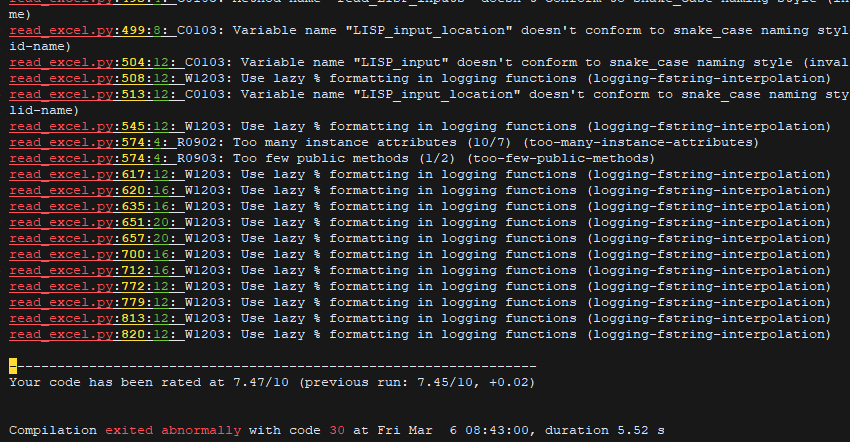

#+ATTR_LATEX: :placement [H]
#+CAPTION: Merge request for the new repository I don't have access to
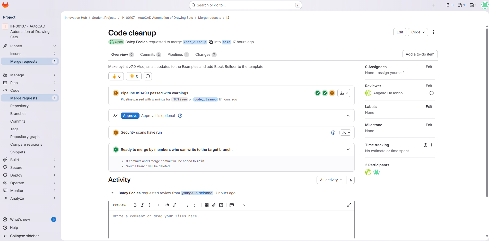

#+ATTR_LATEX: :placement [H]
#+CAPTION: My final presentation
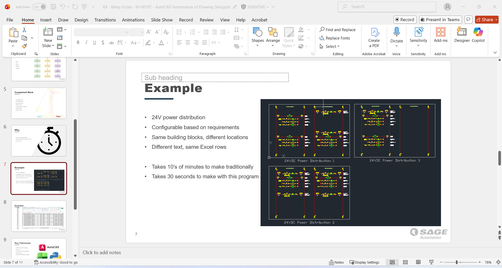
