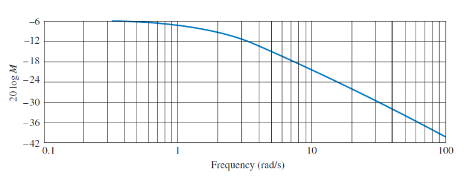
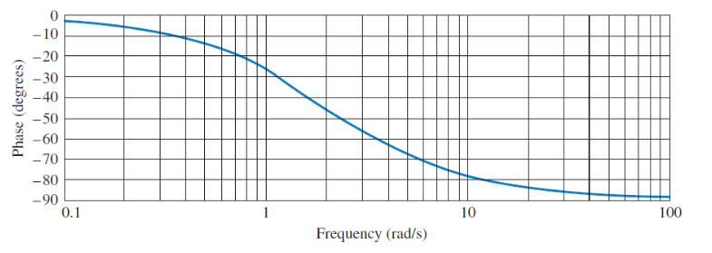

:PROPERTIES:
:ID:       79b422d5-ff34-41ab-8b86-67e6ecfc68ad
:END:
#+title: Bode Plots
#+date: [2024-09-15 Sun 19:06]
#+AUTHOR: Baley Eccles - 652137
#+STARTUP: latexpreview

* Bode Plots
 - A way to reperesent [[id:80120a64-eeb7-471c-94e2-a3c537a21699][Laplace Transforms]] and [[id:e2fd0b83-635c-48b4-85c0-2067477a0e63][Fourier Transforms]]
 - Two types magnitude and phase
 - Creating the subsitute into the [[id:c7591f3a-c2d4-4591-b6af-b0db831a296c][Transfer Function]] $s=j\omega$
   - We can either take the magnitude or phase of it
     - Take the limits as $\omega \rightarrow 0$ and $\omega \rightarrow \infty$
     - We use [[id:d041a889-d4af-4598-8434-866ecc7ce005][Decibels]] to plot them
     - $+20dB/dec$ for [[id:720b73a5-8e1c-465f-a0a2-3db6189efbf4][zeros]]
     - $-20dB/dec$ for [[id:720b73a5-8e1c-465f-a0a2-3db6189efbf4][poles]]

** Problems
 - $|G(s)| < 1$ when $\angle G(s) = -180^o$
   - Because the signal is flipped and sent back to the error
** Example Bode Plots
*** Frequency

*** Phase

** Example
\[G(s) = 500\frac{s + 3}{(s + 1)(s + 50)}\]
Plot $|G(j\omega)|$ and $\angle G(j\omega)$
*** Magnitude
\[|G(0)| = 500\frac{3}{50} = 150\]
\[|G(0)|_{dB} = 20\log_{10}(150) = 43.5\ dB\]

Poles: $\omega = 1$, $\omega = 50$
 - $-20\ dB/dec$
Zero: $\omega = 3$
 - $+20\ dB/dec$

[[xopp-figure:/home/baley/UTAS/org-roam/org-files/Bode_Plot_Magnitude_Example.xopp]]
*** Phase
Initial phase:
\[G(j\omega) = 500\frac{j\omega + 3}{(j\omega + 1)(j\omega + 50)}\]
Poles:
 - $\omega = 1$
   - $\omega = 1/10$
     - ON
   - $\omega = 1\cdot 10 = 10$
     - OFF
   - $-45^o/dec$
 - $\omega = 50$
   - $\omega = 50/10 = 5$
     - ON
   - $\omega = 50\cdot 10 = 500$
     - OFF
   - $-45^o/dec$
Zero: $\omega = 3$
 - $+20\ dB/dec$
   - $\omega = 3/10$
     - ON
   - $\omega = 3\cdot 10 = 30$
     - OFF
   - $+45^o/dec$
Two poles, one zero therefore end at $-90^o$
[[xopp-figure:/home/baley/UTAS/org-roam/org-files/Bode_Plot_Phase_Example.xopp]]

