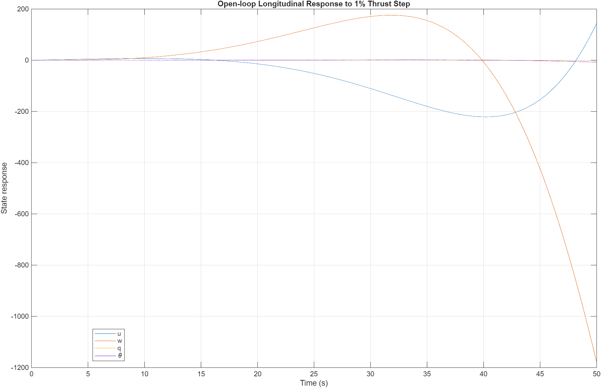
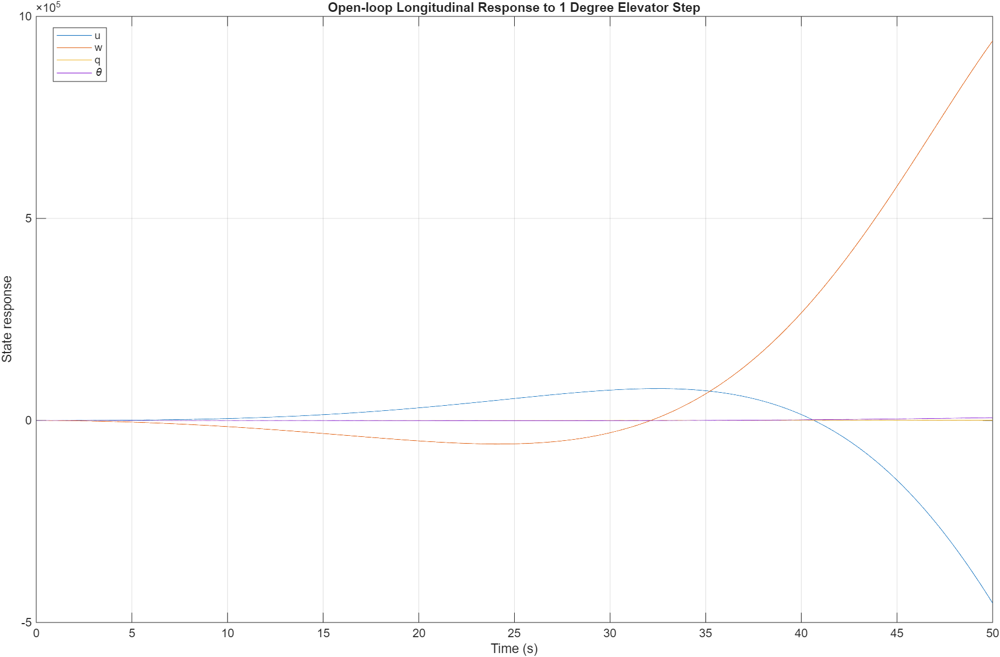
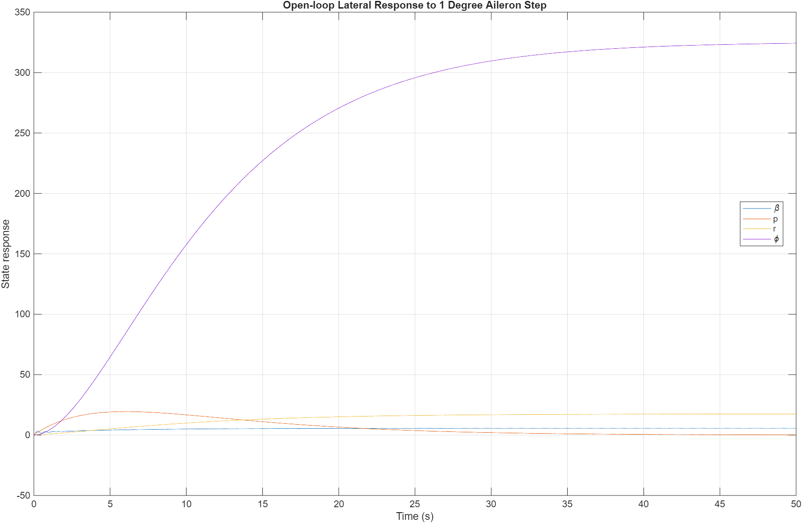
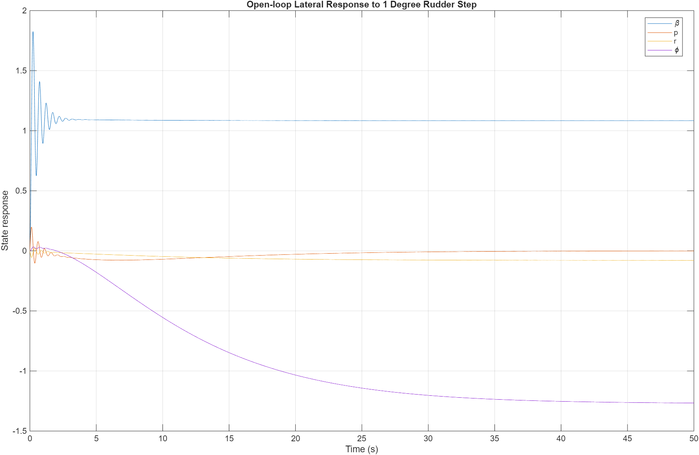
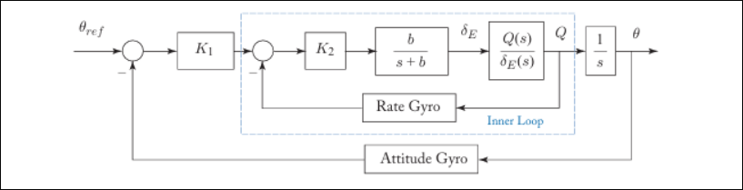
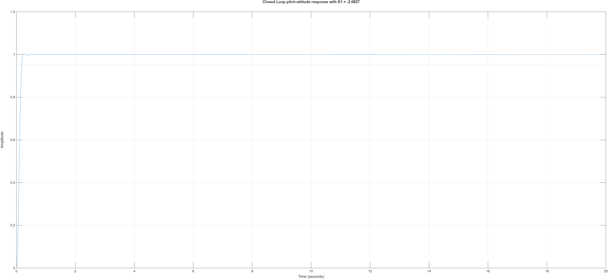
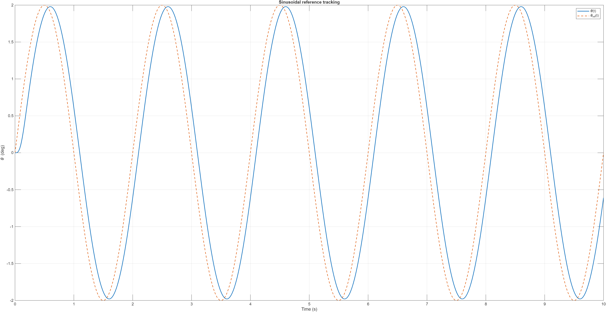

:PROPERTIES:
:ID:       ef0a1cbb-2d92-4e49-ba39-67265565cbfe
:END:
#+title: ENG417 - Control Systems 2 - Design Report
#+date: [2026-03-21 Sat 14:10]
#+AUTHOR: Baley Eccles - 652137
#+STARTUP: latexpreview
#+FILETAGS: :Assignment:UTAS:2026:
#+LATEX_HEADER: \usepackage[a4paper, margin=2cm]{geometry}
#+LATEX_HEADER_EXTRA: \usepackage{minted}
#+LATEX_HEADER_EXTRA: \usepackage{fontspec}
#+LATEX_HEADER_EXTRA: \setmonofont{Iosevka}
#+LATEX_HEADER_EXTRA: \setminted{fontsize=\small, frame=single, breaklines=true}
#+LATEX_HEADER_EXTRA: \usemintedstyle{emacs}
#+LATEX_HEADER_EXTRA: \usepackage{float}

* Question 1

Given the following list of equations:

\begin{align*}
\dot{U} &= RV - WQ - g\sin(\theta) + \frac{1}{m}(-D + T\cos(\alpha)) \\
\dot{V} &= -UR + WB + g\sin(\phi)\cos(\theta) + \frac{1}{m}(Y + T\cos(\alpha)\sin(\beta)) \\
\dot{W} &= UQ - VP + g\cos(\phi)\cos(\theta) + \frac{1}{m}(-L -T\sin(\alpha)) \\
\dot{P} &= (c_1R + c_2P)Q + c_3(L_A + L_T) + c_4(N_A + N_T) \\
\dot{Q} &= c_5PR + c_6(P^2 - R^2) + c_7M \\
\dot{R} &= (c_8P - c_2R)Q + c_4(L_A + L_T) + c_9(N_A + N_T)
\end{align*}

The goal is to show that they can be linearized into the following systems:

\[\begin{bmatrix}
\dot{u} \\
\dot{w} \\
\dot{q} \\
\dot{\theta}
\end{bmatrix} = \begin{bmatrix}
x_u & x_w & x_q & x_\theta \\
z_u & z_w & z_q & z_\theta \\
m_u & m_w & m_q & m_\theta \\
0 & 0 & 1 & 0
\end{bmatrix} \begin{bmatrix}
u \\
w \\
q \\
\theta
\end{bmatrix} + \begin{bmatrix}
x_{\delta_E} & x_{\delta_T} \\
z_{\delta_E} & z_{\delta_T} \\
m_{\delta_E} & m_{\delta_T} \\
0 & 0 \end{bmatrix} \begin{bmatrix}
\delta_E \\
\delta_T
\end{bmatrix}\]

\[\begin{bmatrix}
\dot{\beta} \\
\dot{p} \\
\dot{r} \\
\dot{\phi}
\end{bmatrix} = \begin{bmatrix}
y_{\beta} & y_{p} & y_{r} & y_{\phi} \\
l_{\beta} & l_{p} & l_{r} & l_{\phi} \\
n_{\beta} & n_{p} & n_{r} & n_{\phi} \\
0 & 1 & 0 & 0
\end{bmatrix} \begin{bmatrix}
\beta \\
p \\
r \\
\phi
\end{bmatrix} + \begin{bmatrix}
y_{\delta_A} & y_{\delta_R} \\
l_{\delta_A} & l_{\delta_R} \\
n_{\delta_A} & n_{\delta_R} \\
0 & 0
\end{bmatrix} \begin{bmatrix}
\delta_A \\
\delta_R
\end{bmatrix}\]

** Solution
Choosing the state vector to be:
\[\underline{x} = \begin{bmatrix}
U \\
W \\
Q \\
\theta
\end{bmatrix}\]

Then:
\[\dot{\underline{x}} = \begin{bmatrix}
\dot{U} \\
\dot{W} \\
\dot{Q} \\
\dot{\theta}
\end{bmatrix} = \begin{bmatrix}
RV - WQ - g\sin(\theta) + \frac{1}{m}(-D + T\cos(\alpha)) \\
UQ - VP + g\cos(\phi)\cos(\theta) + \frac{1}{m}(-L -T\sin(\alpha)) \\
c_5PR + c_6(P^2 - R^2) + c_7M \\
Q
\end{bmatrix}\]

Note: $\dot{\theta} = Q$ because $\theta$ is the pitch angle and $Q$ is the pitch rate.

*** Equilibrium Point
The equilibrium point occurs when $\dot{\underline{x}} = 0$ and at the trim point (which we will ignore for now), which gives the following set of equations:

\begin{align*}
0 &= RV - WQ - g\sin(\theta) + \frac{1}{m}(-D + T\cos(\alpha)) \\
0 &= UQ - VP + g\cos(\phi)\cos(\theta) + \frac{1}{m}(-L -T\sin(\alpha)) \\
0 &= c_5PR + c_6(P^2 - R^2) + c_7M \\
0 &= Q
\end{align*}

Solving this we get the following equilibrium points:
\[\bar{x} = \begin{bmatrix}
\bar{U} \\
\bar{W} \\
0 \\
\sin^{-1}{\left(\frac{- D + R V m + T \cos{\left(\alpha \right)}}{g m} \right)}
\end{bmatrix}\]

#+BEGIN_SRC octave :results output :eval never :exports none :session EQU_1 :tangle /home/baley/UTAS/ENG417 - Control Systems 2/Q1.m
clc
clear
close all

if exist('OCTAVE_VERSION', 'builtin')
  set(0, "DefaultLineLineWidth", 2);
  set(0, "DefaultAxesFontSize", 25);
  warning('off');
  pkg load symbolic
end

syms U V W Q theta R P g m D T alpha L phi M c_5 c_6

% Define the equations
eq1 = 0 == R*V - W*Q - g*sin(theta) + (1/m)*(-D + T*cos(alpha));
eq2 = 0 == U*Q - V*P + g*cos(phi)*cos(theta) + (1/m)*(-L - T*sin(alpha));
eq3 = 0 == c_5*P*R + c_6*(P^2 - R^2) + M;
eq4 = 0 == Q;

[U_eq, W_eq, Q_eq, theta_eq] = solve([eq1, eq2, eq3, eq4], [U, W, Q, theta]);

latex(U_eq(2))
latex(W_eq(2))
latex(Q_eq(2))
latex(theta_eq(2))
#+END_SRC

#+RESULTS:

*** Linearising
Taking the Taylor Series of the following about the found point:
\[\dot{\underline{x}} = \begin{bmatrix}
f_1(\underline{x}) \\
f_2(\underline{x}) \\
f_3(\underline{x}) \\
f_4(\underline{x})
\end{bmatrix} = \begin{bmatrix}
RV - WQ - g\sin(\theta) + \frac{1}{m}(-D + T\cos(\alpha)) \\
UQ - VP + g\cos(\phi)\cos(\theta) + \frac{1}{m}(-L -T\sin(\alpha)) \\
c_5PR + c_6(P^2 - R^2) + c_7M \\
Q
\end{bmatrix}\]

The first approximation of the Taylor Series is defined as:

\[f_n(\underline{x}) \approx f_n(\bar{x}) + \sum_{m=1}^M\frac{\partial f_n}{\partial x_m}|_{x = \bar{x}}(x - \bar{x}_m)\]

**** Linearisation of $f_1(\underline{x})$:
\begin{align*}
f_1(\bar{x}) &= RV - W\cdot 0 - g\sin\left(\sin^{-1}{\left(\frac{- D + R V m + T \cos{\left(\alpha \right)}}{g m} \right)}\right) + \frac{1}{m}(-D + T\cos(\alpha)) \\
f_1(\bar{x}) &= 0
\end{align*}
#+BEGIN_SRC octave :results output :eval never :exports none :session EQU_1 :tangle /home/baley/UTAS/ENG417 - Control Systems 2/Q1.m
syms bar_U bar_W

syms c_5 c_6 c_7;

f_1 = R*V - W*Q - g*sin(theta) + (1/m)*(-D + T*cos(alpha));
f_2 = U*Q - V*P + g*cos(phi)*cos(theta) + (1/m)*(-L - T*sin(alpha));
f_3 = c_5*P*R + c_6*(P^2 - R^2) + c_7*M;
f_4 = Q;

f_1_bar_x = f_1;
theta_eq(2);
f_1_bar_x = subs(f_1_bar_x, U, bar_U);
f_1_bar_x = subs(f_1_bar_x, W, bar_W);
f_1_bar_x = subs(f_1_bar_x, Q, 0);
f_1_bar_x = subs(f_1_bar_x, theta, theta_eq(2));

f_1_bar_x = simplify(f_1_bar_x);
#+END_SRC

#+RESULTS:

\[\sum_{m=1}^M\frac{\partial f_n}{\partial x_m}|_{x = \bar{x}}(x - \bar{x}_m) = 0 + 0 - Q \bar{W} - g \sqrt{\frac{g^{2} m^{2} - \left(- D + R V m + T \cos{\left(\alpha \right)}\right)^{2}}{g^{2} m^{2}}} \left(\theta - \operatorname{asin}{\left(\frac{- D + R V m + T \cos{\left(\alpha \right)}}{g m} \right)}\right)\]

#+BEGIN_SRC octave :results output :eval never :exports none :session EQU_1 :tangle /home/baley/UTAS/ENG417 - Control Systems 2/Q1.m
theta_eq(2);
bar_x = [bar_U, bar_W, 0, theta_eq(2)];
x = [U, W, Q, theta];

d_f_1_d_x = [diff(f_1, U), diff(f_1, W), diff(f_1, Q), diff(f_1, theta)];
d_f_1_d_x = subs(d_f_1_d_x, [U, W, Q, theta], bar_x);
d_f_1_d_x_x_bar_x = simplify(d_f_1_d_x.*(x - bar_x));
d_f_1_d_x_x_bar_x = sum(d_f_1_d_x_x_bar_x);
latex(d_f_1_d_x_x_bar_x);
#+END_SRC

#+RESULTS:

Hence:
\[f_1(\underline{x}) \approx - Q \bar{W} - g \sqrt{\frac{g^{2} m^{2} - \left(- D + R V m + T \cos{\left(\alpha \right)}\right)^{2}}{g^{2} m^{2}}} \left(\theta - \operatorname{asin}{\left(\frac{- D + R V m + T \cos{\left(\alpha \right)}}{g m} \right)}\right)\]

#+BEGIN_SRC octave :results output :eval never :exports none :session EQU_1 :tangle /home/baley/UTAS/ENG417 - Control Systems 2/Q1.m
f_1_underline_x = simplify(f_1_bar_x + d_f_1_d_x_x_bar_x);
latex(f_1_underline_x)
#+END_SRC

#+RESULTS:

**** Linearisation of $f_2(\underline{x})$:
\begin{align*}
f_2(\bar{x}) = - \frac{L}{m} - P V - \frac{T \sin{\left(\alpha \right)}}{m} + g \sqrt{1 - \frac{\left(- D + R V m + T \cos{\left(\alpha \right)}\right)^{2}}{g^{2} m^{2}}} \cos{\left(\phi \right)}
\end{align*}
#+BEGIN_SRC octave :results output :eval never :exports none :session EQU_1 :tangle /home/baley/UTAS/ENG417 - Control Systems 2/Q1.m
syms bar_U bar_W

f_2_bar_x = f_2;
theta_eq(2);
f_2_bar_x = subs(f_2_bar_x, U, bar_U);
f_2_bar_x = subs(f_2_bar_x, W, bar_W);
f_2_bar_x = subs(f_2_bar_x, Q, 0);
f_2_bar_x = subs(f_2_bar_x, theta, theta_eq(2));

f_2_bar_x = simplify(f_2_bar_x);
latex(f_2_bar_x)
#+END_SRC

#+RESULTS:

\[\sum_{m=1}^M\frac{\partial f_n}{\partial x_m}|_{x = \bar{x}}(x - \bar{x}_m) = Q \bar{U} - \frac{\left(\theta - \operatorname{asin}{\left(\frac{- D + R V m + T \cos{\left(\alpha \right)}}{g m} \right)}\right) \left(- D + R V m + T \cos{\left(\alpha \right)}\right) \cos{\left(\phi \right)}}{m}\]

#+BEGIN_SRC octave :results output :eval never :exports none :session EQU_1 :tangle /home/baley/UTAS/ENG417 - Control Systems 2/Q1.m
bar_x = [bar_U, bar_W, 0, theta_eq(2)];
x = [U, W, Q, theta];

syms c_5 c_6 c_7

d_f_2_d_x = [diff(f_2, U), diff(f_2, W), diff(f_2, Q), diff(f_2, theta)];
d_f_2_d_x = subs(d_f_2_d_x, [U, W, Q, theta], bar_x);
d_f_2_d_x_x_bar_x = simplify(d_f_2_d_x.*(x - bar_x));
d_f_2_d_x_x_bar_x = sum(d_f_2_d_x_x_bar_x);
latex(d_f_2_d_x_x_bar_x)
#+END_SRC

#+RESULTS:

Hence:
\[f_1(\underline{x}) \approx \frac{- L - T \sin{\left(\alpha \right)} + m \left(- P V + Q \bar{U} + g \sqrt{\frac{g^{2} m^{2} - \left(- D + R V m + T \cos{\left(\alpha \right)}\right)^{2}}{g^{2} m^{2}}} \cos{\left(\phi \right)}\right) - \left(\theta - \operatorname{asin}{\left(\frac{- D + R V m + T \cos{\left(\alpha \right)}}{g m} \right)}\right) \left(- D + R V m + T \cos{\left(\alpha \right)}\right) \cos{\left(\phi \right)}}{m}\]

#+BEGIN_SRC octave :results output :eval never :exports none :session EQU_1 :tangle /home/baley/UTAS/ENG417 - Control Systems 2/Q1.m
f_2_underline_x = factor(f_2_bar_x + d_f_2_d_x_x_bar_x);
latex(f_2_underline_x)
#+END_SRC

#+RESULTS:

**** Linearisation of $f_3(\underline{x})$:
\[f_3(\underline{x}) = M c_{7} + P R c_{5} + c_{6} \left(P^{2} - R^{2}\right)\]
$f_3(\underline{x})$ is already linear, so there is no need to make it linear.

**** Linearisation of $f_4(\underline{x})$:
\[f_4(\underline{x}) = Q\]
$f_4(\underline{x})$ is also already linear, so there is no need to create an approximation for it.

**** Linearisation Result

Finally we must substitute the trim point values into the equations, the relevant values can be seen in the following table:
| Gravity (g)              | 9.81 m/s |
| Angle of Attack (\alpha) | 5^o      |
| Velocity (V)             | 182 m/s  |
| Mass (m)                 | 9295 kg  |

#+BEGIN_SRC octave :results output :eval never :exports none :session EQU_1 :tangle /home/baley/UTAS/ENG417 - Control Systems 2/Q1.m
f_1_underline_x_subs = f_1_underline_x;
f_2_underline_x_subs = f_2_underline_x;
f_3_underline_x_subs = f_3;
f_4_underline_x_subs = f_4;

%% I am unsure if some of these values are correct. I just assumed they are zero if I don't know.
value_g = 9.81;
value_alpha = deg2rad(5);
value_V = 182;
value_m = 9295
value_T = 0; 
value_R = 0;
value_D = 0;
value_L = 0;
value_P = 0;
value_M = 75674;
value_c_7 = 3.450;
value_phi = 0;
value_bar_U = value_V;
value_bar_W = 0;

symbolics = [g, alpha, V, m, T, R, D, L, P, M, c_7, phi, bar_U, bar_W]
value_symbolics = [value_g, value_alpha, value_V, value_m, value_T, value_R, value_D, value_L, value_P, value_M, value_c_7, value_phi, value_bar_U, value_bar_W]

f_1_underline_x_subs = vpa(subs(f_1_underline_x_subs, symbolics, value_symbolics), 4)
f_2_underline_x_subs = vpa(subs(f_2_underline_x_subs, symbolics, value_symbolics), 4)
f_3_underline_x_subs = vpa(subs(f_3_underline_x_subs, symbolics, value_symbolics), 4)
f_4_underline_x_subs = vpa(subs(f_4_underline_x_subs, symbolics, value_symbolics), 4)
#+END_SRC

#+RESULTS:
#+begin_example
value_m = 9295
symbolics = (sym) [g  α  V  m  T  R  D  L  P  M  c₇  φ  bar_U  bar_W]  (1×14 matrix)
value_symbolics =

 Columns 1 through 6:

   9.8100e+00   8.7266e-02   1.8200e+02   9.2950e+03            0            0

 Columns 7 through 12:

            0            0            0   7.5674e+04   3.4500e+00            0

 Columns 13 and 14:

   1.8200e+02            0
f_1_underline_x_subs = (sym) -9.81⋅θ
f_2_underline_x_subs = (sym) 182.0⋅Q + 9.81
f_3_underline_x_subs = (sym) 2.611e+5
f_4_underline_x_subs = (sym) Q
#+end_example

Hence we get:
\[A =\left[\begin{matrix}
0 & 0 & 0 & -9.81\\
0 & 0 & 182.0 & 0\\
0 & 0 & 0 & 0\\
0 & 0 & 1.0 & 0
\end{matrix}\right]\]

This is consistent with the following matrix that was obtained by substituting equations and values from the project description:
\[A = \left[\begin{matrix}-1.721 \cdot 10^{-7} & 1.108 \cdot 10^{-6} & 0 & -9.81\\-1.268 \cdot 10^{-5} & -4.203 \cdot 10^{-5} & 182.0 & 0\\1.123 \cdot 10^{-7} & 6.475 \cdot 10^{-8} & -1.076 \cdot 10^{-6} & 0\\0 & 0 & 1.0 & 0\end{matrix}\right]\]
Although there are a lot of values that are close to zero but not exactly.

:TODO: Linearistation of second system OR talk about how it would be similar

* Question 2

The longitudinal and lateral directions each have the linearised, decoupled state space models shown in the solution to Q1.
The concise longitudinal/lateral aerodynamic stability and control derivatives, shown in tables A2.5, A26, A2.7 and A2.8 of the provided document are used to convert the provided aircraft and trim point specifications to match the values required to form the numerical state space models. These calculations can be seen in the MATLAB script shown in Appendix A {name it whatever you like}. These are then used to form state space models. These models are inspected to find poles. Both models have no zeros.

Longitudinal Poles:
$-0.3035+0j$
$0.965 \pm 0.1020j$
$-0.3+0j$

Lateral Poles:
$-1.7188\pm12.7294j$
$-0.1346+0j$
$-0.2009+0j$

From these pole locations we can expect that the longitudinal model will be unstable due to the poles on the RHS of the s-plane. The lateral model may be stable, however slow moving due to the poles close to the Imaginary axis.  
a.

#+ATTR_LATEX: :placement [H]
#+CAPTION: $1\%$ Thrust Step \label{fig:fig1}

Figure \ref{fig:fig1} shows the open-loop longitudinal response to a 1% step in thrust. This shows an unstable response, with large growth in the states $w$ and $u$, which represent motion in the x and z directions. The response is not quickly damped and does not return to equilibrium.
The phugoid mode is the low-frequency longitudinal mode, involving an exchange between forward speed, vertical motion and pitch over a long time scale. The plot shows very slow change over tens of seconds, which can represent the phugoid mode. The large growth of the states suggests the phugoid is lightly damped or unstable in the open-loop. The short-period mode is either weakly exited by the thrust input, or masked by the slow phugoid behaviour. This is because there are no obvious fast oscillation in the plot.
This is not an acceptable response to thrust input alone. The long term divergence would not be acceptable without control. 
b.

#+ATTR_LATEX: :placement [H]
#+CAPTION: $1^o$ Elevator Step \label{fig:fig2}

The elevator step response, shown in \ref{fig:fig2}, is much more dramatic than the thrust response. The very large growth in states $u$ and $q$ and drift in $\theta$ is a clear sign of open-loop longitudinal instability. 
The rapid change in pitch rate is associated with the short-period dynamics, while the longer drift in speed and pitch angle show the phugoid behaviour. This response is unacceptable without control as a small elevator step produces very large state excursions, showing that pitch attitude cannot be maintained without feedback control.
c.

#+ATTR_LATEX: :placement [H]
#+CAPTION: $1^{o}$ Step in Aileron Position \label{fig:fig3}

The aileron step response shows a quick growth then decay in $p$, $r$ and $\beta$ growing slowly and $\phi$ increasing and settling at a very large bank angle instead of returning to zero. This response shows the roll subsidence mode, through the fast response in roll rate $p$ and the spiral mode, through the long term drift in bank angle $\phi$. The roll subsidence mode is a fast, overdamped response which matches the roll rate response. As $\phi$ does not return to zero and instead grows to a large value, the spiral mode appears to be unstable. 
A step in the aileron position causes the aircraft to move into a large sustained bank angle. This is not an acceptable open-loop response. 
d.

#+ATTR_LATEX: :placement [H]
#+CAPTION: $1^{o}$ Step in Rudder Position \label{fig:fig4}

The rudder step response shows short oscillator transients in $\beta$, $p$ and $r$. This is the dutch roll mode. The oscillation decays quickly so the dutch mode appears to be stable and damped. The decay of roll rate $p$ is the roll subsidence mode. The slow drift of bank angle $\phi$ to a non-zero value shows the spiral mode. Again, as $\phi$ does not return to zero this shows the spiral mode is unstable. The long term spiral drift makes the open loop response unacceptable.

Analysis confirms the longitudinal model is unstable, as expected from the pole locations. This is unacceptable for an open-loop system. The lateral mode response is still not acceptable in open-loop due to spiral mode drift.

* Question 3

** Longitudinal Direction
*** Controllability
#+BEGIN_SRC octave :results output :eval never :exports none :session Q3 :tangle /home/baley/UTAS/ENG417 - Control Systems 2/Q3.m
clc
clear
close all

if exist('OCTAVE_VERSION', 'builtin')
  set(0, "DefaultLineLineWidth", 2);
  set(0, "DefaultAxesFontSize", 25);
  warning('off');
  pkg load symbolic
end
syms u w q theta delta_e delta_T

%% Constants
g = 9.81;
m = 9295;
V_0 = 182;
I_y = 75674;
rho = 0.460;
S = 27.871;
bar_bar_c = 3.450;
theta_e = 0;

X_delta_e = 3.651;
X_delta_T = 4.2711;

Z_delta_e = 23.5329;
Z_delta_T = 0;

M_delta_e = -12.7322;
M_delta_T = 0;

%% Equations
%% eta = delta_E
%% tau = delta_T

X_u = -0.0016;
X_w = 0.0103;
X_dot_w = 0;
X_q = 0;
X_eta = 3.651;
X_tau = 4.2711;

Z_u = -0.1179;
Z_w = -0.3907;
Z_dot_w = 0;
Z_q = 0
Z_eta = 23.5329;
Z_tau = 0;

M_u = 0.0085;
M_w = 0.0049;
M_dot_w = 0.0023;
M_q = -0.500;
M_eta = -12.7322;
M_tau = 0;

U_e = V_0;
W_e = 0;

x_u = (X_u/m) + (X_dot_w*Z_u/(m*(m - Z_dot_w)));
z_u = Z_u/(m - Z_dot_w);
m_u = (M_u/I_y) + (Z_u*M_dot_w/(I_y*(m - Z_dot_w)));

x_w = (X_w/m) + (X_dot_w*Z_w/(m*(m - Z_dot_w)));
z_w = Z_w/(m - Z_dot_w);
m_w = (M_w/I_y) + (Z_w*M_dot_w/(I_y*(m - Z_dot_w)));

x_q = ((X_q - m*W_e)/m) + ((Z_q + m*U_e)*X_dot_w)/(m*(m - Z_dot_w));
z_q = (Z_q + m*U_e)/(m - Z_dot_w);
m_q = (M_q/I_y) + ((Z_q + m*U_e)*M_dot_w)/(I_y*(m - Z_dot_w));

x_theta = -g*cos(theta_e) - (X_dot_w*g*sin(theta_e))/(m - Z_dot_w);
z_theta = -(m*g*sin(theta_e))/(m - Z_dot_w);
m_theta = -(M_dot_w*m*g*sin(theta_e))/(I_y*(m - Z_dot_w));

x_delta_e = (V_0*X_eta)/(m) + ((bar_bar_c/V_0)*X_dot_w*Z_eta)/(m*(m - (bar_bar_c/V_0)*Z_dot_w));
z_delta_e = (V_0*Z_eta)/(m - (bar_bar_c/V_0)*Z_dot_w)
m_delta_e = (V_0*M_eta)/(I_y) + (bar_bar_c*M_dot_w*Z_eta)/(I_y*(m - (bar_bar_c/V_0)*Z_dot_w));

x_delta_T = (V_0*X_tau)/(m) + ((bar_bar_c/V_0)*X_dot_w*Z_tau)/(m*(m - (bar_bar_c/V_0)*Z_dot_w));
z_delta_T = (V_0*Z_tau)/(m - (bar_bar_c/V_0)*Z_dot_w)
m_delta_T = (V_0*M_tau)/(I_y) + (bar_bar_c*M_dot_w*Z_tau)/(I_y*(m - (bar_bar_c/V_0)*Z_dot_w));

%% Symbolic Equations
dot_u = u*x_u + w*x_w + q*x_q + theta*x_theta + delta_e*x_delta_e + delta_T*x_delta_T;
dot_w = u*z_u + w*z_w + q*z_q + theta*z_theta + delta_e*z_delta_e + delta_T*z_delta_T;
dot_q = u*m_u + w*m_w + q*m_q + theta*m_theta + delta_e*m_delta_e + delta_T*m_delta_T;
dot_theta = u*0 + w*0 + q*1 + theta*0 + delta_e*0 + delta_T*0;

latex(vpa(dot_u, 4))
latex(vpa(dot_w, 4))
latex(vpa(dot_q, 4))
latex(vpa(dot_theta, 4))

A = [x_u, x_w, x_q, x_theta; ...
     z_u, z_w, z_q, z_theta; ...
     m_u, m_w, m_q, m_theta; ...
     0, 0, 1, 0;];

B = [x_delta_e, x_delta_T; ...
     z_delta_e, z_delta_T; ...
     m_delta_e, m_delta_T; ...
     0, 0;];

latex(vpa(sym(A), 4))
latex(vpa(sym(B), 4))
#+END_SRC

#+RESULTS:
: Z_q = 0
: z_delta_e = 0.4608
: z_delta_T = 0
: 0.08363 \delta_{T} + 0.07149 \delta_{e} - 9.81 \theta - 1.721 \cdot 10^{-7} u + 1.108 \cdot 10^{-6} w
: 0.4608 \delta_{e} + 182.0 q - 1.268 \cdot 10^{-5} u - 4.203 \cdot 10^{-5} w
: - 0.03062 \delta_{e} - 1.076 \cdot 10^{-6} q + 1.123 \cdot 10^{-7} u + 6.475 \cdot 10^{-8} w
: q
: \left[\begin{matrix}-1.721 \cdot 10^{-7} & 1.108 \cdot 10^{-6} & 0 & -9.81\\-1.268 \cdot 10^{-5} & -4.203 \cdot 10^{-5} & 182.0 & 0\\1.123 \cdot 10^{-7} & 6.475 \cdot 10^{-8} & -1.076 \cdot 10^{-6} & 0\\0 & 0 & 1.0 & 0\end{matrix}\right]
: \left[\begin{matrix}0.07149 & 0.08363\\0.4608 & 0\\-0.03062 & 0\\0 & 0\end{matrix}\right]

Hence we get the following matrices for $A$ and $B$.
\[A = \left[\begin{matrix}-1.721 \cdot 10^{-7} & 1.108 \cdot 10^{-6} & 0 & -9.81\\-1.268 \cdot 10^{-5} & -4.203 \cdot 10^{-5} & 182.0 & 0\\1.123 \cdot 10^{-7} & 6.475 \cdot 10^{-8} & -1.076 \cdot 10^{-6} & 0\\0 & 0 & 1.0 & 0\end{matrix}\right]\]
\[B = \left[\begin{matrix}0.07149 & 0.08363\\0.4608 & 0\\-0.03062 & 0\\0 & 0\end{matrix}\right]\]

*_NOTE_*: We can see that many of the values in $A$ are very small, this might cause problems in the following calculations, but the mathematics are still accurate. As calculated before in the linearisation these values should probably be exactly zero.

#+BEGIN_SRC octave :results output :eval never :exports none :session Q3 :tangle /home/baley/UTAS/ENG417 - Control Systems 2/Q3.m
P = [B, A*B, A^2*B, A^3*B];
latex(sym(vpa(P, 4)))
rank(P)
#+END_SRC

#+RESULTS:
: \left[\begin{matrix}0.07149 & 0.08363 & 4.983 \cdot 10^{-7} & -1.44 \cdot 10^{-8} & 0.3004 & -1.173 \cdot 10^{-12} & -7.46 \cdot 10^{-7} & -9.215 \cdot 10^{-8}\\0.4608 & 0 & -5.573 & -1.061 \cdot 10^{-6} & 0.0002471 & 1.71 \cdot 10^{-6} & -6.95 \cdot 10^{-5} & -8.65 \cdot 10^{-11}\\-0.03062 & 0 & 7.08 \cdot 10^{-8} & 9.394 \cdot 10^{-9} & -3.609 \cdot 10^{-7} & -8.041 \cdot 10^{-14} & 3.376 \cdot 10^{-8} & 1.107 \cdot 10^{-13}\\0 & 0 & -0.03062 & 0 & 7.08 \cdot 10^{-8} & 9.394 \cdot 10^{-9} & -3.609 \cdot 10^{-7} & -8.041 \cdot 10^{-14}\end{matrix}\right]
: ans = 4

Next we can use the following equation to find if its controllable:

\begin{align*}
\underline{P} &= [B\ AB\ A^2B\ \hdots\ A^{n-1}B] \\
\underline{P} &= \left[\begin{matrix}0.07149 & 0.08363 & 4.983 \cdot 10^{-7} & -1.44 \cdot 10^{-8} & 0.3004 & -1.173 \cdot 10^{-12} & -7.46 \cdot 10^{-7} & -9.215 \cdot 10^{-8}\\0.4608 & 0 & -5.573 & -1.061 \cdot 10^{-6} & 0.0002471 & 1.71 \cdot 10^{-6} & -6.95 \cdot 10^{-5} & -8.65 \cdot 10^{-11}\\-0.03062 & 0 & 7.08 \cdot 10^{-8} & 9.394 \cdot 10^{-9} & -3.609 \cdot 10^{-7} & -8.041 \cdot 10^{-14} & 3.376 \cdot 10^{-8} & 1.107 \cdot 10^{-13}\\0 & 0 & -0.03062 & 0 & 7.08 \cdot 10^{-8} & 9.394 \cdot 10^{-9} & -3.609 \cdot 10^{-7} & -8.041 \cdot 10^{-14}\end{matrix}\right] \\
\textrm{rank}(P) &= 4
\end{align*}

Thus, the system is controllable. Next we can look at the minimal amount of variables to be actuated to control the system.

#+BEGIN_SRC octave :results output :eval never :exports none :session Q3 :tangle /home/baley/UTAS/ENG417 - Control Systems 2/Q3.m
B_1 = B;
B_1(:,1) = [];
latex(sym(vpa(B_1, 4)))
P_1 = [B_1, A*B_1, A^2*B_1, A^3*B_1];
latex(sym(vpa(P_1, 4)))
rank(P_1)
B_2 = B;
B_2(:,2) = [];
latex(sym(vpa(B_2, 4)))
P_2 = [B_2, A*B_2, A^2*B_2, A^3*B_2];
latex(sym(vpa(P_2, 4)))
rank(P_2)
B_3 = B;
B_3(:,1) = [];
B_3(:,1) = [];
latex(sym(vpa(B_3, 4)))
P_3 = [B_3, A*B_3, A^2*B_3, A^3*B_3];
latex(sym(vpa(P_3, 4)))
rank(P_3)
#+END_SRC

#+RESULTS:
: \left[\begin{matrix}0.08363\\0\\0\\0\end{matrix}\right]
: \left[\begin{matrix}0.08363 & -1.44 \cdot 10^{-8} & -1.173 \cdot 10^{-12} & -9.215 \cdot 10^{-8}\\0 & -1.061 \cdot 10^{-6} & 1.71 \cdot 10^{-6} & -8.65 \cdot 10^{-11}\\0 & 9.394 \cdot 10^{-9} & -8.041 \cdot 10^{-14} & 1.107 \cdot 10^{-13}\\0 & 0 & 9.394 \cdot 10^{-9} & -8.041 \cdot 10^{-14}\end{matrix}\right]
: ans = 4
: \left[\begin{matrix}0.07149\\0.4608\\-0.03062\\0\end{matrix}\right]
: \left[\begin{matrix}0.07149 & 4.983 \cdot 10^{-7} & 0.3004 & -7.46 \cdot 10^{-7}\\0.4608 & -5.573 & 0.0002471 & -6.95 \cdot 10^{-5}\\-0.03062 & 7.08 \cdot 10^{-8} & -3.609 \cdot 10^{-7} & 3.376 \cdot 10^{-8}\\0 & -0.03062 & 7.08 \cdot 10^{-8} & -3.609 \cdot 10^{-7}\end{matrix}\right]
: ans = 4
: \left[\begin{matrix}\\\\\\\end{matrix}\right]
: \left[\begin{matrix}\\\\\\\end{matrix}\right]
: ans = 0

With:
\begin{align*}
B &= \left[\begin{matrix}0.08363\\0\\0\\0\end{matrix}\right] \\
P &= \left[\begin{matrix}0.08363 & -1.44 \cdot 10^{-8} & -1.173 \cdot 10^{-12} & -9.215 \cdot 10^{-8}\\0 & -1.061 \cdot 10^{-6} & 1.71 \cdot 10^{-6} & -8.65 \cdot 10^{-11}\\0 & 9.394 \cdot 10^{-9} & -8.041 \cdot 10^{-14} & 1.107 \cdot 10^{-13}\\0 & 0 & 9.394 \cdot 10^{-9} & -8.041 \cdot 10^{-14}\end{matrix}\right] \\
\textrm{rank}(P) &= 4
\end{align*}

And with:
\begin{align*}
B &= \left[\begin{matrix}0.07149\\0.4608\\-0.03062\\0\end{matrix}\right] \\
P &= \left[\begin{matrix}0.07149 & 4.983 \cdot 10^{-7} & 0.3004 & -7.46 \cdot 10^{-7}\\0.4608 & -5.573 & 0.0002471 & -6.95 \cdot 10^{-5}\\-0.03062 & 7.08 \cdot 10^{-8} & -3.609 \cdot 10^{-7} & 3.376 \cdot 10^{-8}\\0 & -0.03062 & 7.08 \cdot 10^{-8} & -3.609 \cdot 10^{-7}\end{matrix}\right] \\
\textrm{rank}(P) &= 4
\end{align*}

Finally with $B$ being an empty matrix we see the rank is 0. Hence we need at least $\delta_E$ or $\delta_T$ for the system to be controllable.

*** Observability
To determine the observability we can use the following equation:
\[O_M = \begin{bmatrix}
C \\
CA \\
CA^2 \\
\vdots \\
CA^{n-1}
\end{bmatrix}\]
If [[id:b29377c0-13e3-4242-9ffb-ee11173122bc][rank]] of $O_M = n$ then all state variables can be determined based on the output quantities that are measured.

#+BEGIN_SRC octave :results output :eval never :exports none :session Q3 :tangle /home/baley/UTAS/ENG417 - Control Systems 2/Q3.m
C = eye(4);

cols = {[], [1], [1,2], [1,3], [1,4], [1,2,3], [1,2,4], [1,3,4], [1,2,3,4], [2], [2,3], [2,4], [2,3,4], [3], [3,4], [4]};
for idx = 1:numel(cols)
  cols_to_remove = cols{idx};
  cols_keep = setdiff(1:size(C,2), cols_to_remove);
  C_cols = C(:, cols_keep);
  O_M = [C_cols, A*C_cols, A^2*C_cols, A^3*C_cols];
  r = rank(O_M');
  fprintf('removed: %s, kept: %s, rank=%d\n', mat2str(cols_to_remove), mat2str(cols_keep), r);
end

#+END_SRC

#+RESULTS:
#+begin_example
removed: [], kept: [1 2 3 4], rank=4
removed: 1, kept: [2 3 4], rank=4
removed: [1 2], kept: [3 4], rank=4
removed: [1 3], kept: [2 4], rank=4
removed: [1 4], kept: [2 3], rank=4
removed: [1 2 3], kept: 4, rank=4
removed: [1 2 4], kept: 3, rank=4
removed: [1 3 4], kept: 2, rank=4
removed: [1 2 3 4], kept: [], rank=0
removed: 2, kept: [1 3 4], rank=4
removed: [2 3], kept: [1 4], rank=4
removed: [2 4], kept: [1 3], rank=4
removed: [2 3 4], kept: 1, rank=4
removed: 3, kept: [1 2 4], rank=4
removed: [3 4], kept: [1 2], rank=4
removed: 4, kept: [1 2 3], rank=4
#+end_example

|----------------------+----------------------+------|
| Columns Removed      | Columns Kept         | Rank |
|----------------------+----------------------+------|
|                      | $u$ $w$ $q$ $\theta$ |    4 |
| $u$                  | $w$ $q$ $\theta$     |    4 |
| $u$ $w$              | $q$ $\theta$         |    4 |
| $u$ $q$              | $w$ $\theta$         |    4 |
| $u$ $\theta$         | $w$ $q$              |    4 |
| $u$ $w$ $q$          | $\theta$             |    4 |
| $u$ $w$ $\theta$     | $q$                  |    4 |
| $u$ $q$ $\theta$     | $w$                  |    4 |
| $u$ $w$ $q$ $\theta$ |                      |    0 |
| $w$                  | $u$ $q$ $\theta$     |    4 |
| $w$ $q$              | $u$ $\theta$         |    4 |
| $w$ $\theta$         | $u$ $q$              |    4 |
| $w$ $q$ $\theta$     | $u$                  |    4 |
| $q$                  | $u$ $w$ $\theta$     |    4 |
| $q$ $\theta$         | $u$ $w$              |    4 |
| $\theta$             | $u$ $w$ $q$          |    4 |
|----------------------+----------------------+------|

The only time the system was not fully observable is when none of the variables were available. The minimum set of variables required to
be measure the system is $\{U, W, Q, \theta\}$, we can choose any amount from the set and system will be fully observable.

** Lateral Direction
#+BEGIN_SRC octave :results output :eval never :exports none :session Q3 :tangle /home/baley/UTAS/ENG417 - Control Systems 2/Q3.m
clc
clear
close all

if exist('OCTAVE_VERSION', 'builtin')
  set(0, "DefaultLineLineWidth", 2);
  set(0, "DefaultAxesFontSize", 25);
  warning('off');
  pkg load symbolic
end
syms beta p r phi delta_A delta_R

%% Constants
g = 9.81;
m = 9295;
V_0 = 182;
I_y = 75674;
rho = 0.460;
S = 27.871;
bar_bar_c = 3.450;
b = 9.144;

U_e = V_0;
W_e = 0;
theta_e = 0;

Y_beta = -27.38;
Y_p = 0.389;
Y_r = 0.538;
Y_phi = 0;
Y_xi = 0;
Y_zeta = 4.588;

L_beta = -28.08;
L_p = -1.644;
L_r = 0.333;
L_phi = 0;
L_xi = 9.591;
L_zeta = 47.92;

N_beta = 5.481;
N_p = -0.081;
N_r = -1.504;
N_phi = 0;
N_xi = -1.429;
N_zeta = -1.908;

I_x = 12875;
I_y = 75674;
I_z = 85552;
I_xz = 1331;

%% Equations
%% Xi = delta_A
%% zeta = delta_R
y_beta = Y_beta/m;
y_p = (b*Y_p + m*W_e)/(m);
y_r = (b*Y_r + m*U_e)/(m);
y_phi = g*cos(theta_e);
y_delta_A = V_0*Y_xi/m;
y_delta_R = V_0*Y_zeta/m;

l_beta = (I_z*L_beta + I_xz*N_beta)/(I_x*I_z - I_xz^2);
l_p = (I_z*L_p + I_xz*N_p)/(I_x*I_z - I_xz^2);
l_r = (I_z*L_r + I_xz*N_r)/(I_x*I_z - I_xz^2);
l_phi = 0;
l_delta_A = (V_0*(I_z*L_xi + I_xz*N_xi))/(I_x*I_z - I_xz^2);
l_delta_R = (V_0*(I_z*L_zeta + I_xz*L_zeta))/(I_x*I_z - I_xz^2);

n_beta = (I_z*N_beta + I_xz*L_beta)/(I_x*I_z - I_xz^2);
n_p = (I_z*N_p + I_xz*L_p)/(I_x*I_z - I_xz^2);
n_r = (I_z*N_r + I_xz*L_r)/(I_x*I_z - I_xz^2);
n_phi = 0;
n_delta_A = (V_0*(I_z*N_xi + I_xz*L_xi))/(I_x*I_z - I_xz^2);
n_delta_R = (V_0*(I_z*N_zeta + I_xz*L_zeta))/(I_x*I_z - I_xz^2);

%% Symbolic Equations
dot_beta = beta*y_beta + p*y_p + r*y_r + phi*y_phi + delta_A*y_delta_A + delta_R*y_delta_R;
dot_p = beta*l_beta + p*l_p + r*l_r + phi*l_phi + delta_A*l_delta_A + delta_R*l_delta_R;
dot_r = beta*n_beta + p*n_p + r*n_r + phi*n_phi + delta_A*n_delta_A + delta_R*n_delta_R;
dot_phi = beta*0 + p*1 + r*0 + phi*0 + delta_A*0 + delta_R*0;

latex(vpa(dot_beta, 4))
latex(vpa(dot_p, 4))
latex(vpa(dot_r, 4))
latex(vpa(dot_phi, 4))

A = [y_beta, y_p, y_r, y_phi; ...
     l_beta, l_p, l_r, l_phi; ...
     n_beta, n_p, n_r, n_phi; ...
     0, 1, 0, 0;];

B = [y_delta_A, y_delta_R; ...
     l_delta_A, l_delta_R; ...
     n_delta_A, n_delta_R; ...
     0, 0;];

latex(vpa(sym(A), 4))
latex(vpa(sym(B), 4))
#+END_SRC

#+RESULTS:
: - 0.002946 \beta + 0.08983 \delta_{R} + 0.0003827 p + 9.81 \phi + 182.0 r
: - 0.002178 \beta + 0.1355 \delta_{A} + 0.689 \delta_{R} - 0.000128 p + 2.409 \cdot 10^{-5} r
: 0.0003924 \beta - 0.01812 \delta_{A} - 0.01646 \delta_{R} - 8.291 \cdot 10^{-6} p - 0.0001166 r
: p
: \left[\begin{matrix}-0.002946 & 0.0003827 & 182.0 & 9.81\\-0.002178 & -0.000128 & 2.409 \cdot 10^{-5} & 0\\0.0003924 & -8.291 \cdot 10^{-6} & -0.0001166 & 0\\0 & 1.0 & 0 & 0\end{matrix}\right]
: \left[\begin{matrix}0 & 0.08984\\0.1355 & 0.689\\-0.01812 & -0.01646\\0 & 0\end{matrix}\right]

\[A = \left[\begin{matrix}-0.002946 & 0.0003827 & 182.0 & 9.81\\-0.002178 & -0.000128 & 2.409 \cdot 10^{-5} & 0\\0.0003924 & -8.291 \cdot 10^{-6} & -0.0001166 & 0\\0 & 1.0 & 0 & 0\end{matrix}\right] \]
\[B = \left[\begin{matrix}0 & 0.08984\\0.1355 & 0.689\\-0.01812 & -0.01646\\0 & 0\end{matrix}\right] \]

#+BEGIN_SRC octave :results output :eval never :exports none :session Q3 :tangle /home/baley/UTAS/ENG417 - Control Systems 2/Q3.m
P = [B, A*B, A^2*B, A^3*B];
latex(sym(vpa(P, 4)))
rank(P)
#+END_SRC

#+RESULTS:
: \left[\begin{matrix}0 & 0.08984 & -3.298 & -2.996 & 1.339 & 6.774 & -0.2396 & -0.2367\\0.1355 & 0.689 & -1.778 \cdot 10^{-5} & -0.0002842 & 0.007182 & 0.006524 & -0.002917 & -0.01475\\-0.01812 & -0.01646 & 9.895 \cdot 10^{-7} & 3.146 \cdot 10^{-5} & -0.001294 & -0.001175 & 0.0005255 & 0.002658\\0 & 0 & 0.1355 & 0.689 & -1.778 \cdot 10^{-5} & -0.0002842 & 0.007182 & 0.006524\end{matrix}\right]
: ans = 4

As before we can find if it is controllable using:

\begin{align*}
\underline{P} &= [B\ AB\ A^2B\ \hdots\ A^{n-1}B] \\
\underline{P} &= \left[\begin{matrix}0 & 0.08984 & -3.298 & -2.996 & 1.339 & 6.774 & -0.2396 & -0.2367\\0.1355 & 0.689 & -1.778 \cdot 10^{-5} & -0.0002842 & 0.007182 & 0.006524 & -0.002917 & -0.01475\\-0.01812 & -0.01646 & 9.895 \cdot 10^{-7} & 3.146 \cdot 10^{-5} & -0.001294 & -0.001175 & 0.0005255 & 0.002658\\0 & 0 & 0.1355 & 0.689 & -1.778 \cdot 10^{-5} & -0.0002842 & 0.007182 & 0.006524\end{matrix}\right] \\
\textrm{rank}(P) &= 4
\end{align*}

Hence the system is fully controllable. Same as before we can reduce the amount of variables available to find the minimal amount of variables required for the system to be controllable:

#+BEGIN_SRC octave :results output :eval never :exports none :session Q3 :tangle /home/baley/UTAS/ENG417 - Control Systems 2/Q3.m
B_1 = B;
B_1(:,1) = [];
latex(sym(vpa(B_1, 4)))
P_1 = [B_1, A*B_1, A^2*B_1, A^3*B_1];
latex(sym(vpa(P_1, 4)))
rank(P_1)
B_2 = B;
B_2(:,2) = [];
latex(sym(vpa(B_2, 4)))
P_2 = [B_2, A*B_2, A^2*B_2, A^3*B_2];
latex(sym(vpa(P_2, 4)))
rank(P_2)
B_3 = B;
B_3(:,1) = [];
B_3(:,1) = [];
latex(sym(vpa(B_3, 4)))
P_3 = [B_3, A*B_3, A^2*B_3, A^3*B_3];
latex(sym(vpa(P_3, 4)))
rank(P_3)
#+END_SRC

#+RESULTS:
: \left[\begin{matrix}0.08984\\0.689\\-0.01646\\0\end{matrix}\right]
: \left[\begin{matrix}0.08984 & -2.996 & 6.774 & -0.2367\\0.689 & -0.0002842 & 0.006524 & -0.01475\\-0.01646 & 3.146 \cdot 10^{-5} & -0.001175 & 0.002658\\0 & 0.689 & -0.0002842 & 0.006524\end{matrix}\right]
: ans = 4
: \left[\begin{matrix}0\\0.1355\\-0.01812\\0\end{matrix}\right]
: \left[\begin{matrix}0 & -3.298 & 1.339 & -0.2396\\0.1355 & -1.778 \cdot 10^{-5} & 0.007182 & -0.002917\\-0.01812 & 9.895 \cdot 10^{-7} & -0.001294 & 0.0005255\\0 & 0.1355 & -1.778 \cdot 10^{-5} & 0.007182\end{matrix}\right]
: ans = 4
: \left[\begin{matrix}\\\\\\\end{matrix}\right]
: \left[\begin{matrix}\\\\\\\end{matrix}\right]
: ans = 0

When $B = \left[\begin{matrix}0.08984\\0.689\\-0.01646\\0\end{matrix}\right]$ and $B = \left[\begin{matrix}0\\0.1355\\-0.01812\\0\end{matrix}\right]$ the rank is 4. Only when $B = \left[\begin{matrix}\\\\\\\end{matrix}\right]$ do we get a rank of 0. Hence we either need either $\delta_A$ or $\delta_R$ for the system to be controllable.

*** Observability
As before we will use: $O_M = \begin{bmatrix} C \\ CA \\ CA^2 \\ \vdots \\ CA^{n-1} \end{bmatrix}$ and its rank.
#+BEGIN_SRC octave :results output :eval never :exports none :session Q3 :tangle /home/baley/UTAS/ENG417 - Control Systems 2/Q3.m
C = eye(4);

cols = {[], [1], [1,2], [1,3], [1,4], [1,2,3], [1,2,4], [1,3,4], [1,2,3,4], [2], [2,3], [2,4], [2,3,4], [3], [3,4], [4]};
for idx = 1:numel(cols)
  cols_to_remove = cols{idx};
  cols_keep = setdiff(1:size(C,2), cols_to_remove);
  C_cols = C(:, cols_keep);
  O_M = [C_cols, A*C_cols, A^2*C_cols, A^3*C_cols];
  r = rank(O_M');
  fprintf('removed: %s, kept: %s, rank=%d\n', mat2str(cols_to_remove), mat2str(cols_keep), r);
end

#+END_SRC

#+RESULTS:
#+begin_example
removed: [], kept: [1 2 3 4], rank=4
removed: 1, kept: [2 3 4], rank=4
removed: [1 2], kept: [3 4], rank=4
removed: [1 3], kept: [2 4], rank=4
removed: [1 4], kept: [2 3], rank=4
removed: [1 2 3], kept: 4, rank=4
removed: [1 2 4], kept: 3, rank=4
removed: [1 3 4], kept: 2, rank=4
removed: [1 2 3 4], kept: [], rank=0
removed: 2, kept: [1 3 4], rank=4
removed: [2 3], kept: [1 4], rank=4
removed: [2 4], kept: [1 3], rank=4
removed: [2 3 4], kept: 1, rank=4
removed: 3, kept: [1 2 4], rank=4
removed: [3 4], kept: [1 2], rank=4
removed: 4, kept: [1 2 3], rank=4
#+end_example

|------------------------+------------------------+------|
| Columns Removed        | Columns Kept           | Rank |
|------------------------+------------------------+------|
|                        | $\beta$ $p$ $r$ $\phi$ |    4 |
| $\beta$                | $p$ $r$ $\phi$         |    4 |
| $\beta$ $p$            | $r$ $\phi$             |    4 |
| $\beta$ $r$            | $p$ $\phi$             |    4 |
| $\beta$ $\phi$         | $p$ $r$                |    4 |
| $\beta$ $p$ $r$        | $\phi$                 |    4 |
| $\beta$ $p$ $\phi$     | $r$                    |    4 |
| $\beta$ $r$ $\phi$     | $p$                    |    4 |
| $\beta$ $p$ $r$ $\phi$ |                        |    0 |
| $p$                    | $\beta$ $r$ $\phi$     |    4 |
| $p$ $r$                | $\beta$ $\phi$         |    4 |
| $p$ $\phi$             | $\beta$ $r$            |    4 |
| $p$ $r$ $\phi$         | $\beta$                |    4 |
| $r$                    | $\beta$ $p$ $\phi$     |    4 |
| $r$ $\phi$             | $\beta$ $p$            |    4 |
| $\phi$                 | $\beta$ $p$ $r$        |    4 |
|------------------------+------------------------+------|

Summarised in the table we see that the rank is only not 4 when every column is removed. Hence the minimal set of required variables is one or more of the following $\{$\beta$ $p$ $r$ $\phi$\}$.
* Question 4

Pitch Attitude Hold control is used to improve both short-period and phugoid stability. The figure below (Figure \ref{fig:fig5}) shows one standard approach to direct pitch control, measuring both pitch rate $Q$ and pitch angle $\theta$. Major and Minor loop design is used to maintain both the short-period and phugoid stability. Rate Gyro and Attitude Gyro are assumed to be 1 for this task.

#+ATTR_LATEX: :placement [H]
#+CAPTION: Standard approach to direct pitch control \label{fig:fig5}

The block $\dfrac{b}{s+b}$ accounts for the actuator time delay, modelled as a first order lag block with the transfer function $\dfrac{1}{1+s\tau}$ with time constant $\tau=0.02s$. This block can also include the saturation block, however as this system is linearised around an operating point it can be assumed that the system can not saturate. The block $\dfrac{Q(s)}{\delta_E(s)}$ represents the relationship between $\delta_E$ and $q$, which can be found using the longitudinal state space model with the $\underline{B}$ matrix using only the column corresponding to $\delta_E$ and the $\underline{C}$ matrix set to $\begin{bmatrix}0&0&1&0\end{bmatrix}$ to only pass $q$ as the output. The combined minor open-loop transfer function can be written as $L_2(s)=\dfrac{1}{1+s\tau}\dfrac{Q(s)}{\delta_E(s)}=\dfrac{N_2(s)}{D_2(s)}$. The closed-loop characteristic equation becomes $D_2(s)+K_2N_2(s)=0$, using negative feedback sign convention. A desired damping ratio of $\zeta=0.7$ was selected to provide a well damped response with limited oscillation. This is used to choose a desired complex pole pair, $s_d=-\zeta\omega_n\pm j\omega_n\sqrt{1-\zeta^2}$. $\omega_n$ is chosen using the relationship $\text{Im}\left(-\dfrac{D_2(s_d)}{N_2(s_d)}\right)=0$ to ensure the resulting controller gain $K_2$ was real. The resulting minor-loop gain was $K_2=-0.207$. It is important to note the sign of $K_2$ can instead be positive if positive feedback is used, however a negative gain will work here instead. This corresponds to the designed short-period poles being placed at $-25.05\pm j25.55$. This gives a stable and well damped minor loop pitch-rate response, shown in Figure \ref{fig:fig6}. The lightly damped, slower phugoid response remained as seen by the slow decay from $1$. This is to be shaped by the lower major loop.

#+ATTR_LATEX: :placement [H]
#+CAPTION: Minor loop step \label{fig:fig6}
[[./MinorLoopStep.png]]

With the minor loop fixed, the major loop was formed from pitch-angle path and closed minor loop. The plant for the major loop was, $G_{\theta,in}(s)=\dfrac{G_a(s)G_\theta(s)}{1+K_2G_a(s)G_q(s)}$ where $G_a(s)$ is the minor loop actuator lag block, $G_q(s)=\dfrac{q(s)}{\delta_E(s)}$ and $G_{\theta}(s)=\dfrac{\theta(s)}{\delta_E(s)}$.

The same design steps used for the minor loop is used here, with damping ratio $\zeta=0.6$ to achieve the best compromise between speed and overshoot. Lower values such as $\zeta=0.5$ produced a more oscillatory response and higher values like $\zeta=0.7$ led to a near zero gain due to overlapping poles. The resulting major loop gain with $\zeta=0.6$ is $K_1=-2.0827$. This results in dominant outer-loop poles at $-15.84\pm j21.12$. This produced a closed loop system with step response info as following:
\begin{align*}
t_r &= 0.1177s \\
T_p &= 0.2440s \\
\%OS &= 0.55\% \\
T_s &= 0.1955s \\
e_{\text{steady state}} &= 3\times10^{-6}\:\text{rad}
\end{align*}

#+ATTR_LATEX: :placement [H]
#+CAPTION: Closed loop step \label{fig:fig7}

As an example of system performance a sinusoidal reference can be used. This produces the output seen in Figure \ref{fig:fig7}. The output is able to track the magnitude but has a small phase shift. This response can be expected due to the nature of the actuator, with the $0.02s$ delay causing the visible phase shift.

#+ATTR_LATEX: :placement [H]
#+CAPTION: Sinusoidal reference tracking \label{fig:fig8}

Overall, this is an acceptable response. The controller can be seen to track an input reference accurately, with negligible stead-state error and very little overshoot. The short-period and phugoid response are now well damped and stable as seen in the closed-loop step response. This shows the chosen major and minor loop gains provide effective Pitch Attitude Hold control.
