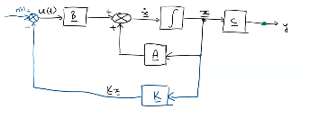

:PROPERTIES:
:ID:       75c352df-3843-4bd6-b15a-9ea7147879ae
:END:
#+title: Steady State Tracking of State Feedback
#+date: [2026-03-22 Sun 19:11]
#+AUTHOR: Baley Eccles - 652137
#+STARTUP: latexpreview

* Steady State Tracking of State Feedback

** Using Input Gain
 - By adding a gain to the beginning of the system
\[\lim_{t\rightarrow \infty}y(t) = y_{ss} = R\]
Modify control law:
\[u(t) = -Kx(t) + Gr(t)\]
closed loop state equations:
\begin{align*}
\dot{x}(t) &= (A - BK)x(t) + BGr(t) \\
y(t) &= Cx(T)
\end{align*}
$G$ has dimension $m\times p$, we impose $m \geq p$
\[H_{CL}(s) = C(sU - (A - BK))^{-1}BG\]
Perfect steady state tracking:
\[H_{CL}(0) = I (p\times p)\]
\[y_{ss} = \lim_{s\rightarrow 0} sH_{CL}(s)R(s)\]
For steop input tracking, $R(s) = \frac{R}{s}$
\[y_{ss} = H_{CL}(0)R\]\
\[H_{CL}(0) = -C(A-BK)^{-1}BG = I\]
*** Case 1: $m = p$
$I$ is $p\times p$
$G$ is $p\times p$
\[G = -[C(A-BK)^{-1}B]^{-1}\]
 - Non-singular matrix
 - 'Transmission zero'
   - Then non-singular 
*** Case 2: $m > p$
\[-C(A-BK)^{-1}B\]
has dimension $p\times m$
Using Moore–Penrose Inverse
\[G = -[C(A-BK)^1B]^T[C(A-BK)^{-1}B(C(A-BK)^{-1}B)^T]^{-1}\]
*** Example
Video 2: https://mylo.utas.edu.au/d2l/le/content/778746/viewContent/6500979/View

** Integrator State (Servomechanisim Design)
 - By adding another state variable to track the output
[[./Integrator State]]
*** Musts Have
These must be true for this method to work
1. The pair $(A,B)$ is controllable
2. The open-loop has no poles at $s=0$
3. The open-loop has no zeroes at $s=0$
*** Method
\[\dot{x}_N = r(t) - y(t)\]
\[u(t) = -Kx(t) + K_ex_N\]

With $\dot{x}_N(t) = r(t)-y(t)$:
\begin{align*}
sX_N(s) - x_n(0) &= R(s) - Y(s) \\
\Rightarrow & sX_N(s) - x_N(0) = E(s)
\end{align*}
For inital condition $x_N(0) = 0$
\[\Rightarrow X_N(s) = \frac{E(s)}{s}\]

\[\underline{\dot{x}} = \begin{bmatrix}
\underline{\dot{x}} \\
\dot{x}_N
\end{bmatrix}= \begin{bmatrix}
\underline{A} & 0 \\
-\underline{C} & 0
\end{bmatrix} \begin{bmatrix}
\underline{x} \\
x_n
\end{bmatrix} + \begin{bmatrix}
\underline{B} \\
0
\end{bmatrix}u + \begin{bmatrix}
\underline{0} \\
1
\end{bmatrix}r\]

\[y = [\underline{C}\ 0]\begin{bmatrix}\underline{x} \\ x_N\end{bmatrix}\]

Control law:
\[u = -[\underline{K} - K_e]\begin{bmatrix}\underline{x} \\ x_N\end{bmatrix}\]

Closed loop system:
\[\underline{\dot{x}} = \begin{bmatrix}
\underline{\dot{x}} \\
\dot{x}_N
\end{bmatrix}= \begin{bmatrix}
\underline{A} - \underline{B}\underline{K} & \underline{B}K_e \\
-\underline{C} & 0
\end{bmatrix} \begin{bmatrix}
\underline{x} \\
x_n
\end{bmatrix} + \begin{bmatrix}
\underline{B} \\
0
\end{bmatrix}u + \begin{bmatrix}
\underline{0} \\
1
\end{bmatrix}r\]

\[y = [\underline{C}\ 0]\begin{bmatrix}\underline{x} \\ x_N\end{bmatrix}\]

Can we control this system?
The test for [[id:6001038f-6a4b-49f6-a9b7-6378c74db194][controlability]] says it is.
Finally, for a step input $r(t) = Ru(t) \Rightarrow R(s) = \frac{R}{s}$
\[y_{ss} = R\]

*** Example
Video 3: https://mylo.utas.edu.au/d2l/le/content/778746/viewContent/6500979/View
