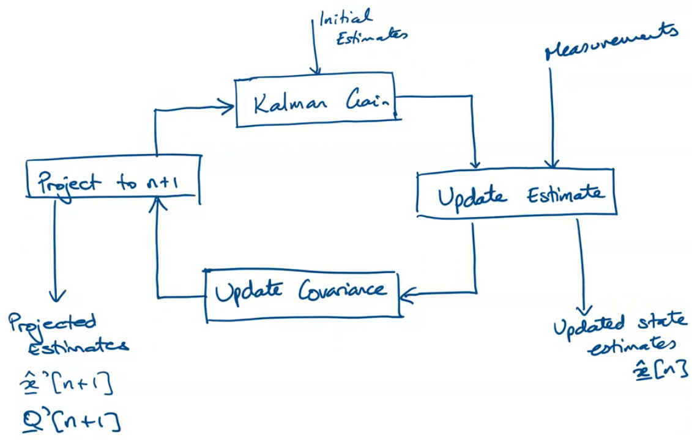

:PROPERTIES:
:ID:       c10d4231-a05e-493b-98d3-b8198409edd1
:END:
#+title: Optimal State Observer
#+date: [2026-04-20 Mon 09:10]
#+AUTHOR: Baley Eccles - 652137
#+STARTUP: latexpreview

* Optimal [[id:5d8efe2d-b6fc-4173-ba45-20e0935430d1][State Observer]]
1. Noise effects measurements
2. Noise is a random process

_Definition: State Estimation:_ The process of extracting a best estimate of a variable from a number of measurements containing noise.

"Optimal minimum variance filter": The Kalman Filter

_Problem description:_
Introduce measurement and model uncertainty. This is commonly done by modifying the state equations:
\[\dot{x} = Ax + Bu + B_ww\]
 - $w$ is the model uncertainty
 - $B_w$ how strongly the uncertainty effects the model
\[y = Cx + v\]
 - $v$ is the measurement noise
   
Typically, assume $w(t)$ and $v(t)$ are zero mean, so:
\[E[w(t)] = E[v(t)] = 0\]
Furthermore, assume uncorrelated Gaussian [[id:84768f70-2b00-498c-a795-765c7916c48f][white random noise]]
Gaussian white noise:
\begin{align*}
E[w(t_1)w^T(t_2)] &= R_{ww}(t_1) \delta(t_1 - t_2) \\
w(t) \sim N\{0, R_{ww}\} \\
E[v(t_1)v^T(t_2)] &= R_{vv}(t_1) \delta(t_1 - t_2) \\
v(t) \sim N\{0, R_{vv}\} \\
E[v(t_1)w^T(t_2)] = 0
\end{align*}

$R_{ww}(\tau)$ and $R_{vv}(\tau)$ are the [[id:2e3961b9-fea7-451f-af2b-02cbd9559c8e][autocorrelation]] of $w$ and $v$ respectively

Adding the observer:
\begin{align*}
\dot{x} &= Ax + Bu + B_ww \\
y &= Cx + v \\
\hat{x} &= A\hat{x} + Bu  + L(y - \hat{y}) \\
\hat{y} &= C\hat{x}
\end{align*}

So:
\begin{align*}
\dot{e}_x &= \dot{x} - \hat{\dot{x}} \\
\dot{e}_x &= (A-LC)e_x + B_ww - Lv
\end{align*}

1. The speed of the estimator is defined by the [[id:e7ad3ee3-7394-40ed-b2a3-ca0815bd9280][Eigenvalues]]:
   - $\Re\{\lambda_i(A-LC)\}$
2. The observer gains $L$ amplify $v$
   
Assuming the system is driven by white Gaussian noise, we can predict the mean square value of the state, which in this case is the estimator error $e_x$:
\[Q(t) = E[e_x(t)e_x^T(t)]\]
 - $Q(0) = Q_0$
So:
\begin{align*}
\dot{Q}(t) &= (A-LC)Q(t) + Q(t)(A - LC)^T + [B_w\ -L]\begin{bmatrix}R_{ww} & 0 \\ 0 & R_{vv}\end{bmatrix}\begin{bmatrix}B_w^T \\ -L^T\end{bmatrix} \\
\Rightarrow \dot{Q}(t) &= (A-LC)Q(t) + Q(t)(A - LC)^T + B_wR_{ww}B_w^T + LR_{vv}L^T
\end{align*}

Goal is to minimise $Q(t)$

** Optimal Kalman Filter
Develop estimates $\hat{x}(t)$ as a linear function of measurements $y(\tau)\ (0\leq \tau\leq t)$ and minimise:
\[J = \textrm{trace}(Q(t))\]
 - Trace is the sum of diagonals of $Q(t)$
\[Q(t) = E[e_x(t)e_x^T(t)]\]

The solution to the differential Riccati equation is:
\[\hat{\dot{x}} = A\hat{x} + L(t)(y - c\hat{x}(t))\]
 - \[L(t) = Q(t)C^T R_{vv}^{-1}\]
and $Q(t) > 0$, which solves:
\[\dot{Q}(t) = AQ(t) + Q(t)A^T + B_wR_{ww}B_w^T - Q(t)C^TB_{vv}^{-1}CQ(t)\]

Convergence to steady state occurs when $\dot{Q}(t) = 0$
\begin{cases}
0 &= AQ_{ss} + Q_{ss}A^T + B_wR_{ww}B_w^T - Q_{ss}C^TR_{vv}^{-1}CQ_{ss} \\
L_{ss} &= Q_{ss}C^TR_{vv}^{-1}
\end{cases}

1. Assume $R_{vv} > 0$ and $R_{vv} > 0$
2. All plant dynamics are constant ([[id:129878a7-2136-473b-ac33-74da80b12e67][LTI]])
3. $(A,C)$ is [[id:7dc26160-17e0-422e-8ac9-dc3706de650c][detectable]]
4. $(A, B_w)$ is [[id:03a9bc91-e20f-4dbc-95ea-cbe72149e5e4][stablisable]]
This will create a Linear Quadratic Estimator (LQE) / Kalman Filter

Provided $Q_{ss}$ exists, the Kalman Filter is asymptotically stable and estimates:
\[\hat{\dot{x}} = A\hat{x} + L_{ss}(y = C\hat{x}) = (A - L_{ss}C)\hat{x} + L_{ss}y\]

** Example
Video 1: https://mylo.utas.edu.au/d2l/le/content/778746/viewContent/6531894/View
Given:
$\dot{x} = Ax + Bu + B_ww$, $y = Cx + v$, $R_{ww} = 1$, $R_{vv} = r$

Use:
\[J = \textrm{trace}(Q(t))\]
\[Q(t) = E[e_x(t)e_x^T(t)]\]

Find $Q_{ss}$ and $L$ for this LQE problem
1. $r = 0.1$
2. $r = 1$
3. $r = 10$

*** Solution
Solve Ricatti Equation:
\[0 &= AQ_{ss} + Q_{ss}A^T + B_wR_{ww}B_w^T - Q_{ss}C^TR_{vv}^{-1}CQ_{ss}\]
 - $Q_{ss}$ is $2\times 2$ with matrix with $q_{11}, q_{12}, q_{21}, q_{22}$
 - Punch everything in, solve for the $Q_{ss}$ values
 - $Q_{ss} > 0$
   - So if the equations are quadratic use the positive value
Use:
\[L_{ss} = Q_{ss}C^TR_{vv}^{-1}\]
 - These are the observer gains
 - Just sub in each values of $r$

** Discrete Systems
\begin{align*}
x[n+1] &= A(T_s)x[n] + B(T_s)u[n] + B_w(T_s)w[n] \\
y[n] &= Cx[n] + v[n] \\
R_{ww} &= E\{w[n]w^T[n]\} \\
R_{vv} &= E\{v[n]v^T[n]\}
Q[n] &= E\{e_x[n]e_x^T[n]\}
\end{align*}

A prior knowledge of the state is denoted $\hat{x}'[n]$. We can write an update equation:
\[\hat{x}[n] = \hat{x}'[n] + L[n](y[n] - C\hat{x}'[n])\]
 - $L$ is the observer gain/Kalman gain
The innovation (measurement residual):
\[i[n] = y[n] - C\hat{x}[n]\]

If we substitute $y[n] = Cx[n] + v[n]$, we get
\[\hat{x}[n] = \hat{x}'[n] + L[n](Cx[n] + v[n] - c\hat{x}'[n])\]
Substitute this into the covariance matrix:
\[Q[n] = (I-L[n]C)Q'[n](I-L[n]C)^TL[n]R_{vv}[n]L^T[n]\]
 - This is the covariance matrix update equation
   
\[SSE = \textrm{trace}\{Q[n]\}\]
 - Goal is to find $\min\{SSE\} = \min\{\textrm{trace}\{Q[n]\}\}$
   
\[L[n] = Q'[n]C^T(CQ'[n]C^T + R_{vv})^{-1}\]
 - Called the Kalman gain equation

The inverted matrix, $S[n] = CQ'[n]C^TR_{vv}$, sometimes called the measurement prediction covariance, is used to find an update to $Q[n]$:
\begin{align*}
Q[n] &= Q'[n] - Q'[n]C^TS^{-1}[n]CQ'[n] \\
Q[n] &= (I - L[n]C)Q'[n]
\end{align*}

Everything for step $n$ is calculated, now project forward: $\hat{x}'[n+1] = A(T_s)\hat{x}[n]$ produces the estimate of state. Then, we need $Q'[n+1]$, we get this through:
\[e'_x[n+1] = A(T_s)e_x[n] + B_ww[n]\]
Then:
\[Q'[n+1] &= A(T_s)Q[n]A^T(T_s) + B_w(T_s)R_{ww}B_w^T(T_s)\]

*** Overview

Kalman Gain:
\[L[n] = Q'[n]C^T(CQ'[n]C^T + R_{vv})^{-1}\]
Update Estimates:
\[\hat{x}[n] = \hat{x}'[n] + L[n](Cx[n] + v[n] - c\hat{x}'[n])\]
Update Covariance:
\[Q[n] &= (I - L[n]C)Q'[n]\]
Project to $n+1$:
\begin{cases}
\hat{x}'[n+1] &= A(T_s)\hat{x} \\
Q'[n+1] &= A(T_s)Q[n]A^T(T_s) + B_w(T_s)R_{ww}B_w^T(T_s)
\end{cases}
