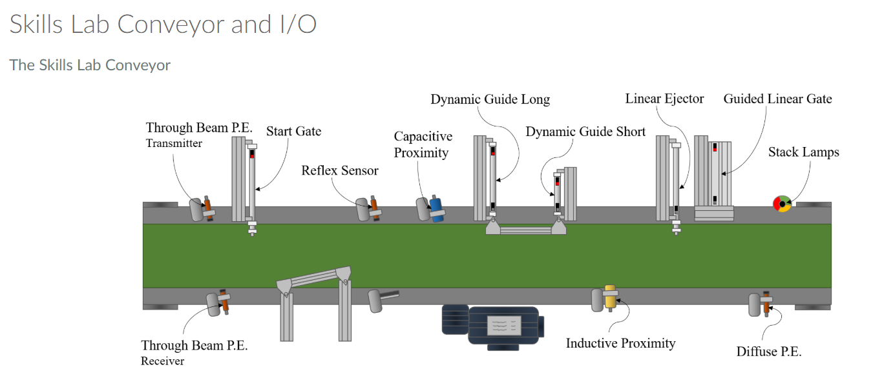
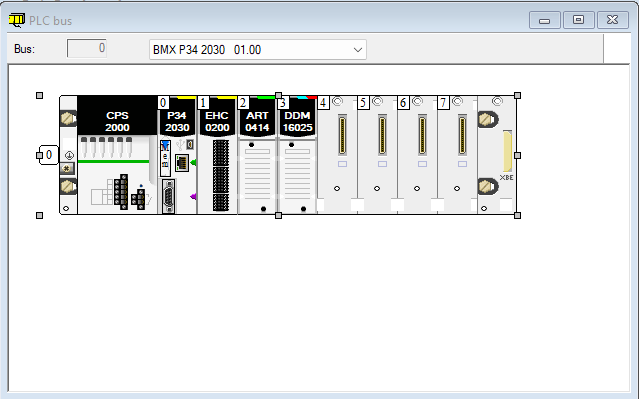
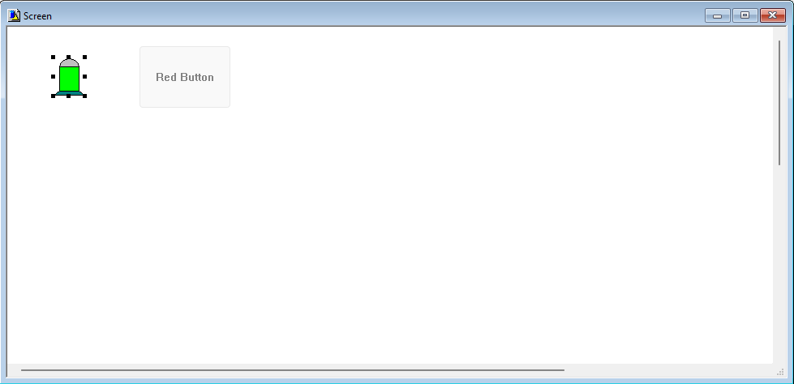
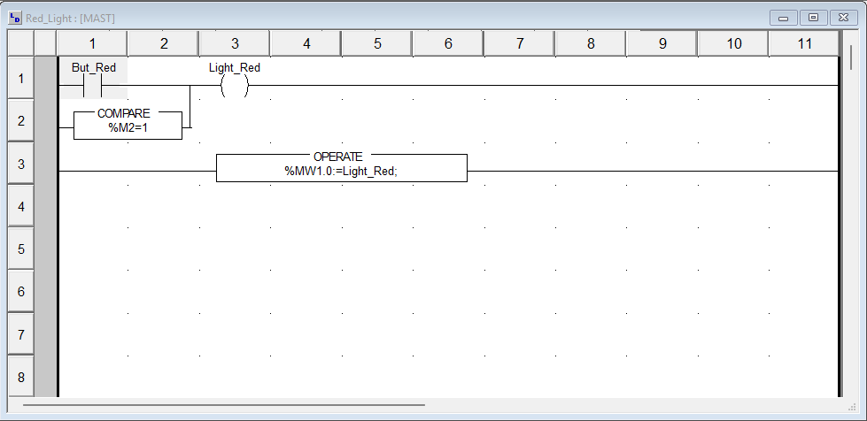
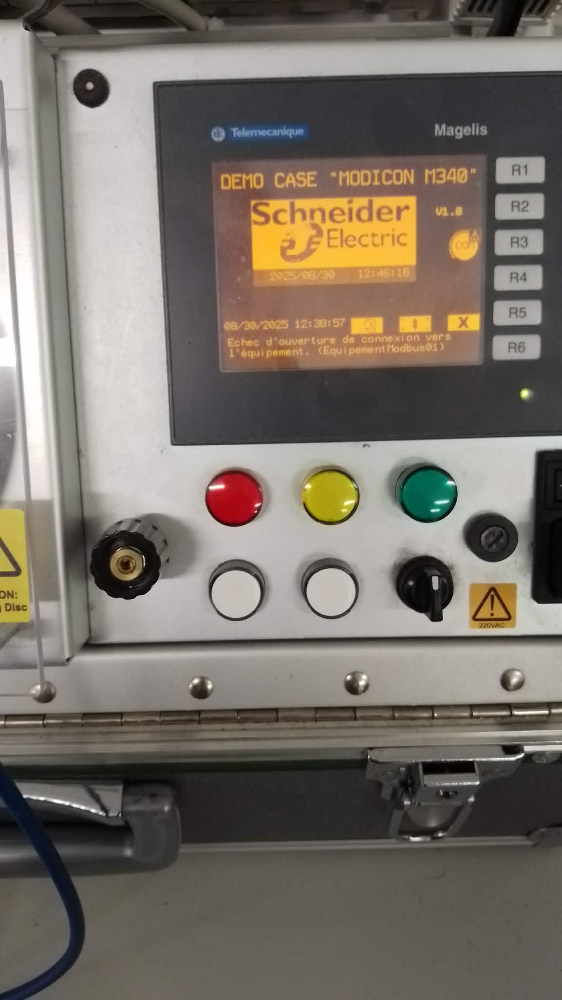
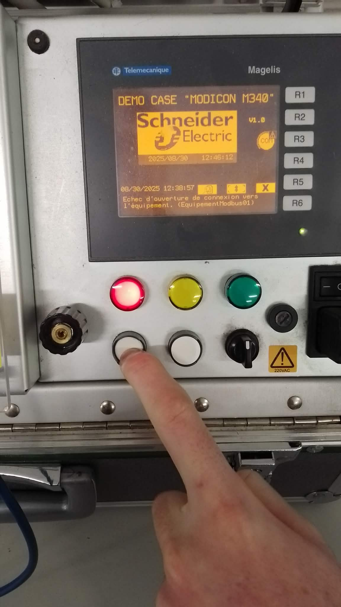
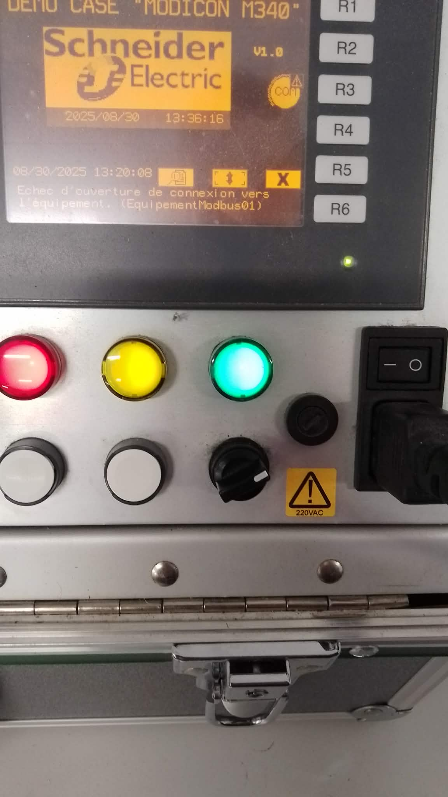
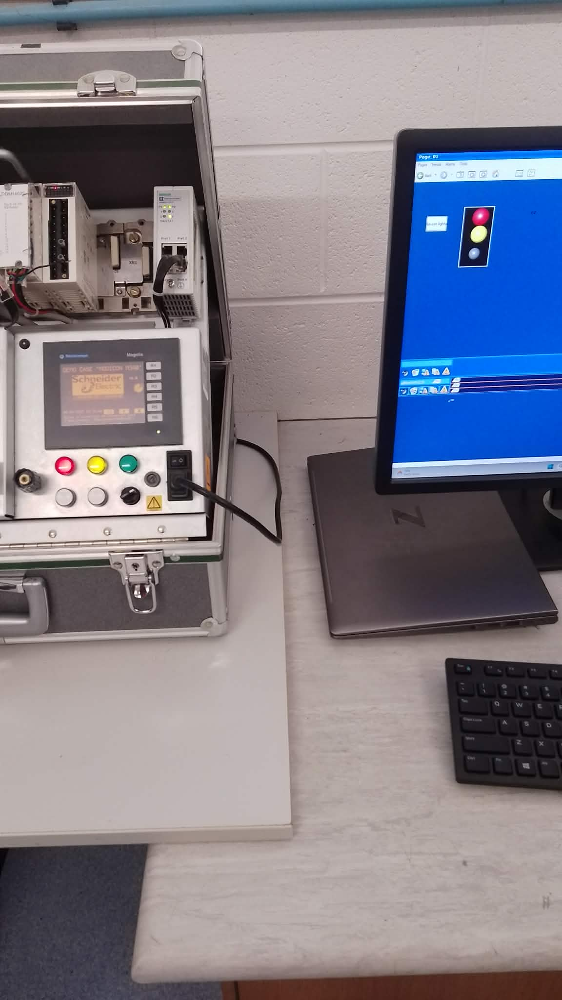
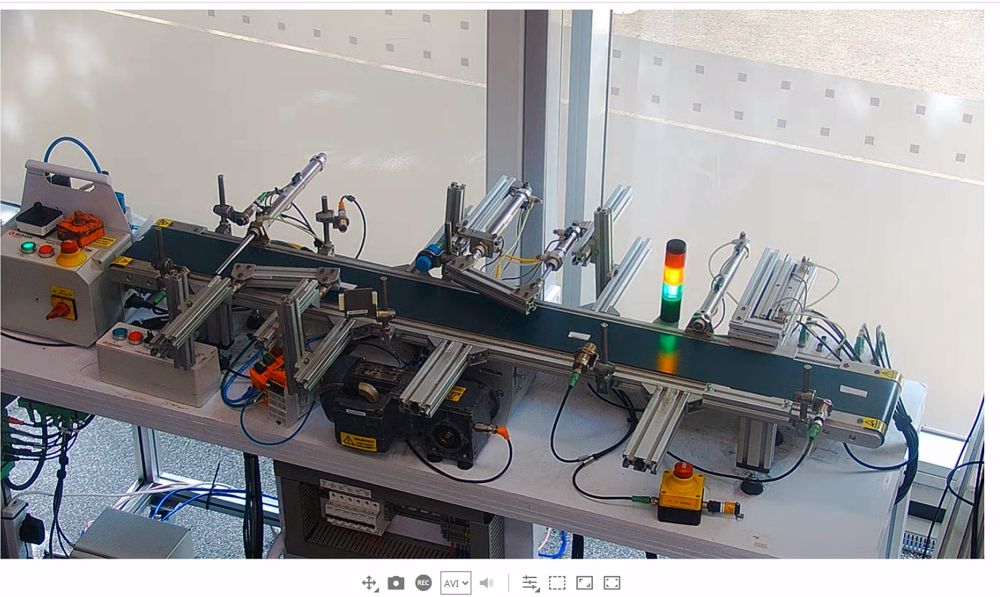

:PROPERTIES:
:ID:       ee96f039-7a53-4728-b7ad-f64be8ef9bf8
:END:
#+title: ENG417 - Control Systems 2 - Automation Report: Part 1 - PLCs and SCADA
#+date: [2026-04-21 Tue 04:03]
#+AUTHOR: Baley Eccles - 652137
#+STARTUP: latexpreview
#+FILETAGS: :Assignment:UTAS:2026:
#+LATEX_HEADER: \usepackage[a4paper, margin=1in]{geometry}
#+LATEX_HEADER_EXTRA: \usepackage{minted}
#+LATEX_HEADER_EXTRA: \usepackage{fontspec}
#+LATEX_HEADER_EXTRA: \setmonofont{Iosevka}
#+LATEX_HEADER_EXTRA: \setminted{fontsize=\small, frame=single, breaklines=true}
#+LATEX_HEADER_EXTRA: \usemintedstyle{emacs}
#+LATEX_HEADER_EXTRA: \usepackage{float}
#+LATEX_HEADER_EXTRA: \usepackage[final]{pdfpages}
#+LATEX_HEADER_EXTRA: \setlength{\parindent}{0pt}
#+LATEX_HEADER_EXTRA: \setlength{\parskip}{1em}
#+LATEX_HEADER_EXTRA: \documentclass[12pt]{article}

\newpage
* Introduction
This report documents the activities and findings from the ENG417 - Control Systems 2 course, focusing on the use of Programmable Logic Controllers (PLCs) and Supervisory Control and Data Acquisition (SCADA) systems. Throughout the course, I engaged in hands-on tutorials and lab exercises aimed at reinforcing theoretical knowledge through practical application. 

In the initial tutorial, I became familiar with the Modicon M340 PLC, configuring its various input and output modules for simulation. I learned to develop ladder logic programs and their corresponding representations in Structured Text, allowing for a deeper understanding of the program's functionality. The subsequent lab work included the implementation of timer-based logic to control sequential light operations, culminating in the creation of a SCADA interface to visualize real-time system states.

Moreover, the course addressed practical challenges such as the "Dairy Gate" problem, which emphasizes the importance of logic and timed actions in automation. My internship experience at SAGE Automation further complemented this learning by providing real-world exposure to PLC programming and SCADA systems in industrial settings. 

The appendices include visual aids that illustrate the configured PLC, operator screens, lab results, and my personal experiences with complex automation projects, reinforcing the critical role of control systems in modern automation environments.

* Tutorial
The first step of the tutorial was to become familiar with Control Expert, this was done by setting up the required Programmable Logic Controller (PLC) and the modules that are going to be used in the lab. This ensures that the simulation environment is the same as the one that will be experienced during the lab. The PLC that was used was the Modicon M340 with a counter module, a analog input module and a digital input/output module in modules positions 1, 2 and 3, respectively. The IP address was set to 127.0.0.1 (the loopback IP address), which specifies that simulation will be used, this will need to be changed to access the non-simulated PLC. Various other minor tasks were conducted that ensured the PLC would operate properly. The configured PLC can be seen in Appendix A, Figure \ref{fig:PLC}.

Next the ladder programs could be created, this was followed as per the workshop sheet; a ladder program was created then tested in simulation. An operator screen was created that would allow an engineer to see the state of the ladder program in a less obtuse way, this can be seen in Appendix A, Figure \ref{fig:screen}. The produced ladder program can be seen in Appendix A, Figure \ref{fig:ladder_1}.

This program was then converted into a Function Block Diagram (FBD) and Structured Text (ST), the ST can be seen in the following code. This does the exact same thing as the ladder diagram as seen in Appendix A, Figure \ref{fig:ladder_1}.
\newpage

#+BEGIN_SRC pascal
IF (But_Red=1 OR %M2=1) THEN
    Light_Red := 1;
ELSE
    Light_Red := 0;
END_IF

%MW1.0 := Light_Red;
#+END_SRC

This specific PLC uses the following addressing scheme, %Direction RackNo.ModulePosition.Bit, the Direction is 'I' for input and 'Q' for output. This provides access to each of the modules input and output systems. For example "%I0.2.5" would read the 5th input bit from the 2nd module on the 0th rack.

* Lab
During the lab a more complicated program was created as per the lab sheet. This program turns three lights on in order from green, yellow, red then turning them off. It utilises TON timers to wait one second before turning the next light on/resetting. This is the program as specified by the lab sheet, pictures of it operating can be seen in Appendix B (Figures \ref{fig:lab_light_0}, \ref{fig:lab_light_1}, \ref{fig:lab_light_2} and \ref{fig:lab_light_3}).

The ladder program was then rewritten in Structured Text, this can be seen below. This does the exact same thing as the ladder program, but written Structured Text. It still uses the TON timers to wait for the next light. It also uses an IF and ELSE statement to start and reset the lights.

#+BEGIN_SRC pascal
IF (SW_Green=TRUE AND Output=FALSE AND Reset=False) THEN
    Red_Timer := TRUE;
ELSE
    Red_Timer := FALSE;
END_IF;

TON_Red(IN:=Red_Timer,PT:=T#1s);
Light_Red := TON_Red.Q;
%MW1.0:=Light_Red;

TON_Orange(IN:=Light_Red,PT:=T#1s);
Light_Orange := TON_Orange.Q;
%MW1.1:=Light_Orange;

TON_Green(IN:=Light_Orange,PT:=T#1s);
Light_Green := TON_Green.Q;
%MW1.2 := Light_Green;

TON_Output(IN:=Light_Green,PT:=T#1s);
Output := TON_Output.Q;

CTU_1(CU:=Light_Red,R:=Reset);
CountValue := CTU_1.CV;
#+END_SRC

The next part of the lab was to develop a SCADA interface for this program, it should show which light is on. This was produced and can be seen in Appendix B, Figure \ref{fig:SCADA}, where two lights were on. The SCADA works by transferring tags between the running PLC program and the SCADA interface, these are then updated on the SCADA interface depending on their values. During the lab we were unable to get the 'Trend' plot working (which seemed to be a common issue amongst other groups), this would show how the values in the PLC program would change with time.

* "Dairy Gate" Problem
The "Dairy Gate" problem is used to control the flow of cows into a milking pen through a gate. This problem is solved using some boolean logic and a timer, if a cow is in the pen then the timer is turned on, once the timer has finished the gate is opened. If there is a cow before the gate and there is not a cow in pen then the gate is opened, once inside the gate is then closed, this starts the aforementioned timer. This can be solved using the following Structured Text, it creates a timer for 10 minutes with the Inside variable and determines if the Gate should be open based on the boolean expression. The provided solutions were also tested to be correct.

#+BEGIN_SRC pascal
TON_Gate(IN := Inside, PT := T#10M);
Gate := ((Before AND NOT Inside) OR Open OR TON_Gate.Q) AND NOT Close;
#+END_SRC

* Personal Experience
During my internship at SAGE Automation I created a PLC program to automate blocks being pushed down a conveyor belt. This was implemented as a ladder diagram in Studio 5000 Logix Designer, a piece of PLC programming software used on Rockwell PLC's. The conveyor belt had various actuators and sensors connected to it, a diagram of this can be seen in Figure \ref{fig:conveyor_1}.

#+ATTR_LATEX: :placement [H]
#+CAPTION: SAGE Automation conveyor diagram \label{fig:conveyor_1}

The goal of the program was to move blocks of the conveyor depending on the determined type of the block. There were three types of blocks to be checked, first a tall plastic block, second a short plastic block and third a tall metal block. Determining the type of the block was done using the various sensors on the conveyor, the Trough Beam P.E. Sensor was used to start the conveyor, the Reflex Sensor was used to classify tall blocks, the Capacitive Proximity Sensor was used to classify short blocks (the absence of the Reflex Sensor begin triggered, as they were not tall enough to trigger it), the Inductive Proximity Sensor was used to classify metal blocks.

The blocks were moved off/positioned on the conveyor using the various actuators. Each actuator had characteristics that must be considered in the PLC program, some were auto retracting and others were not, hence some would require extra logic to reset them to their initial positions. There was also a stack of lamps present that would change colours based on the detection of the blocks. The real world conveyor can be seen in Appendix D, Figure \ref{fig:conveyor_2}.

A snippet of the ladder diagram produced can be seen in Appendix D, Figure \ref{fig:Logix5000_1} and \ref{fig:Logix5000_2}. The program used various blocks, such as counters and timers, to delay, count and manage the state of the conveyor. The designed program was significantly more complicated and involved than anything developed during this class.

Likewise, during my placement I also created various SCADA systems, these were created in the SCADA program called Ignition. One such example of a SCADA system created was one that measures the water in three tanks and identifies pump faults. This can be seen in Figure \ref{fig:SAGE_SCADA}.

#+ATTR_LATEX: :placement [H]
#+CAPTION: SAGE Automation SCADA system \label{fig:SAGE_SCADA}
[[./SAGE_Ignition.PNG]]

* Conclusion
In this report, I presented the practical applications of PLC's and SCADA systems as explored through various tutorials and labs. Through hands-on experience with the Modicon M340 PLC and the development of ladder logic and Structured Text programs, I gained insight into the essential role these systems play in automation processes.

The "Dairy Gate" problem showcased the effective use of boolean logic and timers in managing real-time control scenarios, while the lab activities demonstrated the capabilities of timing functions in sequential operations. Additionally, my experience at SAGE Automation reinforced these concepts by applying them in real-world implementations, including conveyor systems and SCADA interfaces.

Overall, the integration of PLC programming and SCADA visualization creates an efficient framework for monitoring and controlling industrial processes. This assignment has enhanced my comprehension of control systems and their practical applications, underscoring the importance of these skills in the automation industry.

\newpage
* Appendix A - Tutorial Results
#+ATTR_LATEX: :placement [H]
#+CAPTION: Configured PLC \label{fig:PLC}

#+ATTR_LATEX: :placement [H]
#+CAPTION: Operator screen for tutorial \label{fig:screen}

#+ATTR_LATEX: :placement [H]
#+CAPTION: Ladder program for tutorial \label{fig:ladder_1}

\newpage
* Appendix B - Lab Results
#+ATTR_LATEX: :placement [H] :width 0.75\textwidth
#+CAPTION: Lab with zero lights on \label{fig:lab_light_0}

#+ATTR_LATEX: :placement [H] :width 0.75\textwidth
#+CAPTION: Lab with one light on \label{fig:lab_light_1}

#+ATTR_LATEX: :placement [H] :width 0.75\textwidth
#+CAPTION: Lab with two lights on \label{fig:lab_light_2}

#+ATTR_LATEX: :placement [H] :width 0.75\textwidth
#+CAPTION: Lab with three lights on \label{fig:lab_light_3}

#+ATTR_LATEX: :placement [H] :width 0.75\textwidth
#+CAPTION: Lab SCADA with two lights on \label{fig:SCADA}

\newpage
* Appendix C - "Dairy Gate" Problem

\newpage
* Appendix D - Personal Experience
#+ATTR_LATEX: :placement [H]
#+CAPTION: SAGE Automation real conveyor \label{fig:conveyor_2}

#+ATTR_LATEX: :placement [H]
#+CAPTION: SAGE Automation Logix5000 \label{fig:Logix5000_1}
[[./SAGE_Logix500_Integration_Project.png]]

#+ATTR_LATEX: :placement [H]
#+CAPTION: SAGE Automation Logix5000 \label{fig:Logix5000_2}
[[./SAGE_Logix5000.png]]

