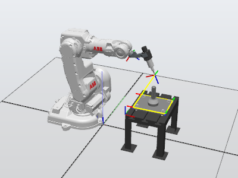
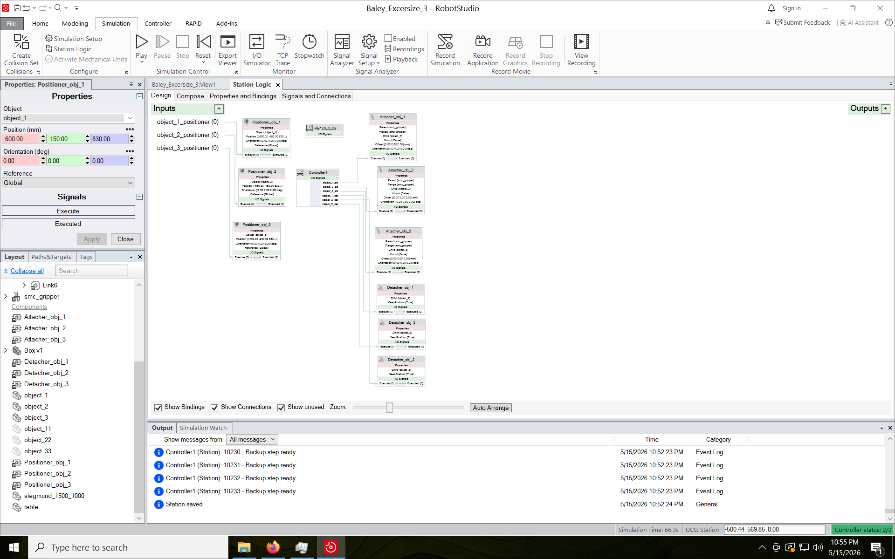
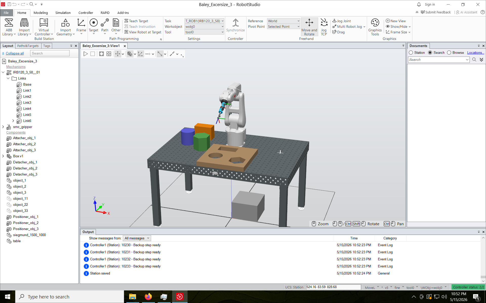

:PROPERTIES:
:ID:       9089281e-800d-45c1-bae9-5cf88cc1e0a5
:END:
#+title: ENG417 - Control Systems 2 - Automation Report: Part 2 – Robotics
#+date: [2026-04-21 Tue 05:09]
#+AUTHOR: Baley Eccles - 652137
#+STARTUP: latexpreview
#+FILETAGS: :Assignment:UTAS:2026:
#+LATEX_HEADER: \usepackage[a4paper, margin=1in]{geometry}
#+LATEX_HEADER_EXTRA: \usepackage{minted}
#+LATEX_HEADER_EXTRA: \usepackage{fontspec}
#+LATEX_HEADER_EXTRA: \setmonofont{Iosevka}
#+LATEX_HEADER_EXTRA: \setminted{fontsize=\small, frame=single, breaklines=true}
#+LATEX_HEADER_EXTRA: \usemintedstyle{emacs}
#+LATEX_HEADER_EXTRA: \usepackage{float}
#+LATEX_HEADER_EXTRA: \usepackage[final]{pdfpages}
#+LATEX_HEADER_EXTRA: \setlength{\parindent}{0pt}
#+LATEX_HEADER_EXTRA: \setlength{\parskip}{1em}
#+LATEX_HEADER_EXTRA: \documentclass[12pt]{article}

* Introduction
This report outlines the practical exercises taken for this unit, focusing on robotic programming and simulation through ABB RobotStudio and RAPID. Beginning with foundational tutorials, I learned to configure robot stations, set up tools and work objects, and program basic motion paths. The completion of five video tutorials provided hands-on experience with robot simulation, allowing me to explore various movement commands, including linear and circular moving. By modifying programs to include looping and advanced movement techniques, I increased my understanding of robot kinematics and control. Simulating a possible use of the mechatronics laboratory solidified my skills in programming a gripper for block manipulation, showcasing how robots can interact with their environment in a precise and controlled manner.

* Tutorials

** Exercise 1: Get started with RobotStudio
The five "Getting Started in 30 Minutes" tutorials were completed using ABB RobotStudio. These tutorials introduced:
 - Robot configuration
 - Tool and workobject setup
 - Jogging and coordinate systems
 - Path programming
 - RAPID program execution
 - Simulation playback

*** Video 1
The first tutorial was all about diving into the RobotStudio environment and starting a new project. I created an empty station without a virtual controller, then downloaded the IRB 140 robot model from the ABB library and added it. This set up the simulation environment for the upcoming videos. I learned how to navigate the 3D workspace, using zoom, rotate, and pan controls, and saved the project for the next video.

*** Video 2 
Next, I worked on setting up a virtual controller for my robot station. I opened the previous project and created a virtual controller right from the station layout. Some problems were encountered regarding licensing during the first workshop session, although these were resolved for the next session. I also explored different jogging methods, joint and linear, to manually move the robot and objects in the station.

*** Video 3
In this video, I attached tools to the robot and created paths for it to follow. After importing a tool from the library, I learned about the importance of correct tool and work object setup for precision. I used the "teach instruction" feature to manually set robot targets, creating a rectangular path. Understanding speed and zone data helped enhance the robots motion, without setting these the robot out of simulation could damage equipment or itself.

*** Video 4
This video had me rebuilding a station and playing with work objects and target definitions. I deleted old paths, imported a new propeller table, and made sure it was within the robot’s reach. Initially I did not provide enough space for the robot to access the entire workspace, this was fixed by moving the robot closer to the bench. I defined a new work object using a three-point method for precise programming. After adjusting target orientations and using orientation transfer, I generated a path from these targets and auto-configured the robot. The simulation was then ran, this made the robot move along the path, initially I did not set the orientation right and it threw an error when it collided with the table, this is because of the collision detection system. After the orientation was resolved it was capable of moving along the path.

*** Video 5
The final tutorial connected everything to RAPID code, executing a full simulation through the controller. I synced paths and targets to RAPID, which generated code automatically. I explored the execution and debugging tools, visualizing the robot's motion in real-time, and learned how to track execution with the program pointer. The final result can be seen in the following image.

** Exercise 2: Get started with RAPID
This exercise focused on extending the RAPID program from the fifth video to develop more advanced robot motion control. The existing program was modified so the robot tool followed four straight linear movements using ~MoveL~ (or ~MoveJ~) to form a square path on the surface of the block. The program was then extended using the MoveC command to generate a circular path on the same surface, showing how circular interpolation can be used for smooth curved motion. Lastly the FOR command was used to make the robot repeat the path continuously.

The snippet of code that achieves this can be seen below and an attached video (called \\
~ENG417_Robo_Move_And_Circle.mp4~) demonstrates this, although without the looping.

#+BEGIN_SRC
PROC main()
    VAR num i;
    FOR i FROM 1 TO 100 DO
        Rectangle;
        Circle;
    ENDFOR

ENDPROC

PROC Rectangle()
    MoveL home_2, v500, fine, MyTool\WObj:=Workobject_1;
    MoveL Target_10, v500, fine, MyTool\WObj:=Workobject_1;
    MoveL Target_20, v500, fine, MyTool\WObj:=Workobject_1;
    MoveL Target_30, v500, fine, MyTool\WObj:=Workobject_1;
    MoveL Target_40, v500, fine, MyTool\WObj:=Workobject_1;
    MoveL Target_10_3, v500, fine, MyTool\WObj:=Workobject_1;
    MoveL home, v500, fine, MyTool\WObj:=Workobject_1;
ENDPROC

PROC Circle()
    MoveL home_2, v500, fine, MyTool\WObj:=Workobject_1;
    MoveL Target_10, v500, fine, MyTool\WObj:=Workobject_1;
    MoveC Target_20, Target_30, v500, fine, MyTool\WObj:=Workobject_1;
    MoveC Target_40, Target_10, v500, fine, MyTool\WObj:=Workobject_1;
    MoveL home, v500, fine, MyTool\WObj:=Workobject_1;
ENDPROC
#+END_SRC

** Exercise 3: Simulate a Mechatronics Laboratory
** 
The provided video was followed to create a program that places blocks in a template. This involved configuring the IRB120 robot with a gripper that is capable of picking up blocks. Then placing the IRB120 on a table with three blocks that would be used for moving. Next the simulation was developed by providing home positions to all the objects, including robot, using positioner's. The simulation was then configured to pick and place the objects, this was done using attacher's and detacher's in RobotStudio, the final logic can be seen in Figure \ref{fig:logic}. Targets were created for the robot to move to, these are then used to create paths for the robot, while in these paths the place for the robot to pickup and put down the objects were specified. Finally the simulation was ran, this can be seen in the provided video called ~ENG417_Robo_Exercise_3.mp4~, the state final state, before simulation, can be seen in Figure \ref{fig:sim}.

#+ATTR_LATEX: :placement [H]
#+CAPTION: Excersize 3 Station Logic \label{fig:logic}

#+ATTR_LATEX: :placement [H]
#+CAPTION: Excersize 3 Station Logic \label{fig:sim}

* Conclusion
The exercises performed throughout this report have provided me with knowledge and practical experience in robotics and automation. Through the process of learning RAPID programming and utilising RobotStudio, I have effectively transitioned from fundamental concepts to executing complex robotic tasks. The development of a simulation for block manipulation not only reinforced programming skills but also highlighted the usage of mechanical and software components in robotic systems. As robotics play an important role across industries, these experiences help me understand functions and applications of robots in industry. The skills gained in these exercises position me well for further exploration and specialisation in the field of automation, opening pathways to innovate solutions that enhance productivity and efficiency in various engineering domains.
