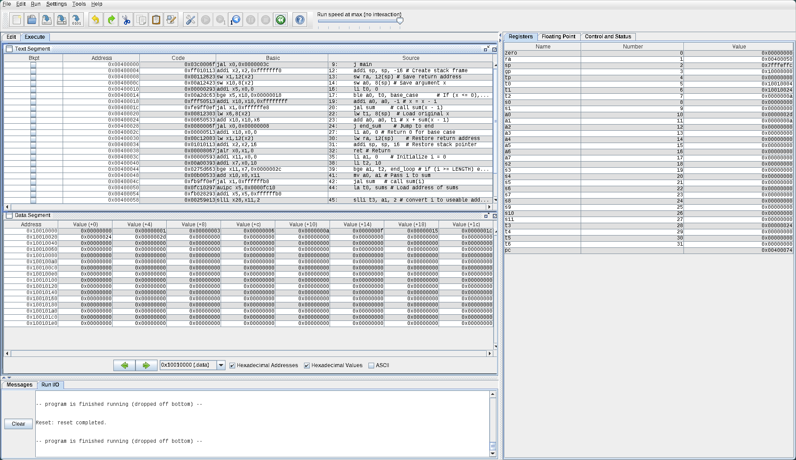

:PROPERTIES:
:ID:       4905c204-4471-4663-822c-3b0e7a6e1b4f
:END:
#+title: ENG442 - Advanced Digital Electronics - Portfolio - Part 2
#+date: [2026-05-04 Mon 23:29]
#+AUTHOR: Baley Eccles - 652137
#+STARTUP: latexpreview
#+FILETAGS: :Assignment:UTAS:2026:
#+LATEX_HEADER: \usepackage[a4paper, margin=1in]{geometry}
#+LATEX_HEADER_EXTRA: \usepackage{minted}
#+LATEX_HEADER_EXTRA: \usepackage{fontspec}
#+LATEX_HEADER_EXTRA: \setmonofont{Iosevka}
#+LATEX_HEADER_EXTRA: \setminted{fontsize=\small, frame=single, breaklines=true}
#+LATEX_HEADER_EXTRA: \usemintedstyle{emacs}
#+LATEX_HEADER_EXTRA: \usepackage{float}
#+LATEX_HEADER_EXTRA: \usepackage[final]{pdfpages}
#+LATEX_HEADER_EXTRA: \setlength{\parindent}{0pt}
#+LATEX_HEADER_EXTRA: \setlength{\parskip}{1em}
#+LATEX_HEADER_EXTRA: \documentclass[12pt]{article}
:TODO: Fix xopp figure widths in latex before submitting
 - Replace 'max width=0.5\linewidth' with 'width=0.75\linewidth'
* Week 6
** Problem 1
/Write a Verilog module that connects your ALU from Week 5 Problem 2 to appropriate I/O and then synthesise, implement and load your design on to the Basys3 FPGA board. You must demonstrate the working solution to the lecturer/tutor and answer questions during class or you may arrange a separate meeting to discuss./
#+BEGIN_SRC verilog :tangle /home/baley/UTAS/ENG442 - Advanced Digital Electronics/Portfolio/Week_6_Problem_1/Week_6_Problem_1.srcs/constrs_1/new/constrains.xdc
## Switches
set_property PACKAGE_PIN V17 [get_ports {sw[0]}]
  set_property IOSTANDARD LVCMOS33 [get_ports {sw[0]}]
set_property PACKAGE_PIN V16 [get_ports {sw[1]}]
  set_property IOSTANDARD LVCMOS33 [get_ports {sw[1]}]
set_property PACKAGE_PIN W16 [get_ports {sw[2]}]
  set_property IOSTANDARD LVCMOS33 [get_ports {sw[2]}]
set_property PACKAGE_PIN W17 [get_ports {sw[3]}]
  set_property IOSTANDARD LVCMOS33 [get_ports {sw[3]}]

## LEDs
set_property PACKAGE_PIN U16 [get_ports {led[0]}]
  set_property IOSTANDARD LVCMOS33 [get_ports {led[0]}]
set_property PACKAGE_PIN E19 [get_ports {led[1]}]
  set_property IOSTANDARD LVCMOS33 [get_ports {led[1]}]
#+END_SRC

#+BEGIN_SRC verilog :tangle /home/baley/UTAS/ENG442 - Advanced Digital Electronics/Portfolio/Week_6_Problem_1/Week_6_Problem_1.srcs/sources_1/new/ALU.v :comments link
// 1-bit adder for ALU
module full_adder (
                   input wire  A,      // operand bit A
                   input wire  B,      // operand bit B
                   input wire  C_in,   // carry-in
                   output wire result, // result bit (sum)
                   output wire C_out   // carry-out
                   );
   assign result = A ^ B ^ C_in;
   assign C_out  = (A & B) | (B & C_in) | (A & C_in);
endmodule

// 1-bit subtractor for ALU
module full_subber (
                    input wire  A,      // operand bit A
                    input wire  B,      // operand bit B
                    input wire  C_in,   // borrow-in (use as borrow-in)
                    output wire result, // result bit (difference)
                    output wire B_out   // borrow-out
                    );
   assign result = (A ^ B) ^ C_in;
   assign B_out  = (~A & B) | (~A & C_in) | (B & C_in);
endmodule

// 2:1 multiplexer (single bit)
module mux2to1 (
                input wire  in_0,
                input wire  in_1,
                input wire  sel,
                output wire out
                );
   assign out = sel ? in_1 : in_0;
endmodule

// 1-bit ALU: operation = 0 -> add, operation = 1 -> sub
module ALU (
            input wire  A,
            input wire  B,
            input wire  C_in,      // carry-in for add or borrow-in for sub
            input wire  operation, // 0 = add, 1 = sub
            output wire result,
            output wire carry_borrow_out
            );
   wire add_result, sub_result;
   wire add_cout,  sub_bout;

   // instantiate adder and subtractor
   full_adder u_adder (
                       .A(A),
                       .B(B),
                       .C_in(C_in),
                       .result(add_result),
                       .C_out(add_cout)
                       );

   full_subber u_subber (
                         .A(A),
                         .B(B),
                         .C_in(C_in),
                         .result(sub_result),
                         .B_out(sub_bout)
                         );

   // select result and carry/borrow based on operation
   mux2to1 u_mux_result (
                         .in_0(add_result),
                         .in_1(sub_result),
                         .sel(operation),
                         .out(result)
                         );

   mux2to1 u_mux_cout (
                       .in_0(add_cout),
                       .in_1(sub_bout),
                       .sel(operation),
                       .out(carry_borrow_out)
                       );
endmodule
#+END_SRC

#+BEGIN_SRC verilog :tangle /home/baley/UTAS/ENG442 - Advanced Digital Electronics/Portfolio/Week_6_Problem_1/Week_6_Problem_1.srcs/sources_1/new/tb_ALU.v :comments link
module tb_ALU(input [3:0] sw, output [1:0] led);
   reg A, B, C_in, operation;
   wire result, carry_borrow_out;

   // Instantiate DUT
   ALU dut (
            sw[0],
            sw[1],
            sw[2],
            sw[3],
            led[0],
            led[1]
            );
endmodule
#+END_SRC

This was tested on the Basys3 board and was correct. It followed the expected truth table seen below.
|---------+---------+------------+----------+---------------+---------------------|
| A/sw[0] | B/sw[1] | C_in/sw[2] | op/sw[3] | result/led[0] | carry/borrow/led[1] |
|---------+---------+------------+----------+---------------+---------------------|
|       0 |       0 |          0 |        0 |             0 |                   0 |
|       0 |       0 |          1 |        0 |             1 |                   0 |
|       0 |       1 |          0 |        0 |             1 |                   0 |
|       0 |       1 |          1 |        0 |             0 |                   1 |
|       1 |       0 |          0 |        0 |             1 |                   0 |
|       1 |       0 |          1 |        0 |             0 |                   1 |
|       1 |       1 |          0 |        0 |             0 |                   1 |
|       1 |       1 |          1 |        0 |             1 |                   1 |
|       0 |       0 |          0 |        1 |             0 |                   0 |
|       0 |       0 |          1 |        1 |             1 |                   1 |
|       0 |       1 |          0 |        1 |             1 |                   1 |
|       0 |       1 |          1 |        1 |             0 |                   1 |
|       1 |       0 |          0 |        1 |             1 |                   0 |
|       1 |       0 |          1 |        1 |             0 |                   0 |
|       1 |       1 |          0 |        1 |             0 |                   0 |
|       1 |       1 |          1 |        1 |             1 |                   1 |
|---------+---------+------------+----------+---------------+---------------------|

** Problem 2

/You are now to reimplement the ALU module using the Verilog add (+) and subtract (-) operators instead of structurally including sub-modules such as a full adder and without using a ripple-carry implementation. Rerun your testbench using this new module and ensure that it behaves logically the same. Note that aside from referencing the new implementation of the ALU, you should not have to make any changes to the testbench file. You do NOT need to run the new version on the Basys3 board./

#+BEGIN_SRC verilog :tangle ENG442_Portfolio_Week_6_Problem_2.v
module ALU_new (
                input wire  A,
                input wire  B,
                input wire  C_in,
                input wire  operation,
                output wire result,
                output wire carry_borrow_out
                );

   // temporary 2-bit values to capture carry/borrow
   wire [1:0] add_temp;
   wire [1:0] sub_temp;

   // addition and subtraction using Verilog operators
   assign add_temp = A + B + C_in;
   assign sub_temp = A - B - C_in;

   // select outputs based on operation
   assign result = (operation == 1'b0) ? add_temp[0] : sub_temp[0];

   assign carry_borrow_out = (operation == 1'b0) ? add_temp[1] : sub_temp[1];

endmodule
#+END_SRC

#+BEGIN_SRC verilog :tangle ENG442_Portfolio_Week_6_Problem_2_tb.v
`include "ENG442_Portfolio_Week_6_Problem_2.v"
`timescale 1ns/1ps

module tb_ALU;
   reg A, B, C_in, operation;
   wire result, carry_borrow_out;

   // Instantiate DUT
   ALU_new dut (
                .A(A),
                .B(B),
                .C_in(C_in),
                .operation(operation),
                .result(result),
                .carry_borrow_out(carry_borrow_out)
                );

   integer i;

   initial begin
      $display("Test");
   end
   initial begin
      $display("A B C_in op | result carry/borrow");
      $display("------------|-------------------");

      // Test all combinations of A,B,C_in and both operations
      for (i = 0; i < 16; i = i + 1) begin
         operation = (i >> 3) & 1;
         A         = (i >> 2) & 1;
         B         = (i >> 1) & 1;
         C_in      = (i >> 0) & 1;
         #5;
         $display("%b %b %b    %b  |   %b       %b", A, B, C_in, operation, result, carry_borrow_out);
      end
   end
endmodule
#+END_SRC

Outputs the following table, which is the same as Week 5 and 6 problems
|---+---+------+----+--------+--------------|
| A | B | C_in | op | result | carry/borrow |
|---+---+------+----+--------+--------------|
| 0 | 0 |    0 |  0 |      0 |            0 |
| 0 | 0 |    1 |  0 |      1 |            0 |
| 0 | 1 |    0 |  0 |      1 |            0 |
| 0 | 1 |    1 |  0 |      0 |            1 |
| 1 | 0 |    0 |  0 |      1 |            0 |
| 1 | 0 |    1 |  0 |      0 |            1 |
| 1 | 1 |    0 |  0 |      0 |            1 |
| 1 | 1 |    1 |  0 |      1 |            1 |
| 0 | 0 |    0 |  1 |      0 |            0 |
| 0 | 0 |    1 |  1 |      1 |            1 |
| 0 | 1 |    0 |  1 |      1 |            1 |
| 0 | 1 |    1 |  1 |      0 |            1 |
| 1 | 0 |    0 |  1 |      1 |            0 |
| 1 | 0 |    1 |  1 |      0 |            0 |
| 1 | 1 |    0 |  1 |      0 |            0 |
| 1 | 1 |    1 |  1 |      1 |            1 |
|---+---+------+----+--------+--------------|
** Problem 3
/Complete the ALU from problem 2 by implementing all operations required by RISC-V R-type instructions./
|------+---------------------+-----+---------+--------+--------+----------------------+--------------|
| Inst | Name                | FMT |  Opcode | funct3 | funct7 | Description (C)      | Note         |
|------+---------------------+-----+---------+--------+--------+----------------------+--------------|
| add  | ADD                 | R   | 0110011 |    0x0 |   0x00 | rd = rs1 + rs2       |              |
| sub  | SUB                 | R   | 0110011 |    0x0 |   0x20 | rd = rs1 - rs2       |              |
| xor  | XOR                 | R   | 0110011 |    0x4 |   0x00 | rd = rs1 ˆ rs2       |              |
| or   | OR                  | R   | 0110011 |    0x6 |   0x00 | rd = rs1             | rs2          |
| and  | AND                 | R   | 0110011 |    0x7 |   0x00 | rd = rs1 & rs2       |              |
| sll  | Shift Left Logical  | R   | 0110011 |    0x1 |   0x00 | rd = rs1 << rs2      |              |
| srl  | Shift Right Logical | R   | 0110011 |    0x5 |   0x00 | rd = rs1 >> rs2      |              |
| sra  | Shift Right Arith*  | R   | 0110011 |    0x5 |   0x20 | rd = rs1 >> rs2      | msb-extends  |
| slt  | Set Less Than       | R   | 0110011 |    0x2 |   0x00 | rd = (rs1 < rs2)?1:0 |              |
| sltu | Set Less Than (U)   | R   | 0110011 |    0x3 |   0x00 | rd = (rs1 < rs2)?1:0 | zero-extends |
|------+---------------------+-----+---------+--------+--------+----------------------+--------------|

#+BEGIN_SRC verilog :tangle ENG442_Portfolio_Week_6_Problem_3.v
module ALU_new (
                 input wire [7:0] A,
                 input wire [7:0] B,
                 input wire [2:0] funct3,
                 input wire [6:0] funct7,

                 output reg [7:0] result,
                 output wire zero
                );

   // signed versions for SLT and SRA
   wire signed [7:0] signed_A = A;
   wire signed [7:0] signed_B = B;

   always @(*) begin
      case (funct3)
        // ADD / SUB
        3'h0: begin
           if (funct7 == 7'h00)
             result = A + B;   // ADD
           else if (funct7 == 7'h20)
             result = A - B;   // SUB
           else
             result = 8'b0; // Should not happen
        end
        // SLL
        3'h1: begin
           result = A << B;
        end
        // SLT (signed)
        3'h2: begin
           result = (signed_A < signed_B) ? 8'b1 : 8'b0;
        end
        // SLTU (unsigned)
        3'h3: begin
           result = (A < B) ? 8'b1 : 8'b0;
        end
        // XOR
        3'h4: begin
           result = A ^ B;
        end
        // SRL / SRA
        3'h5: begin
           if (funct7 == 7'h00)           
             result = A >> B;         // SRL             
           else if (funct7 == 7'h20)
             result = signed_A >>> B; // SRA
           else
             result = 8'b0; // Should not happen
        end
        // OR
        3'h6: begin
           result = A | B;
        end
        // AND
        3'h7: begin
           result = A & B;
        end
        default: begin
           // Should not happen
           result = 8'b0;
        end
      endcase
   end

   // zero flag
   assign zero = (result == 8'b00000000);

endmodule
#+END_SRC

#+BEGIN_SRC verilog :tangle ENG442_Portfolio_Week_6_Problem_3_tb.v
`include "ENG442_Portfolio_Week_6_Problem_3.v"
`timescale 1ns/1ps

module tb_ALU;
   
   reg [7:0] A, B;
   reg [2:0] funct3;
   reg [6:0] funct7;

   wire [7:0] result;
   wire       zero;

   // Instantiate DUT
   ALU_new dut (
                .A(A),
                .B(B),
                .funct3(funct3),
                .funct7(funct7),
                .result(result),
                .zero(zero)
                );
   
   initial begin
      // ADD
      A = 8'd10;
      B = 8'd5;
      funct3 = 3'h0;
      funct7 = 7'h00;
      #10;
      $display("ADD: %d + %d = %d", A, B, result);

      // SUB
      A = 8'd10;
      B = 8'd5;
      funct3 = 3'h0;
      funct7 = 7'h20;
      #10;
      $display("SUB: %d - %d = %d", A, B, result);

      // XOR
      A = 8'b1100;
      B = 8'b1010;
      funct3 = 3'h4; funct7 = 7'h00;
      #10;
      $display("XOR: %b ^ %b = %b", A, B, result);

      // OR
      funct3 = 3'h6;
      #10;
      $display("OR: %b | %b = %b", A, B, result);

      // AND
      funct3 = 3'h7;
      #10;
      $display("AND: %b & %b = %b", A, B, result);

      // SLL
      A = 8'b00001111;
      B = 8'd2;
      funct3 = 3'h1;
      #10;
      $display("SLL: %b << %d = %b", A, B, result);

      // SRL
      A = 8'b11110000;
      B = 8'd2;
      funct3 = 3'h5;
      funct7 = 7'h00;
      #10;
      $display("SRL: %b >> %d = %b", A, B, result);

      // SRA
      A = 8'b11110000;
      B = 8'd2;
      funct3 = 3'h5;
      funct7 = 7'h20;
      #10;
      $display("SRA: %b >>> %d = %b", A, B, result);

      // SLT (signed)
      A = -8'd2;
      B = 8'd1;
      funct3 = 3'h2;
      #10;
      $display("SLT: (%d < %d) = %d", A, B, result);

      // SLTU (unsigned)
      A = 8'd2;
      B = 8'd5;
      funct3 = 3'h3;
      #10;
      $display("SLTU: (%d < %d) = %d", A, B, result);
      $finish;
   end
endmodule
#+END_SRC

Outputs the following, which is correct:
|-------------+----------------------+----------|
| Instruction | Input                |   Result |
|-------------+----------------------+----------|
| ADD         | 10 + 5               |       15 |
| SUB         | 10 - 5               |        5 |
| XOR         | 00001100 ^ 00001010  | 00000110 |
| OR          | 00001100 or 00001010 | 00001110 |
| AND         | 00001100 & 00001010  | 00001000 |
| SLL         | 00001111 << 2        | 00111100 |
| SRL         | 11110000 >> 2        | 00111100 |
| SRA         | 11110000 >>> 2       | 11111100 |
| SLT         | (254 < 1)            |        1 |
| SLTU        | (2 < 5)              |        1 |
|-------------+----------------------+----------|

* Week 7
/Compile the following C code segments into RSIC-V assembly./
** Problem 1
/Array access (you may use registers for variables i, g and h):/
#+BEGIN_SRC C
void main () {
    int i = 3;
    int h = 12;
    int A[4] = {9, 8, 7, 6};
    int g = h + A[i];
}
#+END_SRC

#+BEGIN_SRC asm
    .data
A:  .word 9, 8, 7, 6 # array A
    .text

    li t0, 3       # i = 3
    li t1, 12      # h = 12
    la t2, A       # Load address of A
    slli t3, t0, 2 # Calculate i*4
    add t3, t3, t2 # Address of A[i]
    lw t4, 0(t3)   # A[i] = t4
    add t5, t1, t4 # g = h + A[i]
#+END_SRC

** Problem 2
/IF statement (test your code with different values for i & j such that sometimes the IF block is executed and other times the ELSE block is executed):/
#+BEGIN_SRC C
int i = 5;
int j = 5;
int f;
int g = 3;
int h = 2;
int main() {
    if(i == j)
        f = g + h;
    else
        f = g - h;
}
#+END_SRC
*** a)
/Compile the above code using registers for all variables./
#+BEGIN_SRC asm
    .text
    .globl main
main:
    # Initialize constants
    li t0, 5 # i = 5
    li t1, 5 # j = 5
    li t2, 3 # g = 3
    li t3, 2 # h = 2
    li t4, 0 # f = 0

    beq t0, t1, if_equal  # If i == j, goto if_equal
else:
    sub t4, t2, t3 # f = g - h
    j end # Jump to end

if_equal:
    add t4, t2, t3 # f = g + h

end:
    # t4 = f

#+END_SRC

*** b)
/Rewrite the assembly program to store the variable f in memory as a global variable./
#+BEGIN_SRC asm
    .data
i:      .word 5
j:      .word 5
g:      .word 3
h:      .word 2
f:      .word 0   # Global variable f

    .text
    .globl main
main:
    lw t0, i # Load i into t0
    lw t1, j # Load j into t1

    beq t0, t1, if_equal  # If i == j, goto if_equal
else:
    lw t2, g       # Load g into t2
    lw t3, h       # Load h into t3
    sub t4, t2, t3 # f = g - h
    sw t4, f       # Store result in f
    j end          # Jump to end

if_equal:
    lw t2, g # Load g into t2
    lw t3, h # Load h into t3
    add t4, t2, t3 # f = g + h
    sw t4, f       # Store result in f

end:

#+END_SRC
*** c)
/Rewrite the assembly program to store the variable f in memory as a local variable. (i.e. the variable will be declared on the first line of the main function)./
#+BEGIN_SRC asm
    .text
    .globl main
main:
    # Allocate stack space for local variable f (4 bytes)
    addi sp, sp, -4 # Make space on the stack
    
    # Initialize constants
    li t0, 5 # i = 5
    li t1, 5 # j = 5
    li t2, 3 # g = 3
    li t3, 2 # h = 2

    beq t0, t1, if_equal  # If i == j, goto if_equal
else:
    sub t4, t2, t3 # f = g - h
    sw t4, 0(sp)   # Store f in local variable on stack
    j end          # Jump to end

if_equal:
    add t4, t2, t3 # f = g + h
    sw t4, 0(sp)   # Store f in local variable on stack

end:
    # f is the first item on the stack
#+END_SRC
** Problem 3
/Basic loop:/
#+BEGIN_SRC C
int g = 0;
int h = 10;
int i = 0;
int j = 1;
int A[10] = {2, 4, 8, 16, 32, 64, 128, 256, 512, 1024};
int main() {
 loop:
    g = g + A[i];
    i = i + j;
    if (i != h) goto loop;
}
#+END_SRC

#+BEGIN_SRC asm
.data
A:      .word 2, 4, 8, 16, 32, 64, 128, 256, 512, 1024

.text
.globl main
main:
    li t0, 0            # g = 0  = t0
    li t1, 10           # h = 10 = t1
    li t2, 0            # i = 0  = t2
    li t3, 1            # j = 1  = t3

loop:
    lw t4, A(t2)        # Load A[i] into t4
    add t0, t0, t4      # g = g + A[i]
    
    add t2, t2, t3      # i = i + j
    
    bne t2, t1, loop    # if (i != h) goto loop
end:
    # finish loop

#+END_SRC
** Problem 4
/WHILE loop:/
#+BEGIN_SRC C
int i = 0;
int j = 1;
int k = 5;
int A[6] = {5, 5, 5, 5, 3, 5};
int main() {
    while(A[i] == k)
        i = i + j;
}
#+END_SRC

#+BEGIN_SRC asm
    .data
A:      .word 5, 5, 5, 5, 3, 5

    .text
    .globl main
main:
    li t0, 0            # i = 0 = t0
    li t1, 1            # j = 1 = t1
    li t2, 5            # k = 5 = t2

loop:
    lw t3, A(t0)        # Load A[i] into t3
    beq t3, t2, continue # if (A[i] == k) go to continue
    j end               # else exit loop
    
continue:
    add t0, t0, t1      # i = i + j
    j loop              # Repeat the loop

end:
    # finish while loop
#+END_SRC

** Problem 5
/SWITCH statement (store f in a register; store all other variables in static memory; bonus marks if you use a jump table to implement the SWITCH statement; test with different values of k):/

#+BEGIN_SRC C
int f;
int g = 1;
int h = 2;
int i = 0;
int j = 1;
int k = 2;
int main() {
    switch (k) {
    case 0: f = i + j; break;
    case 1: f = g + h; break;
    case 2: f = g - h; break;
    case 3: f = i - j; break;
    }
}
#+END_SRC

#+BEGIN_SRC asm
    .data
g: .word 1 # g = 1
h: .word 2 # h = 2
i: .word 0 # i = 0
j: .word 1 # j = 1
k: .word 2 # k = 2

    .text
    .globl main
main:
    # Load the value of k into a register
    lw t0, k         # Load k into t0 (temporary register)

    # f stored in x1
    li x1, 0 # f
    
    # Switch statement logic
    li t1, 0         # Case 0
    beq t0, t1, case_0   # If k == 0, jump to case_0

    li t1, 1         # Case 1
    beq t0, t1, case_1   # If k == 1, jump to case_1

    li t1, 2         # Case 2
    beq t0, t1, case_2   # If k == 2, jump to case_2

    li t1, 3         # Case 3
    beq t0, t1, case_3   # If k == 3, jump to case_3

    j end_switch     # Jump to end

case_0:
    lw t2, i         # Load i into t2
    lw t3, j         # Load j into t3
    add x1, t2, t3   # f = i + j
    j end_switch

case_1:
    lw t2, g         # Load g into t2
    lw t3, h         # Load h into t3
    add x1, t2, t3   # f = g + h
    j end_switch

case_2:
    lw t2, g         # Load g into t2
    lw t3, h         # Load h into t3
    sub x1, t2, t3   # f = g - h
    j end_switch

case_3:
    lw t2, i         # Load i into t2
    lw t3, j         # Load j into t3
    sub x1, t2, t3   # f = i - j
    j end_switch

end_switch:
    # Done
#+END_SRC

* Week 8
** Problem 1
/Compile the following C code into RISC-V assembly. Not that sums is stored in static memory and i and x are stored in local stack memory. Make sure variables are updated in memory each time values are assigned to them./

#+BEGIN_SRC C :tangle tmp.c
#define LENGTH 10
int sums[LENGTH];

int sum(int x) {
    if(x <= 0) {
        return 0;
    }
    return x + sum(x - 1);
}

int main() {
    for (int i = 0; i < LENGTH; ++i) {
        sums[i] = sum(i);
    }
    return 0;
}
#+END_SRC

#+BEGIN_SRC asm
    .eqv LENGTH, 10
    .eqv LENGTH_IN_BYTES, 40 # could probably use a macro to calculate this
    .data
sums: .space LENGTH_IN_BYTES # 10*4 = 10 length array

    .text
    .globl main

    j main
    # Recursive sum function
sum:
    addi sp, sp, -16 # Create stack frame
    sw ra, 12(sp) # Save return address
    sw a0, 8(sp) # Save argument x

    li t0, 0
    ble a0, t0, base_case      # If (x <= 0), jump to base case

    addi a0, a0, -1 # x = x - 1
    jal sum     # call sum(x - 1)
    
    lw t1, 8(sp)  # Load original x
    add a0, a0, t1 # x + sum(x - 1)
    j end_sum    # Jump to end

base_case:
    li a0, 0 # Return 0 for base case

end_sum:
    lw ra, 12(sp)    # Restore return address
    addi sp, sp, 16  # Restore stack pointer
    ret # Return

main:
    li a1, 0    # Initialize i = 0

loop:
    li t2, LENGTH
    bge a1, t2, end_loop # if (i >= LENGTH) exit loop

    mv a0, a1 # Pass i to sum
    jal sum   # call sum(i)

    la t0, sums # Load address of sums
    slli t3, a1, 2 # convert i to useable address
    add t1, t0, t3 # add address of sums to i
    sw a0, 0(t1)   # Store return value in sums[i]
    addi t0, t0, 4 # Move to next integer in sums
    addi a1, a1, 1 # i++

    j loop # Repeat loop

end_loop:
    # Done
#+END_SRC

/Execute the assembly program in RARS and address the following:/
*** a)
/Explain how you have used the ~sp~ and/or ~fp~ registers in your assembly program. If you have not used the ~fp~ register then explain how this can be used./

~sp~ is the stack pointer, it points to a place on the stack. It allows you to store and retrieve variables. The usage in this case is storing ~x~ in the recursive function so it does not overwrite its self when the recursive function is called.

~fp~ is the frame pointer, it can be used to restore the stack pointer. To use it in this context at ~sum~ we would set ~fp~ to ~sp~ and then at ~end_sum~ we would restore ~sp~ to ~fp~. This allows for more complicated allocation of the stack, for this function we only subtract 16 at the beginning and add 16 at the end, with the frame pointer we could allocate varying amounts and then delete it at the end of the function without manually keeping track of how much stack we allocated.
*** b)
/What is the starting address of the text segment? What is the starting address of the data segment?/

The .text segment starts at 0x00400000 in RARS, although this could be different on real hardware or different emulators. The .data segment starts at 0x10010000 in RARS, likewise this could be different on real hardware and on other emulators.

*** c)
/Include a screenshot of memory after your program has ended execution and provide a brief explanation of the values stored./

1. a0 is 0x2d which is 42 in decimal. This is the final expected value.
2. The data segment contains the array sums, 0, 1, 3, 6, 10, 15, 21, 28, 36, and 45 in hexadecimal. These are the expected values, the original C program was ran and this is what it produced.
3. There are left over values in the registers ~t0~, ~t1~, ~t3~ corresponding to the array index calculations.
4. ~t2~ is 0xa which is 10 and is the LENGTH .eqv value.

*** d)
/For each instruction that is different in the basic column, explain how the basic code is the same as the source code (if multiple explanations are the same, feel free to reference previous explanations). You must demonstrate the working solution to the lecturer/tutor and answer questions during class or you may arrange a separate meeting to discuss./

1. ~j main~ to ~jal x0, 0x0000003c~
   - ~jal~ jumps to the provided address and stores the return address in the register. In this case there is no return address so it chose ~x0~, which corresponds to not storing it and the hexadecimal number ~0x0000003c~ is the address of main.
2. ~li t0, 0~ to ~addi x5, x0, 0~
   - ~li~ loads an immediate value into provided register, addi does the same thing by providing ~x0~ (the zero register) as the first input and the immediate value as the second. This results in ~t0 = 0 + 0~.
3. ~ble a0, t0, base_case~ to ~bge x5, x10, 0x00000018~
   - Simply swaps the order of the arguments: branch ~if a0 <= t0~ to branch ~if a0 >= t0~. ~0x00000018~ is the address of ~base_case~.
4. ~jal sum~ to ~jal x1, 0xfffffe8~
   - ~jal~ with no address has an implicit return address, the real instruction just uses ~x1~ for this (which is ~rd~, the return address). Likewise as the others ~0xfffffe8~ is the address of ~sum~.
5. ~j end_sum~ to ~jal x0, 0x0000008~
   - Same as as 1.
6. ~li a0, 0~ to ~addi x10, x0, 0~
   - Same as 2.
7. ~ret~ to ~jalr x0, x1, 0~
   - Similar to 4 but in the other direction, stores current program counter in ~x0~ (does nothing) and jump to ~x1~ (the return address in 4).
8. ~li a1, 0~ to ~addi x11, x0, 0~
   - Same as 2.
9. ~li t2, 10~ to ~addi x7, x0, 10~
   - Same as 2, but loads ~10~ instead of ~0~ (~t2 = 0 + 10~).
10. ~mv a0, a1~ to ~add x10, x0, x11~
    - Similar to 2, this time it uses a register instead of an immediate value.
11. ~jal sum~ to ~jal x1, 0xfffffb8~
    - Same as 4.
12. ~la t0, sums~ to ~auipc x5, 0x0000fc10~ and ~addi x5, x5, 0xffffffb0~
    - ~auipc~ (add upper immediate to pc) gets the upper bits of ~sums~ and ~addi~ gets the lower bits and combines them.
13. ~j Loop~ to ~jal x0, 0xffffffd4~
    - Same as 1.

** Problem 2
/Disable the pseudo-instructions by turning off the “Permit extended (pseudo) instructions and formats” option in the Settings menu and try to assemble your program. RARS will let you know if there is a problem. Pseudo-instructions will need to be converted. Rewrite your code without pseudo-instructions and verify by assembling and running it in RARS./
#+BEGIN_SRC asm
    .eqv LENGTH, 10
    .eqv LENGTH_IN_BYTES, 40 # could probably use a macro to calculate this
    .data
sums: .space LENGTH_IN_BYTES # 10*4 = 10 length array

    .text
    .globl main

    # Replace 'j main' with
    beq x0, x0, main
    
    # Recursive sum function
sum:
    addi sp, sp, -16 # Create stack frame
    sw ra, 12(sp) # Save return address
    sw a0, 8(sp) # Save argument x

    # Replace 'li t0, 0' with
    addi t0, x0, 0
    # Replace 'ble a0, t0, base_case' with
    bge t0, a0, base_case

    addi a0, a0, -1 # x = x - 1
    # Replace 'jal sum' with
    jal ra, sum
    
    lw t1, 8(sp)  # Load original x
    add a0, a0, t1 # x + sum(x - 1)
    # Replace j end_sum with
    beq x0, x0, end_sum

base_case:
    # Replace 'li a0, 0' with
    addi a0, x0, 0

end_sum:
    lw ra, 12(sp)    # Restore return address
    addi sp, sp, 16  # Restore stack pointer
    
    # Replace 'ret' with
    addi t0, x0, 0
    jalr x0, ra, 0

main:
    # Replace 'li t1, 0' with
    addi a1, x0, 0

loop:
    # Replace 'li t2, LENGTH' with
    addi t2, x0, LENGTH
    bge a1, t2, end_loop # if (i >= LENGTH) exit loop

    # Replace 'mv a0, a1' with
    add a0, x0, a1

    # Replace 'jal sum' with
    jal ra, sum

    # Replace 'la t0, sums' with
    lui t0, 0x10010
    addi  t0, t0, 0x0
    
    slli t3, a1, 2 # convert i to useable address
    add t1, t0, t3 # add address of sums to i
    sw a0, 0(t1)   # Store return value in sums[i]
    addi t0, t0, 4 # Move to next integer in sums
    addi a1, a1, 1 # i++

    jal x0, loop # Repeat loop

end_loop:
    # Done
#+END_SRC

* Week 9
/For each instruction below, highlight the active control signals and the active paths in the data path. If the instruction uses an immediate value, annotate the immediate generator's output with the instruction type./

** a
#+BEGIN_SRC asm
    add x5, x6, x7
#+END_SRC
[[xopp-figure:/home/baley/UTAS/org-roam/org-files/ENG442_Portfolio_Week_9_a.xopp]]

** b
#+BEGIN_SRC asm
    lw x2, 100(x3)
#+END_SRC
[[xopp-figure:/home/baley/UTAS/org-roam/org-files/ENG442_Portfolio_Week_9_b.xopp]]

** c
#+BEGIN_SRC asm
    sw x5, 100(x2)
#+END_SRC
[[xopp-figure:/home/baley/UTAS/org-roam/org-files/ENG442_Portfolio_Week_9_c.xopp]]

** d
#+BEGIN_SRC asm
    beq x3, x4, Loop
#+END_SRC
_Note:_
 - Green is both cases
 - Red is ~x3 == x4~
 - Blue is ~x3 != x4~
[[xopp-figure:/home/baley/UTAS/org-roam/org-files/ENG442_Portfolio_Week_9_d.xopp]]

** e
#+BEGIN_SRC asm
    addi x5, x6, 55
#+END_SRC
[[xopp-figure:/home/baley/UTAS/org-roam/org-files/ENG442_Portfolio_Week_9_e.xopp]]
** f
#+BEGIN_SRC asm
    jal x1, Loop
#+END_SRC
_Note:_ Extra hardware is required to store PC+4 into x1. This can be achieved by extending the MemToReg multiplexer to include the PC+4 output.
[[xopp-figure:/home/baley/UTAS/org-roam/org-files/ENG442_Portfolio_Week_9_f.xopp]]

* Week 10
/The below RISC-V assembly program is to be run on a five-stage pipelined datapath. For each of the first 5 cycles, highlight the active control signals and the active paths in the datapath. Ignore pipeline stages that are executing instructions before ~Loop~./
#+BEGIN_SRC asm
Loop:
    add x5, x6, x7
    lw x6, 100(x5)
    beq x5, x6, Loop
    sw x6, 100(x2)
    jal x0, Loop
#+END_SRC
|-------+-----+-----+-----+-----+-----|
| Cycle | IF  | ID  | EX  | MEM | WB  |
|-------+-----+-----+-----+-----+-----|
|     1 | add | -   | -   | -   | -   |
|     2 | lw  | add | -   | -   | -   |
|     3 | beq | lw  | add | -   | -   |
|     4 | sw  | beq | lw  | add | -   |
|     5 | jal | sw  | beq | lw  | add |
|-------+-----+-----+-----+-----+-----|
_Note:_
 - Green: ~add x5, x6, x7~
 - Red: ~lw x6, 100(x5)~
 - Blue: ~beq x5, x6, Loop~
 - Orange: ~sw x6, 100(x2)~
 - Pink: ~jal x0, Loop~
   
[[xopp-pages:/home/baley/UTAS/org-roam/org-files/ENG442_Portfolio_Week_10_1.xopp]]

