:PROPERTIES:
:ID:       1eece1ca-8bf1-48c4-aec3-405764a8097a
:END:
#+title: ENG417 - Control Systems 2 - Design Report 2
#+AUTHOR: Baley Eccles - 652137 and Tyler Robards - 651790
#+STARTUP: latexpreview
#+FILETAGS: :Assignment:UTAS:2026:
#+LATEX_HEADER: \usepackage[a4paper, margin=1in]{geometry}
#+LATEX_HEADER_EXTRA: \usepackage{minted}
#+LATEX_HEADER_EXTRA: \usepackage{fontspec}
#+LATEX_HEADER_EXTRA: \setmonofont{Iosevka}
#+LATEX_HEADER_EXTRA: \setminted{fontsize=\small, frame=single, breaklines=true}
#+LATEX_HEADER_EXTRA: \usemintedstyle{emacs}
#+LATEX_HEADER_EXTRA: \usepackage{float}
#+LATEX_HEADER_EXTRA: \usepackage[final]{pdfpages}
#+LATEX_HEADER_EXTRA: \setlength{\parindent}{0pt}
#+LATEX_HEADER_EXTRA: \setlength{\parskip}{1em}
#+LATEX_HEADER_EXTRA: \documentclass[12pt]{article}

* Used Matrices
\[\begin{bmatrix}
\dot{u} \\ \dot{w} \\ \dot{q} \\ \dot{\theta}
\end{bmatrix} &= \begin{bmatrix}
-0.0002 & 0.0013 & -15.8623 & -9.7727 \\
-0.0148 & -0.0490 & 181.3074 & -0.8550 \\
0.0005 & 0.0003 & -0.0913 & -0.0004 \\
0.0000 & 0.0000 & 1.0000 & 0.0000
\end{bmatrix} \begin{bmatrix}
u \\ w \\ q \\ \theta
\end{bmatrix} + \begin{bmatrix}
83.4038 & 97.5694 \\
537.5876 & 0.0000 \\
-123.2522 & 0.0000 \\
0.0000 & 0.0000
\end{bmatrix} \begin{bmatrix}
\delta_e \\ \delta_t
\end{bmatrix}\]

\[\begin{bmatrix}
\dot{\beta} \\ \dot{p} \\ \dot{r} \\ \dot{\phi}
\end{bmatrix} &= \begin{bmatrix}
-3.4367 & 16.3088 & -180.6900 & 9.7727 \\
-23.2336 & -1.3654 & 0.2569 & 0.0000 \\
0.3220 & -0.0313 & -0.1835 & 0.0000 \\
0.0000 & 1.0000 & 0.0000 & 0.0000
\end{bmatrix} \begin{bmatrix}
\beta \\ p \\ r \\ \phi
\end{bmatrix} + \begin{bmatrix}
0.0000 & 0.1048 \\
7.2348 & 1.4712 \\
0.0801 & -0.0208 \\
0.0000 & 0.0000
\end{bmatrix} \begin{bmatrix}
\delta_a \\ \delta_r
\end{bmatrix}\]

* Question 5: LQR Regulator
/Design an LQR regulator that produces a desirable wing leveller control system./

_NOTE:_ The code for this section is in ~Q5.m~ and was tested to work in both Octave and MATLAB.

Lets choose:
\[Q = \begin{bmatrix}
0 & 0 & 0 & 0 \\
0 & 10 & 0 & 0 \\
0 & 0 & 0 & 0 \\
0 & 0 & 0 & 50
\end{bmatrix}\]
And
\[R = \begin{bmatrix}
1
\end{bmatrix}\]
This applies a large weighting to $\phi$ (wing level), lesser weighting to the $p$ (roll rate), and apply no weighting to the other states.

#+BEGIN_SRC octave :results output :exports none :session EQU_1 :tangle /home/baley/UTAS/ENG417 - Control Systems 2/Q5.m :eval no-export
clc
clear
close all

if exist('OCTAVE_VERSION', 'builtin')
  set(0, "DefaultLineLineWidth", 2);
  set(0, "DefaultAxesFontSize", 25);
  warning('off');
  pkg load control
end

A = [...
      -3.4367, 16.3088, -180.6900, 9.7727 ; ...
      -23.2336, -1.3654, 0.2569, 0.0000 ; ...
      0.3220, -0.0313, -0.1835, 0.0000 ; ...
      0.0000, 1.0000, 0.0000, 0.0000];

% Aileron input only
B = [...
    0.0000; ...
    7.2348; ...
    0.0801; ...
    0.0000];

%% Weighting matrices
Q = diag([0, 10, 0, 50]);
R = 50;

%% LQR gain
K = lqr(A, B, Q, R)

%% Closed-loop matrix
Acl = A - B*K;

%% Closed-loop eigenvalues
eig(Acl)

%% Simulation
sys_cl = ss(Acl, zeros(4,1), eye(4), zeros(4,1));

t = 0:0.01:20;

                                % Small roll
%% Initial condition:
x0 = [5*pi/180; 0; 0; 10*pi/180];

initial(sys_cl, x0, t)
grid on
legend('\beta', 'p', 'r', '\phi')
title('LQR Wing Leveller Small Roll Response')
xlabel('Time [s]')
ylabel('State response')
print -dpng "ENG417_LQR_Small_Response"

%% Small Roll Aileron deflection
[y, t, x] = initial(sys_cl, x0, t);

delta_a = -x*K'*180/pi;

figure
plot(t, delta_a)
grid on
xlabel('Time [s]')
ylabel('\delta_a [deg]')
title('Small Roll - Aileron Deflection')
print -dpng "ENG417_LQR_Small_Aileron"

%% Small Roll - Aileron deflection rate
delta_a_rate = gradient(delta_a, t);

figure
plot(t, delta_a_rate)
grid on
xlabel('Time [s]')
ylabel('$\dot{\delta}_a$ [deg/s]', 'interpreter', 'latex')
title('Small Roll - Aileron Deflection Rate')
print -dpng "ENG417_LQR_Small_Aileron_Rate"

                                % Large roll
x0 = [0; 0; 0; 40*pi/180];

initial(sys_cl, x0, t)
grid on
legend('\beta', 'p', 'r', '\phi')
xlabel('Time [s]')
ylabel('State response')
print -dpng "ENG417_LQR_Large_Response"

%% Large Roll Aileron deflection
[y, t, x] = initial(sys_cl, x0, t);

delta_a = -x*K'*180/pi;

figure
plot(t, delta_a)
grid on
xlabel('Time [s]')
ylabel('\delta_a [deg]')
title('Large Roll - Aileron Deflection')
print -dpng "ENG417_LQR_Large_Aileron"

%% Large Roll - Aileron deflection rate
delta_a_rate = gradient(delta_a, t);

figure
plot(t, delta_a_rate)
grid on
xlabel('Time [s]')
ylabel('$\dot{\delta}_a$ [deg/s]', 'interpreter', 'latex')
title('Large Roll - Aileron Deflection Rate')
print -dpng "ENG417_LQR_Large_Aileron_Rate"
#+END_SRC

#+RESULTS:
#+begin_example
K =

  -0.050508   0.207339   4.832372   0.688910
ans =

   -2.2934 + 20.7639i
   -2.2934 - 20.7639i
   -1.1429 +  0.6648i
   -1.1429 -  0.6648i
error: ptitle' undefined near line 1, column 1
#+end_example

** Results
This provides gains of:
\[K = [-0.0505\ 0.2073\ 4.8324\ 0.6889]\]

This means the control law is:
\[\delta_a = −0.0505\beta, 0.2073p, 4.8324r, 0.6889\phi\]

And the eigenvalues are:
\[\lambda = -2.2934 \pm 20.7639j,\ 1.1429 \pm 0.6648j\]

Notably, all the eigenvalues have $\Re\{\lambda\} < 0$, so the system is stable.

** Plots
*** Small Roll and Roll Rate
 - With the initial conditions of $\beta = 5^o,\ p = 0\ r = 0\ \phi = 10^o$.

Looking at the plots in Figure \ref{fig:LQR_Small_Response} we can see that all of the responses settle around the 4 second mark, with the exception of the first state which settles much quicker at 2 seconds. The 4^{th} (:TODO: I dont know if this will look good) state (wing level $\phi$) smoothly reaches zero, this is because of the large weighting in the $Q$ matrix. The 2^{nd} state (roll rate ($p$)) has an initial oscillation before smoothly settling to zero, this is also because of the weighting in the $Q$ matrix. The sideslip angle ($\beta$) and yaw rate ($r$) are not directly penalised in the selected $Q$ matrix. However, they are still affected through the coupled aircraft dynamics and the feedback gain $K$, so they also decay to zero in the closed-loop response. \\

#+ATTR_LATEX: :placement [H]
#+CAPTION: LQR Wing Leveller Small Roll Response \label{fig:LQR_Small_Response}
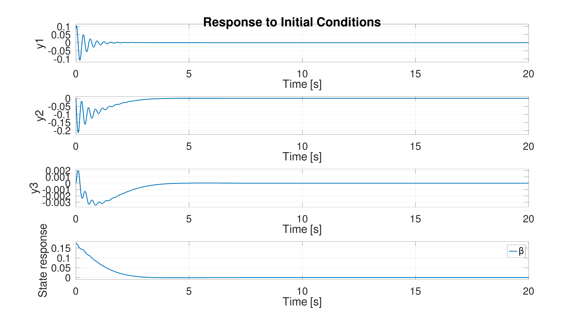

Looking at Figure \ref{fig:LQR_Small_Aileron} we can see that the angle does not exceed $\pm 30^o$, which was the limits of the provided plane, so in this factor the controller is capable of achieving the desired outcome. The plot shows low magnitude high frequency oscillation amongst the settling, this poses the question about the deflection rate, this can be seen in Figure \ref{fig:LQR_Small_Aileron_Rate}. It can be seen that the maximum deflection rate of the aileron is $32^o/s$, this is once again below the maximum of $90^o/s$. There are considerable oscillation in the aileron deflection rate, however no maximum aileron deflection acceleration is provided, so this can be assumed to possible.

#+ATTR_LATEX: :placement [H]
#+CAPTION: LQR Wing Leveller Small Roll Aileron Response \label{fig:LQR_Small_Aileron}
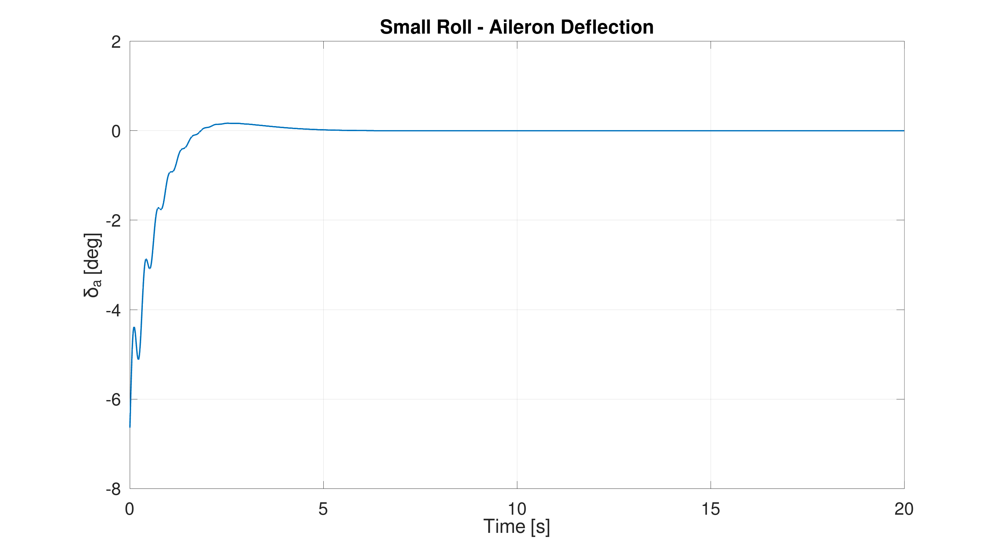

#+ATTR_LATEX: :placement [H]
#+CAPTION: LQR Wing Leveller Small Roll Aileron Rate Response \label{fig:LQR_Small_Aileron_Rate}
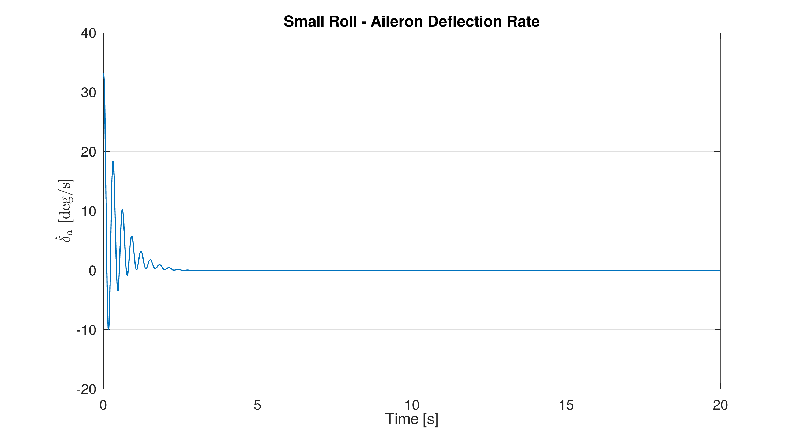

*** Large Roll
 - With the initial conditions of $\beta = 0,\ p = 0\ r = 0\ \phi = 40^o$.

Looking at Figure \ref{fig:LQR_Large_Response} we can see that the response is the same just scaled, which is expected as this is a linear system. Looking at the aileron deflection in Figure \ref{fig:LQR_Large_Aileron} we can see that it almost reaches the maximum of $-30^o$, likewise with Figure \ref{fig:LQR_Large_Aileron_Rate} the aileron deflection just barely goes of there the maximum of $90^o/s$. This means that the controller is capable of handling roll angles approximately in the range $-40^o < \phi < 40^o$.

#+ATTR_LATEX: :placement [H]
#+CAPTION: LQR Wing Leveller Large Roll Response \label{fig:LQR_Large_Response}
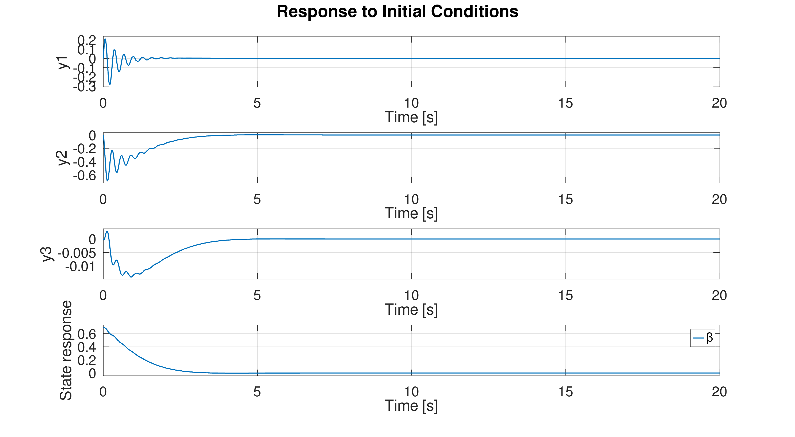

#+ATTR_LATEX: :placement [H]
#+CAPTION: LQR Wing Leveller Large Roll Aileron Response \label{fig:LQR_Large_Aileron}
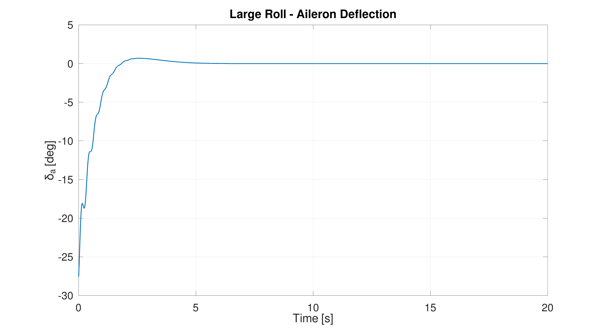

#+ATTR_LATEX: :placement [H]
#+CAPTION: LQR Wing Leveller Large Roll Aileron Rate Response \label{fig:LQR_Large_Aileron_Rate}
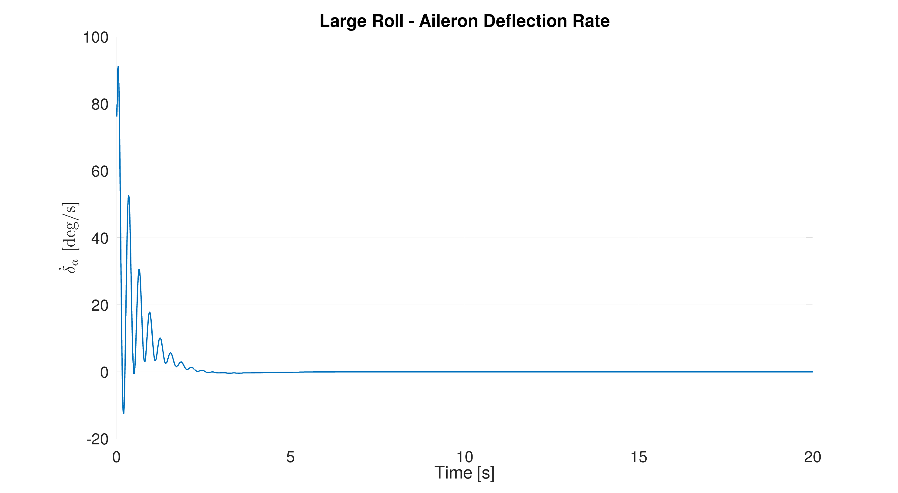

The $40^o$ roll angle is large, however this may be encountered because it is a fighter jet. But, the response may not be indicative of the real response as this model is linearised around a trim point.

** Stability Margins
Looking at the stability margins we would expect the gain margin to be infinite ($G_M = \infty$) and the phase margin to be greater than sixty degrees ($\Phi_M > 60^o$), as this is a LQR regulator.

We can get the $L$ function to find the gain and phase margin, it works out to be:
\begin{align*}
L &= K(sI - A)^{-1}B \\
\begin{bmatrix}
\dot{\beta} \\
\dot{p} \\
\dot{r} \\
\dot{\phi}
\end{bmatrix}
&=
\begin{bmatrix}
-3.437 & 16.31 & -180.7 & 9.773 \\
-23.23 & -1.365 & 0.2569 & 0 \\
0.322 & -0.0313 & -0.1835 & 0 \\
0 & 1 & 0 & 0
\end{bmatrix}
\begin{bmatrix}
\beta \\
p \\
r \\
\phi
\end{bmatrix}
+
\begin{bmatrix}
0 \\
7.235 \\
0.0801 \\
0
\end{bmatrix}
\begin{bmatrix}
\delta_a
\end{bmatrix}
\\[1em]
\begin{bmatrix}
L
\end{bmatrix}
&=
\begin{bmatrix}
-0.05051 & 0.2073 &  4.832 & 0.6889
\end{bmatrix}
\begin{bmatrix}
\beta \\
p \\
r \\
\phi
\end{bmatrix}
+
\begin{bmatrix}
0
\end{bmatrix}
\begin{bmatrix}
\delta_a
\end{bmatrix}
\end{align*}

#+BEGIN_SRC octave :results output :exports none :session EQU_1 :tangle /home/baley/UTAS/ENG417 - Control Systems 2/Q5.m :eval no-export
L = ss(A, B, K, 0)

[GM, PM, Wcg, Wcp] = margin(L)

%% In dB
GM_dB = 20*log10(GM)

%% Plot Bode
figure
margin(L)
grid on
title('Open-loop Stability Margins for LQR Wing Leveller')
print -dpng "ENG417_LQR_Bode"
#+END_SRC

#+RESULTS:
#+begin_example
L.a =
            x1       x2       x3       x4
   x1   -3.437    16.31   -180.7    9.773
   x2   -23.23   -1.365   0.2569        0
   x3    0.322  -0.0313  -0.1835        0
   x4        0        1        0        0

L.b =
           u1
   x1       0
   x2   7.235
   x3  0.0801
   x4       0

L.c =
             x1        x2        x3        x4
   y1  -0.05051    0.2073     4.832    0.6889

L.d =
       u1
   y1   0

Continuous-time model.
GM = Inf
PM = 84.736
Wcg = NaN
Wcp = 1.3034
GM_dB = Inf
#+end_example

The bode plot can be seen in Figure \ref{fig:LQR_Bode}. The gain margin is $G_M = \infty$ and the phase margin is $\Phi_M = 84.7^o$, both are as good as expected.

#+ATTR_LATEX: :placement [H]
#+CAPTION: Open-loop Stability Margins for LQR Wing Leveller \label{fig:LQR_Bode}
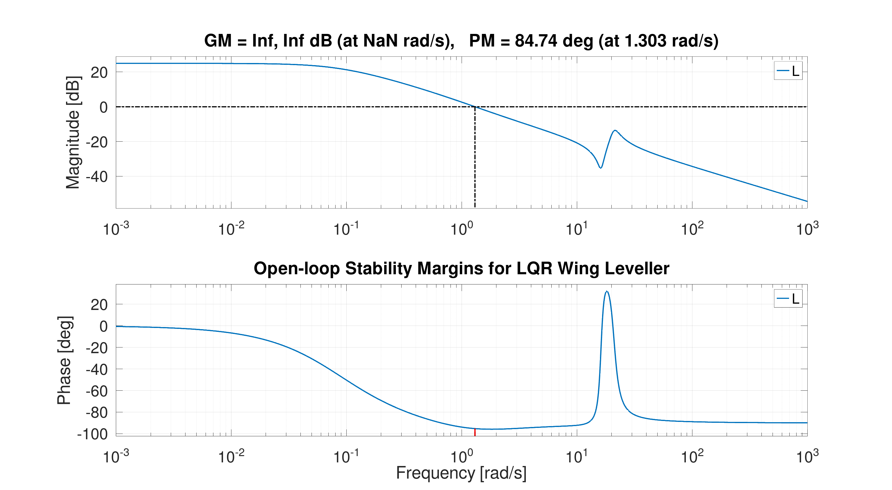

* Question 6: Mach Number Hold Control System
/Use controller pole-placement techniques to design a Mach Number hold control system./

_NOTE:_ The code for this section is in ~Q6.m~ and was tested to work in both Octave and MATLAB.

** System Derivation
A first-order lag of 5 seconds means the throttle dynamics are defined by:
\begin{align*}
\frac{\delta_T(s)}{\delta_{T_c}(s)} &= \frac{1}{5s + 1} \\
\dot{\delta_T} &= -0.2\delta_T + 0.2\delta_{T_c}
\end{align*}

The elevator servo has a time constant of 20 ms, so it is defined by:
\begin{align*}
\frac{\delta_E(s)}{\delta_{E_c}(s)} &= \frac{1}{0.02s + 1} \\
\dot{\delta_E} &= -50\delta_E + 50\delta_{E_c}
\end{align*}

Using an 800 ms time constant for the altimeter gives:
\begin{align*}
\frac{A(s)}{h(s)} &= \frac{1}{0.8s + 1} \\
\dot{A} &= -1.25A + 1.25h
\end{align*}

The altitude kinematics are defined by:
\begin{align*}
\dot{h} &= -w + U_0\theta \\
U_0 &= V_0\cos(\alpha_e) \\
&= 182\cos(5^o) \\
&= 181.3 \text{ m/s} \\
\dot{h} &= -w + 181.3\theta
\end{align*}

The Mach meter has a time constant of 50 ms. Since Mach number is defined as velocity divided by the speed of sound, the perturbation Mach number can be approximated by:
\begin{align*}
\Delta M &\approx \frac{\Delta u}{a} \\
a &= \frac{V_0}{M_0} \\
&= \frac{182}{0.6} \\
&= 303.33 \text{ m/s} \\
\Delta M &\approx \frac{u}{303.33} \\
&= \frac{M_0}{V_0}u
\end{align*}

The Mach meter dynamics are therefore:
\begin{align*}
\frac{M(s)}{M_{\text{true}}(s)} &= \frac{1}{0.05s + 1} \\
\dot{M} &= -20M + 20M_{\text{true}} \\
\dot{M} &= -20M + 20\frac{M_0}{V_0}u \\
\dot{M} &= -20M + 20\frac{0.6}{182}u \\
\dot{M} &= -20M + 0.0659u
\end{align*}

The plant state vector is thus:
\[x = \begin{bmatrix}
u \\
w \\
q \\
\theta \\
h \\
\delta_E \\
\delta_T \\
A \\
M
\end{bmatrix}\]

The control input vector is:
\[u_c = \begin{bmatrix}
\delta_{E_c} \\
\delta_{T_c}
\end{bmatrix}\]

where $\delta_{E_c}$ is the commanded elevator deflection and $\delta_{T_c}$ is the commanded throttle input. The symbol $u_c$ is used for the control input vector to avoid confusion with the other $u$.

The plant model can then be written as:
\[\dot{x} = Ax + Bu_c\]

where:
\[A = \begin{bmatrix}
-0.0002 & 0.0013 & -15.8623 & -9.7727 & 0.0000 & 83.4038 & 97.5694 & 0.0000 & 0.0000 \\
-0.0148 & -0.0490 & 181.3074 & -0.8550 & 0.0000 & 537.5876 & 0.0000 & 0.0000 & 0.0000 \\
0.0005 & 0.0003 & -0.0913 & -0.0004 & 0.0000 & -123.2522 & 0.0000 & 0.0000 & 0.0000 \\
0.0000 & 0.0000 & 1.0000 & 0.0000 & 0.0000 & 0.0000 & 0.0000 & 0.0000 & 0.0000 \\
0.0000 & -1.0000 & 0.0000 & 181.3000 & 0.0000 & 0.0000 & 0.0000 & 0.0000 & 0.0000 \\
0.0000 & 0.0000 & 0.0000 & 0.0000 & 0.0000 & -50.0000 & 0.0000 & 0.0000 & 0.0000 \\
0.0000 & 0.0000 & 0.0000 & 0.0000 & 0.0000 & 0.0000 & -0.2000 & 0.0000 & 0.0000 \\
0.0000 & 0.0000 & 0.0000 & 0.0000 & 1.2500 & 0.0000 & 0.0000 & -1.2500 & 0.0000 \\
0.0659 & 0.0000 & 0.0000 & 0.0000 & 0.0000 & 0.0000 & 0.0000 & 0.0000 & -20.0000
\end{bmatrix}\]

and:
\[B = \begin{bmatrix}
0.0000 & 0.0000 \\
0.0000 & 0.0000 \\
0.0000 & 0.0000 \\
0.0000 & 0.0000 \\
0.0000 & 0.0000 \\
50.0000 & 0.0000 \\
0.0000 & 0.2000 \\
0.0000 & 0.0000 \\
0.0000 & 0.0000
\end{bmatrix}\]

The controlled outputs are the measured Mach number and the measured altitude from the altimeter. Therefore:

\[y = \begin{bmatrix}
M \\
A
\end{bmatrix}\]

and:
\[y = Cx\]

where:
\[C = \begin{bmatrix}
0 & 0 & 0 & 0 & 0 & 0 & 0 & 0 & 1 \\
0 & 0 & 0 & 0 & 0 & 0 & 0 & 1 & 0
\end{bmatrix}\]

To allow the controller to track commanded Mach number and altitude with zero steady-state error, integral action is added. Two integral error states are introduced:
\[z_M = \int (M_{\text{ref}} - M)\,dt\]

\[z_h = \int (h_{\text{ref}} - A)\,dt\]

Therefore:
\[\dot{z}_M = M_{\text{ref}} - M\]

\[\dot{z}_h = h_{\text{ref}} - A\]

The integral states are combined into:
\[z = \begin{bmatrix}
z_M \\
z_h
\end{bmatrix}\]

and the reference input vector is:
\[r = \begin{bmatrix}
M_{\text{ref}} \\
h_{\text{ref}}
\end{bmatrix}\]

Since:
\[\dot{z} = r - y\]

and:
\[y = Cx\]

the integral dynamics can be written as:
\[\dot{z} = r - Cx\]

The augmented state vector used for controller design is then:
\[x_a = \begin{bmatrix}
x \\
z
\end{bmatrix} = \begin{bmatrix}
u \\
w \\
q \\
\theta \\
h \\
\delta_E \\
\delta_T \\
A \\
M \\
z_M \\
z_h
\end{bmatrix}\]

The augmented state-space model is:
\[\dot{x}_a = A_a x_a + B_a u_c + B_r r\]

where:
\[A_a = \begin{bmatrix}
A & 0 \\
-C & 0
\end{bmatrix}\]

\[B_a = \begin{bmatrix}
B \\
0
\end{bmatrix}\]

and:
\[B_r = \begin{bmatrix}
0 \\
I
\end{bmatrix}\]

Written out fully:

\[\footnotesize A_a = \begin{bmatrix}
-0.0002 & 0.0013 & -15.8623 & -9.7727 & 0.0000 & 83.4038 & 97.5694 & 0.0000 & 0.0000 & 0.0000\ \ \ \ \ \ 0.0000 \\
-0.0148 & -0.0490 & 181.3074 & -0.8550 & 0.0000 & 537.5876 & 0.0000 & 0.0000 & 0.0000 & 0.0000\ \ \ \ \ \ 0.0000 \\
0.0005 & 0.0003 & -0.0913 & -0.0004 & 0.0000 & -123.2522 & 0.0000 & 0.0000 & 0.0000 & 0.0000\ \ \ \ \ \ 0.0000 \\
0.0000 & 0.0000 & 1.0000 & 0.0000 & 0.0000 & 0.0000 & 0.0000 & 0.0000 & 0.0000 & 0.0000\ \ \ \ \ \ 0.0000 \\
0.0000 & -1.0000 & 0.0000 & 181.3000 & 0.0000 & 0.0000 & 0.0000 & 0.0000 & 0.0000 & 0.0000\ \ \ \ \ \ 0.0000 \\
0.0000 & 0.0000 & 0.0000 & 0.0000 & 0.0000 & -50.0000 & 0.0000 & 0.0000 & 0.0000 & 0.0000\ \ \ \ \ \ 0.0000 \\
0.0000 & 0.0000 & 0.0000 & 0.0000 & 0.0000 & 0.0000 & -0.2000 & 0.0000 & 0.0000 & 0.0000\ \ \ \ \ \ 0.0000 \\
0.0000 & 0.0000 & 0.0000 & 0.0000 & 1.2500 & 0.0000 & 0.0000 & -1.2500 & 0.0000 & 0.0000\ \ \ \ \ \ 0.0000 \\
0.0659 & 0.0000 & 0.0000 & 0.0000 & 0.0000 & 0.0000 & 0.0000 & 0.0000 & -20.0000 & 0.0000\ \ \ \ \ \ 0.0000 \\
0.0000 & 0.0000 & 0.0000 & 0.0000 & 0.0000 & 0.0000 & 0.0000 & 0.0000 & -1.0000 & 0.0000\ \ \ \ \ \ 0.0000 \\
0.0000 & 0.0000 & 0.0000 & 0.0000 & 0.0000 & 0.0000 & 0.0000 & -1.0000 & 0.0000 & 0.0000\ \ \ \ \ 0.0000
\end{bmatrix}\]

\[B_a =
\begin{bmatrix}
0.0000 & 0.0000 \\
0.0000 & 0.0000 \\
0.0000 & 0.0000 \\
0.0000 & 0.0000 \\
0.0000 & 0.0000 \\
50.0000 & 0.0000 \\
0.0000 & 0.2000 \\
0.0000 & 0.0000 \\
0.0000 & 0.0000 \\
0.0000 & 0.0000 \\
0.0000 & 0.0000
\end{bmatrix}\]

\[B_r =
\begin{bmatrix}
0.0000 & 0.0000 \\
0.0000 & 0.0000 \\
0.0000 & 0.0000 \\
0.0000 & 0.0000 \\
0.0000 & 0.0000 \\
0.0000 & 0.0000 \\
0.0000 & 0.0000 \\
0.0000 & 0.0000 \\
0.0000 & 0.0000 \\
1.0000 & 0.0000 \\
0.0000 & 1.0000
\end{bmatrix}\]

The matrices $A$ and $B$ describe the 9-state plant model, while $A_a$ and $B_a$ will be used for the pole-placement controller design. The reference input matrix $B_r$ will be used when simulating commanded changes in Mach number and altitude.

#+BEGIN_SRC octave :results output :exports none :session Q6 :tangle /home/baley/UTAS/ENG417 - Control Systems 2/Q6.m :eval no-export
clc
clear
close all

if exist('OCTAVE_VERSION', 'builtin')
  set(0, "DefaultLineLineWidth", 2);
  set(0, "DefaultAxesFontSize", 25);
  warning('off');
  pkg load control
end

A = [...
 -0.0002,  0.0013, -15.8623,  -9.7727,   0.0000,   83.4038,   97.5694,   0.0000,   0.0000; ...
 -0.0148, -0.0490, 181.3074,  -0.8550,   0.0000,  537.5876,    0.0000,   0.0000,   0.0000; ...
  0.0005,  0.0003,  -0.0913,  -0.0004,   0.0000, -123.2522,    0.0000,   0.0000,   0.0000; ...
  0.0000,  0.0000,   1.0000,   0.0000,   0.0000,    0.0000,    0.0000,   0.0000,   0.0000; ...
  0.0000, -1.0000,   0.0000, 181.3000,   0.0000,    0.0000,    0.0000,   0.0000,   0.0000; ...
  0.0000,  0.0000,   0.0000,   0.0000,   0.0000,  -50.0000,    0.0000,   0.0000,   0.0000; ...
  0.0000,  0.0000,   0.0000,   0.0000,   0.0000,    0.0000,   -0.2000,   0.0000,   0.0000; ...
  0.0000,  0.0000,   0.0000,   0.0000,   1.2500,    0.0000,    0.0000,  -1.2500,   0.0000; ...
  0.0659,  0.0000,   0.0000,   0.0000,   0.0000,    0.0000,    0.0000,   0.0000, -20.0000 ...
];

B = [...
  0.0000, 0.0000; ...
  0.0000, 0.0000; ...
  0.0000, 0.0000; ...
  0.0000, 0.0000; ...
  0.0000, 0.0000; ...
 50.0000, 0.0000; ...
  0.0000, 0.2000; ...
  0.0000, 0.0000; ...
  0.0000, 0.0000 ...
];

C = [0, 0, 0, 0, 0, 0, 0, 0, 1; ...
     0, 0, 0, 0, 0, 0, 0, 1, 0];

D = zeros(2,2);

Aa = [A, zeros(9,2); ...
     -C, zeros(2,2)];

Ba = [B; zeros(2,2)];

Br = [zeros(9,2); eye(2)];
#+END_SRC

#+RESULTS:

** Controllability

#+BEGIN_SRC octave :results output :exports none :session Q6 :tangle /home/baley/UTAS/ENG417 - Control Systems 2/Q6.m :eval no-export
%% Controlability 
Co = ctrb(A, B);
Co_a = ctrb(Aa, Ba);

rank(Co)
rank(Co, 1e-8)

rank(Co_a)
rank(Co_a, 1e-8)

#+END_SRC

#+RESULTS:
: ans = 6
: ans = 9
: ans = 2
: ans = 11

The rank of the controllability matrices are 6/9 and 2/11, so the systems are not fully controllable. However with a lower tolerance the ranks are 9 and 11, this is because of the different scales used for each variable leading to differences being calculated as very small, hence a larger tolerance fixes shows it to be controllable. So pole placement methods can be used to design a controller.

** Controller Design
Many pole combinations were tested, some more aggressive pole selections produced oscillatory responses or actuator demands that were considered unrealistic. The final selected pole locations provided a suitable compromise between response speed, stability, and actuator usage. The chosen poles are:
\[\lambda = -0.45 \pm 0.45j,\ -0.8 \pm 0.6j,\ -1.5,\ -2.2,\ -3.5,\ -5.0,\ -8.0,\ -12.0,\ -18.0\]

#+BEGIN_SRC octave :results output :exports none :session Q6 :tangle /home/baley/UTAS/ENG417 - Control Systems 2/Q6.m :eval no-export
%% Pole placment
p = [-0.45+0.45i, -0.45-0.45i, ...
     -0.8+0.6i, -0.8-0.6i, ...
     -1.5, -2.2, -3.5, -5.0, -8.0, -12.0, -18.0];

Ka = place(Aa, Ba, p);

Kx = Ka(:,1:9);
Ki = Ka(:,10:11);

%% Closed loop system
Acl = Aa - Ba*Ka;
Bcl = Br;

C_MA = [0, 0, 0, 0, 0, 0, 0, 0, 1, 0, 0; ...
        0, 0, 0, 0, 0, 0, 0, 1, 0, 0, 0];

C_delta = [0,   0,   0,   0,   0,   1,   0,   0,   0,   0,   0; ...
           0,   0,   0,   0,   0,   0,   1,   0,   0,   0,   0];

C_uc = -Ka;

Cout = [C_MA;
        C_delta;
        C_uc];

Dout = zeros(6,2);

sys_cl = ss(Acl, Bcl, Cout, Dout);

%% Ref commands
t = 0:0.05:120;

Mref = 0.02 * ones(size(t));      % Mach perturbation: +0.02
href = 30.48 * ones(size(t));     % Altitude perturbation: +100 ft = 30.48 m

r = [Mref' href'];

[y, t, xa] = lsim(sys_cl, r, t);

M_out = y(:,1);
A_out = y(:,2);
delta_E = y(:,3)*180/pi;
delta_T = y(:,4);
delta_E_cmd = y(:,5)*180/pi;
delta_T_cmd = y(:,6);

%% Plots
close all;
%% Mach response
figure;
plot(t, M_out, "b", t, Mref, "r--");
grid on;
xlim([0 20]);
xlabel("Time (s)");
ylabel("Mach perturbation");
title("Mach Number Response");
legend("Measured Mach", "Mach reference");
print -dpng "ENG417_Mach_Response"

figure;
plot(t, A_out, "b", t, href, "r--");
grid on;
xlim([0 20]);
xlabel("Time (s)");
ylabel("Altitude perturbation (m)");
title("Altitude Response");
legend("Measured altitude", "Altitude reference");
print -dpng "ENG417_Altitude_Response"

%% Plot elevator response
figure;
plot(t, delta_E, "b", t, delta_E_cmd, "r--");
grid on;
xlim([0 20]);
xlabel("Time (s)");
ylabel("Elevator deflection");
title("Elevator Response");
legend("Actual elevator", "Commanded elevator");
print -dpng "ENG417_Elevator_Response"

%% Plot throttle response
figure;
plot(t, delta_T, "b", t, delta_T_cmd, "r--");
grid on;
xlim([0 20]);
xlabel("Time (s)");
ylabel("Throttle perturbation");
title("Throttle Response");
legend("Actual throttle", "Commanded throttle");
print -dpng "ENG417_Throttle_Response"

%% Elevator deflection rate
delta_E_rate = gradient(delta_E, t);
delta_E_cmd_rate = gradient(delta_E_cmd, t);

figure
plot(t, delta_E_rate, "b", t, delta_E_cmd_rate, "r--");
grid on;
xlim([0 20]);
xlabel("Time (s)");
ylabel("Elevator deflection rate");
title("Elevator Rate Response");
legend("Actual elevator rate", "Commanded elevator rate");
print -dpng "ENG417_Elevator_Rate_Response"
#+END_SRC

#+RESULTS:

#+BEGIN_SRC octave :results output :exports none :session Q6 :tangle /home/baley/UTAS/ENG417 - Control Systems 2/Q6.m :eval no-export
%% Limits check
max_delta_E = max(abs(delta_E));
max_delta_E_cmd = max(abs(delta_E_cmd));
max_delta_E_rate = max(abs(delta_E_rate));
max_delta_E_cmd_rate = max(abs(delta_E_cmd_rate));
max_delta_T = max(abs(delta_T));
max_delta_T_cmd = max(abs(delta_T_cmd));

fprintf("\nMaximum actual elevator deflection = %.6f\n", max_delta_E);
fprintf("Maximum commanded elevator deflection = %.6f\n", max_delta_E_cmd);
fprintf("\nMaximum actual elevator deflection rate = %.6f\n", max_delta_E_rate);
fprintf("Maximum commanded elevator deflection rate = %.6f\n", max_delta_E_cmd_rate);
fprintf("Maximum actual throttle perturbation = %.6f\n", max_delta_T);
fprintf("Maximum commanded throttle perturbation = %.6f\n", max_delta_T_cmd);
#+END_SRC
#+RESULTS:
: Maximum actual elevator deflection = 2.993247
: Maximum commanded elevator deflection = 3.023490
: Maximum actual elevator deflection rate = 18.696729
: Maximum commanded elevator deflection rate = 20.272911
: Maximum actual throttle perturbation = 0.030398
: Maximum commanded throttle perturbation = 0.174248

** Analysis
Looking at the Mach number response in Figure \ref{fig:Mach_Response}, the response initially decreases before increasing towards the commanded Mach number. This initial inverse response is due to the coupling between the elevator and throttle dynamics. The elevator responds quickly and can temporarily change the aircraft pitch and flight path, while the throttle response is much slower due to the 5 s engine lag. As a result, the forward velocity, and therefore Mach number, can initially move in the opposite direction before the throttle response develops. The Mach response then overshoots the reference slightly before settling after approximately 15 seconds. The final response has approximately zero steady-state error, showing that the integral action is working correctly.

#+ATTR_LATEX: :placement [H]
#+CAPTION: Mach Number Response \label{fig:Mach_Response}
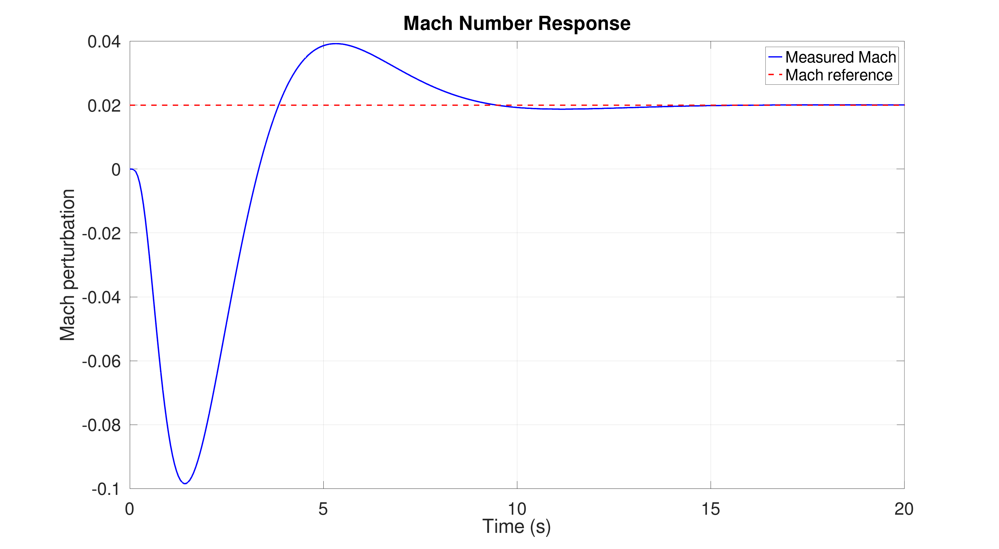

The altitude response is shown in Figure \ref{fig:Altitude_Response}. The measured altitude settles to the reference signal after approximately 20 seconds, with a small amount of overshoot. The altitude response also has approximately zero steady-state error, again demonstrating the effect of the integral action. The altitude response is slightly slower than the Mach response due to the aircraft height dynamics and the altimeter lag.

#+ATTR_LATEX: :placement [H]
#+CAPTION: Altitude Response \label{fig:Altitude_Response}
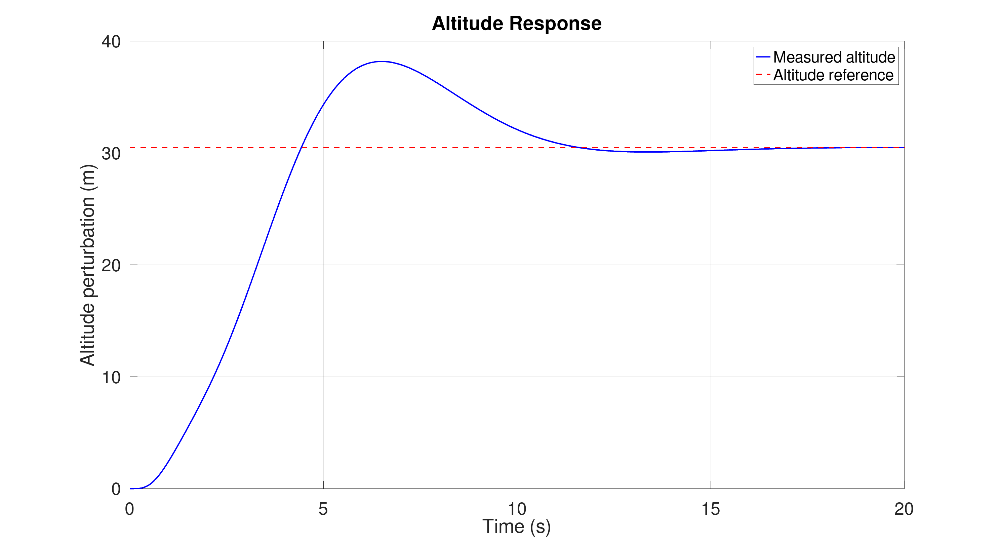

Figure \ref{fig:Elevator_Response} shows the elevator deflection response. The actual elevator response tracks the commanded elevator response very closely because the elevator actuator has a very small time constant of 20 ms. The elevator response settles back towards zero after approximately 10 seconds, which indicates that the elevator is mainly used during the transient response. The elevator deflection limit is $\pm 30^o$, and this limit is not violated. The maximum elevator deflection is approximately $-3^o$, which is well below the limit.

#+ATTR_LATEX: :placement [H]
#+CAPTION: Elevator Response \label{fig:Elevator_Response}
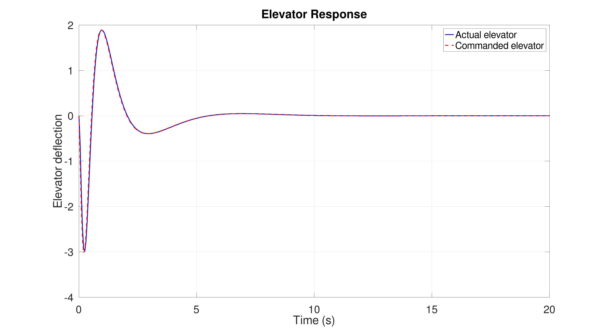

The elevator rate response is shown in Figure \ref{fig:Elevator_Rate_Response}. The maximum elevator rate remains below the limit of $65^o/s$, so the elevator rate constraint is also satisfied. The elevator rate settles after approximately 5 seconds, which is expected because it represents the rate of change of elevator deflection and is therefore largest during the initial transient response.

#+ATTR_LATEX: :placement [H]
#+CAPTION: Elevator Rate Response \label{fig:Elevator_Rate_Response}
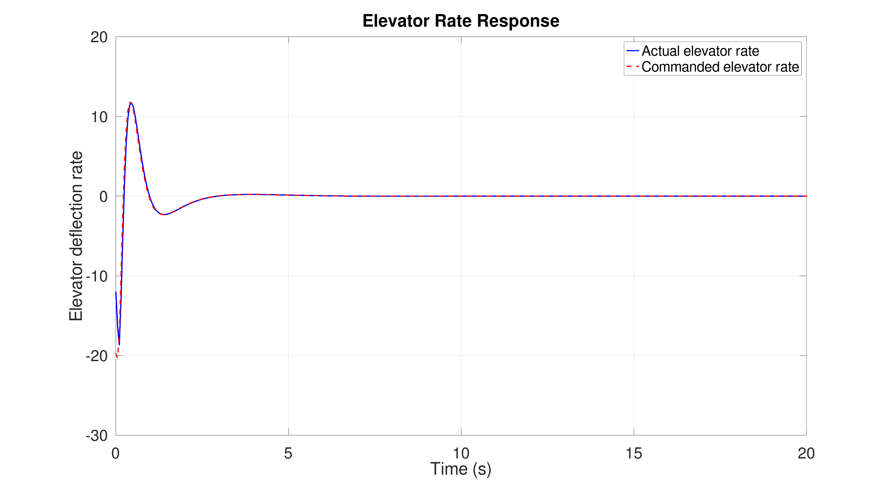

Figure \ref{fig:Throttle_Response} shows the throttle response. The actual and commanded throttle responses do not match closely during the transient period because the throttle and engine dynamics are modelled as a first-order lag with a 5 second time constant. Therefore, the actual throttle response is delayed and smoothed relative to the commanded throttle input. The throttle response settles after approximately 10 seconds and returns to the expected steady-state perturbation value of zero. The maximum commanded throttle perturbation is approximately 0.17, while the maximum actual throttle perturbation is approximately 0.03. These values are within the allowable throttle range of 0% to 100%.

#+ATTR_LATEX: :placement [H]
#+CAPTION: Throttle Response \label{fig:Throttle_Response}
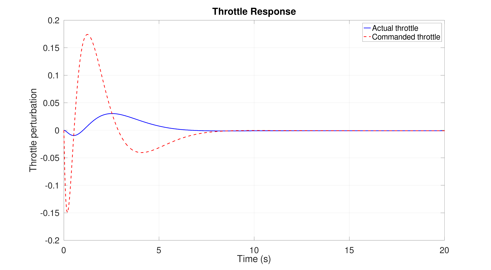

This system is a Multiple-Input Multiple-Output (MIMO) system, so both the elevator and throttle affect both Mach number and altitude. The elevator can affect Mach number indirectly through changes in pitch attitude and flight path, while the throttle affects Mach number more directly but much more slowly. The controller coordinates both inputs to track the commanded Mach number and altitude while keeping the actuator deflections and rates within their limits.

* 7. Model Predictive Control (MPC)
/Implement a model predictive control system to execute an altitude-adjustment-and-hold command, taking the plane from its starting altitude of 30, 000 ft and ending at an altitude of 32 000 ft. Note that in practice, the trim state changes here, but the linearised dynamics still provide a reasonable model of the system. As part of your response, show that the transfer function between the elevator angle and altitude is given approximately by $\frac{h(s)}{\delta_e(s)} = \frac{V_0}{s}\left(\frac{\theta(s)}{\delta_e(s)} - \frac{\alpha(s)}{\delta_e(s)}\right)$/

_NOTE:_ The code for this section is in ~Q7.m~ and was tested to work in both Octave and MATLAB.

** System Model
First the longitudinal system model was formed,

\[\dot{x}=\underline{A}\underline{x}+\underline{B}\underline{u}\]

\[\begin{bmatrix}\dot{u}\\\dot{w}\\\dot{q}\\\dot{\theta}\end{bmatrix}= \begin{bmatrix}-0.0002 & 0.0013 & -15.8623 & -9.7727 \\ -0.0148 & -0.0490 & 181.3074 & -0.8550 \\ 0.0005 & 0.0003 & -0.0913 & -0.0004 \\ 0.0000 & 0.0000 & 1.0000 & 0.0000 \end{bmatrix} \begin{bmatrix}u\\w\\q\\\theta\end{bmatrix} + \begin{bmatrix}83.4038 & 97.5694 \\ 537.5876 & 0.0000 \\ -123.2522 & 0.0000 \\ 0.0000 & 0.0000\end{bmatrix} \begin{bmatrix}\delta_e \\ \delta_t \end{bmatrix}\]

\[\underline{y}=\underline{C}\underline{x}\]

\[\underline{y} = \begin{bmatrix}1&0&0&0\\0&1&0&0\\0&0&1&0\\0&0&0&1\end{bmatrix}
\begin{bmatrix}u\\w\\q\\\theta\end{bmatrix}\]

** Discrete System
Next the discrete state space models were formed using the formulas below with $T_s=0.5$,

\[\underline{A}(T_s)=\underline{A}_m=e^{\underline{A}T_s}=I+\underline{A}T_s+\dfrac{\underline{A}^2T_s^2}{2!}+...+\dfrac{\underline{A}^kT_s^k}{k!}\]

\[\underline{B}(T_s)=\underline{B}_m=\left(IT_s+\dfrac{\underline{A}T_s^2}{2!}+\dfrac{\underline{A}^2T_s^3}{3!}+...+\dfrac{\underline{A}^kT_s^{k_1}}{(k+1)!}\right)\underline{B}\]

\[\underline{C}(T_s)=\underline{C}\]

The first column of $B_m$ is taken to only use the elevator control input $\delta_e$.

** Augmented Plant Model
This is then augmented to add altitude and altimeter lag states forming the following plant model. This is required because the original plant model did not originally include altitude, however this is needed to accurately control the height response. The altimeter state is used because the controller does not have perfect knowledge of the current height, only the delayed measurement from the altimeter.

The height state is formed from the aircraft dynamics, using the flight path angle. The climb rate is approximately,

\[\dot{h}=V_0\gamma\]

Substituting $\gamma = \theta-\alpha$. For small perturbations the angle of attack is approximately,

\[\alpha\approx \dfrac{\omega}{V_0}\]

This gives,

\[\dot{h}=V_0\theta-\omega\]

This is also equivalent to,

\[\dfrac{h(s)}{\delta_e(s)}=\dfrac{V_0}{s}\left(\dfrac{\theta(s)}{\delta_e(s)}-\dfrac{\alpha(s)}{\delta_e(s)}\right)\]

This can be discretised to form,

\[h[k+1]=h[k]+T_s(V_0\theta[k]-\omega[k])\]

The measured height state can be formed following the steps below,

\[\dfrac{h_m(s)}{h(s)}=\dfrac{a}{s+a}\]

\[\dot{h_m}=a(h-h_m)\]

where,

\[a=\dfrac{1}{\tau_{alt}}\]

Discretising gives,

\[h_m[k+1]=T_sah[k]+(1-T_sa)h_m[k]\]

These are both used to form the augmented plant model below,

\[\begin{bmatrix}u[k+1]\\w[k+1]\\q[k+1]\\\theta[k+1]\\h[k+1]\\h_m[k+1]\end{bmatrix} =  \begin{bmatrix}-0.0002&0.0013&-15.8623&-9.7727&0.0000&0.0000\\-0.0148 &-0.0490&181.3074&-0.8550&0.0000&0.0000\\0.0005&0.0003&-0.0913&-0.0004&0.0000&0.0000\\0.0000 &0.0000 &1.0000&0.0000&0.0000&0.0000\\
0.0000&-0.5000&0.0000&9.1000&1.0000&0.0000\\0.0000&0.0000&0.0000&0.0000&0.0625&0.9375\end{bmatrix} \begin{bmatrix}u[k]\\w[k]\\q[k]\\\theta[k]\\h[k]\\h_m[k]\end{bmatrix} +  \begin{bmatrix}6.6356&0\\-1.0966&0\\-6.1484&0\\-0.1538&0\\0&0\\0&0\end{bmatrix} \begin{bmatrix}\delta_e\\\delta_T\end{bmatrix}\]

\[y[k+1]=\begin{bmatrix}0&0&0&0&0&1\end{bmatrix}\begin{bmatrix}u[k]\\w[k]\\q[k]\\\theta[k]\\h[k]\\h_m[k]\end{bmatrix}\]

$C_m$ only includes the altimeter state because the controller is using the measured altitude.

** MPC Augmentation
The MPC augmentation is formed using the following steps,

\[x[k]=\begin{bmatrix}\Delta x_m[k]\\y[k]\end{bmatrix}\]

\[\Delta x_m[k+1]=\underline{x}_m[k+1]-\underline{x}_m[k]\]

\[\Delta u[k+1]=\underline{u}_m[k+1]-\underline{u}_m[k]\]

\[\underline{x}[k+1]=\begin{bmatrix}\underline{A_m}&\underline{0}\\\underline{C}_m\underline{A}_m&1\end{bmatrix}\underline{x}[k]+\begin{bmatrix}\underline{B}_m\\\underline{C}_m\underline{B}_m\end{bmatrix}\Delta u[k]\]

\[y[k]=\begin{bmatrix}\underline{0}&1\end{bmatrix}\underline{x}[k]\]

The MPC predicts the future output over a prediction horizon using,

\[\underline{Y}=\underline{F}x[k_i]+\underline{\Phi}\underline{\Delta U}\]

The free response matrix $\underline{F}$ and dynamic matrix $\underline{\Phi}$ can be pre-calculated as seen below to simplify calculations,

\[\underline{F}=\begin{bmatrix}\underline{CA}\\\underline{CA}^2\\...\\\underline{CA}^{N_p}\end{bmatrix}\]

\[\underline{\Phi}=\begin{bmatrix}\underline{CB}&\underline{0}&\underline{0}&...&\underline{0}\\
\underline{CAB}&\underline{CB}&\underline{0}&...&\underline{0}\\
...&...&...&...&...\\
\underline{CA}^{(N_p-1)}\underline{B}&\underline{CA}^{(N_p-2)}\underline{B}&\underline{CA}^{(N_p-3)}\underline{B}&...&\underline{CA}^{(N_p-N_c)}\underline{B}\end{bmatrix}\]

** Reference Command
The altitude command used is from 30,000 ft to 32,000 ft. As the model is based on perturbations around the trim altitude, the reference used by the MPC is $r=609.6m$. An initial step command caused very aggressive pitch angle and vertical velocity responses. This occurred because the controller was trying to reach the final altitude as quickly as possible, which pushed the linear model outside its realistic small perturbation range.

To improve the response a ramped reference was used instead. This was implemented as,

\[r_{now}=\min\left(r,\dfrac{r\cdot t_{now}}{\text{climb time}}\right)\]

The predicted reference vector is then set as $R_s=r_{now}$ over the predicted horizon. This is updated in the main simulation loop, with climb time as a tunable parameter. This helped to reduce the large pitch angle and vertical velocity transients seen initially.

** Cost Function
The MPC cost function was used to balance the altitude tracking performance against elevator movement. The cost function used is,

\[J=(\underline{R}_s-\underline{Y})^T(\underline{R}_s-\underline{Y})+\underline{\Delta U}^T R\underline{\Delta U}\]

The first term penalises the predicted altitude tracking error. The second term penalises changes in elevator input. The input weighting $R$ is a tunable parameter. Increasing $R$ made the response smoother, however if it was too large the aircraft became slow to reach the target altitude.

** Elevator Constraints
The MPC included hard constraints on elevator deflection and elevator rate. The specification defines constraints,

\[-30^\circ\le\delta_e\le30^\circ\]

\[|\Delta\delta_e|\le65^\circ/s\cdot T_s\]

** Simulation Method
The simulation was performed by repeatedly solving the MPC optimisation problem at each time step. At each sample, the measured altitude was calculated from the plant state. The change in plant state was then used to form the augmented MPC state. The quadratic programming problem was then solved to find the optimal sequence of future elevator controls. Only the first control step was applied. This was then propagated forward, with each state stored for plotting.

** Results
The final MPC tuning used $T_s = 0.05\ \text{s}$, $N_p = 80$, $N_c = 5$, $R_{\text{weight}} = 10$, and a climb time of $20\ \text{s}$. With these settings, the aircraft was able to climb from $30000\ \text{ft}$ to $32000\ \text{ft}$ and then hold the new altitude.

A ramped altitude command was used instead of a step input. This made the response much more realistic, as the aircraft was not being asked to instantly change altitude. The altitude plot shows that the true altitude follows the command closely and reaches the final reference with only a small overshoot. The measured altitude sits slightly behind the true altitude during the climb because the altimeter was modelled with a first-order lag. This matches what would be expected in the real system, where the controller acts on the measured altitude rather than the exact true altitude.

The elevator response shows that the controller stayed well within the deflection limit of $\pm 30^\circ$. The elevator rate also remained within the specified limit of $\pm 65^\circ/\text{s}$. The largest rate changes occur at the start of the climb and when the ramp reaches the final altitude, which makes sense because these are the points where the controller has to adjust the aircraft motion the most.

The pitch angle and vertical velocity responses are also much better than the earlier step-response results. The pitch angle rises at the start of the climb, then settles during the climb before reducing again as the aircraft captures the final altitude. The vertical velocity follows the same pattern, increasing while the aircraft climbs and then returning close to zero once the altitude hold condition is reached.

Overall, the final MPC response meets the aim of the altitude adjustment and hold task. It reaches the target altitude, includes the effect of altimeter lag, and respects both elevator constraints. The response is still slightly aggressive around the start and end of the ramp, but it is much more physically reasonable than the original step-response tuning.

#+CAPTION: Altitude response
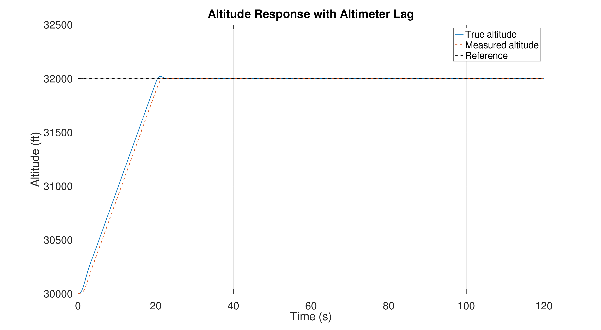

#+CAPTION: Elevator input
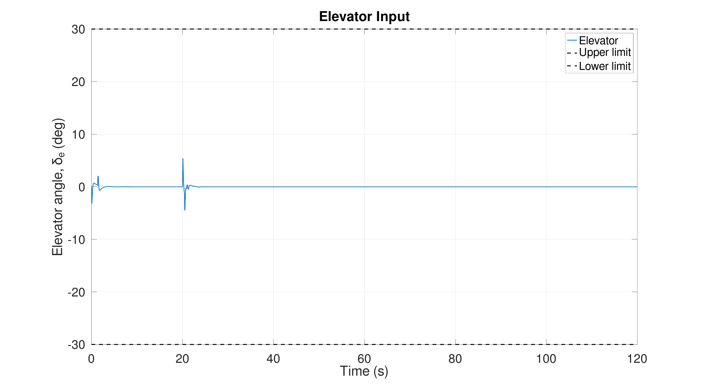

#+CAPTION: Elevator rate of change
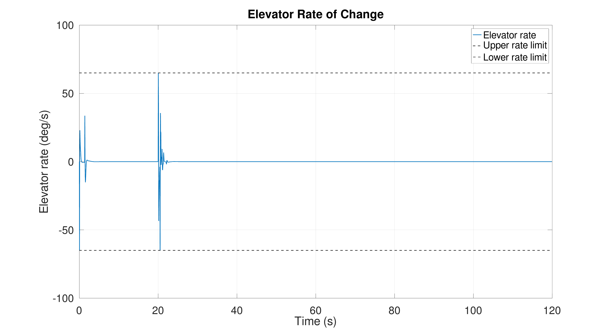

#+CAPTION: Pitch angle
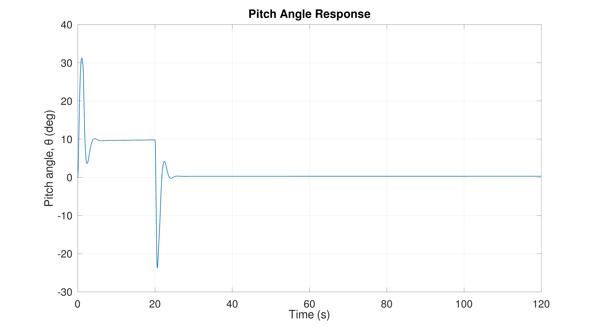

#+CAPTION: Velocity
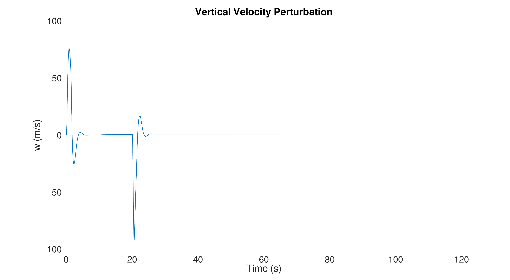

#+BEGIN_SRC octave :results output :exports none :session Q7 :tangle /home/baley/UTAS/ENG417 - Control Systems 2/Q7.m :eval no-export
clc;
clear;
close all;

if exist('OCTAVE_VERSION', 'builtin')
  set(0, "DefaultLineLineWidth", 2);
  set(0, "DefaultAxesFontSize", 25);
  warning('off');
  pkg load control
  pkg load optim
end

%% Longtiudiunal Model 
% xdot = A*x+B*u
% y = C*x+D*u

% xdot = [udot; wdot; qdot; thetadot];
% x =[u; w; q; theta];
% u = [delta_e; delta_T];

% A Matrix from project 1 feedback
A = [-0.0002, 0.0013, -15.8623, -9.7727;
    -0.0148, -0.490, 181.3074, -0.8550;
    0.0005, 0.0003, -0.0913, 0.0004;
    0, 0, 1, 0];
% B Matrix from project 1 feedback
B = [83.4038, 97.5694;
    537.876, 0;
    -123.252, 0;
    0, 0];
% Take only elevator control
Be = B(:,1);
C = eye(4);

%% System variables and Constants (need to update)

Ts = 0.05;   % To update as needed
k = 10;     % To update as needed
Nc = 5;     % To update as needed
Np = 80;    % To update as needed
R_weight = 10;       % larger value gives smoother elevator action

climb_time = 20;   % seconds to ramp from 30000 ft to 32000 ft

x0 = [0;0;0];
xm0 = [0;0];

V0 = 182;                  % trim velocity, m/s
ft_to_m = 0.3048;

h0_ft = 30000;             % starting altitude
hf_ft = 32000;             % final altitude

r = (hf_ft - h0_ft) * ft_to_m;    % altitude reference in metres

%% Discrete State Space Model 
ATs = zeros(4,4);
BTs = zeros(4,2);
BTse = zeros(4,2);
for i = 1:k+1
    ATs = ATs + (Ts)^(i-1)*A^(i-1)./factorial(i-1);
    BTs = BTs + (A^(i-1)*Ts^(i)*B/factorial(i));
end

Am = ATs;
Bm = BTs(:,1)  % Take only the elevator control
Cm = C;

% xm[k+1] = Am*xm[k] + Bm*um[k[
% y[k] = Cm*xm[k]

%% Add altitude and altimeter lag states
% x_m = [u_a; w; q; theta; h; h_m]
%
% h[k+1]   = h[k] + Ts*(V0*theta[k] - w[k])
% h_m_dot  = a_alt*(h - h_m)
% h_m[k+1] = h_m[k] + Ts*a_alt*(h[k] - h_m[k])

tau_alt = 0.8;          % altimeter time constant in seconds
a_alt = 1/tau_alt;
Am = [Am, zeros(4,2);
       0, -Ts, 0, Ts*V0, 1, 0;
       0,  0,  0, 0, Ts*a_alt, 1 - Ts*a_alt]
Bm = [Bm;
       0;
       0];
% Output is measured altitude, not true altitude
Cm = [0 0 0 0 0 1];

%% MPC augmentation 
% x[k] = [Delta x_m[k]; y[k]]
%
% x[k+1] = A*x[k] + B*Delta u[k]
% y[k]   = C*x[k]

n = size(Am,1);      % number of plant states, n = 5
ny = size(Cm,1);     % number of outputs, ny = 1

A = [Am, zeros(n,ny);
     Cm*Am, eye(ny)];
B = [Bm;
     Cm*Bm];
C = [zeros(ny,n), eye(ny)];

%% Build prediction matrices
% Y = F*x[k] + Phi*DeltaU

F = zeros(Np*ny, n + ny);
Phi = zeros(Np*ny, Nc);

for i = 1:Np
    % Free response term: C*A^i
    F((i-1)*ny+1:i*ny, :) = C * (A^i);
    % Forced response terms
    for j = 1:Nc
        if i >= j
            Phi((i-1)*ny+1:i*ny, j) = C * (A^(i-j)) * B;
        end
    end
end

%% Cost function weighting
R = R_weight * eye(Nc);

% Reference trajectory
% R_s = r * ones(Np*ny,1); % Now updated in the loop

%% Input constraints
u_max = deg2rad(30);
u_min = -u_max;

du_max = deg2rad(65) * Ts;
du_min = -du_max;

% Rate constraints on DeltaU
% du_min <= DeltaU <= du_max

I_Nc = eye(Nc);

M_1 = [ I_Nc;
       -I_Nc];

gamma_1 = [ du_max * ones(Nc,1);
           -du_min * ones(Nc,1)];

% Matrix that accumulates DeltaU into future U values
H = tril(ones(Nc));

%% Simulation setup
Tfinal = 120;
Nsim = round(Tfinal/Ts);

% Plant state x_m = [u_a, w, q, theta, h]'
x_m = zeros(n,1);
x_m_prev = x_m;

% Control input u[k] = delta_e[k]
u = 0;

% Storage vectors
time = zeros(Nsim,1);
h_true_store_ft = zeros(Nsim,1);
h_meas_store_ft = zeros(Nsim,1);
u_store_deg = zeros(Nsim,1);
theta_store_deg = zeros(Nsim,1);
w_store = zeros(Nsim,1);
q_store = zeros(Nsim,1);
elevator_rate_store = zeros(Nsim,1);
u_prev = u;

% quadprog options
if exist('OCTAVE_VERSION', 'builtin')
else
  options = optimoptions('quadprog', 'Display', 'off');
end

%% Simulation loop
for k = 1:Nsim

      % Current simulation time
    t_now = (k-1)*Ts;

    % Output y[k] = h[k]
    y = Cm*x_m;

    % Delta x_m[k]
    delta_x_m = x_m - x_m_prev;

    % MPC state x[k]
    x = [delta_x_m;
         y];

    % Ramped altitude reference
    r_now = min(r, r*t_now/climb_time);
    R_s = r_now * ones(Np,1);

    % QP cost matrices
    E = 2*(Phi'*Phi + R);
    f_qp = -2*Phi'*(R_s - F*x);

    % Magnitude constraints on future u values
    % u_min <= u[k-1] + H*DeltaU <= u_max

    M_2 = [ H;
           -H];

    gamma_2 = [ u_max*ones(Nc,1) - u*ones(Nc,1);
               -u_min*ones(Nc,1) + u*ones(Nc,1)];

    % Combine constraints
    % M*DeltaU <= gamma

    M = [M_1;
         M_2];

    gamma = [gamma_1;
             gamma_2];

    % Solve constrained MPC optimisation
    if exist('OCTAVE_VERSION', 'builtin')
      [DeltaU, ~, exitflag] = quadprog(E, f_qp, M, gamma, [], [], [], [], []);
    else
      [DeltaU, ~, exitflag] = quadprog(E, f_qp, M, gamma, [], [], [], [], [], options);
    end

    % If quadprog fails, apply no change in elevator
    if exitflag <= 0
        DeltaU = zeros(Nc,1);
    end

    % Apply only the first control increment
    delta_u = DeltaU(1);

    % u[k] = u[k-1] + Delta u[k]
    u = u + delta_u;

    % Safety clamp against numerical issues
    u = max(min(u, u_max), u_min);

    % Propagate the plant
    x_m_prev = x_m;

    % x_m[k+1] = A_m*x_m[k] + B_m*u[k]
    x_m = Am*x_m + Bm*u;

    % Store results
    time(k) = (k-1)*Ts;
    h_true_store_ft(k) = h0_ft + x_m(5)/ft_to_m;
    h_meas_store_ft(k) = h0_ft + x_m(6)/ft_to_m;
    u_store_deg(k) = rad2deg(u);
    theta_store_deg(k) = rad2deg(x_m(4));
    w_store(k) = x_m(2);
    q_store(k) = x_m(3);
    elevator_rate_store(k) = rad2deg((u - u_prev) / Ts);
    u_prev = u;

end

%% Plot Results
%% Plot altitude response
figure;
plot(time, h_true_store_ft, 'LineWidth', 1.5);
hold on;
plot(time, h_meas_store_ft, '--', 'LineWidth', 1.5);
yline(hf_ft, ':', 'LineWidth', 1.2);
grid on;
xlabel('Time (s)');
ylabel('Altitude (ft)');
title('Altitude Response with Altimeter Lag');
legend('True altitude', 'Measured altitude', 'Reference', 'Location', 'best');
print -dpng "ENG417_AltitudeResponse"

%% Plot elevator input
figure;
plot(time, u_store_deg, 'LineWidth', 1.5);
hold on;
yline(30, '--');
yline(-30, '--');
grid on;
xlabel('Time (s)');
ylabel('Elevator angle, \delta_e (deg)');
title('Elevator Input');
legend('Elevator', 'Upper limit', 'Lower limit', 'Location', 'best');
print -dpng "ENG417_ElevatorInput"

%% Plot elevator rate
figure;
plot(time, elevator_rate_store, 'LineWidth', 1.5);
hold on;
yline(65, '--', 'LineWidth', 1.2);
yline(-65, '--', 'LineWidth', 1.2);
grid on;
xlabel('Time (s)');
ylabel('Elevator rate (deg/s)');
title('Elevator Rate of Change');
legend('Elevator rate', 'Upper rate limit', 'Lower rate limit', 'Location', 'best');
print -dpng "ENG417_ElevatorRateofChange"

%% Plot pitch angle
figure;
plot(time, theta_store_deg, 'LineWidth', 1.5);
grid on;
xlabel('Time (s)');
ylabel('Pitch angle, \theta (deg)');
title('Pitch Angle Response');
print -dpng "ENG417_PitchAngle"

%% Plot vertical velocity perturbation
figure;
plot(time, w_store, 'LineWidth', 1.5);
grid on;
xlabel('Time (s)');
ylabel('w (m/s)');
title('Vertical Velocity Perturbation');
print -dpng "ENG417_Velocity"

%% Print final values
fprintf('Final true altitude: %.2f ft\n', h_true_store_ft(end));
fprintf('Final measured altitude: %.2f ft\n',h_meas_store_ft(end));
fprintf('Final elevator angle: %.2f deg\n', u_store_deg(end));
fprintf('Final pitch angle: %.2f deg\n', theta_store_deg(end));
fprintf('Final vertical velocity perturbation: %.4f m/s\n', w_store(end));
#+END_SRC

#+RESULTS:
#+begin_example
Bm =

   6.6356
  -1.0966
  -6.1484
  -0.1538
Am =

   1.0000   0.0001  -0.8032  -0.4886        0        0
  -0.0006   0.9759   8.9341  -0.0420        0        0
   0.0000   0.0000   0.9955   0.0000        0        0
   0.0000   0.0000   0.0499   1.0000        0        0
        0  -0.0500        0   9.1000   1.0000        0
        0        0        0        0   0.0625   0.9375
Final true altitude: 32000.00 ft
Final measured altitude: 32000.00 ft
Final elevator angle: -0.01 deg
Final pitch angle: 0.31 deg
Final vertical velocity perturbation: 0.9825 m/s
#+end_example

\newpage

* Appendix A - Code For Question 5

#+INCLUDE: "/home/baley/UTAS/ENG417 - Control Systems 2/Q5.m" src octave

\newpage
* Appendix B - Code For Question 6

#+INCLUDE: "/home/baley/UTAS/ENG417 - Control Systems 2/Q6.m" src octave

\newpage
* Appendix C - Code For Question 7

#+INCLUDE: "/home/baley/UTAS/ENG417 - Control Systems 2/Q7.m" src octave
