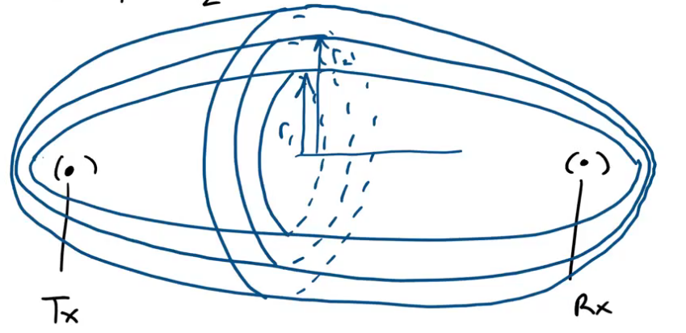

:PROPERTIES:
:ID:       244088d2-641b-4711-a24b-034f0f5af679
:END:
#+title: Fresnel Zone
#+date: [2026-07-11 Sat 16:40]
#+AUTHOR: Baley Eccles - 652137
#+STARTUP: latexpreview

* Fresnel Zone

\[r_n = \sqrt{\frac{n\lambda d_1 d_2}{d_1 + d_2}}\]
If $d_1 = d_2$, we get maximised power distribution.

Found using:
\[\frac{E_d}{E_0} = F(\nu) = \frac{(1 + j)}{2}\int_{\nu}^{\infty}e^{-j\frac{\pi t^2}{2}}dt\]
This has been approximated as:
\[G_d[dB] = 20\log_{10}|F(\nu)|\]
Where:
\[G_d[dB] = \begin{cases}
0 &,\ \nu \leq -1 \\
20\log_{10}(0.5 - 0.62\nu) &,\ -1< \nu \leq 0 \\
20\log_{10}(0.5e^{-0.95\nu}) &,\ 0 < \nu \leq 1 \\
20\log_{10}(0.4 - \sqrt{0.1184 - (0.38 - 0.1\nu)^2}) &,\ 1 \leq \nu < 2.4 \\
20\log_{10}(\frac{0.225}{\nu}) &,\ \nu \geq 2.4
\end{cases}\]
