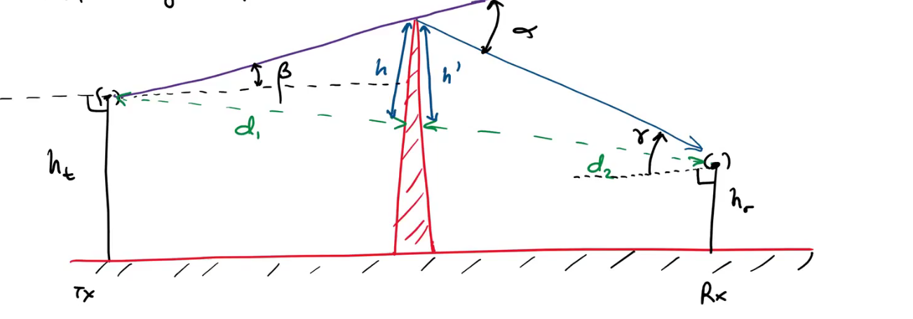
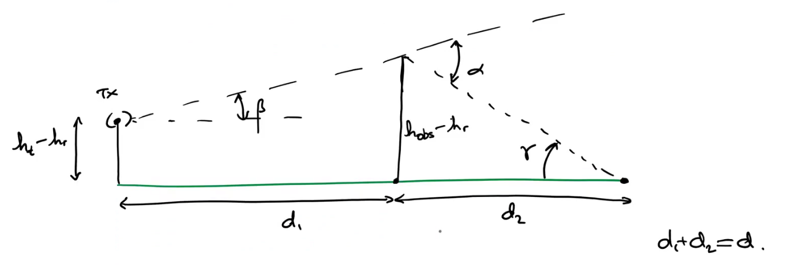

:PROPERTIES:
:ID:       5c7a2564-4736-445c-b417-bc5fe2920203
:END:
#+title: Diffraction
#+date: [2026-07-11 Sat 16:41]
#+AUTHOR: Baley Eccles - 652137
#+STARTUP: latexpreview

* Diffraction
** Knife-Edge Diffraction

If $\alpha$ and $\beta$ are small, and $h << d$, and $d_2$, then $h\approx h\prime$.

From the geometry, the excess path lenght of the wave is:
\[\Delta = \frac{h^2(d_1 + d_2)}{2d_1d_2}\]
So the phase difference is:
\[\phi = \frac{2\pi \Delta}{\lambda} \approx \frac{2\pi}{\lambda}\frac{h^2}{2}\frac{d_1 _{ d_2}}{d_1d_2}\]
From a small angle approximation (so a ntenna height is << d), $\alpha = \beta + \gamma$. and
\[\alpha \approx h\frac{d_1 + d_2}{d_1d_2}\]
Usually, the Fresnel-Kirchoff diffraction parameter is used to normalise:
\[\nu = h\sqrt{\frac{2(d_1 + d_2)}{\lambda d_1 d_2}} = \alpha \sqrt{\frac{2d_1 d_2}{\lambda(d_1 + d_2)}}\]
Therefor, $\phi = \frac{\pi}{2}\nu^2$
