:PROPERTIES:
:ID:       348a72c0-0839-4cd2-aa09-08452564f5f1
:END:
#+title: ENG405 - Communication Systems 2 – Project 1
#+date: [2026-07-16 Thu 18:23]
#+AUTHOR: Baley Eccles - 652137
#+STARTUP: latexpreview
#+FILETAGS: :Assignment:UTAS:2026:
#+LATEX_HEADER: \usepackage[a4paper, margin=1in]{geometry}
#+LATEX_HEADER_EXTRA: \usepackage{minted}
#+LATEX_HEADER_EXTRA: \usepackage{fontspec}
#+LATEX_HEADER_EXTRA: \setmonofont{Iosevka}
#+LATEX_HEADER_EXTRA: \setminted{fontsize=\small, frame=single, breaklines=true}
#+LATEX_HEADER_EXTRA: \usemintedstyle{emacs}
#+LATEX_HEADER_EXTRA: \usepackage{float}
#+LATEX_HEADER_EXTRA: \usepackage[final]{pdfpages}
#+LATEX_HEADER_EXTRA: \setlength{\parindent}{0pt}
#+LATEX_HEADER_EXTRA: \setlength{\parskip}{1em}
#+LATEX_HEADER_EXTRA: \documentclass[12pt]{article}

* Question 1
** (a) Distribution Of The Received Amplitude
The received complex signal is:
\[S=X+jY\]
And each are distributed normally:
\begin{align*}
X &\sim \mathcal{N}(x_0,\sigma^2) \\
Y &\sim \mathcal{N}(y_0,\sigma^2)
\end{align*}

$X$ and $Y$ are independent. The deterministic LOS vector is:
\[r_0=x_0+jy_0\]

The received amplitude is
\[A=\sqrt{X^2+Y^2}\]

The PDF of $X$ and $Y$ is
\[f_{X,Y}(x,y) = \frac{1}{2\pi\sigma^2} \exp\left[ -\frac{(x-x_0)^2+(y-y_0)^2}{2\sigma^2} \right]\]

We need this in polar coordinates, so let $x = a\cos\theta$ and $y = a\sin\theta$. Also use the substitution $x_0 = r_0\cos\theta_0$ and $y_0 = r_0\sin\theta_0$.

#+BEGIN_SRC octave :results output :exports none :session Q1 :eval no-export :tangle ENG405_Project_1_Q1.m
clc
clear
close all

if exist('OCTAVE_VERSION', 'builtin')
  set(0, "DefaultLineLineWidth", 2);
  set(0, "DefaultAxesFontSize", 25);
  warning('off');
  pkg load symbolic
end

syms x y r_0 theta theta_0 sigma a I
x_0 = r_0*cos(theta_0);
y_0 = r_0*sin(theta_0);

f = (1/(2*pi*sigma^2))*exp(-((x - x_0)^2 + (y - y_0)^2)/(2*sigma^2));

f_polar = subs(f, [x, y], [a*cos(theta), a*sin(theta)])*a;

f_polar = simplify(f_polar);
latex(f_polar)
#+END_SRC

#+RESULTS:
: Symbolic pkg v3.2.2: Python communication link active, SymPy v1.14.0.
: \frac{a e^{\frac{- a^{2} + 2 a r_{0} \cos{\left(\theta - \theta_{0} \right)} - r_{0}^{2}}{2 \sigma^{2}}}}{2 \pi \sigma^{2}}

Hence:
\[f_{A,\Theta}(a,\theta) = \frac{a}{2 \pi \sigma^{2}} \exp\left[\frac{- a^{2} + 2 a r_{0} \cos{\left(\theta - \theta_{0} \right)} - r_{0}^{2}}{2 \sigma^{2}}\right]\]

The PDF of $A$ is obtained by integrating over all angles:
\begin{align*}
f_A(a) &= \int_{-\pi}^{\pi} f_{A,\Theta}(a,\theta)d\theta \\
2\pi I_0(x) &= \int_{-\pi}^{\pi}e^{x\cos(\theta)}\ d\theta \\
\Rightarrow f_A(a) &= \frac{2\pi a}{2\pi\sigma^2}\exp\left[-\frac{a^2 + r_0^2}{2\sigma^2}\right]\int_{-\pi}^{\pi}\exp\left[\frac{ar_0}{\sigma^2}\cos(\theta - \theta_0)\right]\ d\theta \\
f_A(a) &= \boxed{\frac{a}{\sigma^2}\exp\left[-\frac{a^2 + r_0^2}{2\sigma^2}\right]I_0\left(\frac{ar_0}{\sigma^2}\right)}
\end{align*}

** (b) Approximate Expression For PDF

#+BEGIN_SRC octave :results output :exports none :session Q1 :eval no-export :tangle ENG405_Project_1_Q1.m
latex(vpa(1/(2*pi)*((x^0)/(factorial(0))*int((cos(theta))^0, theta, -pi, pi)), 4))
latex(vpa(1/(2*pi)*((x^1)/(factorial(1))*int((cos(theta))^1, theta, -pi, pi)), 4))
latex(vpa(1/(2*pi)*((x^2)/(factorial(2))*int((cos(theta))^2, theta, -pi, pi)), 4))
latex(vpa(1/(2*pi)*((x^3)/(factorial(3))*int((cos(theta))^3, theta, -pi, pi)), 4))
latex(vpa(1/(2*pi)*((x^4)/(factorial(4))*int((cos(theta))^4, theta, -pi, pi)), 4))
#+END_SRC

#+RESULTS:
: 1.0
: 0
: 0.25 x^{2}
: 0
: 0.01562 x^{4}

\begin{align*}
f(x) &= \sum_{n=0}^{\infty}\frac{f^{(n)}(0)}{n!}x^n \\
e^{x\cos \theta} &= \sum_{n=0}^{\infty}\frac{(x\cos\theta)^n}{n!} = \sum_{n=0}^{\infty}\frac{x^n\cos^n\theta}{n!} \\
f(x) &= \frac{1}{2\pi}\sum_{n=0}^{\infty} \frac{x^n}{n!}\int_{-\pi}^{\pi}\cos^n(\theta)\ d\theta \\
\Rightarrow f(x) &\approx \boxed{1 + \frac{x^2}{4}} + \frac{x^4}{64}
\end{align*}

Hence:
\begin{align*}
I_0\left(\frac{ar_0}{\sigma^2}\right) &\approx 1 + \frac{a^2r_0^2}{4\sigma^4} \\
\Rightarrow f_A(a) &= \boxed{\frac{a}{\sigma^2}\exp\left[-\frac{a^2 + r_0^2}{2\sigma^2}\right]\left(1 + \frac{a^2r_0^2}{4\sigma^4}\right)}
\end{align*}

** (c) Distribution Of Received Power
Let the received power be $L = A^2 \Rightarrow A = \sqrt{L}$, we can transform the PDF using $f_L(l) = f_A(\sqrt{L})\frac{1}{2\sqrt{L}}$ because $\frac{dA}{dL} = \frac{1}{2\sqrt{L}}$ and the probability within the amplitude interval must equal the probability within the corresponding power interval ($f_L(l)dl = f_A(a)da$). This means:
\begin{align*}
\frac{dA}{dL} &= \frac{1}{2\sqrt{L}} \\
f_L(l) &= \frac{\sqrt{l}}{\sigma^2}\exp\left[-\frac{l + r_0^2}{2\sigma^2}\right]I_0\left(\frac{\sqrt{l}r_0}{\sigma^2}\right) \frac{1}{2\sqrt{l}} \\
f_L(l) &= \frac{1}{2\sigma^2}\exp\left[-\frac{l + r_0^2}{2\sigma^2}\right]I_0\left(\frac{\sqrt{l}r_0}{\sigma^2}\right)
\end{align*}
Using the Taylor series approximation we can get the statistical distribution of the power of the incoming signal:
\[f_L(l) \approx \boxed{\frac{1}{2\sigma^2}\exp\left[-\frac{l + r_0^2}{2\sigma^2}\right]\left(1 + \frac{lr_0^2}{4\sigma^4}\right)}\]

The relative error is approximately the first ignored term of the Taylor Series, this is $\epsilon_{\textrm{rel}} \approx \frac{x^4}{64}$. Substituting in $x = \frac{\sqrt{l} r_0}{\sigma^2}$ we get $\epsilon_{\textrm{rel}} = \frac{l^2r_0^4}{64\sigma^8}$. As $l \rightarrow \infty$, $\epsilon_{\textrm{rel}} \rightarrow \infty$, so there is no bound on the maximum error.

** (d) Why The Outage Probability Expression Is True
An outage occurs if $SIR = \frac{L}{Z} < R$, which means:
\begin{align*}
\frac{L}{Z} &< R \\
Z &> \frac{L}{R}
\end{align*}
So a call will be successful if $Z \leq \frac{l}{R}$, using the PDF to find the probability this means:
\[P_{\textrm{call}} = \int_0^{\frac{l}{R}}p_Z(Z=z)dz\]
But, $L$ is also a random variable, every value of it must also be considered:
\begin{align*}
P_{\textrm{success}} &= \int_0^{\infty}P_{\textrm{call}}p_L(L=l)dl \\
P_{\textrm{success}} &= \int_0^{\infty}\left[\int_0^{\frac{l}{R}}p_Z(Z=z)dz\right]p_L(L=l)dl \\
\end{align*}
And $P_{\textrm{out}} = 1 - P_{\textrm{success}}$:
\[\Rightarrow P_{\textrm{out}} &= \boxed{1 - \int_0^{\infty}\left[\int_0^{\frac{l}{R}}p_Z(Z=z)dz\right]p_L(L=l)dl}\]

The boundary between outage and a successful call is $z = \frac{l}{R}$:

#+ATTR_LATEX: :placement [H]
#+CAPTION: \label{fig:Q1d1}
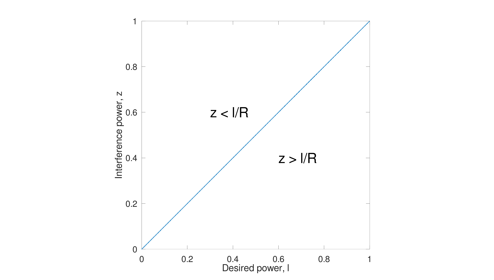

#+BEGIN_SRC octave :results output :exports none :session Q1 :eval no-export :tangle ENG405_Project_1_Q1.m
close all
R = 1;
l = [0:0.001:1];
z = l/R;
figure;
plot(l,z, '')
axis equal;
set(gca, "PlotBoxAspectRatio", [1 1 1]);
text(0.3, 0.6, 'z < l/R', 'FontSize', 40);
text(0.6, 0.4, 'z > l/R', 'FontSize', 40);
xlabel("Desired power, l");
ylabel("Interference power, z");
print("Q1d_Pr_Line.png", "-dpng");
#+END_SRC

#+RESULTS:

When adding the requirement that the desired signal power must exceed $R_N\chi_l$ means $l \geq R_N\chi_l$. This simply means that the lower limit of the $L$ integral changes to $R_N\chi_l$ because an outage would occur for values less than it.
\[P_{\textrm{out}} &= \boxed{1 - \int_{R_N\chi_l}^{\infty}\left[\int_0^{\frac{l}{R}}p_Z(Z=z)dz\right]p_L(L=l)dl}\]
** (e) Required Value Of $R$
We require $P_{\textrm{out}} \geq 0.5\%$
\begin{align*}
P_{\textrm{out}} &= \frac{R\chi_z}{R\chi_z + \chi_l}e^{-\left(\frac{r_0^2}{R\chi_z + \chi_l}\right)} \\
0.005 &\leq \frac{R\chi_z}{R\chi_z + \chi_l}e^{-\left(\frac{r_0^2}{R\chi_z + \chi_l}\right)} \\
\chi_l &= 5\chi_z \\
r_0^2 &= 0.8\chi_l \\
\Rightarrow r_0^2 &= 4\chi_z \\
\Rightarrow 0.005 &\leq \frac{R\chi_z}{R\chi_z + 5\chi_z}e^{-\left(\frac{4\chi_z}{R\chi_z + 5\chi_z}\right)} \\
\Rightarrow 0.005 &\leq \frac{R}{R + 5}e^{-\left(\frac{4}{R + 5}\right)} \\
\end{align*}
Using ~Octave~/~MATLAB~
#+BEGIN_SRC octave :results output :exports none :session Q1 :eval no-export
syms R
R_val = vpasolve(0.5/100 == R/(R + 5)*exp(-(4/(R+5))), R)
R_dB = vpa(10*log10(R_val))
#+END_SRC

#+RESULTS:
: R_val = (sym) 0.055764813887475151713817805805105
: R_dB = (sym) -12.536397428991592734233585002252
\[\boxed{R = 0.0558} = \boxed{-12.54\ \textrm{dB}}\]
** (f) Significance For Mobile Systems
From the outage probability equation we can see few things:
\[P_{\textrm{out}} &= \frac{R\chi_z}{R\chi_z + \chi_l}\exp\left[-\frac{r_0^2}{R\chi_z + \chi_l}\right]\]
1. As the SIR ($R$) increases the outage probability ($P_{out}$) increases. This means that a system that requires a higher quality signal will have increased outages.
2. As the interfering signal power ($\chi_z$) increases the outage probability ($P_{out}$) increases. This would occur in dense areas where there are many interfering signals, such as cities.
3. As the average desired signal power ($\chi_l$) increases the outage probability ($P_{out}$) decreases. This means that increasing the transmitter power will improve the received data, this could be done by choosing the closest/strongest base station to communicate to.
4. As the LOS component ($r_0$) increases the probability ($P_{out}$) decreases. This means positioning the antenna in the direction of the receiver will decrease outages, for rural base stations this would mean making the antenna transmit in a circle and taller, in urban areas this would mean directing the antenna down streets and away from buildings.

* Question 2
** Full Reflected-Wave Model
Wave 1 has LOS from the transmitter to the receiver, it has path length:
\[d_1 = \sqrt{d^2 + (h_t - h_r)^2}\]

Wave 2 is reflected off the ground, it has path length:
\[d_2 = \sqrt{d^2 + (h_t + h_r)^2}\]
It is reflected with angle:
\[\psi = \tan^{-1}\left(\frac{h_t + h_r}{d}\right)\]
The complex ground permittivity can be calculated as:
\[\tilde{\epsilon_r} = \epsilon_r - j\frac{\sigma}{\omega\epsilon_0}\]
In the notes we assumed that the reflection coefficient ($\Gamma$) is $-1$ because we assumed that the reflection ($\psi$) is small, this is not true and the actual value depends on:
\begin{align*}
\Gamma_{\|} &= \frac{\epsilon_r\sin(\theta_i) - \sqrt{\epsilon_r - \cos^2(\theta_i)}}{\epsilon_r\sin(\theta_i) + \sqrt{\epsilon_r - \cos^2(\theta_i)}} \\
\Gamma_{\perp} &= \frac{\sin(\theta_i) - \sqrt{\epsilon_r - \cos^2(\theta_i)}}{\sin(\theta_i) + \sqrt{\epsilon_r - \cos^2(\theta_i)}}
\end{align*}
$\Gamma_{\|}$ is for parallel/vertical polarised waves and $\Gamma_{\perp}$ is for perpendicularly/horizontal polarised waves.

The two waves can be represented by:
\begin{align*}
E_1 &\propto \frac{e^{-j\frac{2\pi}{\lambda}d_1}}{d_1} \\
E_2 &\propto \Gamma\frac{e^{-j\frac{2\pi}{\lambda}d_2}}{d_2} \\
E_{TOT} &\propto \frac{e^{-j\frac{2\pi}{\lambda}d_1}}{d_1} + \Gamma\frac{e^{-j\frac{2\pi}{\lambda}d_2}}{d_2} \\
\end{align*}

Using \[P_r = \frac{P_tG_tG_r\lambda^2}{(4\pi)^2d^2L}\] we can get:
\[P_r = \frac{P_tG_tG_r\lambda^2}{(4\pi)^2L}\left|\frac{e^{-j\frac{2\pi}{\lambda}d_1}}{d_1} + \Gamma\frac{e^{-j\frac{2\pi}{\lambda}d_2}}{d_2}\right|^2\]

The path loss is defined as:
\[PL = -10\log_{10}\left(\frac{P_r}{P_t}\right)\]
Which means the path loss is:
\[PL = -10\log_{10}\left(\frac{G_tG_r\lambda^2}{(4\pi)^2L}\left|\frac{e^{-j\frac{2\pi}{\lambda}d_1}}{d_1} + \Gamma\frac{e^{-j\frac{2\pi}{\lambda}d_2}}{d_2}\right|^2\right)\]
** Simplified Two-Ray Model
We can simplify the two-ray model by assuming the wave is totally reflected with a $180^{\circ}$ shift ($\Gamma = -1$), at large distances the distance travelled by each wave will be the same ($d_1 = d_2 = d_3$). Preforming these approximations we get:
\begin{align*}
P_r &= P_t G_t G_r \frac{h_t^2 h_r^2}{d^4} \\
PL &= 40\log_{10}(d) - 20\log_{10}(h_t) - 20\log_{10}(h_r) - 10\log_{10}(G_tG_r)
\end{align*}
This approximation is valid for when the distance between the receiver and transmitter is large ($d >> \frac{4\pi h_t h_r}{\lambda}$).

** Free-Space Model
The free space model simply ignores all losses and only takes into account the transmitter power, receiver gain, transmitter gain, wavelength/frequency and the distance. It is simply:
\[P_r = P_tG_tG_R\left(\frac{\lambda}{4\pi d_1}\right)^2\]
** Analysis
The ~Octave~/~MATLAB~ code can be seen in ~ENG405_Project_1_Q2.m~, it uses $h_t = 10\ \mathrm{m}$, $h_r = 2\ \mathrm{m}$ $\epsilon_r = 15$, $\sigma = 0.005\ \mathrm{S/m}$, $P_t = 1\ \mathrm{W}$ and unity gain for the receiver and transmitter. The Figures \ref{fig:Q21}, \ref{fig:Q22}, \ref{fig:Q23} and \ref{fig:Q24} were produced by the code.

Figure \ref{fig:Q21} shows the each of the models at $500\ \mathrm{MHz}$. The Full Fresnel model and the Two-ray simplified model shows the patterns of constructive and destructive interference. The interference is caused by the reflected wave from the ground arriving at the receiver with different phase from the LOS wave.

The biggest general disagreements between each model is at short distances, this is because the reflection coefficient is smaller at larger reflection angles. The Full Fresnel model has reflection coefficient at $0\ \mathrm{m}$ of:
\begin{align*}
\Gamma_{\|} &= \frac{\epsilon_r\sin(\theta_i) - \sqrt{\epsilon_r - \cos^2(\theta_i)}}{\epsilon_r\sin(\theta_i) + \sqrt{\epsilon_r - \cos^2(\theta_i)}} \\
&= 0.67
\end{align*}
Where as all the other models assume it is $1$. Although the difference is small for all except the far two-ray approximation (not surprising given the name and equation used). As the distance increase they become almost identical, with exception of the free space model which diverges significantly, this is because the approximation only has $d^{-2}$ term not $d^{-4}$.

#+ATTR_LATEX: :placement [H]
#+CAPTION: \label{fig:Q21}
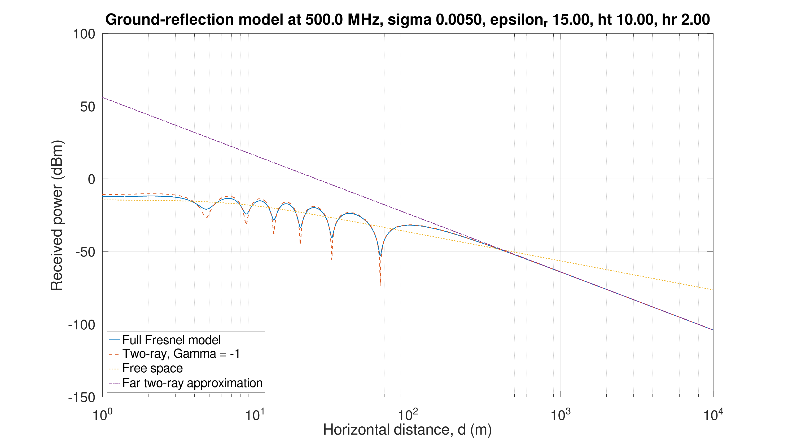

Looking at Figure \ref{fig:Q22}, which are the models simulated at $2.4\ \mathrm{GHz}$. We can see that there are many more points where the signal interferes constructively and destructively, this is simply due to the smaller wavelength. As before the same with disagreements between models is true, smaller distance means more error and larger is less error.

Both frequencies (Figures \ref{fig:Q21} and \ref{fig:Q22}) reach the asymptote of the far two-ray approximation, this is due to the $d^{-4}$ term, same with the asymptote for the free space model being due to the $d^{-2}$.

#+ATTR_LATEX: :placement [H]
#+CAPTION: \label{fig:Q22}
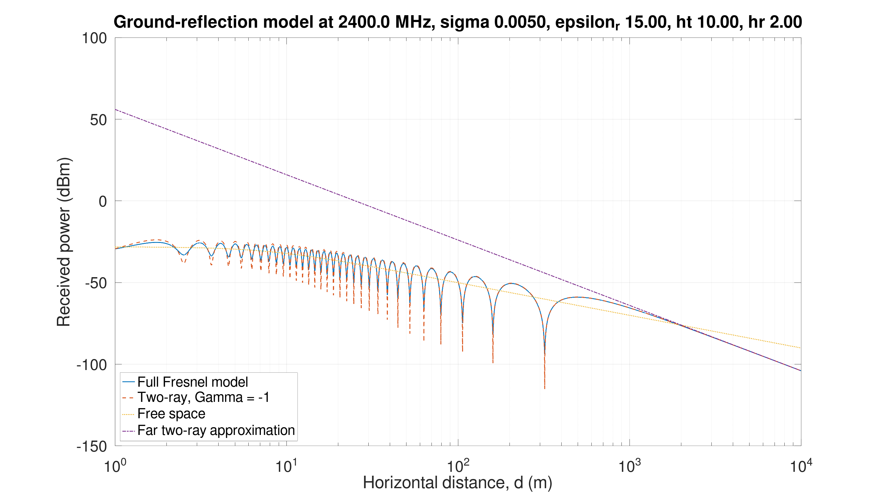

Increasing the heights of the antennas will increase the power received , this intuitively makes sense, as we increase the heights of the antennas the amount of the signal hitting the ground reduces. Changing the heights of antennas also changes the amount and locations of the interference, this is due to allowing/not allowing the phase change more or less from the greater/lower distance. This can also be seen in Figure \ref{fig:Q23}, by multiplying the receiver height by $10$ we see that interference gets more squished. The power increase (at $1000\ \mathrm{m}$) from $\approx-70\ \mathrm{dBm} \approx 1\times10^{-8}\ \mathrm{W}$ to $\approx-50\ \mathrm{dBm} \approx 1\times10^{-10}\ \mathrm{W}$, which is a $100$ times increase in power received, this is predicted because $P_r\propto h_t^2h_r^2$.

#+ATTR_LATEX: :placement [H]
#+CAPTION: \label{fig:Q23}
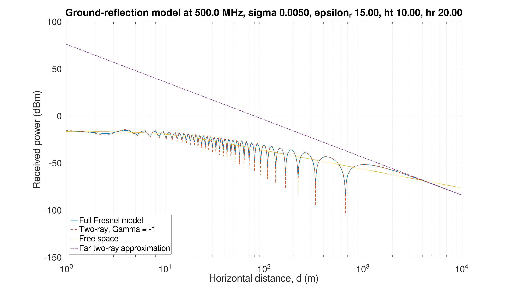

Changing the ground permittivity changes the reflection coefficient, so it will only change the full model. We would expect for larger $\epsilon_r$ the power increases slightly because more of the wave is reflected, for smaller $\epsilon_r$ we would expect to see less power delivered. This can be seen in Figures \label{fig:Q24} and \label{fig:Q25}, the power is slightly lower in the second Figure. As the distance gets larger the effect gets smaller, this is because the angle of reflection coefficient goes to $1$ ($\theta_i \rightarrow 0 \Rightarrow \Gamma \rightarrow 1$)

#+ATTR_LATEX: :placement [H]
#+CAPTION: \label{fig:Q24}
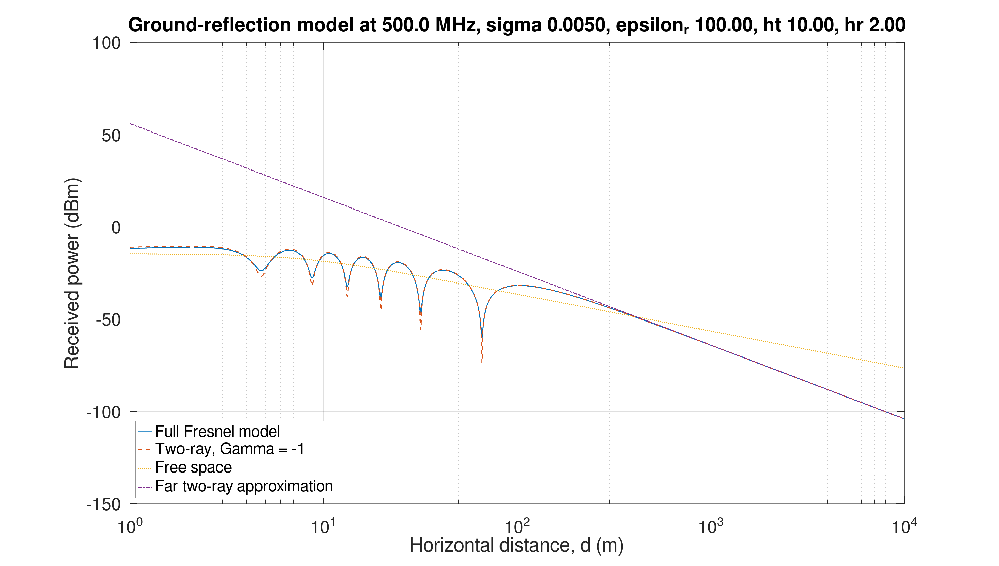

#+ATTR_LATEX: :placement [H]
#+CAPTION: \label{fig:Q25}
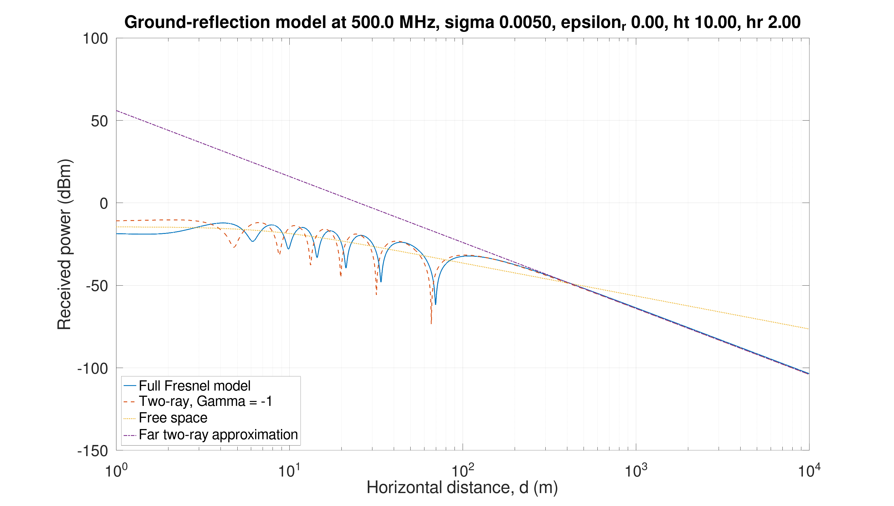

The simplification of $\Gamma = -1$ assumes that the reflected signal has the same amplitude as the incident signal and has a $180^{\circ}$ phase shift. The simulation shows that this is inaccurate for small distances (large reflection angles), this is because the reflection coefficient far from $-1$ for these cases. As the distance increase (small reflection angles) the assumption becomes considerable more accurate. Likewise, the assumption that $d_1 \approx d_2$ also only holds for large distances, for short distances this isn't true and can be seen in the simulation.

Changing the polarisation from perpendicular/horizontal to parallel/vertical will introduce the possibility of encountering the Brewster angle, this can cause the reflection coefficient to become zero. This would cause none of the power from the ground reflected signal to be received, reducing power received but deleting the interference patterns. This can be seen in Figure \ref{fig:Q26} at about $46.5\ \mathrm{m}$, the calculations for this are as follows.

\begin{align*}
\theta_B &= \tan^{-1}\left(\frac{1}{\sqrt{\epsilon_r}}\right) \\
\tan(\theta_B) &= \frac{h_t + h_r}{d} \\
d &= \frac{h_t + h_r}{\tan(\theta_B)} \\
d &= (h_t + h_r)\sqrt{\epsilon_r} \\
d &= (10 + 2)\sqrt{15} \\
d &= 46.5\ \mathrm{m}
\end{align*}

#+ATTR_LATEX: :placement [H]
#+CAPTION: \label{fig:Q26}
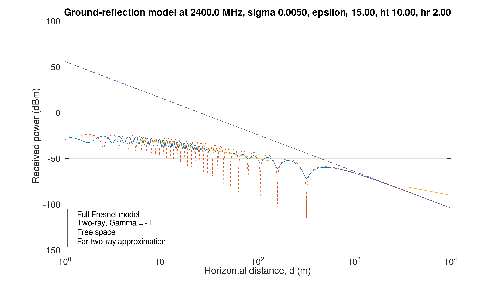

Real life measurements would contain many more propagation paths, the wave would reflect off the atmosphere, buildings, trees, vehicles etc.. The new equation to consider is:

\[E = \sum_{n=1}^{\infty}E_n\]

This would produce a less regular curve than the two path model. Receiver noise would make it impossible to measure the lower powered signals, whereas the simulation is able to theoretically predict them. Change in the antenna distances would change the measured values, particularly at $2.4\ \mathrm{GHz}$ where the antennas would only need to move by a few centimetres (due to the short wavelength). Overall, we would expect the real measurements to produce a plot that is smoother with less obvious interference patterns.

#+BEGIN_SRC octave :results output :exports none :session Q2 :eval no-export :tangle ENG405_Project_1_Q2.m
clear
close all
clc
if exist('OCTAVE_VERSION', 'builtin')
  set(0, "DefaultLineLineWidth", 2);
  set(0, "DefaultAxesFontSize", 25);
  warning('off');
end

%% Constants
c = 3e8; % Speed of light
epsilon_0 = 8.854187817e-12; % Permitivity of free space
epsilon_r = 15; % Relative permittivity
sigma = 0.005; % Conductivity

%% Transmitter and receiver parameters
Pt = 1; % Transmitted power
Gt = 1; % Transmitter antenna gain
Gr = 1; % Receiver antenna gain

ht = 10; % Transmitter height
hr = 2; % Receiver height

frequencies = [500e6, 2.4e9];

d = logspace(0, 4, 10000);

%% Polarisation:
%% "H" = horizontal
%% "V" = vertical
polarisation = "H";

for index = 1:length(frequencies)

  f = frequencies(index);
  omega = 2*pi*f;
  lambda = c/f;
  k = 2*pi/lambda;
  
  epsilon_complex = epsilon_r - 1i*sigma/(omega*epsilon_0);

  r1 = sqrt(d.^2 + (ht - hr)^2);
  r2 = sqrt(d.^2 + (ht + hr)^2);

  psi = atan((ht + hr)./d);

  if strcmpi(polarisation, "H")
    Gamma = (sin(psi) - sqrt(epsilon_complex - cos(psi).^2)) ./ (sin(psi) + sqrt(epsilon_complex - cos(psi).^2));
  else
    Gamma = (epsilon_complex*sin(psi) - sqrt(epsilon_complex - cos(psi).^2)) ./ (epsilon_complex*sin(psi) + sqrt(epsilon_complex - cos(psi).^2));
  end

  %% Full electromagnetic two-path field
  field_full = exp(-1i*k*r1)./r1 + Gamma.*exp(-1i*k*r2)./r2;

  Pr_full = Pt*Gt*Gr*(lambda/(4*pi))^2 .* abs(field_full).^2;

  %% Simplified two-ray model
  field_two_ray = exp(-1i*k*r1)./r1 - exp(-1i*k*r2)./r2;

  Pr_two_ray = Pt*Gt*Gr*(lambda/(4*pi))^2 .* abs(field_two_ray).^2;

  %% Free-space
  Pr_free_space = Pt*Gt*Gr .* (lambda./(4*pi*r1)).^2;

  %% Far-distance two-ray approximation
  Pr_far = Pt*Gt*Gr .* (ht^2*hr^2)./(d.^4);

  %% Prevent log10(0)
  Pr_full = max(Pr_full, realmin);
  Pr_two_ray = max(Pr_two_ray, realmin);
  Pr_free_space = max(Pr_free_space, realmin);
  Pr_far = max(Pr_far, realmin);
  
  Pr_full_dBm = 10*log10(Pr_full/1e-3);
  Pr_two_ray_dBm = 10*log10(Pr_two_ray/1e-3);
  Pr_free_space_dBm = 10*log10(Pr_free_space/1e-3);
  Pr_far_dBm = 10*log10(Pr_far/1e-3);

  figure;

  semilogx(d, Pr_full_dBm, "linewidth", 1.5);
  hold on;
  semilogx(d, Pr_two_ray_dBm, "--", "linewidth", 1.5);
  semilogx(d, Pr_free_space_dBm, ":", "linewidth", 1.5);
  semilogx(d, Pr_far_dBm, "-.", "linewidth", 1.5);

  grid on;

  xlabel("Horizontal distance, d (m)");
  ylabel("Received power (dBm)");

  title(sprintf("Ground-reflection model at %.1f MHz, sigma %.4f, epsilon_r %.2f, ht %.2f, hr %.2f", f/1e6, sigma, epsilon_r, ht, hr));

  legend("Full Fresnel model", "Two-ray, \Gamma = -1", "Free space", "Far two-ray approximation", "location", "southwest");
  pause(0.5); % pause so it prints correctly
  print(sprintf("ENG405_Q2_%.1f_MHz_Ground_Reflection_%s_sigma_%.4f_er_%.2f_ht_%.2f_hr_%.2f_.png", f/1e6, polarisation, sigma, epsilon_r, ht, hr), "-dpng");

  Gamma_H = (sin(psi) - sqrt(epsilon_complex - cos(psi).^2)) ./ (sin(psi) + sqrt(epsilon_complex - cos(psi).^2));

  Gamma_V = (epsilon_complex*sin(psi) - sqrt(epsilon_complex - cos(psi).^2)) ./ (epsilon_complex*sin(psi) + sqrt(epsilon_complex - cos(psi).^2));
  hold off;

  fprintf("\nFrequency: %.1f MHz\n", f/1e6);
  fprintf("Wavelength: %.4f m\n", lambda);
end
#+END_SRC

#+RESULTS:
: Frequency: 500.0 MHz
: Wavelength: 0.6000 m
: 
: Frequency: 2400.0 MHz
: Wavelength: 0.1250 m

* Question 3
** a
We can generate random channel coefficients using $h_k = \sigma_k(a_k + jb_k)$, where $a_k, b_k \sim N(0,1)$ and $\sigma_k$ is the variance which is used to ensure the power is consistent:
\begin{align*}
E\{|h_k|^2\} &= P_k \\
x_k, x_k &\sim N(0,1) \\
P_k &= E\{x_k^2\} + E\{y_k^2\} \\
P_k &= \sigma_k^2 + \sigma_k^2 \\
\sigma_k &= \sqrt{\frac{P_k}{2}}
\end{align*}

The unit power QPSK pilot bits can be generate using:
\[x[n] = \frac{(1 - 2b_1) + j(1 - 2b_2)}{\sqrt{2}}\]
The received signal is:
\[y[n] = h_0x[n] + h_1x[n-1] + h_2x[n-2] + n[n]\]
Where $n[n]$ is the receivers noise and is generated using:
\[n[n] = \sqrt{\frac{N_0}{2}}(n_1[n] + jn_2[n])\]
Where $n_1,n_2 \sim N(0,N_0)$. The channel can be estimated using:
\[r = Ah + n\]
Where for a 3 tap channel:
\[A = \begin{bmatrix}
x[2] & x[1] & x[0] \\
x[3] & x[2] & x[1] \\
x[4] & x[3] & x[2] \\
\vdots & \vdots & \vdots \\
x[N] & x[N - 1] x[N - 2]
\end{bmatrix}\]
And can be calculated using $\tilde{h} = (A^HA)^{-1}A^Hr$
This can be seen implemented in the ~Octave~/~MATLAB~ code ~ENG405_Project_1_Q3.m~. With a random seed of ~31~, and running from ~Octave~, the output has an actual channel response and estimated response of:
\begin{align*}
h &= \begin{bmatrix}
-0.470796 - 0.523828j \\
 0.376513 + 0.354112j \\
-0.011633 - 0.088637j
\end{bmatrix} &
\tilde{h} &= \begin{bmatrix}
-0.487280 - 0.489631j \\
 0.317130 + 0.380030j \\
 0.020867 - 0.008645j
\end{bmatrix} 
\end{align*}
We can see that the estimation is close, but not equal, to the actual response, as expected.

#+BEGIN_SRC octave :results output :exports none :session Q3 :eval no-export :tangle ENG405_Project_1_Q3.m
clear
close all
clc
if exist('OCTAVE_VERSION', 'builtin')
  set(0, "DefaultLineLineWidth", 2);
  set(0, "DefaultAxesFontSize", 25);
  warning('off');
end

%% Set seed
rand("seed", 31);
randn("seed", 31);

%% Parameters
Pk = [1; 0.5; 0.2];
taps = 3;
Np = 64; % pilot symbols count

%% Noise power
N0 = 0.2;

%% Generate the fading channel
h = sqrt(Pk/2).*(randn(taps,1) + 1i*randn(taps,1));

disp("Actual channel impulse response:");
disp(h);

%% Generate random pilot bits
pilot_bits = randi([0 1], 2*Np, 1);

%% QPSK modulation
b1 = pilot_bits(1:2:end);
b2 = pilot_bits(2:2:end);

pilot_symbol = ((1 - 2*b1) + 1i*(1 - 2*b2))/sqrt(2);

%% Send pilots through the multipath channel
out_clean = filter(h, 1, pilot_symbol);

%% Generate noise
noise = sqrt(N0/2).*(randn(size(out_clean)) + 1i*randn(size(out_clean)));

%% Received pilot signal
received = out_clean + noise;

%% Construct pilot convolution matrix
X_pilot = zeros(Np - taps + 1, taps);

for n = taps:Np
  X_pilot(n-taps+1,:) = pilot_symbol(n:-1:n-taps+1).';
end

% Corresponding received samples
y_est = received(taps:Np);

%% Least-squares channel estimate
h_est = X_pilot \ y_est;

disp("Estimated channel impulse response:");
disp(h_est);
#+END_SRC

#+RESULTS:
: Actual channel impulse response:
: -0.470796 - 0.523828i
:    0.376513 + 0.354112i
:   -0.011633 - 0.088637i
: Estimated channel impulse response:
: -0.470796 - 0.523828i
:    0.376513 + 0.354112i
:   -0.011633 - 0.088637i

** b
*** Zero-Forcing Equaliser (ZF)
Zero-Forcing Equaliser minimises peak distortion, this attempts cancels the inter-symbol interference, but amplifies the noise. The Zero-Forcing Equaliser coefficients can be found using:
\[\begin{cases}
\hat{y}[n] = \sum_{j = -k}^k c_jy[n - j] \\
\hat{y}[n] = \begin{cases}
1 &, n = 0 \\
0 &, n = \pm 1, \pm 2, \hdots, \pm k
\end{cases}
\end{cases}\]
Which can also be written as:
\begin{align*}
\begin{bmatrix}
y[0] & y[-1] & \hdots & y[-2k] \\
y[1] & y[0] & \hdots & y[-2k+1] \\
\vdots & \vdots & \hdots & \vdots \\
y[2k] & y[2k-1] & \hdots & y[0] \\
\end{bmatrix}\begin{bmatrix}
c_{-k} \\
c_{-k +1} \\
\vdots \\
c_{0} \\
\vdots \\
c_{k-1} \\
c_{k}
\end{bmatrix} &= \begin{bmatrix}
0 \\
\vdots \\
0 \\
1 \\
0 \\
\vdots \\
0 \\
\end{bmatrix} \\
YC &= \hat{Y}
\end{align*}
So, the ZF coefficients can be found using $C &= Y^{-1}\hat{Y}$.
This was also implemented in ~Octave~/~MATLAB~ code ~ENG405_Project_1_Q3.m~. With the same random seed of ~31~ and in ~Octave~ the ZF equaliser coefficients are:
\[C = \begin{bmatrix}
 0.105939 - 0.114521j \\
 0.177829 - 0.179540j \\
-0.749485 + 0.768159j \\
-0.395034 + 0.311390j \\
\end{bmatrix}\]

The tolerance to noise can be found using:
\[\sigma_{\hat{y}}^2 = \sigma^2\sum_{j=-k}^k|c_j|^2\]
It comes out to $\sigma_{\hat{y}}^2 = 1.49\sigma^2$, this means that it amplifies the noise by $1.49$. This shows the noise enhancement of the ZF equaliser.
*** Minimum Mean Square Error Equaliser (MMSE)
The Minimum Mean Square Error Equaliser (MMSE) minimises the mean square error ($$\{c_k\} = \min_{c_k}\{E[(a[k] - \hat{a}[k])^2]\}$$). The coefficients can be found using either of the two equations:
\begin{align*}
C &= [Y^HY + N_0I]^{-1}Y^H\hat{Y} & C &= Y^H[YY^H + N_0I]^{-1}\hat{Y}
\end{align*}
I chose $5$ coefficients for the equalisers , this means we need the identity matrix to be $5\times 5$ (or $7\times 7$ for the second equation). The matrices $C$ and $\hat{Y}$ will be:
\begin{align*}
C &= \begin{bmatrix}
c_0 \\ c_1 \\ c_2 \\ c_3 \\ c_4
\end{bmatrix} & \hat{Y} &= 
\begin{bmatrix}
0 \\ 0 \\ 0 \\ 1 \\ 0 \\ 0 \\ 0
\end{bmatrix}
\end{align*}
The ~Octave/MATLAB~ code in ~ENG405_Project_1_Q3.m~ calculates this. From the code the matrix $Y$ is $7\times 5$ and can be seen here:
\[Y = \begin{bmatrix}
-0.4745 - 0.5162j &        0           &        0           &        0           &         0           \\
 0.3632 + 0.3599j &  -0.4745 - 0.5162j &        0           &        0           &         0           \\
-0.0044 - 0.0708j &   0.3632 + 0.3599j &  -0.4745 - 0.5162j &        0           &         0           \\
      0           &  -0.0044 - 0.0708j &   0.3632 + 0.3599j &  -0.4745 - 0.5162j &         0           \\
      0           &        0           &  -0.0044 - 0.0708j &   0.3632 + 0.3599j &   -0.4745 - 0.5162j \\
      0           &        0           &        0           &  -0.0044 - 0.0708j &    0.3632 + 0.3599j \\
      0           &        0           &        0           &        0           &   -0.0044 - 0.0708j
\end{bmatrix}\]

Finally, the code produces the MMSE coefficients matrix $C$ as:
\[C = \begin{bmatrix}
 0.034721 - 0.040409j \\
 0.093654 - 0.104297j \\
 0.214433 - 0.236242j \\
-0.510646 + 0.520469j \\
-0.211862 + 0.162920j \\
\end{bmatrix}\]

#+BEGIN_SRC octave :results output :exports none :session Q3 :eval no-export :tangle ENG405_Project_1_Q3.m
%% Equaliser parameters
Lc = 5; % Number of equaliser coefficients

%% Desired combined channel-equaliser response
hat_Y = zeros(taps + Lc - 1, 1);

offset = ceil(Lc/2);
hat_Y(offset + 1) = 1;

Y = zeros(Lc + taps - 1, Lc);
for column = 1:Lc
  Y(column:column+taps-1, column) = h_est;
end

C_ZF = pinv(Y)*hat_Y;
C_ZF_noise = sum(abs(C_ZF).^2)

disp("Y:");
disp(Y);

disp("hat_Y:");
disp(hat_Y);

disp("ZF:");
disp(C_ZF);

%% MMSE equaliser
C_MMSE = Y'*inv(Y*Y' + N0*eye(Lc + 2))*hat_Y;
C_MMSE = inv(Y'*Y + N0*eye(Lc))*Y'*hat_Y;

disp("MMSE:");
disp(C_MMSE);
#+END_SRC

#+RESULTS:
#+begin_example
C_ZF_noise = 1.7108
Y:
Columns 1 through 4:

  -0.4708 - 0.5238i        0 +      0i        0 +      0i        0 +      0i
   0.3765 + 0.3541i  -0.4708 - 0.5238i        0 +      0i        0 +      0i
  -0.0116 - 0.0886i   0.3765 + 0.3541i  -0.4708 - 0.5238i        0 +      0i
        0 +      0i  -0.0116 - 0.0886i   0.3765 + 0.3541i  -0.4708 - 0.5238i
        0 +      0i        0 +      0i  -0.0116 - 0.0886i   0.3765 + 0.3541i
        0 +      0i        0 +      0i        0 +      0i  -0.0116 - 0.0886i
        0 +      0i        0 +      0i        0 +      0i        0 +      0i

 Column 5:

        0 +      0i
        0 +      0i
        0 +      0i
        0 +      0i
  -0.4708 - 0.5238i
   0.3765 + 0.3541i
  -0.0116 - 0.0886i
hat_Y:
0
   0
   0
   1
   0
   0
   0
ZF:
0.043304 + 0.008576i
   0.098782 - 0.006121i
   0.158543 - 0.063169i
  -0.740290 + 0.873963i
  -0.394714 + 0.449764i
MMSE:
0.043304 + 0.008576i
   0.098782 - 0.006121i
   0.158543 - 0.063169i
  -0.740290 + 0.873963i
  -0.394714 + 0.449764i
#+end_example

** c
Running the ~Octave~/~MATLAB~ code in ~ENG405_Project_1_Q3.m~ we find the following metrics of the ZF and MMSE equalisers:
#+BEGIN_SRC
ZF BER = 0.085885
MMSE BER = 0.084405
ZF residual ISI power = 0.110011
MMSE residual ISI power = 0.086896
ZF peak distortion D0 = 0.792777
MMSE peak distortion D0 = 0.893709
ZF noise gain = 1.498601
MMSE noise gain = 0.727356
ZF output noise power = 0.299720
MMSE output noise power = 0.145471
ZF MSE = 0.535628
MMSE MSE = 0.522520
#+END_SRC
We can see that the ZF noise gain ($1.4986$) is the same as calculated before and that it performs worse than the MMSE equaliser which had a noise gain of $0.7273$. This is to be expected as I have stated that the ZF equaliser amplifies noise more and is because the MMSE equaliser takes the noise into consideration when calculating the channel. Every other metric is similar to one another, with the MMSE performing slightly better on every metrics, which is expected.

#+ATTR_LATEX: :placement [H]
#+CAPTION: \label{fig:Q3c1}
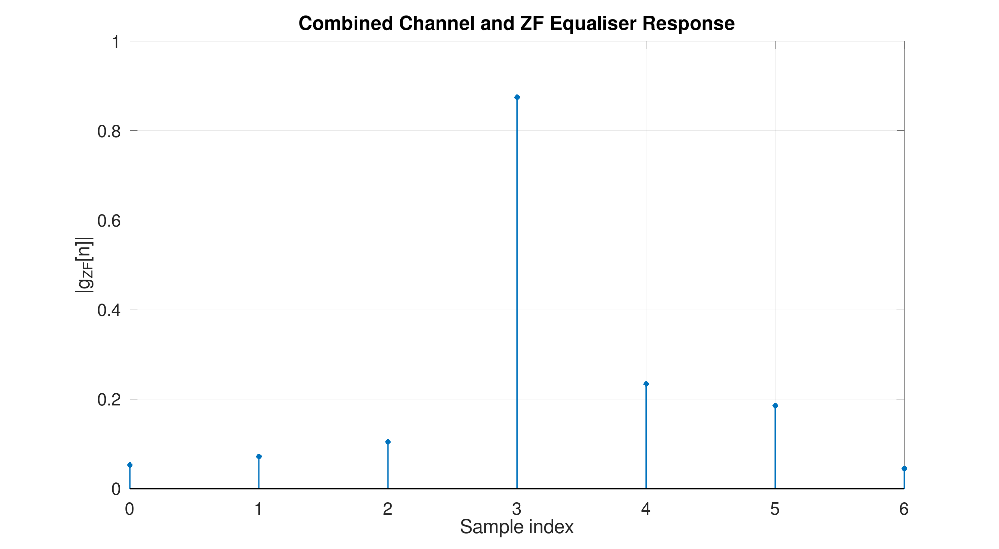

#+ATTR_LATEX: :placement [H]
#+CAPTION: \label{fig:Q3c2}
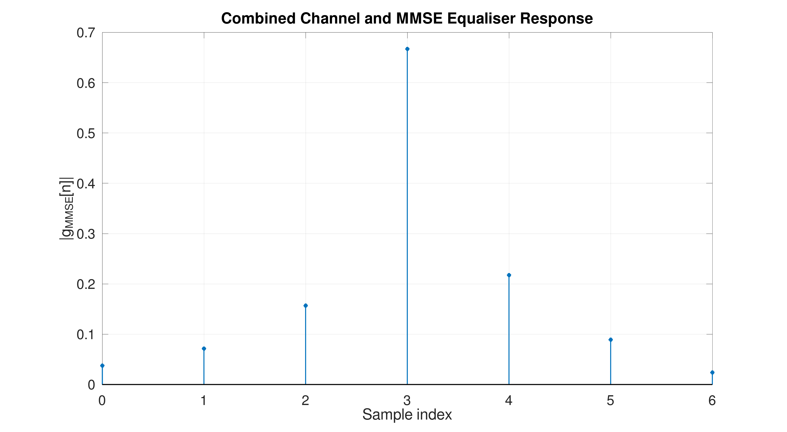

Figures \ref{fig:Q3c1} and \ref{fig:Q3c2} show the channel response of ZF and MMSE equalisers respectively. They show main peak at $3$, which is the chosen offset, the other impulses indicate how much of the other neighbouring symbols will effect detected symbol.

#+ATTR_LATEX: :placement [H]
#+CAPTION: \label{fig:Q3c3}
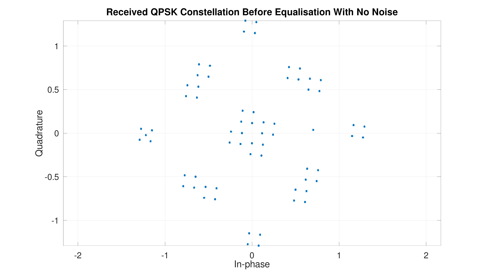

#+ATTR_LATEX: :placement [H]
#+CAPTION: \label{fig:Q3c4}
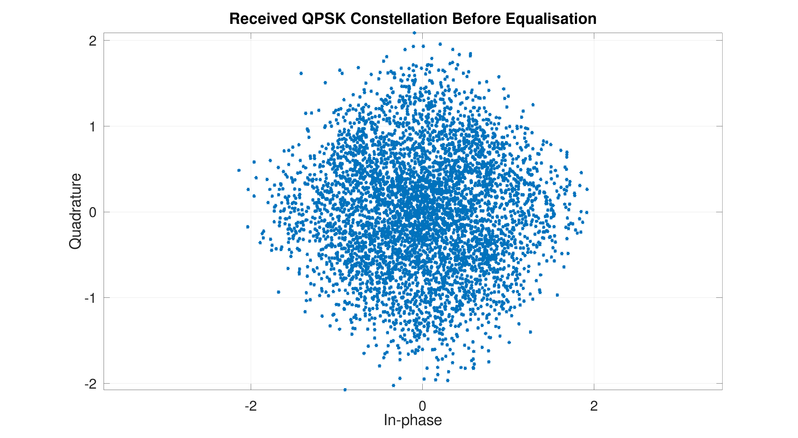

Figure \ref{fig:Q3c3} shows the constellation before equalisation with no noise, it shows how the channel effects the location of the symbols. Each of the points should ideally be moved to one of the four QPSK symbol positions, they may be inaccurate due to the estimation of the channel. When adding noise it randomly moves the symbols about the no-noise constellation, this can be seen in Figure \ref{fig:Q3c4}.

#+ATTR_LATEX: :placement [H]
#+CAPTION: \label{fig:Q3c5}
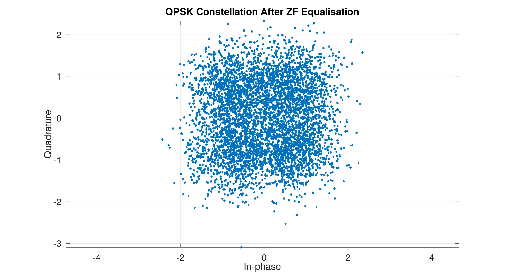

#+ATTR_LATEX: :placement [H]
#+CAPTION: \label{fig:Q3c6}
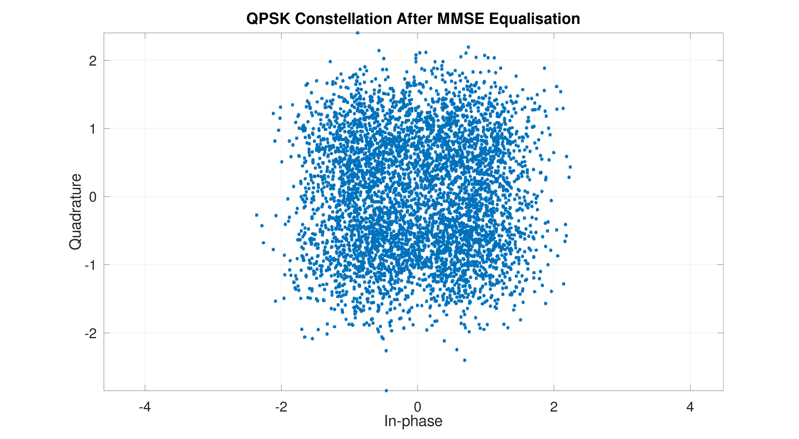

The received symbols after equalisation can be seen in Figures \ref{fig:Q3c5} and \ref{fig:Q3c6}, they show how the symbols are transformed by the equaliser to the four possible QPSK positions. These are used to find the metrics mentioned before.

#+BEGIN_SRC octave :results output :exports none :session Q3 :eval no-export :tangle ENG405_Project_1_Q3.m
N_bits = 100000; % Must be even

%% Generate random data bits
data_bits = randi([0 1], N_bits, 1);

%% QPSK modulation
b_I = data_bits(1:2:end);
b_Q = data_bits(2:2:end);

x_data = ((1 - 2*b_I) + 1i*(1 - 2*b_Q))/sqrt(2);

%% Pass QPSK symbols through the actual channel
y_clean = filter(h, 1, x_data);

%% Add complex white Gaussian noise
noise = sqrt(N0/2).*(randn(size(y_clean)) + 1i*randn(size(y_clean)));

y_received = y_clean + noise;

%% Apply the equalisers
z_ZF = filter(C_ZF, 1, y_received);
z_MMSE = filter(C_MMSE, 1, y_received);

%% Combined channel-equaliser responses
g_ZF = conv(h, C_ZF);
g_MMSE = conv(h, C_MMSE);

main_ZF = g_ZF(offset + 1);
main_MMSE = g_MMSE(offset + 1);

%% Remove the equaliser offset
z_ZF = z_ZF(offset + 1:end);
z_MMSE = z_MMSE(offset + 1:end);

%% Ensure all vectors have the same length
N_valid = min([length(x_data), length(z_ZF), length(z_MMSE)]);

x_valid = x_data(1:N_valid);
z_ZF = z_ZF(1:N_valid);
z_MMSE = z_MMSE(1:N_valid);

z_ZF = z_ZF/main_ZF;
z_MMSE = z_MMSE/main_MMSE;

%% QPSK demodulation
bits_ZF = zeros(2*N_valid,1);
bits_MMSE = zeros(2*N_valid,1);

bits_ZF(1:2:end) = real(z_ZF) < 0;
bits_ZF(2:2:end) = imag(z_ZF) < 0;

bits_MMSE(1:2:end) = real(z_MMSE) < 0;
bits_MMSE(2:2:end) = imag(z_MMSE) < 0;

reference_bits = data_bits(1:2*N_valid);

BER_ZF = mean(bits_ZF ~= reference_bits);
BER_MMSE = mean(bits_MMSE ~= reference_bits);

fprintf("ZF BER = %.6f\n", BER_ZF);
fprintf("MMSE BER = %.6f\n", BER_MMSE);

ISI_ZF = sum(abs(g_ZF).^2) - abs(main_ZF)^2;
ISI_MMSE = sum(abs(g_MMSE).^2) - abs(main_MMSE)^2;

fprintf("ZF residual ISI power = %.6f\n", ISI_ZF);
fprintf("MMSE residual ISI power = %.6f\n", ISI_MMSE);

D0_ZF = (sum(abs(g_ZF)) - abs(main_ZF))/abs(main_ZF);
D0_MMSE = (sum(abs(g_MMSE)) - abs(main_MMSE))/abs(main_MMSE);

fprintf("ZF peak distortion D0 = %.6f\n", D0_ZF);
fprintf("MMSE peak distortion D0 = %.6f\n", D0_MMSE);

noise_gain_ZF = sum(abs(C_ZF).^2);
noise_gain_MMSE = sum(abs(C_MMSE).^2);

output_noise_ZF = N0*noise_gain_ZF;
output_noise_MMSE = N0*noise_gain_MMSE;

fprintf("ZF noise gain = %.6f\n", noise_gain_ZF);
fprintf("MMSE noise gain = %.6f\n", noise_gain_MMSE);

fprintf("ZF output noise power = %.6f\n", output_noise_ZF);
fprintf("MMSE output noise power = %.6f\n", output_noise_MMSE);

MSE_ZF = mean(abs(x_valid - z_ZF).^2);
MSE_MMSE = mean(abs(x_valid - z_MMSE).^2);

fprintf("ZF MSE = %.6f\n", MSE_ZF);
fprintf("MMSE MSE = %.6f\n", MSE_MMSE);

figure;
stem(0:length(g_ZF)-1, abs(g_ZF), "filled");
grid on;
xlabel("Sample index");
ylabel("|g_{ZF}[n]|");
title("Combined Channel and ZF Equaliser Response");
print("_Q3c_Combined_Channel_and_ZF_Equaliser_Response.png", "-dpng");

figure;
stem(0:length(g_MMSE)-1, abs(g_MMSE), "filled");
grid on;
xlabel("Sample index");
ylabel("|g_{MMSE}[n]|");
title("Combined Channel and MMSE Equaliser Response");
print("_Q3c_Combined_Channel_and_MMSE_Equaliser_Response.png", "-dpng");

figure;
plot(real(y_received(1:min(5000,end))), imag(y_received(1:min(5000,end))), "*");
grid on;
axis equal;
xlabel("In-phase");
ylabel("Quadrature");
title("Received QPSK Constellation Before Equalisation");
print("_Q3c_Received_QPSK_Constellation_Before_Equalisation_No_Noise.png", "-dpng");

figure;
plot(real(z_ZF(1:min(5000,end))), imag(z_ZF(1:min(5000,end))), "*");
grid on;
axis equal;
xlabel("In-phase");
ylabel("Quadrature");
title("QPSK Constellation After ZF Equalisation");
print("_Q3c_QPSK_Constellation_After_ZF_Equalisation.png", "-dpng");

figure;
plot(real(z_MMSE(1:min(5000,end))), imag(z_MMSE(1:min(5000,end))), "*");
grid on;
axis equal;
xlabel("In-phase");
ylabel("Quadrature");
title("QPSK Constellation After MMSE Equalisation");
print("_Q3c_QPSK_Constellation_After_MMSE_Equalisation.png", "-dpng");
#+END_SRC

#+RESULTS:
#+begin_example
ZF BER = 0.000000
MMSE BER = 0.000000
ZF residual ISI power = 0.100461
MMSE residual ISI power = 0.100461
ZF peak distortion D0 = 0.702393
MMSE peak distortion D0 = 0.702393
ZF noise gain = 1.710799
MMSE noise gain = 1.710799
ZF output noise power = 0.000000
MMSE output noise power = 0.000000
ZF MSE = 0.128300
MMSE MSE = 0.128300
#+end_example

** d
#+BEGIN_SRC octave :results output graphics file :exports none :session Q3 :eval no-export :tangle ENG405_Project_1_Q3.m
disp("This may take a long time to compute")

%% Channel timing parameters
coherence_time = 10e-3;      % 10 ms
data_rate = 100e3;           % 100 kbps

bits_per_channel = round(coherence_time*data_rate);
symbols_per_channel = bits_per_channel/2;

fprintf("Bits per channel response = %d\n", bits_per_channel);
fprintf("Symbols per channel response = %d\n", symbols_per_channel);

%% Simulation Parameters
SNR_dB = -20:1:30;
number_channels = 1000;

BER_ZF_curve = zeros(size(SNR_dB));
BER_MMSE_curve = zeros(size(SNR_dB));

%% Repeat the simulation for each SNR
for SNR_index = 1:length(SNR_dB)
  fprintf("Step %d/%d\n", SNR_index, length(SNR_dB));
  
  SNR = 10^(SNR_dB(SNR_index)/10);

  N0_MC = 1/SNR;
  total_errors_ZF = 0;
  total_errors_MMSE = 0;
  total_bits = 0;

  %% Simulate several independent channel impulse responses
  for channel_number = 1:number_channels

    %% Generate a new Rayleigh channel
    h_MC = sqrt(Pk/2).*(randn(taps,1) + 1i*randn(taps,1));

    %% Generate pilot bits
    pilot_bits_MC = randi([0 1], 2*Np, 1);

    %% QPSK-modulate pilot bits
    pilot_b1 = pilot_bits_MC(1:2:end);
    pilot_b2 = pilot_bits_MC(2:2:end);

    pilot_symbol_MC = ((1 - 2*pilot_b1) + 1i*(1 - 2*pilot_b2))/sqrt(2);

    %% Send pilots through channel
    pilot_clean_MC = filter(h_MC, 1, pilot_symbol_MC);

    %% Add noise to pilot symbols
    pilot_noise_MC = sqrt(N0_MC/2).*(randn(size(pilot_clean_MC)) + 1i*randn(size(pilot_clean_MC)));

    pilot_received_MC = pilot_clean_MC + pilot_noise_MC;

    %% Construct pilot convolution matrix
    X_pilot_MC = zeros(Np - taps + 1, taps);

    for n = taps:Np
      X_pilot_MC(n-taps+1,:) = pilot_symbol_MC(n:-1:n-taps+1).';
    end

    y_est_MC = pilot_received_MC(taps:Np);

    %% Least-squares channel estimate
    h_est_MC = X_pilot_MC \ y_est_MC;

    %% Construct channel convolution matrix
    Y_MC = zeros(taps + Lc - 1, Lc);

    for column = 1:Lc
      Y_MC(column:column+taps-1, column) = h_est_MC;
    end

    %% Desired combined response
    hat_Y_MC = zeros(taps + Lc - 1, 1);
    hat_Y_MC(offset + 1) = 1;

    %% Design ZF equaliser
    C_ZF_MC = pinv(Y_MC)*hat_Y_MC;

    %% Design MMSE equaliser
    C_MMSE_MC = (Y_MC'*Y_MC + N0_MC*eye(Lc)) \ (Y_MC'*hat_Y_MC);

    %% Generate data bits for one coherence interval
    data_bits_MC = randi([0 1], bits_per_channel, 1);

    %% QPSK modulation
    b1_MC = data_bits_MC(1:2:end);
    b2_MC = data_bits_MC(2:2:end);

    x_data_MC = ((1 - 2*b1_MC) + 1i*(1 - 2*b2_MC))/sqrt(2);

    %% Pass data through actual channel
    data_clean_MC = filter(h_MC, 1, x_data_MC);

    %% Add receiver noise
    data_noise_MC = sqrt(N0_MC/2).*(randn(size(data_clean_MC)) + 1i*randn(size(data_clean_MC)));

    data_received_MC = data_clean_MC + data_noise_MC;

    %% Apply the equalisers
    z_ZF_MC = filter(C_ZF_MC, 1, data_received_MC);
    z_MMSE_MC = filter(C_MMSE_MC, 1, data_received_MC);

    %% Find actual combined channel-equaliser responses
    g_ZF_MC = conv(h_MC, C_ZF_MC);
    g_MMSE_MC = conv(h_MC, C_MMSE_MC);

    %% Main cursor values
    main_ZF_MC = g_ZF_MC(offset + 1);
    main_MMSE_MC = g_MMSE_MC(offset + 1);

    %% Remove equaliser decision offset
    z_ZF_MC = z_ZF_MC(offset + 1:end);
    z_MMSE_MC = z_MMSE_MC(offset + 1:end);

    %% Ensure equal-length symbol vectors
    N_valid_MC = min([length(x_data_MC), length(z_ZF_MC), length(z_MMSE_MC)]);

    z_ZF_MC = z_ZF_MC(1:N_valid_MC);
    z_MMSE_MC = z_MMSE_MC(1:N_valid_MC);

    %% Correct main cursor amplitude and phase
    if abs(main_ZF_MC) > 1e-12
      z_ZF_MC = z_ZF_MC/main_ZF_MC;
    end

    if abs(main_MMSE_MC) > 1e-12
      z_MMSE_MC = z_MMSE_MC/main_MMSE_MC;
    end

    %% QPSK demodulation
    bits_ZF_MC = zeros(2*N_valid_MC,1);
    bits_MMSE_MC = zeros(2*N_valid_MC,1);

    bits_ZF_MC(1:2:end) = real(z_ZF_MC) < 0;
    bits_ZF_MC(2:2:end) = imag(z_ZF_MC) < 0;

    bits_MMSE_MC(1:2:end) = real(z_MMSE_MC) < 0;
    bits_MMSE_MC(2:2:end) = imag(z_MMSE_MC) < 0;

    reference_bits_MC = data_bits_MC(1:2*N_valid_MC);

    %% Count bit errors
    total_errors_ZF = total_errors_ZF + sum(bits_ZF_MC ~= reference_bits_MC);

    total_errors_MMSE = total_errors_MMSE + sum(bits_MMSE_MC ~= reference_bits_MC);

    total_bits = total_bits + length(reference_bits_MC);

  end

  %% BER at current SNR
  BER_ZF_curve(SNR_index) = total_errors_ZF/total_bits;
  BER_MMSE_curve(SNR_index) = total_errors_MMSE/total_bits;

  fprintf(["SNR = %2d dB, ZF BER = %.6f, MMSE BER = %.6f\n"], SNR_dB(SNR_index), BER_ZF_curve(SNR_index), BER_MMSE_curve(SNR_index));

end

figure;

semilogy(SNR_dB, BER_ZF_curve, "o-", SNR_dB, BER_MMSE_curve, "s-");

grid on;
xlabel("E_s/N_0 (dB)");
ylabel("Bit Error Rate");
title("Monte Carlo BER of ZF and MMSE Equalisers");
legend("ZF equaliser", "MMSE equaliser", "location", "southwest");
print("Q3d_BER_ZF_MMSE.png", "-dpng");
#+END_SRC

#+BEGIN_SRC octave :results output :exports none :session Q3 :eval no-export :tangle ENG405_Project_1_Q3.m
%pause % stop octave from closing my figures >:(
#+END_SRC

The BER-SNR plot can be seen in Figure \ref{fig:Q3c7}, which was produced by the code in ~ENG405_Project_1_Q3.m~. For small and large SNR the ZF and MMSE have basically the same BER, this is because at the extremes either the noise dominates and the BER is very high, or there is no noise and the BER is low. For very small SNR the plots approach 0.5 BER, meaning the choice is effectively random. For large SNR they both converge at around $6\times 10^{-3}$, the noise is no longer having an effect on the symbol and it is now coming down to the inter-symbol interference cause by the imperfect equalisers. For the moderate SNR region the MMSE equaliser provides lower BER than the ZF equaliser, this is likely because the MMSE equaliser accounts for the noise whereas the ZF equaliser doesn't (it amplifies it). 

#+ATTR_LATEX: :placement [H]
#+CAPTION: \label{fig:Q3c7}
[[./ENG405_Project_1_Q3_d.png]]

