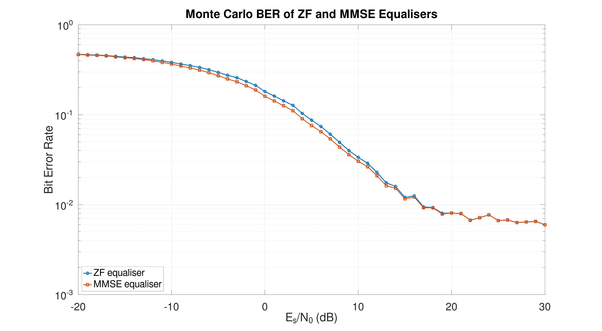

:PROPERTIES:
:ID:       348a72c0-0839-4cd2-aa09-08452564f5f1
:END:
#+title: ENG405 - Communication Systems 2 – Project 1
#+date: [2026-07-16 Thu 18:23]
#+AUTHOR: Baley Eccles - 652137
#+STARTUP: latexpreview

* Question 1
The received complex signal is:
\[S=X+jY\]
And each are distributed normally:
\begin{align*}
X &\sim \mathcal{N}(x_0,\sigma^2) \\
Y &\sim \mathcal{N}(y_0,\sigma^2)
\end{align*}

$X$ and $Y$ are independent. The deterministic LOS vector is:
\[r_0=x_0+jy_0\]

The received amplitude is
\[A=\sqrt{X^2+Y^2}\]

** (a) Distribution Of The Received Amplitude

The PDF of $X$ and $Y$ is

\[f_{X,Y}(x,y) = \frac{1}{2\pi\sigma^2} \exp\left[ -\frac{(x-x_0)^2+(y-y_0)^2}{2\sigma^2} \right]\]

We need this in polar coordinates, so let $x = a\cos\theta$ and $y = a\sin\theta$. Also use the substitution $x_0 = r_0\cos\theta_0$ and $y_0 = r_0\sin\theta_0$.

#+BEGIN_SRC octave :results output :exports none :session Q1 :eval no-export
clc
clear
close all
if exist('OCTAVE_VERSION', 'builtin')
  set(0, "DefaultLineLineWidth", 2);
  set(0, "DefaultAxesFontSize", 25);
  warning('off');
  pkg load symbolic
end

syms x y r_0 theta theta_0 sigma a I
x_0 = r_0*cos(theta_0);
y_0 = r_0*sin(theta_0);

f = (1/(2*pi*sigma^2))*exp(-((x - x_0)^2 + (y - y_0)^2)/(2*sigma^2));

f_polar = subs(f, [x, y], [a*cos(theta), a*sin(theta)])*a;

f_polar = simplify(f_polar);
latex(f_polar)
#+END_SRC

#+RESULTS:
: Symbolic pkg v3.2.2: Python communication link active, SymPy v1.14.0.
: \frac{a e^{\frac{- a^{2} + 2 a r_{0} \cos{\left(\theta - \theta_{0} \right)} - r_{0}^{2}}{2 \sigma^{2}}}}{2 \pi \sigma^{2}}

Hence:
\[f_{A,\Theta}(a,\theta) = \frac{a}{2 \pi \sigma^{2}} \exp\left[\frac{- a^{2} + 2 a r_{0} \cos{\left(\theta - \theta_{0} \right)} - r_{0}^{2}}{2 \sigma^{2}}\right]\]

The PDF of $A$ is obtained by integrating over all angles:
\begin{align*}
f_A(a) &= \int_{-\pi}^{\pi} f_{A,\Theta}(a,\theta)d\theta \\
f_A(a) &= \frac{a}{2\pi\sigma^2}\exp\left[-\frac{a^2 + r_0^2}{2\sigma^2}\right]\int_{-\pi}^{\pi}\exp\left[\frac{ar_0}{\sigma^2}\cos(\theta - \theta_0)\right]\ d\theta \\
f_A(a) &= \boxed{\frac{a}{2\pi\sigma^2}\exp\left[-\frac{a^2 + r_0^2}{2\sigma^2}\right]I_0\left(\frac{ar_0}{\sigma^2}\right)}
\end{align*}

** (b) Approximate Expression For PDF

#+BEGIN_SRC octave :results output :exports none :session Q1 :eval no-export
latex(vpa(1/(2*pi)*((x^0)/(factorial(0))*int((cos(theta))^0, theta, -pi, pi)), 4))
latex(vpa(1/(2*pi)*((x^1)/(factorial(1))*int((cos(theta))^1, theta, -pi, pi)), 4))
latex(vpa(1/(2*pi)*((x^2)/(factorial(2))*int((cos(theta))^2, theta, -pi, pi)), 4))
latex(vpa(1/(2*pi)*((x^3)/(factorial(3))*int((cos(theta))^3, theta, -pi, pi)), 4))
latex(vpa(1/(2*pi)*((x^4)/(factorial(4))*int((cos(theta))^4, theta, -pi, pi)), 4))
#+END_SRC

#+RESULTS:
: 1.0
: 0
: 0.25 x^{2}
: 0
: 0.01562 x^{4}
: ans = 64.020

\begin{align*}
f(x) &= \sum_{n=0}^{\infty}\frac{f^{(n)}(0)}{n!}x^n \\
e^{x\cos \theta} &= \sum_{n=0}^{\infty}\frac{(x\cos\theta)^n}{n!} = \sum_{n=0}^{\infty}\frac{x^n\cos^n\theta}{n!} \\
f(x) &= \frac{1}{2\pi}\sum_{n=0}^{\infty} \frac{x^n}{n!}\int_{-\pi}^{\pi}\cos^n(\theta)\ d\theta \\
\Rightarrow f(x) &\approx \boxed{1 + \frac{x^2}{4}} + \frac{x^4}{64}
\end{align*}

Hence:
\begin{align*}
I_0\left(\frac{ar_0}{\sigma^2}\right) &\approx 1 + \frac{a^2r_0^2}{4\sigma^4} \\
\Rightarrow f_A(a) &= \boxed{\frac{a}{2\pi\sigma^2}\exp\left[-\frac{a^2 + r_0^2}{2\sigma^2}\right]\left(1 + \frac{a^2r_0^2}{4\sigma^4}\right)}
\end{align*}

** (c) Distribution Of Received Power
Let the received power be $L = A^2 \Rightarrow A = \sqrt{L}$, we can transform the PDF using $f_L(l) = f_A(\sqrt{L})\frac{1}{2\sqrt{L}}$ because $\frac{dA}{dL} = \frac{1}{2\sqrt{L}}$ and the probability within the amplitude interval must equal the probability within the corresponding power interval ($f_L(l)dl = f_A(a)da$). This means:
\begin{align*}
\frac{dA}{dL} &= \frac{1}{2\sqrt{L}} \\
f_L(l) &= \frac{\sqrt{l}}{2\pi\sigma^2}\exp\left[-\frac{l + r_0^2}{2\sigma^2}\right]I_0\left(\frac{\sqrt{l}r_0}{\sigma^2}\right) \frac{1}{2\sqrt{l}} \\
f_L(l) &= \frac{1}{4\pi\sigma^2}\exp\left[-\frac{l + r_0^2}{2\sigma^2}\right]I_0\left(\frac{\sqrt{l}r_0}{\sigma^2}\right)
\end{align*}
Using the Taylor series approximation we can get the statistical distribution of the power of the incoming signal:
\[f_L(l) \approx \boxed{\frac{1}{4\pi\sigma^2}\exp\left[-\frac{l + r_0^2}{2\sigma^2}\right]\left(1 + \frac{lr_0^2}{4\sigma^4}\right)}\]

The relative error is approximately the first ignored term of the Taylor Series, this is $\epsilon_{\textrm{rel}} \approx \frac{x^4}{64}$. Substituting in $x = \frac{\sqrt{l} r_0}{\sigma^2}$ we get $\epsilon_{\textrm{rel}} = \frac{l^2r_0^4}{64\sigma^8}$. As $l \rightarrow \infty$, $\epsilon_{\textrm{rel}} \rightarrow \infty$, so there is no bound on the maximum error.

** (d) Why The Outage Probability Expression Is True
An outage occurs if $SIR = \frac{L}{Z} < R$, which means:
\begin{align*}
\frac{L}{Z} &< R \\
Z &> \frac{L}{R}
\end{align*}
So a call will be successful if $Z \leq \frac{l}{R}$, using the PDF to find the probability this means:
\[P_{\textrm{call}} = \int_0^{\frac{l}{R}}p_Z(Z=z)dz\]
But, $L$ is also a random variable, every value of it must also be considered:
\begin{align*}
P_{\textrm{success}} &= \int_0^{\infty}P_{\textrm{call}}p_L(L=l)dl \\
P_{\textrm{success}} &= \int_0^{\infty}\left[\int_0^{\frac{l}{R}}p_Z(Z=z)dz\right]p_L(L=l)dl \\
\end{align*}
And $P_{\textrm{out}} = 1 - P_{\textrm{success}}$:
\[\Rightarrow P_{\textrm{out}} &= \boxed{1 - \int_0^{\infty}\left[\int_0^{\frac{l}{R}}p_Z(Z=z)dz\right]p_L(L=l)dl}\]

The boundary between outage and a successful call is $z = \frac{l}{R}$:

#+BEGIN_SRC octave :results output :exports none :session Q1 :eval no-export
close all
R = 1;
l = [0:0.001:1];
z = l/R;
figure;
plot(l,z, '')
axis equal;
set(gca, "PlotBoxAspectRatio", [1 1 1]);
text(0.3, 0.6, 'z < l/R', 'FontSize', 40);
text(0.6, 0.4, 'z > l/R', 'FontSize', 40);
xlabel("Desired power, l");
ylabel("Interference power, z");
#+END_SRC

#+RESULTS:

When adding the requirement that the desired signal power must exceed $R_N\chi_l$ means $l \geq R_N\chi_l$. This simply means that the lower limit of the $L$ integral changes to $R_N\chi_l$ because an outage would occur for values less than it.
\[P_{\textrm{out}} &= \boxed{1 - \int_{R_N\chi_l}^{\infty}\left[\int_0^{\frac{l}{R}}p_Z(Z=z)dz\right]p_L(L=l)dl}\]
** (e) Required Value Of $R$
We require $P_{\textrm{out}} \geq 0.5\%$
\begin{align*}
P_{\textrm{out}} &= \frac{R\chi_z}{R\chi_z + \chi_l}e^{-\left(\frac{r_0^2}{R\chi_z + \chi_l}\right)} \\
0.5 &\leq \frac{R\chi_z}{R\chi_z + \chi_l}e^{-\left(\frac{r_0^2}{R\chi_z + \chi_l}\right)} \\
\chi_l &= 5\chi_z \\
r_0^2 &= 0.8\chi_l \\
\Rightarrow r_0^2 &= 4\chi_z \\
\Rightarrow 0.5 &\leq \frac{R\chi_z}{R\chi_z + 5\chi_z}e^{-\left(\frac{4\chi_z}{R\chi_z + 5\chi_z}\right)} \\
\Rightarrow 0.5 &\leq \frac{R}{R + 5}e^{-\left(\frac{4}{R + 5}\right)} \\
\end{align*}
Using ~Octave~/~MATLAB~
#+BEGIN_SRC octave :results output :exports none :session Q1 :eval no-export
syms R
R_val = vpasolve(0.5/100 == R/(R + 5)*exp(-(4/(R+5))), R)
R_dB = vpa(10*log10(R_val))
#+END_SRC

#+RESULTS:
: R_val = (sym) 0.055764813887475151713817805805105
: R_dB = (sym) -12.536397428991592734233585002252
\[\boxed{R = 0.0558} = \boxed{-12.54\ \textrm{dB}}\]
** TODO (f) Significance For Mobile Systems

* Question 2
** Full Reflected-Wave Model
Wave 1 has LOS from the transmitter to the receiver, it has path length:
\[d_1 = \sqrt{d^2 + (h_t - h_r)^2}\]

Wave 2 is reflected off the ground, it has path length:
\[d_2 = \sqrt{d^2 + (h_t + h_r)^2}\]
It is reflected with angle:
\[\psi = \tan^{-1}\left(\frac{h_t + h_r}{d}\right)\]
The complex ground permittivity can be calculated as:
\[\tilde{\epsilon_r} = \epsilon_r - j\frac{\sigma}{\omega\epsilon_0}\]
In the notes we assumed that the reflection coefficient ($\Gamma$) is $-1$ because we assumed that the reflection ($\psi$) is small, this is not true and the actual value depends on:
\begin{align*}
\Gamma_{\|} &= \frac{\epsilon_r\sin(\theta_i) - \sqrt{\epsilon_r - \cos^2(\theta_i)}}{\epsilon_r\sin(\theta_i) + \sqrt{\epsilon_r - \cos^2(\theta_i)}} \\
\Gamma_{\perp} &= \frac{\sin(\theta_i) - \sqrt{\epsilon_r - \cos^2(\theta_i)}}{\sin(\theta_i) + \sqrt{\epsilon_r - \cos^2(\theta_i)}}
\end{align*}
$\Gamma_{\|}$ is for parallel polarised waves and $\Gamma_{\perp}$ is for perpendicularly polarised waves.

The two waves can be represented by:
\begin{align*}
E_1 &\propto \frac{e^{-j\frac{2\pi}{\lambda}d_1}}{d_1} \\
E_2 &\propto \Gamma\frac{e^{-j\frac{2\pi}{\lambda}d_2}}{d_2} \\
E_{TOT} &\propto \frac{e^{-j\frac{2\pi}{\lambda}d_1}}{d_1} + \Gamma\frac{e^{-j\frac{2\pi}{\lambda}d_2}}{d_2} \\
\end{align*}

Using \[P_r = \frac{P_tG_tG_r\lambda^2}{(4\pi)^2d^2L}\] we can get:
\[P_r = \frac{P_tG_tG_r\lambda^2}{(4\pi)^2L}\left|\frac{e^{-j\frac{2\pi}{\lambda}d_1}}{d_1} + \Gamma\frac{e^{-j\frac{2\pi}{\lambda}d_2}}{d_2}\right|^2\]

The path loss is defined as:
\[PL = -10\log_{10}\left(\frac{P_r}{P_t}\right)\]
Which means the path loss is:
\[PL = -10\log_{10}\left(\frac{G_tG_r\lambda^2}{(4\pi)^2L}\left|\frac{e^{-j\frac{2\pi}{\lambda}d_1}}{d_1} + \Gamma\frac{e^{-j\frac{2\pi}{\lambda}d_2}}{d_2}\right|^2\right)\]
** Simplified Two-Ray Model
We can simplify the two-ray model by assuming the wave is totally reflected with a $180^{\circ}$ shift ($\Gamma = -1$), at large distances the distance travelled by each wave will be the same ($d_1 = d_2 = d_3$), and the difference in path length is $\Delta d = \frac{2 h_t h_r}{d}$ (https://en.wikipedia.org/wiki/Two-ray_ground-reflection_model#Approximation). Preforming these approximations we get:
\begin{align*}
P_r &= P_t G_t G_r \frac{h_t^2 h_r^2}{d^4} \\
PL &= 40\log_{10}(d) - 20\log_{10}(h_t) - 20\log_{10}(h_r) - 10\log_{10}(G_tG_r)
\end{align*}
This approximation is valid for when the distance between the receiver and transmitter is large ($d >> \frac{4\pi h_t h_r}{\lambda}$).

** Simulation
#+BEGIN_SRC octave :results output :exports none :session Q2 :eval no-export
clear
close all
clc
if exist('OCTAVE_VERSION', 'builtin')
  set(0, "DefaultLineLineWidth", 2);
  set(0, "DefaultAxesFontSize", 25);
  warning('off');
end

%% Physical constants
c = 299792458; % Speed of light
epsilon_0 = 8.854187817e-12; % Permitivity of free space

%% Transmitter and receiver parameters
Pt = 1; % Transmitted power
Gt = 1; % Transmitter antenna gain
Gr = 1; % Receiver antenna gain

ht = 10; % Transmitter height
hr = 2; % Receiver height

%% Ground parameters
epsilon_r = 15; % Relative permittivity
sigma = 0.005; % Conductivity

%% Frequencies
frequencies = [500e6, 2.4e9];

%% Distance range
d = logspace(0, 4, 5000);  %% 1 m to 10 km

%% Polarisation:
%% "H" = horizontal
%% "V" = vertical
polarisation = "H";

for index = 1:length(frequencies)

  f = frequencies(index);
  omega = 2*pi*f;
  lambda = c/f;
  k = 2*pi/lambda;
  
  %% Complex relative permittivity
  epsilon_complex = epsilon_r - 1i*sigma/(omega*epsilon_0);

  %% Direct and reflected path lengths
  r1 = sqrt(d.^2 + (ht - hr)^2);
  r2 = sqrt(d.^2 + (ht + hr)^2);

  %% Grazing angle
  psi = atan((ht + hr)./d);

  %% Fresnel reflection coefficient
  root_term = sqrt(epsilon_complex - cos(psi).^2);

  if strcmpi(polarisation, "H")
    Gamma = (sin(psi) - root_term) ./ (sin(psi) + root_term);
  else
    Gamma = (epsilon_complex*sin(psi) - root_term) ./ (epsilon_complex*sin(psi) + root_term);
  end

  %% Full electromagnetic two-path field
  field_full = exp(-1i*k*r1)./r1 + Gamma.*exp(-1i*k*r2)./r2;

  Pr_full = Pt*Gt*Gr*(lambda/(4*pi))^2 .* abs(field_full).^2;

  %% Simplified two-ray model: Gamma = -1
  field_two_ray = exp(-1i*k*r1)./r1 - exp(-1i*k*r2)./r2;

  Pr_two_ray = Pt*Gt*Gr*(lambda/(4*pi))^2 .* abs(field_two_ray).^2;

  %% Free-space propagation
  Pr_free_space = Pt*Gt*Gr .* (lambda./(4*pi*r1)).^2;

  %% Far-distance two-ray approximation
  Pr_far = Pt*Gt*Gr .* (ht^2*hr^2)./(d.^4);

  %% Prevent log10(0)
  Pr_full = max(Pr_full, realmin);
  Pr_two_ray = max(Pr_two_ray, realmin);
  Pr_free_space = max(Pr_free_space, realmin);
  Pr_far = max(Pr_far, realmin);
  
  %% Received power in dBm
  Pr_full_dBm = 10*log10(Pr_full/1e-3);
  Pr_two_ray_dBm = 10*log10(Pr_two_ray/1e-3);
  Pr_free_space_dBm = 10*log10(Pr_free_space/1e-3);
  Pr_far_dBm = 10*log10(Pr_far/1e-3);

  figure;

  semilogx(d, Pr_full_dBm, "linewidth", 1.5);
  hold on;
  semilogx(d, Pr_two_ray_dBm, "--", "linewidth", 1.5);
  semilogx(d, Pr_free_space_dBm, ":", "linewidth", 1.5);
  semilogx(d, Pr_far_dBm, "-.", "linewidth", 1.5);

  grid on;

  xlabel("Horizontal distance, d (m)");
  ylabel("Received power (dBm)");

  title(sprintf( "Ground-reflection model at %.1f MHz", f/1e6));

  legend( "Full Fresnel model", "Two-ray, \Gamma = -1", "Free space", "Far two-ray approximation", "location", "southwest");

  Gamma_H = (sin(psi) - root_term) ./ (sin(psi) + root_term);

  Gamma_V = (epsilon_complex*sin(psi) - root_term) ./ (epsilon_complex*sin(psi) + root_term);
  hold off;
  figure;
  semilogx(d, abs(Gamma_H), "linewidth", 1.5);
  hold on;
  semilogx(d, abs(Gamma_V), "--", "linewidth", 1.5);
  grid on;
  
  xlabel("Distance (m)");
  ylabel("|\Gamma|");
  title(sprintf( "Reflection coefficient magnitude at %.1f MHz", f/1e6));
  legend("Horizontal", "Vertical");

  %% Crossover distance
  crossover_distance = 4*pi*ht*hr/lambda;

  fprintf("\nFrequency: %.1f MHz\n", f/1e6);
  fprintf("Wavelength: %.4f m\n", lambda);
  fprintf("Approximate crossover distance: %.2f m\n", crossover_distance);
end
#+END_SRC

#+RESULTS:
: Frequency: 500.0 MHz
: Wavelength: 0.5996 m
: Approximate crossover distance: 419.17 m
: 
: Frequency: 2400.0 MHz
: Wavelength: 0.1249 m
: Approximate crossover distance: 2012.01 m

:TODO: Report, where it is better than the approximation, difference from real measurements

* Question 3
** a
We can generate random channel coefficients using $h_k = \sigma_k(a_k + jb_k)$, where $a_k, b_k \sim N(0,1)$ and $\sigma_k$ is the variance which is used to ensure the power is consistent:
\begin{align*}
E\{|h_k|^2\} &= P_k \\
x_k, x_k &\sim N(0,1) \\
P_k &= E\{x_k^2\} + E\{y_k^2\} \\
P_k &= \sigma_k^2 + \sigma_k^2 \\
\sigma_k &= \sqrt{\frac{P_k}{2}}
\end{align*}

The unit power QPSK pilot bits can be generate using:
\[x[n] = \frac{(1 - 2b_1) + j(1 - 2b_2)}{\sqrt{2}}\]
The received signal is:
\[y[n] = h_0x[n] + h_1x[n-1] + h_2x[n-2] + n[n]\]
Where $n[n]$ is the receivers noise ($n[n] \sim CN(0,N_0)$) and is generate using:
\[n[n] = \sqrt{\frac{N_0}{2}}(n_1[n] + jn_2[n])\]
Where $n_1,n_2 \sim N(0,N_0)$. The channel can be estimated using
\[r = Ah + n\]
Where for a 3 tap channel:
\[A = \begin{bmatrix}
x[2] & x[1] & x[0] \\
x[3] & x[2] & x[1] \\
x[4] & x[3] & x[2] \\
\vdots & \vdots & \vdots \\
x[N] & x[N - 1] x[N - 2]
\end{bmatrix}\]
And can be calculated using $h_{LS} = (A^HA)^{-1}A^Hr$

#+BEGIN_SRC octave :results output :exports none :session Q3 :eval no-export :tangle ENG405_Project_1_Q3.m
clear
close all
clc
if exist('OCTAVE_VERSION', 'builtin')
  set(0, "DefaultLineLineWidth", 2);
  set(0, "DefaultAxesFontSize", 25);
  warning('off');
end

%% Set seed
rand("seed", 31);
randn("seed", 31);

%% Parameters
Pk = [1; 0.5; 0.2];
taps = 3;
Np = 64; % pilot symbols count

%% Noise power
N0 = 0.01;

%% Generate the fading channel
h = sqrt(Pk/2).*(randn(taps,1) + 1i*randn(taps,1));

disp("Actual channel impulse response:");
disp(h);

%% Generate random pilot bits
pilot_bits = randi([0 1], 2*Np, 1);

%% QPSK modulation
b1 = pilot_bits(1:2:end);
b2 = pilot_bits(2:2:end);

pilot_symbol = ((1 - 2*b1) + 1i*(1 - 2*b2))/sqrt(2);

%% Send pilots through the multipath channel
out_clean = filter(h, 1, pilot_symbol);

%% Generate noise
noise = sqrt(N0/2).*(randn(size(out_clean)) + 1i*randn(size(out_clean)));

%% Received pilot signal
received = out_clean + noise;

%% Construct pilot convolution matrix
X_pilot = zeros(Np - taps + 1, taps);

for n = taps:Np
  X_pilot(n-taps+1,:) = pilot_symbol(n:-1:n-taps+1).';
end

% Corresponding received samples
y_LS = received(taps:Np);

%% Least-squares channel estimate
h_est = X_pilot \ y_LS;

disp("Estimated channel impulse response:");
disp(h_est);

disp("Channel estimation error:");
disp(h_est - h);
#+END_SRC

#+RESULTS:
#+begin_example
Actual channel impulse response:
-0.470796 - 0.523828i
   0.376513 + 0.354112i
  -0.011633 - 0.088637i
Estimated channel impulse response:
-0.474482 - 0.516181i
   0.363235 + 0.359907i
  -0.004366 - 0.070750i
Channel estimation error:
-3.6860e-03 + 7.6465e-03i
  -1.3279e-02 + 5.7954e-03i
   7.2672e-03 + 1.7887e-02i
#+end_example

** b
*** Zero-Forcing Equaliser (ZF)
Zero-Forcing Equaliser minimises peak distortion, this cancels the intersymbol interference, but amplifies the noise. The Zero-Forcing Equaliser coefficients can be found using:
\[\begin{cases}
\hat{y}[n] = \sum_{j = -k}^k c_jy[n - j] \\
\hat{y}[n] = \begin{cases}
1 &, n = 0 \\
0 &, n = \pm 1, \pm 2, \hdots, \pm k
\end{cases}
\end{cases}\]
Which can also be written as:
\begin{align*}
\begin{bmatrix}
y[0] & y[-1] & \hdots & y[-2k] \\
y[1] & y[0] & \hdots & y[-2k+1] \\
\vdots & \vdots & \hdots & \vdots \\
y[2k] & y[2k-1] & \hdots & y[0] \\
\end{bmatrix}\begin{bmatrix}
c_{-k} \\
c_{-k +1} \\
\vdots \\
c_{0} \\
\vdots \\
c_{k-1} \\
c_{k}
\end{bmatrix} &= \begin{bmatrix}
0 \\
\vdots \\
0 \\
1 \\
0 \\
\vdots \\
0 \\
\end{bmatrix} \\
YC &= \hat{Y}
\end{align*}
So, the ZF coefficients can be found using $C &= Y^{-1}\hat{Y}$.
:TODO: add matrices + code note
*** Minimum Mean Square Error Equaliser (MMSE)
The Minimum Mean Square Error Equaliser (MMSE) minimises the mean square error ($\{c_k\} = \min_{c_k}\{E[(a[k] - \hat{a}[k])^2]\}$). The coefficients can be found using either of the two equations:
\begin{align*}
C &= [Y^HY + N_0I]^{-1}Y_H\hat{Y} & C &= Y^H[YY^H + N_0I]^{-1}\hat{Y}
\end{align*}
We need the identity matrix to be $5\times 5$ (or $7\times 7$ for the second equation) because we chose $5$ coefficients for the equalisers. The matrices $C$ and $\hat{Y}$ will be:
\begin{align*}
C &= \begin{bmatrix}
c_0 \\ c_2 \\ c_3 \\ c_4 \\ c_5
\end{bmatrix} & \hat{Y} &= 
\begin{bmatrix}
0 \\ 0 \\ 1 \\ 0 \\ 0
\end{bmatrix}
\end{align*}
:TODO: add matrices + code note
#+BEGIN_SRC octave :results output :exports none :session Q3 :eval no-export :tangle ENG405_Project_1_Q3.m
%% Equaliser parameters
Lc = 5; % Number of equaliser coefficients

%% Construct the channel convolution matrix
Y = zeros(taps + Lc - 1, Lc);

for column = 1:Lc
  Y(column:column+taps-1, column) = h_est;
end

%disp("Channel convolution matrix Y:");
%disp(Y);

%% Desired combined channel-equaliser response
hat_Y = zeros(taps + Lc - 1, 1);

offset = floor(Lc/2);
hat_Y(offset + 1) = 1;

%disp("Desired combined response:");
%disp(hat_Y);

%% Zero-forcing equaliser
C_ZF = pinv(Y)*hat_Y;

disp("ZF equaliser coefficients:");
disp(C_ZF);

%% MMSE equaliser
C_MMSE = inv(Y'*Y + N0*eye(Lc))*Y'*hat_Y
%C_MMSE = Y'*inv(Y*Y' + N0*eye(Lc + 2))*hat_Y

disp("MMSE equaliser coefficients:");

%% Combined channel-equaliser responses
combined_ZF = conv(h_est, C_ZF);
combined_MMSE = conv(h_est, C_MMSE);

%disp("Estimated channel convolved with ZF equaliser:");
%disp(combined_ZF);

disp("Estimated channel convolved with MMSE equaliser:");
disp(combined_MMSE);
#+END_SRC

#+RESULTS:
#+begin_example
ZF equaliser coefficients:
0.027934 - 0.009850i
   0.057789 - 0.032988i
  -0.880272 + 0.972140i
  -0.563559 + 0.643270i
  -0.207652 + 0.308216i
C_MMSE =

   0.039397 - 0.016795i
   0.082308 - 0.054077i
  -0.840674 + 0.929871i
  -0.530194 + 0.602012i
  -0.191532 + 0.284344i
MMSE equaliser coefficients:
Estimated channel convolved with MMSE equaliser:
-0.027362 - 0.012367i
  -0.046612 - 0.008749i
   0.926866 - 0.000000i
  -0.081900 + 0.017642i
  -0.102143 + 0.047219i
  -0.127001 + 0.069233i
   0.020954 + 0.012310i
#+end_example

** c
:TODO: Report
#+BEGIN_SRC octave :results output :exports none :session Q3 :eval no-export :tangle ENG405_Project_1_Q3.m
N_bits = 100000; % Must be even

%% Generate random data bits
data_bits = randi([0 1], N_bits, 1);

%% QPSK modulation
b_I = data_bits(1:2:end);
b_Q = data_bits(2:2:end);

x_data = ((1 - 2*b_I) + 1i*(1 - 2*b_Q))/sqrt(2);

%% Pass QPSK symbols through the actual channel
y_clean = filter(h, 1, x_data);

%% Add complex white Gaussian noise
noise = sqrt(N0/2).*(randn(size(y_clean)) + 1i*randn(size(y_clean)));

y_received = y_clean + noise;

%% Apply the equalisers
z_ZF = filter(C_ZF, 1, y_received);
z_MMSE = filter(C_MMSE, 1, y_received);

%% Combined channel-equaliser responses
g_ZF = conv(h, C_ZF);
g_MMSE = conv(h, C_MMSE);

disp("Actual channel convolved with ZF equaliser:");
disp(g_ZF);

disp("Actual channel convolved with MMSE equaliser:");
disp(g_MMSE);

%% Main cursor values
main_ZF = g_ZF(offset + 1);
main_MMSE = g_MMSE(offset + 1);

%% Remove the equaliser decision offset
z_ZF = z_ZF(offset + 1:end);
z_MMSE = z_MMSE(offset + 1:end);

% Ensure all vectors have the same length
N_valid = min([length(x_data), length(z_ZF), length(z_MMSE)]);

x_valid = x_data(1:N_valid);
z_ZF = z_ZF(1:N_valid);
z_MMSE = z_MMSE(1:N_valid);

%% Correct the main cursor amplitude and phase
z_ZF = z_ZF/main_ZF;
z_MMSE = z_MMSE/main_MMSE;

%% QPSK demodulation
bits_ZF = zeros(2*N_valid,1);
bits_MMSE = zeros(2*N_valid,1);

bits_ZF(1:2:end) = real(z_ZF) < 0;
bits_ZF(2:2:end) = imag(z_ZF) < 0;

bits_MMSE(1:2:end) = real(z_MMSE) < 0;
bits_MMSE(2:2:end) = imag(z_MMSE) < 0;

reference_bits = data_bits(1:2*N_valid);

%% Calculate BER
BER_ZF = mean(bits_ZF != reference_bits);
BER_MMSE = mean(bits_MMSE != reference_bits);

printf("ZF BER   = %.6e\n", BER_ZF);
printf("MMSE BER = %.6e\n", BER_MMSE);

%% Residual ISI power
ISI_ZF = sum(abs(g_ZF).^2) - abs(main_ZF)^2;
ISI_MMSE = sum(abs(g_MMSE).^2) - abs(main_MMSE)^2;

printf("ZF residual ISI power   = %.6e\n", ISI_ZF);
printf("MMSE residual ISI power = %.6e\n", ISI_MMSE);

%% Normalised peak distortion
D0_ZF = (sum(abs(g_ZF)) - abs(main_ZF))/abs(main_ZF);
D0_MMSE = (sum(abs(g_MMSE)) - abs(main_MMSE))/abs(main_MMSE);

printf("ZF peak distortion D0   = %.6f\n", D0_ZF);
printf("MMSE peak distortion D0 = %.6f\n", D0_MMSE);

%% Noise enhancement
noise_gain_ZF = sum(abs(C_ZF).^2);
noise_gain_MMSE = sum(abs(C_MMSE).^2);

output_noise_ZF = N0*noise_gain_ZF;
output_noise_MMSE = N0*noise_gain_MMSE;

printf("ZF noise gain   = %.6f\n", noise_gain_ZF);
printf("MMSE noise gain = %.6f\n", noise_gain_MMSE);

printf("ZF output noise power   = %.6e\n", output_noise_ZF);
printf("MMSE output noise power = %.6e\n", output_noise_MMSE);

%% Approximate output SINR
SINR_ZF = abs(main_ZF)^2/(ISI_ZF + output_noise_ZF);
SINR_MMSE = abs(main_MMSE)^2/(ISI_MMSE + output_noise_MMSE);

printf("ZF output SINR   = %.2f dB\n", 10*log10(SINR_ZF));
printf("MMSE output SINR = %.2f dB\n", 10*log10(SINR_MMSE));

%% Mean-square error
MSE_ZF = mean(abs(x_valid - z_ZF).^2);
MSE_MMSE = mean(abs(x_valid - z_MMSE).^2);

printf("ZF MSE   = %.6e\n", MSE_ZF);
printf("MMSE MSE = %.6e\n", MSE_MMSE);

%% Plot combined impulse responses
figure;
stem(0:length(g_ZF)-1, abs(g_ZF), "filled");
grid on;
xlabel("Sample index");
ylabel("|g_{ZF}[n]|");
title("Combined Channel and ZF Equaliser Response");

figure;
stem(0:length(g_MMSE)-1, abs(g_MMSE), "filled");
grid on;
xlabel("Sample index");
ylabel("|g_{MMSE}[n]|");
title("Combined Channel and MMSE Equaliser Response");

%% Plot received constellation before equalisation
figure;
plot(real(y_received(1:min(5000,end))), imag(y_received(1:min(5000,end))), "*");
grid on;
axis equal;
xlabel("In-phase");
ylabel("Quadrature");
title("Received QPSK Constellation Before Equalisation");

%% Plot ZF output constellation
figure;
plot(real(z_ZF(1:min(5000,end))), imag(z_ZF(1:min(5000,end))), "*");
grid on;
axis equal;
xlabel("In-phase");
ylabel("Quadrature");
title("QPSK Constellation After ZF Equalisation");

%% Plot MMSE output constellation
figure;
plot(real(z_MMSE(1:min(5000,end))), imag(z_MMSE(1:min(5000,end))), "*");
grid on;
axis equal;
xlabel("In-phase");
ylabel("Quadrature");
title("QPSK Constellation After MMSE Equalisation");
#+END_SRC

#+RESULTS:
#+begin_example
Actual channel convolved with ZF equaliser:
-0.018311 - 0.009995i
  -0.030481 - 0.008557i
   0.955904 + 0.009113i
  -0.076993 + 0.041930i
  -0.084355 + 0.073020i
  -0.123753 + 0.084985i
   0.029735 + 0.014820i
Actual channel convolved with MMSE equaliser:
-0.027346 - 0.012730i
  -0.046296 - 0.010029i
   0.931070 + 0.008078i
  -0.086590 + 0.040056i
  -0.081484 + 0.069078i
  -0.113276 + 0.079227i
   0.027431 + 0.013669i
ZF BER   = 4.000160e-05
MMSE BER = 5.000200e-05
ZF residual ISI power   = 4.521242e-02
MMSE residual ISI power = 4.371517e-02
ZF peak distortion D0   = 0.455159
MMSE peak distortion D0 = 0.481842
ZF noise gain   = 2.594751
MMSE noise gain = 2.343986
ZF output noise power   = 2.594751e-02
MMSE output noise power = 2.343986e-02
ZF output SINR   = 11.09 dB
MMSE output SINR = 11.11 dB
ZF MSE   = 7.905710e-02
MMSE MSE = 7.862911e-02
#+end_example

** d
#+BEGIN_SRC octave :results output graphics file :exports both :session Q3 :eval no-export :tangle ENG405_Project_1_Q3.m
pause % Dont do part this becaues it takes too long :TODO: Remove from final submition
exit

%% Channel timing parameters
coherence_time = 10e-3;      % 10 ms
data_rate = 100e3;           % 100 kbps

bits_per_channel = round(coherence_time*data_rate);
symbols_per_channel = bits_per_channel/2;

printf("Bits per channel response = %d\n", bits_per_channel);
printf("Symbols per channel response = %d\n", symbols_per_channel);

%% Simulation Parameters
SNR_dB = -20:1:30;
%SNR_dB = 0:2:10;
number_channels = 1000;

BER_ZF_curve = zeros(size(SNR_dB));
BER_MMSE_curve = zeros(size(SNR_dB));

%% Repeat the simulation for each SNR
for SNR_index = 1:length(SNR_dB)
  printf("Step %d/%d\n", SNR_index, length(SNR_dB));
  
  %% Convert SNR from dB to linear
  SNR = 10^(SNR_dB(SNR_index)/10);

  % Unit-energy QPSK, so Es = 1
  Es = 1;
  N0_MC = Es/SNR;

  total_errors_ZF = 0;
  total_errors_MMSE = 0;
  total_bits = 0;

  %% Simulate several independent channel impulse responses
  for channel_number = 1:number_channels

    %% Generate a new Rayleigh channel
    h_MC = sqrt(Pk/2).*(randn(taps,1) + 1i*randn(taps,1));

    %% Generate pilot bits
    pilot_bits_MC = randi([0 1], 2*Np, 1);

    %% QPSK-modulate pilot bits
    pilot_b1 = pilot_bits_MC(1:2:end);
    pilot_b2 = pilot_bits_MC(2:2:end);

    pilot_symbol_MC = ((1 - 2*pilot_b1) + 1i*(1 - 2*pilot_b2))/sqrt(2);

    %% Send pilots through channel
    pilot_clean_MC = filter(h_MC, 1, pilot_symbol_MC);

    %% Add noise to pilot symbols
    pilot_noise_MC = sqrt(N0_MC/2).*(randn(size(pilot_clean_MC)) + 1i*randn(size(pilot_clean_MC)));

    pilot_received_MC = pilot_clean_MC + pilot_noise_MC;

    %% Construct pilot convolution matrix
    X_pilot_MC = zeros(Np - taps + 1, taps);

    for n = taps:Np
      X_pilot_MC(n-taps+1,:) = pilot_symbol_MC(n:-1:n-taps+1).';
    end

    y_LS_MC = pilot_received_MC(taps:Np);

    %% Least-squares channel estimate
    h_est_MC = X_pilot_MC \ y_LS_MC;

    %% Construct channel convolution matrix
    Y_MC = zeros(taps + Lc - 1, Lc);

    for column = 1:Lc
      Y_MC(column:column+taps-1, column) = h_est_MC;
    end

    %% Desired combined response
    hat_Y_MC = zeros(taps + Lc - 1, 1);
    hat_Y_MC(offset + 1) = 1;

    %% Design ZF equaliser
    C_ZF_MC = pinv(Y_MC)*hat_Y_MC;

    %% Design MMSE equaliser
    C_MMSE_MC = (Y_MC'*Y_MC + N0_MC*eye(Lc)) \ (Y_MC'*hat_Y_MC);

    %% Generate data bits for one coherence interval
    data_bits_MC = randi([0 1], bits_per_channel, 1);

    %% QPSK modulation
    b1_MC = data_bits_MC(1:2:end);
    b2_MC = data_bits_MC(2:2:end);

    x_data_MC = ((1 - 2*b1_MC) + 1i*(1 - 2*b2_MC))/sqrt(2);

    %% Pass data through actual channel
    data_clean_MC = filter(h_MC, 1, x_data_MC);

    %% Add receiver noise
    data_noise_MC = sqrt(N0_MC/2).*(randn(size(data_clean_MC)) + 1i*randn(size(data_clean_MC)));

    data_received_MC = data_clean_MC + data_noise_MC;

    %% Apply the equalisers
    z_ZF_MC = filter(C_ZF_MC, 1, data_received_MC);
    z_MMSE_MC = filter(C_MMSE_MC, 1, data_received_MC);

    %% Find actual combined channel-equaliser responses
    g_ZF_MC = conv(h_MC, C_ZF_MC);
    g_MMSE_MC = conv(h_MC, C_MMSE_MC);

    %% Main cursor values
    main_ZF_MC = g_ZF_MC(offset + 1);
    main_MMSE_MC = g_MMSE_MC(offset + 1);

    %% Remove equaliser decision offset
    z_ZF_MC = z_ZF_MC(offset + 1:end);
    z_MMSE_MC = z_MMSE_MC(offset + 1:end);

    %% Ensure equal-length symbol vectors
    N_valid_MC = min([length(x_data_MC), length(z_ZF_MC), length(z_MMSE_MC)]);

    z_ZF_MC = z_ZF_MC(1:N_valid_MC);
    z_MMSE_MC = z_MMSE_MC(1:N_valid_MC);

    %% Correct main cursor amplitude and phase
    if abs(main_ZF_MC) > 1e-12
      z_ZF_MC = z_ZF_MC/main_ZF_MC;
    end

    if abs(main_MMSE_MC) > 1e-12
      z_MMSE_MC = z_MMSE_MC/main_MMSE_MC;
    end

    %% QPSK demodulation
    bits_ZF_MC = zeros(2*N_valid_MC,1);
    bits_MMSE_MC = zeros(2*N_valid_MC,1);

    bits_ZF_MC(1:2:end) = real(z_ZF_MC) < 0;
    bits_ZF_MC(2:2:end) = imag(z_ZF_MC) < 0;

    bits_MMSE_MC(1:2:end) = real(z_MMSE_MC) < 0;
    bits_MMSE_MC(2:2:end) = imag(z_MMSE_MC) < 0;

    reference_bits_MC = data_bits_MC(1:2*N_valid_MC);

    %% Count bit errors
    total_errors_ZF = total_errors_ZF + sum(bits_ZF_MC != reference_bits_MC);

    total_errors_MMSE = total_errors_MMSE + sum(bits_MMSE_MC != reference_bits_MC);

    total_bits = total_bits + length(reference_bits_MC);

  end

  %% BER at current SNR
  BER_ZF_curve(SNR_index) = total_errors_ZF/total_bits;
  BER_MMSE_curve(SNR_index) = total_errors_MMSE/total_bits;

  printf(["SNR = %2d dB, ZF BER = %.6e, MMSE BER = %.6e\n"], SNR_dB(SNR_index), BER_ZF_curve(SNR_index), BER_MMSE_curve(SNR_index));

end

figure;

semilogy(SNR_dB, BER_ZF_curve, "o-", SNR_dB, BER_MMSE_curve, "s-");

grid on;
xlabel("E_s/N_0 (dB)");
ylabel("Bit Error Rate");
title("Monte Carlo BER of ZF and MMSE Equalisers");
legend("ZF equaliser", "MMSE equaliser", "location", "southwest");

print("Q3d_BER_ZF_MMSE.png", "-dpng");
#+END_SRC

#+BEGIN_SRC octave :results output :exports none :session Q3 :eval no-export :tangle ENG405_Project_1_Q3.m
pause
#+END_SRC

:TODO: Report, talk about plots and what not. Add no equaliser plot

