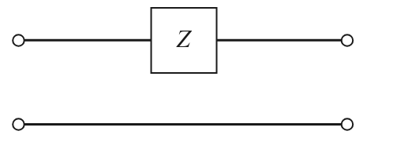
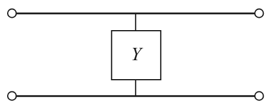
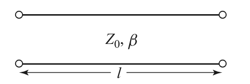
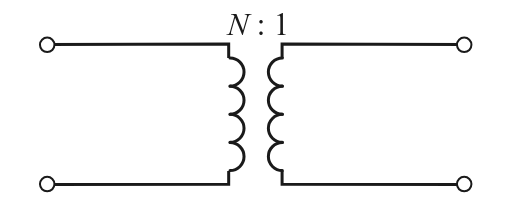
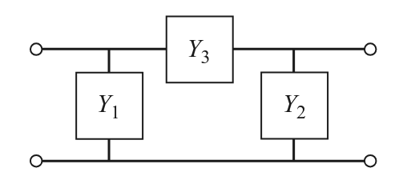
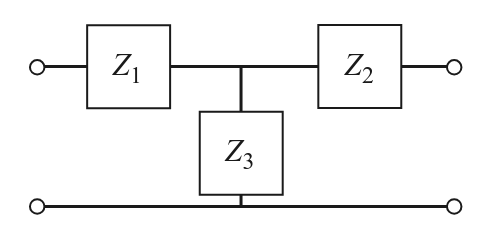

:PROPERTIES:
:ID:       ce7f7be0-a734-4999-9175-9aabfa310530
:END:
#+title: Network Analysis
#+date: [2026-07-21 Tue 15:07]
#+AUTHOR: Baley Eccles - 652137
#+STARTUP: latexpreview

* Network Analysis
Proves a  systematic way to abstract and simplify complex electrical behaviour. By describing its input-output relationships using network parameters, we can infer equivalent models of a complex circuit whose behaviour is difficult to describe using classical circuit theory. To do this we must measure S parameters using a tool known as a VNA.

** Port
A port describes a two terminal pair that connects to an external circuit.
Current in must equal current out:
 - \[I_{in} = I_{out}\] 

** N-Ports
N input/output pairs
\[V_n = V^+_n + V^-_n\]
\[I_n = I^+_n - I^-_n\]

** Parameters
Impedance: Z-parameters
Admittance: Y-parameters
Scattering: S-parameters
And ABCD-Parameter, among others

*** Z-parameter
\[\begin{bmatrix}
V_1 \\
V_2 \\
\vdots \\
V_N
\end{bmatrix} = \begin{bmatrix}
Z_{11} & Z_{12} & \hdots & Z_{1N} \\
Z_{21} & Z_{22} & \hdots & \vdots\\
\vdots& \hdots& \vdots& \vdots \\
Z_{N1} & \hdots & \hdots & Z_{NN}
\end{bmatrix}\begin{bmatrix}
I_1 \\
I_2 \\
\vdots \\
I_N
\end{bmatrix}\]
\[Z_{ij} = \frac{V_i}{I_j}|_{I_k = 0\textrm{ for } k\neq j}\]
$Z_{ij}$ can be found by driving the current $I_j$ and open circuit all other ports.
$Z_{ij}\ , i=j$ is called the self impedance 

*** Y-parameter
\[Y = \begin{bmatrix}
Y_{11} & Y_{12} & \hdots & Y_{1N} \\
Y_{21} & Y_{22} & \hdots & \vdots\\
\vdots& \hdots& \vdots& \vdots \\
Y_{N1} & \hdots & \hdots & Y_{NN}
\end{bmatrix} = Z^{-1} = \begin{bmatrix}
Z_{11} & Z_{12} & \hdots & Z_{1N} \\
Z_{21} & Z_{22} & \hdots & \vdots\\
\vdots& \hdots& \vdots& \vdots \\
Z_{N1} & \hdots & \hdots & Z_{NN}
\end{bmatrix}^{-1}\]
Admittance parameters

*** S-parameter
Better suited for high frequency analysis.
$V^+_N$ is the wave entering Nth port
$V^-_N$ is the wave exiting Nth port
\[\begin{bmatrix}
V^-_1 \\
V^-_2 \\
\vdots \\
V^-_N
\end{bmatrix} = \begin{bmatrix}
S_{11} & S_{12} & \hdots & S_{1N} \\
S_{21} & S_{22} & \hdots & \vdots\\
\vdots& \hdots& \vdots& \vdots \\
S_{N1} & \hdots & \hdots & S_{NN}
\end{bmatrix}\begin{bmatrix}
V^+_1 \\
V^+_2 \\
\vdots \\
V^+_N
\end{bmatrix}\]
\[S_{ij} = \frac{V^-_i}{V^+_j}|_{V^+_k = 0\textrm{ for } k\neq j}\]

*** ABCD Parameters of Some Useful Two-Port Circuits
**** Series Impedance

\[A = 1\]
\[B = Z\]
\[C = 0\]
\[D = 1\]

**** Shunt Admittance

\[A = 1\]
\[B = 0\]
\[C = Y\]
\[D = 1\]

**** Lossless Transmission Line

\[A = \cos(\beta l)\]
\[B = jZ_0\sin(\beta l)\]
\[C = jY_0\sin(\beta l)\]
\[D = \cos(\beta l)\]

**** Ideal Transformer \(N:1\)

\[A = N\]
\[B = 0\]
\[C = 0\]
\[D = \frac{1}{N}\]

**** Admittance Network

\[A = 1 + \frac{Y_2}{Y_3}\]
\[B = \frac{1}{Y_3}\]
\[C = Y_1 + Y_2 + \frac{Y_1Y_2}{Y_3}\]
\[D = 1 + \frac{Y_1}{Y_3}\]

**** Impedance Network

\[A = 1 + \frac{Z_1}{Z_3}\]
\[B = Z_1 + Z_2 + \frac{Z_1Z_2}{Z_3}\]
\[C = \frac{1}{Z_3}\]
\[D = 1 + \frac{Z_2}{Z_3}\]

