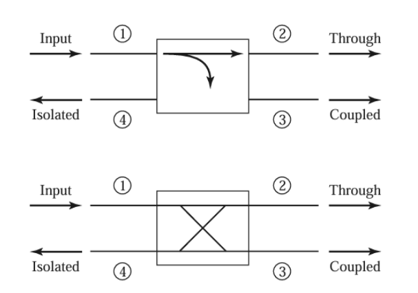

:PROPERTIES:
:ID:       ce7f7be0-a734-4999-9175-9aabfa310530
:END:
#+title: Network Analysis
#+date: [2026-07-21 Tue 15:07]
#+AUTHOR: Baley Eccles - 652137
#+STARTUP: latexpreview

* Network Analysis
Proves a  systematic way to abstract and simplify complex electrical behaviour. By describing its input-output relationships using network parameters, we can infer equivalent models of a complex circuit whose behaviour is difficult to describe using classical circuit theory. To do this we must measure S parameters using a tool known as a VNA.

** Port
A port describes a two terminal pair that connects to an external circuit.
Current in must equal current out:
 - \[I_{in} = I_{out}\] 

** N-Ports
N input/output pairs
\[V_n = V^+_n + V^-_n\]
\[I_n = I^+_n - I^-_n\]

** Parameters
Impedance: Z-parameters
Admittance: Y-parameters
Scattering: S-parameters
And ABCD-Parameter, among others

*** Z-parameter
\[\begin{bmatrix}
V_1 \\
V_2 \\
\vdots \\
V_N
\end{bmatrix} = \begin{bmatrix}
Z_{11} & Z_{12} & \hdots & Z_{1N} \\
Z_{21} & Z_{22} & \hdots & \vdots\\
\vdots& \hdots& \vdots& \vdots \\
Z_{N1} & \hdots & \hdots & Z_{NN}
\end{bmatrix}\begin{bmatrix}
I_1 \\
I_2 \\
\vdots \\
I_N
\end{bmatrix}\]
\[Z_{ij} = \frac{V_i}{I_j}|_{I_k = 0\textrm{ for } k\neq j}\]
$Z_{ij}$ can be found by driving the current $I_j$ and open circuit all other ports.
$Z_{ij}\ , i=j$ is called the self impedance 

*** Y-parameter
\[Y = \begin{bmatrix}
Y_{11} & Y_{12} & \hdots & Y_{1N} \\
Y_{21} & Y_{22} & \hdots & \vdots\\
\vdots& \hdots& \vdots& \vdots \\
Y_{N1} & \hdots & \hdots & Y_{NN}
\end{bmatrix} = Z^{-1} = \begin{bmatrix}
Z_{11} & Z_{12} & \hdots & Z_{1N} \\
Z_{21} & Z_{22} & \hdots & \vdots\\
\vdots& \hdots& \vdots& \vdots \\
Z_{N1} & \hdots & \hdots & Z_{NN}
\end{bmatrix}^{-1}\]
Admittance parameters

*** S-parameter
Better suited for high frequency analysis.2
$V^+_N$ is the wave entering Nth port
$V^-_N$ is the wave exiting Nth port
\[\begin{bmatrix}
V^-_1 \\
V^-_2 \\
\vdots \\
V^-_N
\end{bmatrix} = \begin{bmatrix}
S_{11} & S_{12} & \hdots & S_{1N} \\
S_{21} & S_{22} & \hdots & \vdots\\
\vdots& \hdots& \vdots& \vdots \\
S_{N1} & \hdots & \hdots & S_{NN}
\end{bmatrix}\begin{bmatrix}
V^+_1 \\
V^+_2 \\
\vdots \\
V^+_N
\end{bmatrix}\]
\[S_{ij} = \frac{V^-_i}{V^+_j}|_{V^+_k = 0\textrm{ for } k\neq j}\]
*** ABCD Parameters of Some Useful Two-Port Circuits
**** Series Impedance
[[./ABCD Series Impedance.png]]
\[A = 1\]
\[B = Z\]
\[C = 0\]
\[D = 1\]

**** Shunt Admittance
[[./ABCD Shunt Admittance.png]]
\[A = 1\]
\[B = 0\]
\[C = Y\]
\[D = 1\]

**** Lossless Transmission Line
[[./ABCD Lossless Transmission Line.png]]
\[A = \cos(\beta l)\]
\[B = jZ_0\sin(\beta l)\]
\[C = jY_0\sin(\beta l)\]
\[D = \cos(\beta l)\]

**** Ideal Transformer \(N:1\)
[[./ABCD Ideal Transformer.png]]
\[A = N\]
\[B = 0\]
\[C = 0\]
\[D = \frac{1}{N}\]

**** Admittance Network
[[./ABCD Admittance Network.png]]
\[A = 1 + \frac{Y_2}{Y_3}\]
\[B = \frac{1}{Y_3}\]
\[C = Y_1 + Y_2 + \frac{Y_1Y_2}{Y_3}\]
\[D = 1 + \frac{Y_1}{Y_3}\]

**** Impedance Network
[[./ABCD Impedance Network.png]]
\[A = 1 + \frac{Z_1}{Z_3}\]
\[B = Z_1 + Z_2 + \frac{Z_1Z_2}{Z_3}\]
\[C = \frac{1}{Z_3}\]
\[D = 1 + \frac{Z_2}{Z_3}\]

*** Reciprocal condition
\[S_{ij} = S_{ji}\]

*** Lossless Conditions
\[|S_{11}|^2 + |S_{12}|^2 + |S_{13}|^2 = 1\]
\[|S_{12}|^2 + |S_{22}|^2 + |S_{23}|^2 = 1\]
\[|S_{13}|^2 + |S_{23}|^2 + |S_{33}|^2 = 1\]

\[S_{11}^{*} S_{12} + S_{12}^{*} S_{22} + S_{13}^{*} S_{23} = 0\]
\[S_{11}^{*} S_{13} + S_{12}^{*} S_{23} + S_{13}^{*} S_{33} = 0\]
\[S_{12}^{*} S_{13} + S_{22}^{*} S_{23} + S_{23}^{*} S_{33} = 0\]
Or:
$S^HS = I$

*** Matched
\[S_{ii} = 0\]

*** Power
For an input vector:
\[a = \begin{bmatrix}
a_1 & a_2 & a_3 & \vdots
\end{bmatrix}\]
\[b = Sa\]
and the power delivered to port $i$ is:
\[P_i &= |b_i|^2\]

*** ABCD -> S Matrix
\[S_{11}=\frac{A + \frac{B}{Z_0} - C Z_0 - D}{A + \frac{B}{Z_0} + C Z_0 + D}\]
\[S_{22}=\frac{-A + \frac{B}{Z_0} - C Z_0 + D}{A + \frac{B}{Z_0} + C Z_0 + D}\]
\[S_{21}=\frac{2}{A + \frac{B}{Z_0} + C Z_0 + D}\]
\[S_{12}=\frac{2(AD-BC)}{A + \frac{B}{Z_0} + C Z_0 + D}\]
** 4 Port Networks
*** Symmetric coupler
\[\theta = \phi = \frac{\pi}{2}\]
\[S = \begin{bmatrix}
0 & \alpha & j\beta & 0 \\
\alpha & 0 & 0 & j\beta \\
j\beta & 0 & 0 & \alpha \\
0  & j\beta & \alpha & 0
\end{bmatrix}\]
\[\alpha^2 + \beta^2 = 1\]
*** Asymmetric coupler
\[\theta = 0 \quad \phi = \pi\]
\[S = \begin{bmatrix}
0& \alpha & \beta & 0 \\
\alpha & 0 & 0 & -\beta \\
\beta & 0 & 0 & \alpha \\
0 & -\beta & \alpha & 0 \\
\end{bmatrix}\]
\[\alpha^2 + \beta^2 = 1\]
*** Directional Couplers

_Coupling:_
\[C = 10\log_{10}\frac{P_1}{P_3} = -20\log_{10}\beta dB\]
_Directivity:_
\[D = 10\log_{10}\frac{P_3}{P_4} = 20\log_{10}\frac{\beta}{|S_{14}|}dB\]
_Isolation:_
\[I = 10\log_{10}\frac{P_1}{P_4} = -20\log_{10}|S_{14}| dB\]
_Insertion Loss:_
\[L = 1 - \log_{10}\frac{P_1}{P_2} = -20\log_{10}|S_{12 dB}|\]

