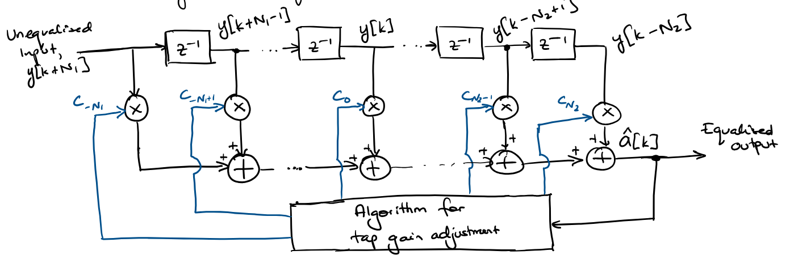

:PROPERTIES:
:ID:       0048a310-96ae-4bc2-af5f-b458e95fc678
:END:
#+title: Equalisation
#+date: [2026-07-27 Mon 09:37]
#+AUTHOR: Baley Eccles - 652137
#+STARTUP: latexpreview

* Equalisation
\[Z_{in}(t)\rightarrow \boxed{H_t(f)} (S_{in}(t)) \rightarrow \boxed{H_c(f)}\rightarrow \boxed{+n(t)} (y(t)) \rightarrow \boxed{\textrm{Equaliser}} (S_{out}(t)) \rightarrow \boxed{H_r(f)}\rightarrow Z_{out}(t)\]
 - Equaliser and $H_r(f)$ may be combined
 - Assume [[id:d535e784-50d7-4f0c-9188-5f42e3aad514][Intersymbol Interference (ISI)]] only lasts for a finite amount of time
 - The total number of samples resulting in [[id:7ea297c6-78cb-4a6b-b4a5-b0af9176122e][dispersion]] is $L$

Naively, we want: $H_{eq}(f) = \frac{1}{H_c(f)}$
 - This will cause infinite gains and amplify noise
\begin{align*}
S_{out}(f) &= [\sin(f)H_c(f) + N(f)]H_{eq}(f) \\
S_{out}(f) &= \sin(f) + N(f)H_{eq}(f) \\
N(f)H_{eq}(f) &= N'(f)
\end{align*}
$N'(f)$ is coloured Gaussian noise, with $S_{N'N'}(f) = \frac{0.5 N_0}{|H_c(f)|^2}$, which risks significant noise enhancement. The SNR drops dramatically with this filter.

\[Z_{in}(t)\rightarrow \boxed{h_t(t)} \rightarrow \boxed{h_c(t)} \rightarrow \boxed{+ n(t)}(w(t)) \rightarrow \boxed{h_r(t) = g_m^{*}(-t)}(y(k)) \rightarrow \boxed{\textrm{Sampler}} \rightarrow (y[n]) \rightarrow \boxed{\textrm{Adaptive Equaliser}} \leftrightarrow (\textrm{output})\]
 - $h(t) = h_t(t)*h_c(t)$
 - $Z_{in}(t)$ with input symbols $a[k]$
 - Adaptive Equaliser takes signals from the output and updates the weights in the equaliser using a Tap Width Algorithm.
\begin{align*}
Z_{in}(t) &= \sum_k a[k]\delta(t - kT_s) \\
w(t) &= h_t(t) * h_c(t) * Z_{in}(t) + n(t) \\
\end{align*}
We want $h_r(t) = h_c(-t) * h_t(-t)$ to minimise SNR, but this is difficult if $h_c(t) \neq \delta(t)$ and is time-varying.
Define $f(t) = h_t(t) * h_c(t) * h_r(t)$, so
\begin{align*}
y(t) &= Z_{in}(t) * f(t) + n(t)*h_r(t) \\
&= \sum_k a[k] f(t - kT_s) + n_g(t)
\end{align*}
Let $f[n] = f(nT_s)$ denote samples of $f(t)$ at $nT_s$, so
\begin{align*}
y[n] &= \sum_{k = -\infty}^{\infty}a[k]f[n - k] + n_g[n] \\
&= a[n]f[0] + \sum_{k\neq n} a[k]f[n - k] + n_g[n]
\end{align*}
 - $a[n]f[0]$ is the desired data symbol
 - $\sum_{k\neq n} a[k]f[n - k]$ is the [[id:d535e784-50d7-4f0c-9188-5f42e3aad514][Intersymbol Interference (ISI)]]
 - $n_g[n]$ is the samples noise
   
We get the [[id:d535e784-50d7-4f0c-9188-5f42e3aad514][ISI]] free condition iff:
\[F_{\Sigma}(f) = \frac{1}{T_s}\sum_{n=-\infty}^{\infty}F\left(f + \frac{n}{T_s}\right) = f[0]\]
 - $F_{\Sigma}(f)$ is the Folded Spectrum
If $F_{\Sigma}(f)$ is not flat, we use $H_{eq}(t)$ to correct it.

** Linear Equalisers (Traversal)

 - $z^{-1}$ is a one unit delay
Ignoring quantisation effects:
\[a[k] = \sum_{j=N_1}^{N_2}c_j y[k-j]\]
 - $\{c_j\}$ are $N_1 + N_2 - 1$ tap weight coefficients
\[H_{eq}(z) = \sum_{j=-L}^Lc_j^{*}z^{-j}\]
 - Assuming $N_1 = -N_2$
*** Zero-Forcing (ZF) Equaliser
 - Minimise Peak Distortion
ZF cancel [[id:d535e784-50d7-4f0c-9188-5f42e3aad514][Intersymbol Interference (ISI)]] but risks significant noise enhancement.

Noise Power:
\[N(z) = \frac{N_0}{|H(z)|^2}\]
Normalised Peak Distortion:
\[D_0 = \frac{1}{|\hat{y}[0]|}\sum_{k\neq 0}|\hat{y}[k]|\]
Where:
\[\hat{y}[n] = \begin{cases}
1 &, n = 0 \\
0 &, n \neq 0
\end{cases}\]
Note $\hat{y}[n]$ is only able to be applied for $n\in [-k, k]$. So, the zero forcing condition becomes:
\[\begin{cases}
\hat{y}[n] = \sum_{j = -k}^k c_jy[n - j] \\
\hat{y}[n] = \begin{cases}
1 &, n = 0 \\
0 &, n = \pm 1, \pm 2, \hdots, \pm k
\end{cases}
\end{cases}\]
Which can also be written as:
\begin{align*}
\begin{bmatrix}
y[0] & y[-1] & \hdots & y[-2k] \\
y[1] & y[0] & \hdots & y[-2k+1] \\
\vdots & \vdots & \hdots & \vdots \\
y[2k] & y[2k-1] & \hdots & y[0] \\
\end{bmatrix}\begin{bmatrix}
c_{-k} \\
c_{-k +1} \\
\vdots \\
c_{0} \\
\vdots \\
c_{k-1} \\
c_{k}
\end{bmatrix} &= \begin{bmatrix}
0 \\
\vdots \\
0 \\
1 \\
0 \\
\vdots \\
0 \\
\end{bmatrix} \\
YC &= \hat{Y} \\
C &= Y^{-1}\hat{Y}
\end{align*}

**** Tolerance of ZF equaliser to noise
\[\sigma_{\hat{y}}^2 = \sigma^2\sum_{j=-k}^k|c_j|^2\]

**** Example
A sampled channel impulse response is found to be $0.1, 1.0, -0.2$ corresponding to  $y[-1], y[0], y[1]$.
a) Find the coefficient of a 3 tap ZF equaliser
b) Find $\hat{a}[n]$ after equalising if an input of $a[n] = \delta[n]$ is given
***** Solution
a)
Need to go from $-2k$ ($-2\cdot 1$) to $2k$ ($2\cdot 1$)
\[\begin{bmatrix}
1.0 & 0.1 & 0 \\
-0.2 & 1.0 & 0.1 \\
0 & -0.2 & 1.0
\end{bmatrix}\begin{bmatrix}
c_{-1} \\
c_{0} \\
c_{11}
\end{bmatrix} &= \begin{bmatrix}
0 \\
1 \\
0 \\
\end{bmatrix}\]

\[\begin{bmatrix}
c_{-1} \\
c_{0} \\
c_{11}
\end{bmatrix} = \begin{bmatrix}
-5/52\\
25/26 \\
5/26
\end{bmatrix}\]

b)
\begin{align*}
\hat{y}[n] &= \sum_{j = -k}^k c_jy[n - j] \\
\hat{y}[-3] &= \sum_{j = -1}^1 c_jy[-3 - j] = 0 \\
\hat{y}[-2] &= \sum_{j = -1}^1 c_jy[-2 - j] = -1/104 \\
\hat{y}[-1] &= \sum_{j = -1}^1 c_jy[-1 - j] = 0 \\
\hat{y}[0] &= \sum_{j = -1}^1 c_jy[0 - j] = 1 \\
\hat{y}[+1] &= \sum_{j = -1}^1 c_jy[1 - j] = 0 \\
\hat{y}[+2] &= \sum_{j = -1}^1 c_jy[2 - j] = -1/26
\end{align*}

*** Minimum Mean Square Error Equaliser (MMSE)
 - Minimise the mean squared error
\[\{c_k\} = \min_{c_k}\{E[(a[k] - \hat{a}[k])^2]\}\]
\[\hat{a}[k]= \sum_{j = -L}^Lc_j y[k - j]\]

Made up of a noise whitening component and a [[id:d535e784-50d7-4f0c-9188-5f42e3aad514][Intersymbol Interference (ISI)]] removal component
\[H_{eq}(z) = \frac{1}{F(z) + N_0}\]
Three important features:
1. The ideal infinite-length MMSE equaliser cancels the noise whitening filter
2. The infinite-length equaliser is identical to the ZF equaliser except for the noise term $N_0$
3. There is a balance between inverting the channel and noise
\[C = Y^H[Y^HY + N_0I]^{-1}\hat{Y}\]
 - $H$ indicates the [[id:51260ef9-3b99-4fa4-a4f2-ff241ff32bff][Hermitian Transpose]]

**** Performance
\[J_{\min} = T_s\int_{-\frac{1}{2T_s}}^{\frac{1}{2T_s}}\frac{N_0}{F_{\Sigma}(f) + N_0} df\]
Has the properties:
 - $0\leq J_{\min} = E\{[a[k] - \hat{a}[k]]^2\} \leq 1$
 - $J_{\min} = 0$ when $N_0 = 0$ as long as $F_{\Sigma}(f) \neq 0$ within the signal bandwidth
 - $J_{\min} = 1$ if $N_0 \rightarrow \infty$

**** Examples
Binary PAM is used to transmit information over and unspecified channel. The transmitted, noise-free demodulator output is (for $a = 1$):
\[y[k] =\begin{cases}
0.3 &, k=\pm 1 \\
0.0 &, k=0 \\
0 &, \textrm{else}
\end{cases}\]
a) Design a three tap MMSE equaliser if $N_0 = 0.1\ w/Hz$. b) Then determine the noise-free output signals if the input is $a = \{1, -1\}$

***** Solution
a)
\[Y =\begin{bmatrix}
y[0] & y[-1] & y[-2] \\
y[1] & y[0] & y[-1] \\
y[2] & y[1] & y[0] \\
\end{bmatrix} = \begin{bmatrix}
0.9 & 0.3 & 0 \\
0.3 & 0.9 & 0.3 \\
0 & 0.3 & 0.9 \\
\end{bmatrix}\]
And
\[N_0I = \begin{bmatrix}
0.1 & 0 & 0 \\
0 & 0.1 & 0 \\
0 & 0 & 0.1 \\
\end{bmatrix}\]
\[C = Y^H[Y^HY + N_0I]^{-1}\hat{Y} = \begin{bmatrix}
-0.263 \\
1.086 \\
-0.263
\end{bmatrix}\]
b)
Channel output:
\[\hat{y}[k] = \sum_{j=-\infty}^{\infty}h[j]a[k - j] = \begin{cases}
0.3 & k=-1 \\
0.6 & k=0 \\
-0.6 & k=1 \\
-0.3 & k=2
\end{cases}\]
Pass through equaliser:
\[a[k] = \sum_{j=-\infty}^{\infty}c_jy[k - j] = \begin{cases}
-0.0789 & k=-2 \\
0.1681 & k=-1 \\
0.7305 & k=0 \\
-0.7305 & k=1 \\
-0.1681 & k=2 \\
0.0789 & k=3
\end{cases}\]

