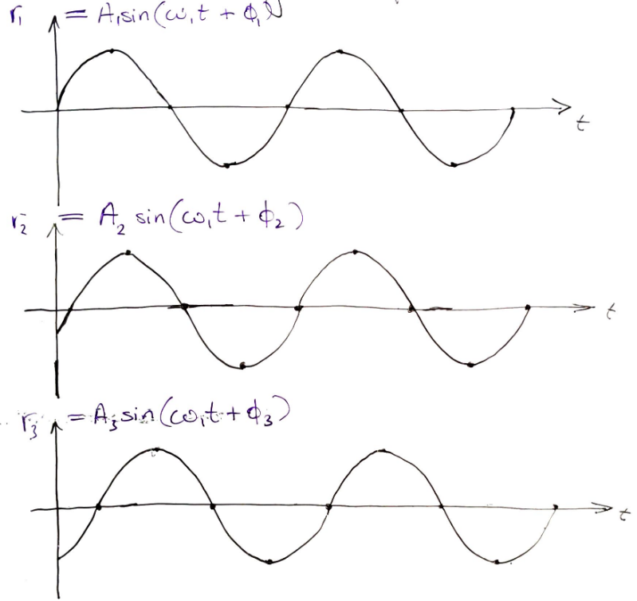
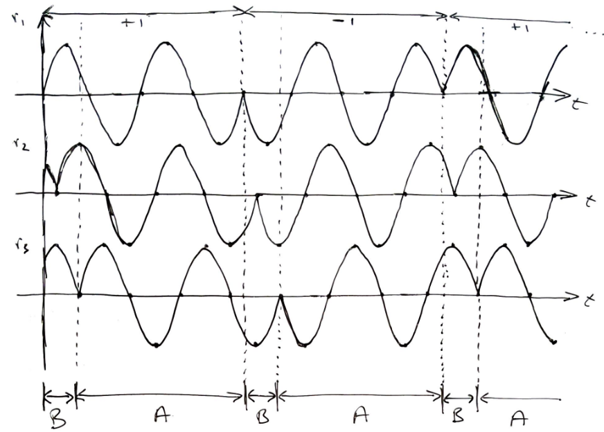
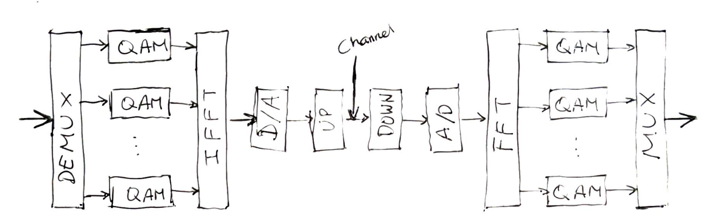

:PROPERTIES:
:ID:       231a118c-a538-4759-a73a-228e4376af96
:END:
#+title: Orthogonal Frequency Division Multiplexing (OFDM)
#+date: [2026-08-10 Mon 09:40]
#+AUTHOR: Baley Eccles - 652137
#+STARTUP: latexpreview

* Orthogonal Frequency Division Multiplexing (OFDM)

 - $N$ is the amount of sub carriers

** Standard IEEE 802.11a
 - 64 sub-carriers
 - 312.5kHz Spacing
 - Selectable modulation (B[[id:d272c047-df78-4f69-8f3e-b682c8f53a99][PSK]], [[id:e699150a-7d97-4f5d-b505-abff0dade347][QPSK]], 16[[id:44e2b236-fe48-411c-9dec-a4a46674f379][QAM]], 64[[id:44e2b236-fe48-411c-9dec-a4a46674f379][QAM]])
   
** Drawbacks of OFDM
 - Fast [[id:8c79d3ee-766a-4f72-a070-7a44d0f85ac1][fading]] / [[id:02463fc8-1fc6-427f-acd1-03542a688e16][Doppler Shift]]
   - Destroy the orthogonality
 - Power amplifiers at the antenna stages should be linear, but OFDM has high dynamic range - it has a high Peak-To-Average Power Ratio (PAPR)
 - [[id:abae31a2-cc7c-4a2d-b1cf-ed322480482e][Multipath]] effects can be handled with the 'cyclic prefix' (CP)
   
** OFDM Transmitter
 - Uses [[id:ba86b339-ae85-45c2-88d4-ce44835059c4][Circular Matricies]] where possible
The signal on sub-carrier $k$ is:
\[x_k(t) = g(t) \left[I(t) \cos(2\pi f_k t) - Q(t)\sin(2\pi f_k t)\right]\]
Then the overall complex baseband signal of all $N$ channels is:
\[x(t) = g(t) \sum_{k=1}^NA_k(t) e^{j2\pi k\Delta f t}\]
The fundamental sub-carrier is the 'slowest' and has period $T_s$, then $\Delta f = \frac{1}{T_s}$.
Consider the following situation at one frequency:

The receiver only sees the sum of these:
\[r = r_1 + r_2 + r_3 = A_T\sin(\omega_1 t + \phi_T)\]
 - Where $A_T,\phi_T$ depend on $\{A_1,A_2,A_3, \phi_1, \phi_2, \phi_3\}$

 - When summed the $B$ sections there will be discontinuities
 - We add sections of $B$ to the beginning of the next section
 - This causes intervals of $T_s$ to be correct

\[r[i] = \sum_{k=0}^Lc[k]d[i-k] + n_s[i]\]
 - $d$ are the transmitted time domain signals
 - $c$ is the channels impulse response ($c = [c_0\ c_1\ \hdots\ c_L\ 0\ 0\ \hdots\ 0]^T$ zeroes added so there are $N$ total values)
 - $L \geq M$
 - $d = \mathcal{F}^H a$
   - $d$ is $N$ samples
Due to the CP, we can represent the channel by a circular matrix
\[\begin{bmatrix}
r[1] \\
r[2] \\
\vdots \\
r[N]
\end{bmatrix}=\begin{bmatrix}
c_0 & 0 & 0 & \hdots & C_L \\
c_1 & c_0 & 0 \hdots & 0 \\
\vdots & c_1 & c_0 \hdots & 0 \\
\vodts & \vdots & \vdots & \vdots & \vdots \\
c_L & c_{L-1} & \hdots \\
0 & c_L & \hdots \\
\vdots & \vdots \\
0 & \hdots c_L & c_{L-1} &\hdots & C_0
\end{bmatrix}\begin{bmatrix}
d[1] \\
d[2] \\
\vdots \\
d[N]
\end{bmatrix} +\begin{bmatrix}
n_s[1] \\
n_s[2] \\
\vdots \\
n_s[N]
\end{bmatrix}\]
\[r = Cd + n_s\]
 
** OFDM Receiver
 - (after removing CP)
\begin{align*}
r &= Cd + n_s \\
r &= C\mathcal{F}^Ha + n_s \\
\Rightarrow^{\textrm{Take FFT}} \mathcal{F}r &= \mathcal{F} C\mathcal{F}^H + a \mathcal{F}n_s \\
c &= \mathcal{F}^H\Lambda \mathcal{F} \\
fr &= \Lambda a + \mathcal{F} n_s \\
\end{align*}
We can work with this thanks to [[id:533199e6-1d41-4223-a95e-b4ee0de5f926][channel estimation]]
We do not have [[id:abae31a2-cc7c-4a2d-b1cf-ed322480482e][dispersive]] effects at the receiver

** Performance of OFDM
\begin{align*}
r &= c[n] * d[n] + n_s[n] \\
\Rightarrow^{FFT} R[k] &= C[k]D[k] + N_s(k) \\
N_s[k] = \sum_{m=0}^{N-1} n_s[m]e^{-\frac{j2\pi km}{N}}
\end{align*}
Assume $n_s[m]$ are iid [[id:0a3093d2-6df1-49f4-b00a-f506505c424d][Gaussian noise]] sample where:
 - $E\{n_s[m]\} = 0$
 - $E\{|n_s[m]|^2\} = \sigma^20$
 - $E\{n_s[m] n_s^{*}[l]\} = 0$
So,
\begin{align*}
E\{N_s[k]\} &= E\left\{\sum_{m=0}^{N-1} n_s[m]e^{-\frac{j2\pi km}{N}}\right\} \\
&= 0 \\
E\{|N_s[k]|^2\} &= E\{N_s[k]N_s^{*}[l]\} \\
&= N\sigma^2
\end{align*}

We should look at the channel $C[k]$ also 
\[C[k] = \sum_{l=0}^Lc[l]e^{-j\frac{2\pi kl}{N}}\]
Assume [[id:2f39c6c4-53d7-4281-b06b-41ec371e5ca2][Rayleigh Faded]] channel response for $c[l] \neq 0$. So, $C[l]$ follows a complex [[id:0a3093d2-6df1-49f4-b00a-f506505c424d][Gaussian]] distribution, so $E\{c[l]\} = 0$.
Also assume that $E\{c[l]c^{*}[m]\} = 0$ for $l \neq m$. Called the "uncorrelated scattering" assumption.
Finally, assume $E\{|c[l]|^2\} = \Omega = 1$
We can then show that:
 - $E\{c[k]\} = 0$
 - $E\{|c[k]|^2\} = L + 1$
So, each $C[k]$ is also [[id:2f39c6c4-53d7-4281-b06b-41ec371e5ca2][Rayleigh Faded]].

_SNR:_
\[R[k] = C[k] D[k] + N_s[k]\]
 - $E\{|D[k]|^2\} = P$
 - $E\{|C[k]|^2\} = L + 1$
 - $N_s[k]$ Gaussian $E\{|N_s[k]|^2\} = N\sigma^2$
\[SNR = \frac{(L+1)P}{N\sigma^2} = \bar{\gamma}\]
 - under the uncorrelated scattering assumption
Then:
\[BER = \frac{1}{2}\left(1 - \sqrt{\frac{\bar{\gamma}/2}{1 + \bar{\gamma}/2}}\right)\]
 - For BPSK

** System Diagram

