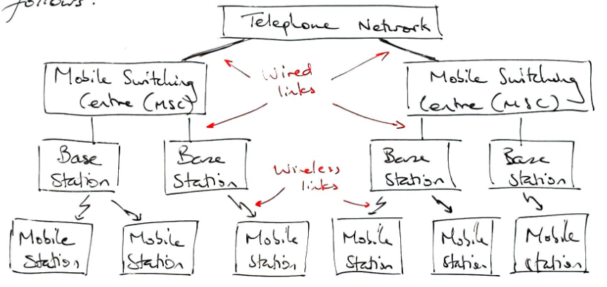

:PROPERTIES:
:ID:       9127e107-dcc1-4ead-8e48-0a243a720e43
:END:
#+title: Mobile Communications
#+date: [2026-08-17 Mon 09:59]
#+AUTHOR: Baley Eccles - 652137
#+STARTUP: latexpreview

* Mobile Communications

Four channels
 - FVC (Forward Voice Channel)
 - FCC (Forward Control Channel)
 - RVC (Reverse Voice Channel)
 - RCC (Reverse Control Channel)

To reduce same frequency interference from nearby base stations we can choose multiple frequencies and then tile a hexagon plane. A to G is 7 frequency reuse.
 - N cells
 - S duplex channels
 - K duplex channels per cell
 - $S = KN$
 - M clusters
 - $T = MKN$ total users available
The cluster size $N$ fits: $N = i^2 + ij + j^2,\ i,j\in \mathds{Z}^+ \cup \{0\}$
 - Can tessellate by moving $i$ then rotating by $120^{\circ}$ then going $j$ and placing the base station (repeating)
The distance between co-channel interferer $BS_s$ is
\[D = R\sqrt{3N}\]
The frequency reverse ratio:
\[Q = \frac{D}{R} = \sqrt{3N}\]

** Interference and System Capacity
\[P_r = P_0\left(\frac{d}{d_0}\right)^{-n}\]
 - $P_r$: average received power
 - $P_0, d_0$: reference power and distance
 - $n$: path loss index

The signal-to-interference (ISR) is:
\[\frac{S}{I} = \frac{S}{\sum_{i=1}^{i_0}I_i}\]
 - $I_i$: The signal power from co-channel BS $i$
 - $i_0$: The total number of co-channel interferers
 - $S$: Desired signal power
Worst-case for $SIR$ at $R$:
\begin{align*}
S &= cd^{-n} = cR^{-n} \\
\frac{S}{I} &= \frac{cR^{-n}}{\sum_{i=1}^{i_0}I_i} \\
I_i &= cD^{-n} \\
\frac{S}{I} &= \frac{\left(\frac{D}{R}\right)^n}{i_0} = \frac{Q^n}{i_0} = \frac{(3N)^{n/2}}{i_0}
\end{align*}
If we have omnidirectional antennas, then $i_0 = 6$.

*** Example
Suppose we need $18\ \mathrm{dB}$ of $S/I$. What is the minimum $N$ is needed if $n=3$ or if $n = 4$?
**** Solution
\[S/I = 18\ mathrm{dB} = 63.1\]
So, we need:
\[\frac{(3N)^{n/2}}{6} = 63.1\]
If $n=3$, we get:
\[N \geq \frac{1}{3}(6\cdot 63.1)^{3/2} = 16.4\]
 - $N = 18$?
| i | j | i^2 + ij + j^2 |   |
| 3 | 3 |             27 | X |
| 3 | 2 |             19 | Y |
| 4 | 0 |             16 | X |
| 4 | 1 |             21 | X |
\[\Rightarrow N = 19\]
If $n=4$, we get:
\[N \geq \frac{1}{4}(6\cdot 63.1)^{4/2} = 6.5\]
\[\Rightarrow N = 7\]
** Adjacent Channel Interference (ACI)
Imperfect filters cannot perfectly remove neighbouring channel impacts.
Assign frequencies of neighbouring channels non-sequentially.

** Hand offs
Quality of Service (QoS) - Probability of dropped call
$P_{r,\min}$ - Below this value call is dropped
$P_{rh}$ - Hand off power level

** Cell Splitting
Place half width hexagons in original hexagon ($R \rightarrow \frac{R}{2}$)
 - Improves SIR
 - Cuts the required transmit power
 - Increases the number of hand offs
 - Areas created with low signal strength

** Sectoring
By not using omnidirectional antennas we can sector off hexagons into:
 - $120^{\circ}$ sectoring: thirds
 - $60^{\circ}$ sectoring: sixths

 - Reduces co-channel interference

** Trunking
Let $U$ be the number of users and $C$ the number of channels
$C = U$ would be perfect but unwise
$C < U$ risks dropping some calls
_Parameters:_
 - Average holding time / average call time, $H$
 - Call rate: average number of calls per unit of time, $\lambda$
 - Offered traffic intensity, $A$, measured in Erlangs
   - One Erlang is the traffic intensity of a channel occupied 100% of the time
 - Grade of service (GoS): The probability of a call being blocked or delayed for too long
 - Blocked call: Call cannot be serviced at the instance it is made
 - Systems load: The total traffic intensity across the entire system

Each user generates traffic $A_u = H\lambda$
For system of $U$ users, the offered traffic intensity $A = A_u U$
In a $C$ trunked system, assuming traffic is equally distributed among channels, then intensity per channel: $A_c = \frac{A_uU}{C}$

*** Blocked Calls Cleared
 - Blocked calls get dropped, try again later.
Assume:
 - Calls arrive by [[id:731e757c-e3ec-4346-97fc-ad4bd86292dc][Poisson Distribtion]].
 - Infinite number of users, but $A$ is constant
 - Arrival of users is memory-less
 - Probability of occupying a channel is exponential
 - There are only a finite number of channels
\[\Pr(\mathrm{blocking}) = GoS = \frac{\frac{A^C}{C!}}{\sum_{k=0}^C \frac{A^k}{k!}}\]
 - We have the Erlang B table for this

*** Blocked Calls Delayed
 - Assignment to the queue if the system is blocked
 - GoS is the probability that a call is held longer than a predefined time
 - Assume an infinite length queue and people don't leave the queue
\[\Pr(\mathrm{delay} > 0) = \frac{A^C}{A^C + C!\left(1 - \frac{A}{C}\right)\sum_{k=0}^{C-1}\frac{A^l}{k!}}\]
 - We have the Erlang C table for this
\[\Pr(\mathrm{delay} > t\ |\ \mathrm{delay} > 0) = e^{-\left(\frac{C-A}{H}t\right)}\]
So, $GoS = \Pr(\mathrm{delay} > 0)\Pr(\mathrm{delay} > t\ |\ \mathrm{delay} > 0)$

** Outage Probability in Cellular Systems
 - We need a threshold SIR level
Consider a desired signal $s$ in the process of one co-channel interferer, $c_1$
 - $s$ experiences [[id:8c79d3ee-766a-4f72-a070-7a44d0f85ac1][fading]]
 - $c_1$ is constant
The probability the signal is serviced is:
\[P_{ser} = 1 - P_{out} = \int_{r_pc_1}^{\infty} P_s(S)ds\]
 - $r_p$ is the receiver protection margin
 - $P_s(S)$ is the PDF of the power level
Now, $c_1$ is also a random variable with PDF $P_{c_1}(C_1)$, then:
\[P_{ser} = \int_0^{\infty}P_{c_1}(C_1)\int_{r_pc_1}^{\infty}P_s(S)dsdc_1\]
We have $i_0$ co-channel interferers. Assume they are all independent.
\[P_{ser} = \int_0^{\infty}P_{c_1}(C_1)\int_0^{\infty}P_{c_2}(C_2)\hdots\int_0^{\infty}P_{c_{i_0}}(C_{i_0})\int_{r_p\sum_{n=1}^{i_0}}^{\infty}P_s(S)dsdc_{i_0}\hdots dc_2dc_1\]
Assume the interferers are [[id:2f39c6c4-53d7-4281-b06b-41ec371e5ca2][Rayleigh Faded]]:
\[P_s(S) = \frac{1}{A}e^{-\frac{S}{A}}\]
\[P_c_n(C_n) = \frac{1}{B_n}e^{-\frac{C_n}{B_n}}\]y
So,
\begin{align*}
P_{ser} &= \prod_{n=1}^{i_0}\int_0^{\infty}e^{c_n\left(\frac{r_p}{A} + \frac{1}{B_n}\right)} dc_n \\
&= \prod_{n=1}^{i_0} \frac{1}{1 + \frac{B_nr_p}{A}} \\
\Lambda_n &= \frac{A}{B_n} \\
&= \prod_{n=1}^{i_0} \frac{\Lambda_n}{\Lambda_n + r_p} \\
\end{align*}

