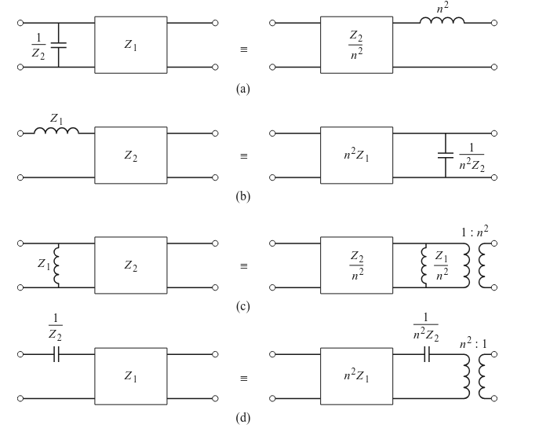

:PROPERTIES:
:ID:       cfe4c79e-69f6-4f18-8f27-379ffb8e76be
:END:
#+title: Richards' Transformation/Kuroda Identities
#+date: [2026-08-30 Sun 10:44]
#+AUTHOR: Baley Eccles - 652137
#+STARTUP: latexpreview

* Richards' Transformation
Transform using
\[\Omega = \tan(\beta l) = \tan\left(\frac{\omega l }{v_p}\right)\]

 - Allows indcutors to be replaced with a short circuit stub of length $\beta l$
   - $Z_L = L$
   - \[L_{LP} \rightarrow Z_{\textrm{series stub}} = Z_0 g_k\]
 - Allows capacitors to be replaced with a open circuit stub of length $\beta l$
   - $Z_C = \frac{1}{C}$
   - \[L_{LP} \rightarrow Z_{\textrm{shunt stub}} = \frac{Z_0}{g_k}\]

** Inductor
\[jX_L = j \Omega L = j L \tan(\beta l)\]

** Capacitor
\[j B_C = j \Omega C = j C \tan(\beta l)\]

* Kuroda Identities

\[n^2 = 1 + \frac{Z_{\textrm{stub}}}{Z_{\textrm{UE}}}\]
\[Z_{\textrm{UE}_1} = Z_0\]
\[Z_{\textrm{series stub}} \rightarrow Z_{\textrm{shunt stub}} = \begin{cases}
Z_{\textrm{UE}}' &= n^2 Z_{\textrm{stub}} \\
Z_{\textrm{stub}}' &= n^2 Z_{\textrm{UE}} \\
\end{cases}\]
\[Z_{\textrm{shunt stub}} \rightarrow Z_{\textrm{series stub}} = \begin{cases}
Z_{\textrm{UE}}' &= \frac{Z_{\textrm{stub}}}{n^2} \\
Z_{\textrm{stub}}' &= \frac{Z_{\textrm{UE}}}{n^2} \\
\end{cases}\]
