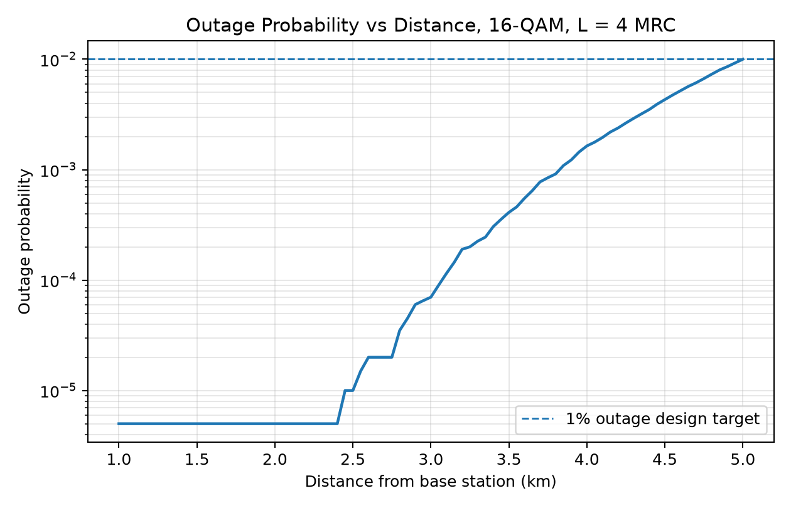
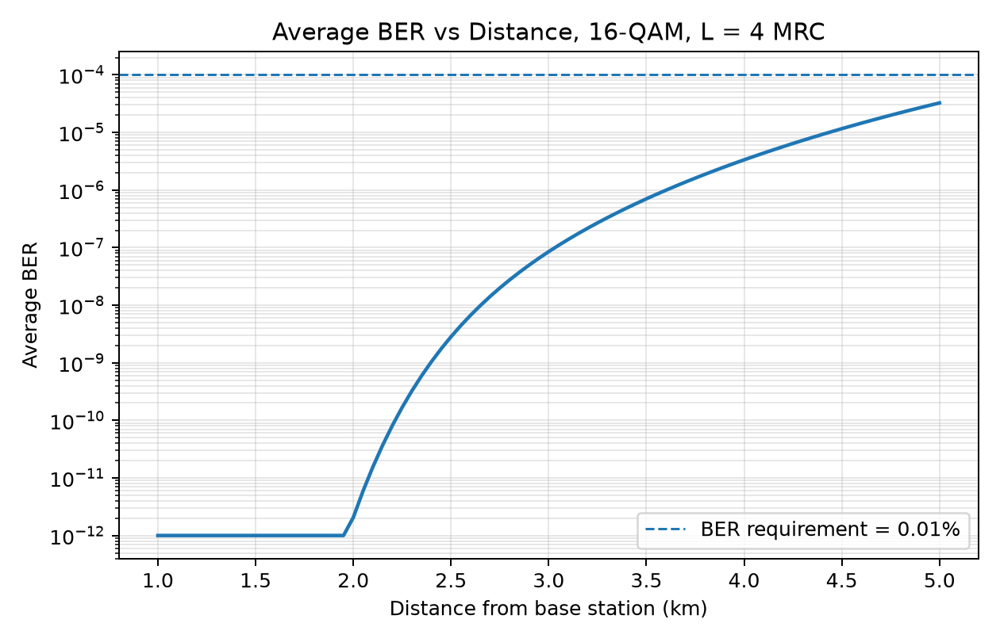
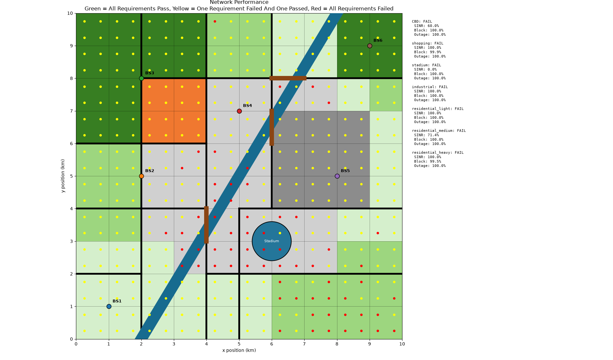
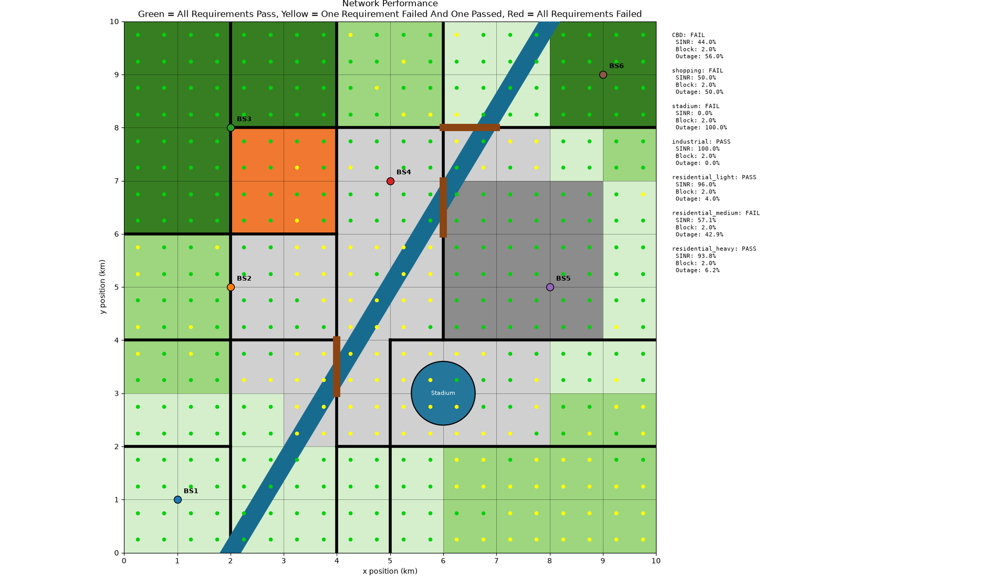
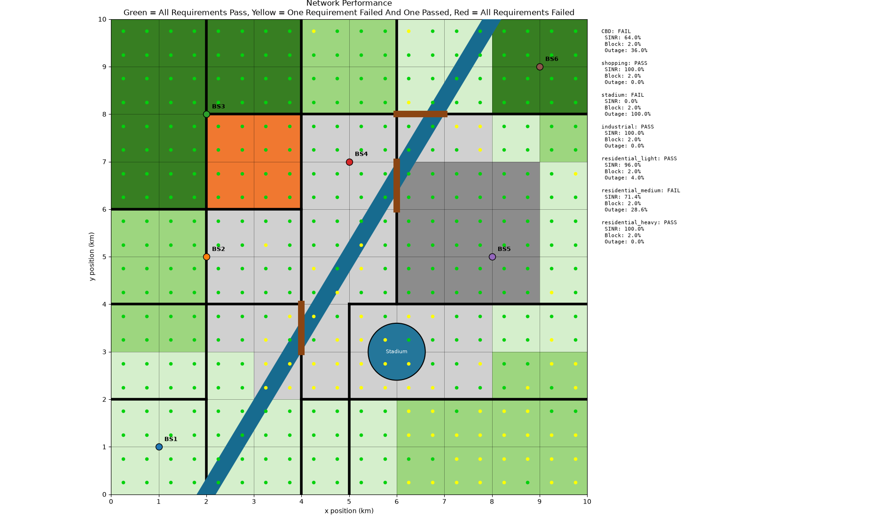
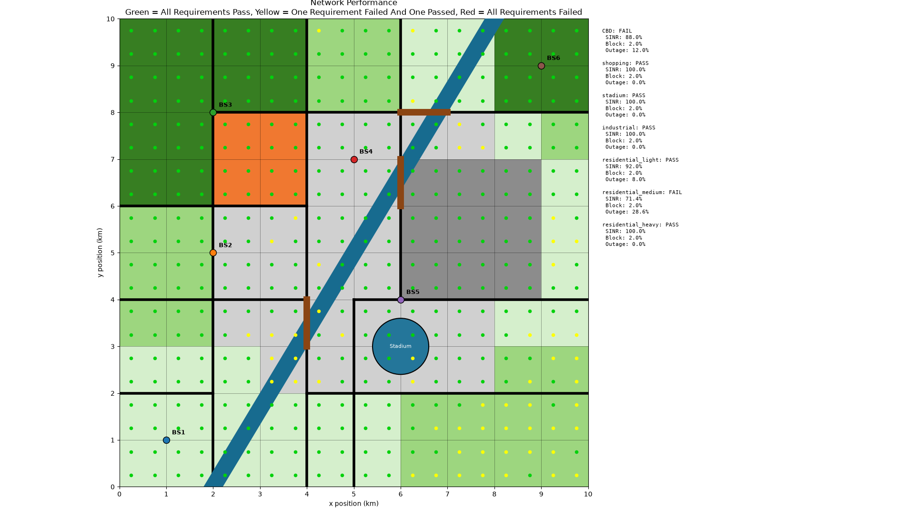
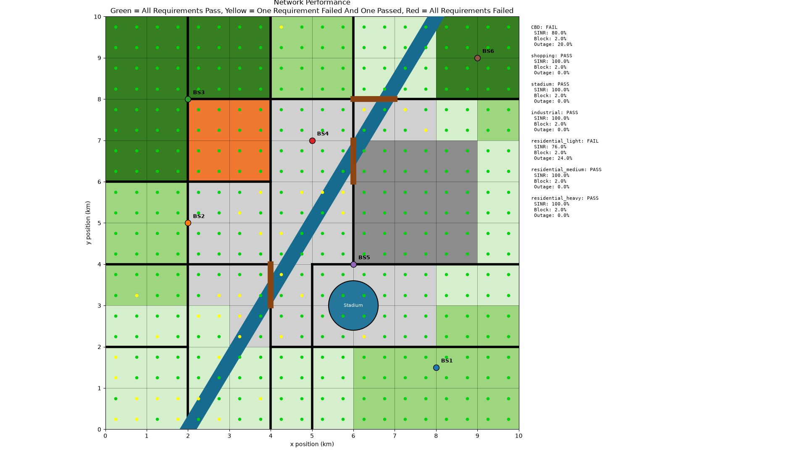

:PROPERTIES:
:ID:       c7b20e70-138a-4214-b0d5-54b9a357e3e8
:END:
#+title: ENG405 - Communication Systems 2 – Project 3
#+date: [2026-09-04 Fri 11:33]
#+AUTHOR: Baley Eccles - 652137
#+STARTUP: latexpreview
#+FILETAGS: :Assignment:UTAS:2026:
#+LATEX_HEADER: \usepackage[a4paper, margin=1in]{geometry}
#+LATEX_HEADER_EXTRA: \usepackage{minted}
#+LATEX_HEADER_EXTRA: \usepackage{fontspec}
#+LATEX_HEADER_EXTRA: \setmonofont{Iosevka}
#+LATEX_HEADER_EXTRA: \setminted{fontsize=\small, frame=single, breaklines=true}
#+LATEX_HEADER_EXTRA: \usemintedstyle{emacs}
#+LATEX_HEADER_EXTRA: \usepackage{float}
#+LATEX_HEADER_EXTRA: \usepackage[final]{pdfpages}
#+LATEX_HEADER_EXTRA: \setlength{\parindent}{0pt}
#+LATEX_HEADER_EXTRA: \setlength{\parskip}{1em}
#+LATEX_HEADER_EXTRA: \documentclass[12pt]{article}

* Question 1
** Assumptions
1. Assume that the shadowing in is Gaussian ($X_{\sigma} \sim \mathcal{N}(0, \sigma^2)$).
2. The small urban population is based off the Hata model (https://en.wikipedia.org/wiki/Hata_model), more specifically the urban small/medium sized city.
3. 16-QAM uses gray coding.
4. A noise temperature of $T_0 = 290\ \textrm{K}$
   
** a
The average path loss is:

\begin{align*}
PL_{\textrm{avg}} &= \frac{1}{10}\sum_{i=1}^{10} PL_i \\
&= \frac{1}{10}\left(133.8 + 142.6 + 138.9 + 146.1 + 135.4 + 140.7 + 147.3 + 137.1 + 141.9 + 132.5\right) \\
&= \boxed{139.63\ \textrm{dB}}
\end{align*}
Using the assumed Hata model:
\begin{align*}
L_U &= 69.55 + 26.16 \log_{10}f - 13.82 \log_{10}h_{B} - C_{H} + [44.9 - 6.55 \log_{10}h_{B}] \log_{10}d \\
C_H &= 0.8 + (1.1 \log_{10}f - 0.7) h_{M} - 1.56 \log_{10}f
\end{align*}
_Note:_ that $f$ is in MHz, $d$ is in km and everything else is in SI units.

With $f = 1000\ \textrm{MHz}$, $h_B = 50\ \textrm{m}$, $hM = 2\ \textrm{m}$:
\begin{align*}
L_U &= 33.772 \log_{10}(d) + 123.23 \\
139.63 &= 33.772 \log_{10}(d) + 123.23 \\
\Rightarrow d &= \boxed{3.06\ \textrm{km}}
\end{align*}

#+BEGIN_SRC octave :results output :exports none :session Q1 :eval no-export :tangle ENG405_Project_3_Q1.m
clc
clear
close all

if exist('OCTAVE_VERSION', 'builtin')
  set(0, "DefaultLineLineWidth", 2);
  set(0, "DefaultAxesFontSize", 25);
  warning('off');
  pkg load symbolic
end
syms log_10_d

f = 1000;
hB = 50;
hM = 2;

CH = 0.8 + (1.1*log10(f) - 0.7)*hM - 1.56*log10(f);

LU = 69.55 + 26.16*log10(f) - 13.82*log10(hB) - CH + (44.9 - 6.55*log10(hB))*log_10_d;
latex(vpa(LU,5))

vpa(10^((vpasolve(LU == 139.63, log_10_d))), 5)
#+END_SRC

#+RESULTS:
: 33.772 log_{10 d} + 123.23
: ans = (sym) 3.0592

The standard deviation estimated be found using (https://en.wikipedia.org/wiki/Unbiased_estimation_of_standard_deviation):
\begin{align*}
\sigma &= \sqrt{\dfrac{1}{n - 1} \sum_{i=1}^n \left(PL_i - PL_{\textrm{avg}}\right)^2} \\
\Rightarrow \sigma &= 5.01\ \textrm{dB}
\end{align*}

#+BEGIN_SRC octave :results output :exports none :session Q1 :eval no-export :tangle ENG405_Project_3_Q1.m

PL_i = [133.8, 142.6, 138.9, 146.1, 135.4, 140.7, 147.3, 137.1, 141.9, 132.5];
PL_avg = 139.63;
n = length(PL_i)
sig = sqrt((1/(n - 1))*sum((PL_i - PL_avg).^2))
#+END_SRC

#+RESULTS:
: n = 10
: sig = 5.0051

** b
*** Power Requirement
The probability of a bit error using M-QAM is (from notes from Communications Systems 1):
\[P_{b,MQAM} \approx \frac{4}{\log_2(M)}(1 - 1/\sqrt{M})\sum_{i=1}^{\sqrt{M}/2}Q\left((2i - 1)\sqrt{\frac{3E_b\log_2M}{(M-1)N_0}}\right)\]
Hence, for 16-QAM:
\[P_b =\frac{3}{8}Q\left(\sqrt{\frac{2E_b}{5N_0}}\right)+\frac{3}{8}Q\left(3\sqrt{\frac{2E_b}{5N_0}}\right)\]
This can be solve numerically with $P_b = \frac{0.01}{100}$ to get:
\[\frac{E_b}{N_0} = 12.20\ \textrm{dB}\]

#+BEGIN_SRC octave :results output :exports none :session Q1 :eval no-export :tangle ENG405_Project_3_Q1_b.m
clearvars
clc

if exist('OCTAVE_VERSION', 'builtin')
  set(0, "DefaultLineLineWidth", 2);
  set(0, "DefaultAxesFontSize", 25);
  warning('off');
  pkg load symbolic
end

M = 16;
k = log2(M);
idx = 1:(sqrt(M)/2);

syms gamma_b positive

argument = (2.*idx - 1).*sqrt((3.*gamma_b.*k)/(M - 1));
Pb_MQAM = (4/k)*(1 - 1/sqrt(M))*sum(0.5.*erfc(argument/sqrt(2)));

latex(Pb_MQAM)

Pb_function = @(gamma_b) (4/k)*(1 - 1/sqrt(M))*sum(0.5.*erfc(((2.*idx - 1).*sqrt((3.*gamma_b.*k)/(M - 1)))/sqrt(2)));
gamma_solution = fzero(@(gamma_b) Pb_function(gamma_b) - 1e-4, [1, 100]);

disp("Eb/N0 in dB:")
disp(10*log10(gamma_solution))
#+END_SRC

#+RESULTS:
: \frac{3 \operatorname{erfc}{\left(\frac{\sqrt{10} \sqrt{\gamma_{b}}}{5} \right)}}{8} + \frac{3 \operatorname{erfc}{\left(\frac{3 \sqrt{10} \sqrt{\gamma_{b}}}{5} \right)}}{8}
: Eb/N0 in dB:
: 12.205

From the provided noise figure we can get power required (https://en.wikipedia.org/wiki/Noise_figure):
\begin{align*}
PN &= (kT_0B)_{\textrm{dBm}}+ NF \\
N_0 &= 10\log_{10}\left(\frac{1.38\times 10^{-23}\cdot 290\cdot 20\times10^6}{10^{-3}}\right) + 6 \\
N_0 &= -94.96\ \textrm{dBm}
\end{align*}
*** Simulation
Using the Hata mean path loss from before we can find the total path loss including shadowing ($X_s$) as:
\[PL(d) = 33.772 \log_{10}(d) + 123.23 + X_s\]

Each Nakagami branch has power gain (https://en.wikipedia.org/wiki/Nakagami_distribution):
\begin{align*}
G_i &\sim \textrm{Nakagami}\left(m, \Omega\right) \\
m &\sim U(2,3)\qquad \Omega = 1 \\
G_i &\sim \textrm{Nakagami}\left(U(2,3), 1\right)
\end{align*}
Using Maximum Ratio Combining (MRC) we can get the MRC gain as:
\[G_{\textrm{MRC}} = \sum_{i=1}^LG_i\]
Hence, the power becomes:
\begin{align*}
P_r &= P_t + G_t + G_r - PL(d) + 10\log_{10}(G_{\textrm{MRC}}) \\
P_r &= P_t + 10 + 10 - 33.772 \log_{10}(d) - 123.23 - X_s + 10\log_{10}(G_{\textrm{MRC}}) \\
P_r &= P_t - 103.23 - X_s - 33.772 \log_{10}(d) + 10\log_{10}(G_{\textrm{MRC}})
\end{align*}

This allows us to create the simulation found in ~ENG405_Project_3_Q1.py~. It was chosen that there would be 4 diverse paths ($L = 4$) and so that the maximum transmitter power is $P_{\textrm{out}}(5\ \textrm{km}) \approx 0.01$.
*** Plot
From the simulation in ~ENG405_Project_3_Q1.py~:

** c
From the same simulation in ~ENG405_Project_3_Q1.py~:

** d
From the notes the amount of fading in the Nakagami-m distribution is $AF = \frac{1}{m}$, and that it should be between 0 and 2. Given that our $m$ is uniformly distributed we can simply find the expected value to get an estimate:
\begin{align*}
E[AF] &= \int_2^3 \frac{1}{m}\ dm \\
E[AF] &= \ln(3) - \ln(2) \\
E[AF] &= 0.405
\end{align*}
For $L$ branches we need to divide by $L$ to get the per-branch amount of fading:
\begin{align*}
AF_{\textrm{Branch}} &= \frac{AF}{L} \\
AF_{\textrm{Branch}} &= \frac{0.405}{4} \\
AF_{\textrm{Branch}} &= 0.101
\end{align*}

** e
At the maximum distance of $5$ km the Hata path loss is:
\begin{align*}
PL(5) &= 123.23 + 33.77\log_{10}(5) \\
PL(5) &= 146.84\ \textrm{dB}
\end{align*}
With $L = 4$, the MRC gain is approximately $10\log_{10}(4) = 6.02\ \textrm{dB}$. From the code we get a mean required power of $P_{t,\textrm{mean}} = 110$ W. We can also get the maximum by choosing only 1% of the channel to fail the $10^{-4}$ BER at $5$ km, which is $P_{t,\max} = 873.5$ W.

#+BEGIN_SRC python :results output :exports none :session Q1 :eval no-export :tangle ENG405_Project_3_Q1.py
import numpy as np
import matplotlib.pyplot as plt
from scipy.special import erfc # Q function
from scipy.optimize import fsolve # For solving

# Given data
loss_samples = np.array([133.8,142.6,138.9,146.1,135.4,140.7,147.3,137.1,141.9,132.5])
sigma_s = np.std(loss_samples, ddof=1)

def path_loss_hata(d_km):
    """
    Description: Caclulates the path loss from the Hata model
    Inputs:
     - 'd_km' distance in kilometers
    Returns: Path loss provided by the Hata model
    """
    f_MHz = 1000.0
    hb = 50.0
    hr = 2.0
    a_hr = (1.1*np.log10(f_MHz)-0.7)*hr - (1.56*np.log10(f_MHz)-0.8)
    A = 69.55 + 26.16*np.log10(f_MHz) - 13.82*np.log10(hb) - a_hr
    B = 44.9 - 6.55*np.log10(hb)
    return A + B*np.log10(d_km)

BW = 20e6
Rb = 4*BW # 16-QAM, Rs ~= BW, 4 bits/symbol
NF_dB = 6.0
Gt_dB = 10.0
Gr_dB = 10.0
N0Rb_dBm = (-174.0 + NF_dB) + 10*np.log10(Rb)
target_ber = 1e-4

def Q(x):
    """
    Description: Calculates the Q Function
    Inputs:
     - 'x' input to Q function
    Returns: The output of the Q function
    """
    return 0.5*erfc(x/np.sqrt(2))

def ber16qam(ebn0):
    """
    Description: Calculates the bit error rate for 16-QAM
    Inputs:
     - 'ebn0' Signal to Noise Ratio for calculation
    Returns: The BER of 16-QAM with provided BER
    """
    return (3/8)*Q(np.sqrt((2/5)*ebn0)) + (3/8)*Q(np.sqrt((2/5)*ebn0))

ebn0_req = fsolve(lambda x: ber16qam(x) - target_ber, x0=10.0)[0]

ebn0_req_dB = 10*np.log10(ebn0_req)
Pr_req_dBm = N0Rb_dBm + ebn0_req_dB

# Four independent MRC branches
L = 4
rng = np.random.default_rng(12132)
Nmc = 200_000

def nakagami_m(m):
    """
    Description: Calculates the Nakagami-m distribution
    Notes:
     - Uses a transformed Gamma function (https://en.wikipedia.org/wiki/Nakagami_distribution)
    Inputs:
     - 'm' The shape of the Nakagami-m distribution
    Returns: A Nakagami-m distributed number
    """
    return rng.gamma(shape=m, scale=1.0/m)

shadow_dB = rng.normal(0.0, sigma_s, Nmc)
m = rng.uniform(2.0, 3.0, Nmc)
g = np.zeros(Nmc)
for _ in range(L):
    g += nakagami_m(m)
    channel_effect_dB = 10*np.log10(g) - shadow_dB

PL5_dB = path_loss_hata(5.0)

# Maximum constant power chosen so only 1% of channel fail BER <= 1e-4 at 5 km
q01 = np.quantile(channel_effect_dB, 0.01)
Pt_max_dBm = Pr_req_dBm - Gt_dB - Gr_dB + PL5_dB - q01

# Power required in each channel state if ideal power control is used
Pt_required_dBm = Pr_req_dBm - Gt_dB - Gr_dB + PL5_dB - channel_effect_dB
Pt_required_W = 10**((Pt_required_dBm - 30)/10)
Pt_average_W = np.mean(Pt_required_W)

dist_km = np.linspace(1.0, 5.0, 81)
outage = []
mean_ber = []

for d in dist_km:
    Pr_dBm = Pt_max_dBm + Gt_dB + Gr_dB - path_loss_hata(d) + channel_effect_dB
    ebn0 = 10**((Pr_dBm - N0Rb_dBm)/10)
    ber = ber16qam(ebn0)
    outage.append(np.mean(ber > target_ber))
    mean_ber.append(np.mean(ber))

outage = np.array(outage)
mean_ber = np.array(mean_ber)

# Outage plot
plt.figure(figsize=(7,4.5))
plt.semilogy(dist_km, np.maximum(outage, 1/Nmc), linewidth=1.8)
plt.axhline(0.01, linestyle='--', linewidth=1.2, label='1% outage design target')
plt.xlabel('Distance from base station (km)')
plt.ylabel('Outage probability')
plt.title('Outage Probability vs Distance, 16-QAM, L = 4 MRC')
plt.grid(True, which='both', alpha=0.3)
plt.legend()
plt.tight_layout()
outage_path = "./ENG405_Project_3_Q1_outage_probability.png"
plt.savefig(outage_path, dpi=180)
plt.close()

# BER plot
plt.figure(figsize=(7,4.5))
plt.semilogy(dist_km, np.maximum(mean_ber, 1e-12), linewidth=1.8)
plt.axhline(target_ber, linestyle='--', linewidth=1.2, label='BER requirement = 0.01%')
plt.xlabel('Distance from base station (km)')
plt.ylabel('Average BER')
plt.title('Average BER vs Distance, 16-QAM, L = 4 MRC')
plt.grid(True, which='both', alpha=0.3)
plt.legend()
plt.tight_layout()
ber_path = "./ENG405_Project_3_Q1_ber_vs_distance.png"
plt.savefig(ber_path, dpi=180)
plt.close()

print(f"Required SNR for BER=1e-4: {ebn0_req_dB:.2f} dB")
print(f"Required received power: {Pr_req_dBm:.2f} dBm")
print(f"Hata path loss at 5 km: {PL5_dB:.2f} dB")
print(f"Max power (99% reliable transmission): {Pt_max_dBm:.2f} dBm = {10**((Pt_max_dBm-30)/10):.1f} W")
print(f"Mean transmit power: {Pt_average_W:.1f} W = {10*np.log10(Pt_average_W*1000):.2f} dBm")
print(f"Simulated outage at 5 km: {outage[-1]:.4f}")
print(f"Simulated average BER at 5 km: {mean_ber[-1]:.3e}")
#+END_SRC

#+RESULTS:
#+begin_example
/tmp/babel-SdURfZ/python-U2CCdW:49: RuntimeWarning: invalid value encountered in sqrt
  return (3/8)*Q(np.sqrt((2/5)*ebn0)) + (3/8)*Q(np.sqrt((2/5)*ebn0))
/tmp/babel-SdURfZ/python-U2CCdW:51: RuntimeWarning: The iteration is not making good progress, as measured by the 
 improvement from the last ten iterations.
  ebn0_req = fsolve(lambda x: ber16qam(x) - target_ber, x0=100.0)[0]
Required SNR for BER=1e-4: 20.00 dB
Required received power: -68.97 dBm
Hata path loss at 5 km: 146.84 dB
Max power (99% reliable transmission): 64.20 dBm = 2629.0 W
Mean transmit power: 332.3 W = 55.22 dBm
Simulated outage at 5 km: 0.0006
Simulated average BER at 5 km: 1.020e-06
#+end_example

* Question 2
** Simulation
*** User Distribution
Users were uniformly distributed across the grid cells belonging to each zone. This means the busiest traffic can be calculated using:
\[A = A_u U\]
Where, $A_u$ is the average traffic per user, $U$ is the number of users in that zone and $A$ is the total offered traffic.

*** Path Loss Models
It was decided that the various Hata models were to be used throughout the simulation. This was done because this model was empirically created in a city, so the data obtained should be indicative of the real world data. The common Hata model equation is:
\[L_U = 69.55 + 26.16\log_{10}(f) - 13.82\log_{10}(h_B) - C_H + [44.9 - 6.55\log_{10}(h_B)]\log_{10}(d)\]

The open model is defined as:
\[L_O = L_U - 4.78 \log_{10}^2(f) + 18.33\log_{10}(f) - 40.94\]
The suburban model is defined as:
\[L_{SU} = L_U - 2\log_{10}^2\left(\frac{f}{28}\right) - 5.4\]
Where:
\[C_H = 0.8 + (1.1 \log_{10}(f) - 0.7) h_M - 1.56\log_{10}(f)\]

The small urban model uses:
\[C_H = 0.8 + (1.1 \log_{10}(f) - 0.7) h_M - 1.56\log_{10}(f)\]
The large urban uses:
\[C_H = \begin{cases}
8.29\log_{10}^2(1.54h_M) - 1.1 &, 150 \leq f \leq 200 \\
3.2\log_{10}^2(11.75h_M) - 4.97 &, 200 \le f \leq 1500
\end{cases}\]
Note that:
1. $L_U$ is in decibels
2. $f$ is in MHz
3. $d$ is in km

The choice for which model to be used was chosen to be the worst case for propagation. So, for users whose line of sight to transmitter passes through the CBD the large urban model was used. For users whose line of sight to transmitter passes through the industrial or the shopping district the small urban model was used. For users whose line of sight to transmitter passes through heavy or medium residential the suburban model was used. Finally, for users whose line of sight to transmitter passes through light residential the open model was used. The implementation of this can be seen in the following code snippet:

#+BEGIN_SRC python :export code
crosses = self.get_grid_crosses(x_km, y_km, bs)

# Higher number = more built-up environment
priority = {
    "open": 0,
    "suburban": 1,
    "small_urban": 2,
    "large_urban": 3,
}

model = "open"
        
for x, y in crosses:
    zone_index = self.city.city_grid[y, x]
    zone_name = self.city.ZONE_NAME[zone_index]
    
    if zone_name == "CBD":
        new_model = "large_urban"
    elif zone_name == "industrial":
        new_model = "small_urban"
    elif zone_name == "shopping":
        new_model = "small_urban"
    elif zone_name in ("residential_medium", "residential_heavy"):
        new_model = "suburban"
    elif zone_name == "residential_light":
        new_model = "open"
    else:
        new_model = "open"
        
    # Only replace the model if the environment is more built-up
    if priority[new_model] > priority[model]:
        model = new_model
#+END_SRC

The Hata model is limited in the fact that it is not intended to be applied to distances shorter than $1$ km. Hence, a separate model should be used for squares adjacent to transmitters. However, this will not be done to reduce simulation complexity.

*** Log-Normal Shadowing
A standard deviation of $\sigma_s = 5$ dB was provided and used in the simulation to simulate log normal shadowing. Shadowing was assumed to be Gaussian distributed:
\[X_{\sigma} \sim \mathcal{N}(0, \sigma_s^2)\]
A shadowing value was generated for each base station to location link and reused throughout the simulation to ensure calculations remained consistent.

*** Received Power
Using the path loss, log-normal shadowing, and the transmitter power the received power can be found using:
\[P_r = P_t - L_p + X_{\sigma}\]
Each user was connected to the base station that provided the largest power, which ensures best case performance.

*** Noise Power
The thermal noise was specified as $N_0 = -174$ dBm/Hz, and a noise figure of $NF = 7$ dB. This means that the noise power can be calculated as:
\[N = N_0 + 10\log_{10}(B) + NF\]
Where $B$ is the bandwidth.

*** Signal-To-Interference-Plus-Noise Ratio (SINR)
The SINR can be calculated using its definition:
\[SINR = \frac{\mathrm{Signal\ Power}}{\mathrm{Interference + Noise\ Power}} \]

The interference is the co-channel interference, only base stations with the same frequency group were included in the calculation.

The SINR coverage allows us to determine if a zone satisfies the requirement and it is calculated as:
\[C_{\textrm{SINR}} = \frac{\textrm{Users satisfying SINR target}}{\textrm{Users in zone}}\]
This can be compared with the provided SINR coverage target fraction.

*** Blocking Probability
It was chosen that and Erlang-B loss system was to be used for the traffic model, this assumes that the blocked calls would be cleared (rather than queued with Erlang-C). The blocking probability can be calculated using:
\[B(C,A) = \dfrac{\frac{A^C}{C!}}{\sum_{k=0}^C \frac{A^k}{k!}}\]
Where $A$ is the offered traffic and $C$ are the traffic channels. This was implemented in Python as (https://en.wikipedia.org/wiki/Erlang_(unit)):
#+BEGIN_SRC python :export code
inv_b = 1.0
for j in range(1, channels + 1):
    inv_b = 1.0 + inv_b*j/traffic_erlang
return 1.0/inv_b
#+END_SRC

*** Throughput
The specification includes user throughput targets, however it provides no channel or system bandwidth, or resource allocation method. Without making significant assumptions it is not possible to determine the throughput per user accurately. Therefore, the user throughput targets will not be considered.

*** Outage Probability
An outage definition was provided as:
\[\textrm{outage} = (\textrm{SINR} < \textrm{SINR}_{\textrm{target}}) \textrm{ OR } (P_B > \textrm{GoS}_{\textrm{target}})\]
The outage probability can be estimated as:
\[\Pr(\textrm{outage}) = \frac{\textrm{Number of users in outage}}{\textrm{Number of users in zone}}\]

*** Other Assumptions
1. Users are uniformly distributed within each zone.
2. The average of a group was assumed to be located in the centre of a cell to reduce simulation time.
3. Transmitters were initially assumed to be omnidirectional
4. The maximum transmit power is $45$ dBm
5. Base station heights were assumed to be $50$ m
6. Mobile antenna heights (people) were assumed to be $2$ m
7. Roads, rivers, and bridges not considered in the propagation calculations
8. All base stations initially use the maximum power possible ($45$ dBm)
9. The bandwidth is $20$ MHz
   
** Baseline Results
*** Parameters
By default it was assumed that the there was 1 channel per base station, this is because there were no provided data points to know how many there must be. Initially it is assumed that all base stations share the same frequency group.

*** Results
The results can be seen in Figure \ref{fig:baseline}. Red dots indicate that that the SINR and the GoS failed to meet the required specifications. Yellow dots indicate that either the SINR or the GoS failed to meet the requirements. Green dots indicate that both the SINR and the GoS passed.

#+ATTR_LATEX: :placement [H]
#+CAPTION: Baseline network performance \label{fig:baseline}

** Design
*** Channels Per Base Station
We need to provide the number of channels per base station to run the simulation, these were determined using the busiest hours traffic for that base station. The total traffic was obtained by summing the average traffic per user for each user assigned to that base station, it can be seen in the following ~Python~ code:
#+BEGIN_SRC python :export code
self.assign_users_to_base_stations()
self.bs_traffic = {bs["id"]: 0.0 for bs in self.city.base_stations}

for user in self.users:
    bs_id = user["serving_bs"]
    self.bs_traffic[bs_id] += (user["traffic_erlang"])
#+END_SRC

The channels per base station then could be calculated using the following code:
#+BEGIN_SRC python :export code
channels = 1
while self.erlang_b(traffic_erlang, channels) > target_blocking:
    channels += 1
return channels
#+END_SRC

The code gave the following values for the channels:
|--------------+---------------------------|
| Base Station | Channels Per Base Station |
|--------------+---------------------------|
| BS1          |                       251 |
| BS2          |                      1074 |
| BS3          |                       211 |
| BS4          |                      1956 |
| BS5          |                      2549 |
| BS6          |                        92 |
|--------------+---------------------------|

This clears up much of the sectors, the output can be seen in Figure \ref{fig:channels}. Now the main problem is the SINR.

#+ATTR_LATEX: :placement [H]
#+CAPTION: Network performance after changing Base Station Channels \label{fig:channels}

*** Frequency Grouping
It was assumed that all base stations share the same frequency group, this will cause interference between neighbouring base stations and will decrease the SINR. Looking at the previous Figures we can find that a good arrangement of frequency grouping to reduce interference can be:
|--------------+-----------------|
| Base Station | Frequency Group |
|--------------+-----------------|
| BS1          |               1 |
| BS2          |               3 |
| BS3          |               1 |
| BS4          |               2 |
| BS5          |               3 |
| BS6          |               1 |
|--------------+-----------------|

Visually we can see that this minimises distance between base stations within the same frequency group, hence reducing interference. This can be seen in Figure \ref{fig:freq1}.

#+ATTR_LATEX: :placement [H]
#+CAPTION: Network performance with distance based frequency grouping \label{fig:freq1}

However Figure \ref{fig:freq1} does not consider that different areas require better/worse SINR coverage. It would be better to choose the following:

|--------------+-----------------|
| Base Station | Frequency Group |
|--------------+-----------------|
| BS1          |               1 |
| BS2          |               2 |
| BS3          |               1 |
| BS4          |               3 |
| BS5          |               1 |
| BS6          |               1 |
|--------------+-----------------|

This was chosen because in Figure \ref{fig:channels} it can be seen that the cells surrounding BS2 and BS4 have more failed points. This separates those two into different frequency groups, reducing interference between them without adding more from the other base stations. This method can be seen in Figure \ref{fig:freq2} and it can be seen that it performs marginally better in the CBD than the previous method seen in Figure \ref{fig:freq1}.

#+ATTR_LATEX: :placement [H]
#+CAPTION: Network performance with SINR based frequency grouping \label{fig:freq2}

*** Moving Base Stations
Looking at Figure \ref{fig:freq2} we can see that we still see that we still have zones in the centre of the CBD, around the stadium, and in the bottom right residential zone where the SINR coverage is not satisfied. To fix this we can move the base stations.

When moving the base stations we will need to recalculate the channels per base station and the adjust the frequency grouping. This will be done based on the previously described methods, but will not be explicitly mentioned until the end.

We can recognise that the industrial area is well covered, hence it would be reasonable to move BS5 closer to the stadium to increase the SINR in the CBD. This was done and can be seen in Figure \ref{fig:BS5}.

#+ATTR_LATEX: :placement [H]
#+CAPTION: Network performance with relocated BS5 \label{fig:BS5}

Likewise, BS1 is located in a light residential area and it does not an entire base station dedicated to it, so it would be wise to move BS1 closer to the medium density residential. This can be seen in Figure \ref{fig:BS1}.

#+ATTR_LATEX: :placement [H]
#+CAPTION: Network performance with relocated BS1 \label{fig:BS1}

Moving both of these base stations improve the suggested areas, but introduce problems in other previously okay areas. It is not reasonable to cover this area with the required specifications using just 6 base stations. Thus we will look into adding more base stations to improve these problem areas.

*** Adding Base Station
After moving the base stations it can be seen in Figure \ref{fig:BS1} that the biggest problem area is still the CBD and now the lower left light residential area. We can easily improve the light residential area and some of the CBD by introducing a new base station in that location. By introducing a base station in the lower left we completely fixed the light residential problem with minor improvements to the CBD, this can be seen in Figure \ref{fig:BS7}. One more base station is allowed to be built, this will be done in the final design.

#+ATTR_LATEX: :placement [H]
#+CAPTION: Network performance with new base station BS7 \label{fig:BS7}

*** Final Design
Without explicitly stating why, but by using the aforementioned methods, the final design can be arrived at. The final design can be seen in Figure \ref{fig:final}.

#+ATTR_LATEX: :placement [H]
#+CAPTION: Network performance of the final design \label{fig:final}

It has the following values for the channels per base station and frequency group of each base station:
|--------------+---------------------------+-----------------|
| Base Station | Channels Per Base Station | Frequency Group |
|--------------+---------------------------+-----------------|
| BS1          |                       259 |               3 |
| BS2          |                       576 |               2 |
| BS3          |                       288 |               3 |
| BS4          |                      1078 |               1 |
| BS5          |                      2147 |               3 |
| BS6          |                       450 |               3 |
| BS7          |                       225 |               1 |
| BS8          |                      1182 |               2 |
|--------------+---------------------------+-----------------|

** Discussion
*** Other Considerations For Design
**** Sectoring
Sectoring is another method that could have been used to increase SINR. Instead of usign omnidirectional antennas, the base stations could have been replaced with antennas that propagate the radiation in a specific direction, hence reducing overlapping frequency groups.

**** Transmit Power
Some areas require less power to satisfy the specifications, and others require more. By changing the transmit power strategically, for example reducing power in light residential and increasing in the CBD, the SINR can be increased. This works because reducing the power the overlapping areas receive less unwanted signal.

*** Problems With The Design
**** Traffic Growth
If traffic growth were to occur it effect the design depending on the location it occurred. We could expect the low/medium density residential zones to become more dense, this would cause strain on the providing base stations. This would be particularly bad for base stations BS7 and BS1, as they are providing for large residential portions and some of the high density CBD. If growth happens in the CBD, the entire CBD would likely become more of an issue, the already problematic base stations would have to cover more users leading to a worse GoS.

**** Overloaded Stations
The base stations that are likely to over load fist would be BS5, BS8, and BS4 as these have the largest channel requirements:
 - BS4: 1078 channels
 - BS5: 2147 channels
 - BS8: 1182 channels

**** Simulation Limitations
The simulation is likely not accurate. There are problems with the way the Hata model has been used at short distances. Rivers and bridges were not considered, these could reduce the SINR even more. Throughput was simulated calculated, these requirements are possibly hard to meet with the current design.

The simulation code can be found in ~main.py~, ~simulation.py~ and ~city.py~.

