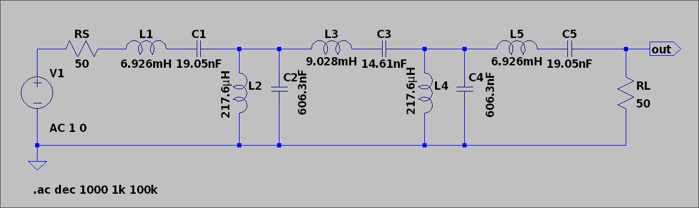

:PROPERTIES:
:ID:       679dfcf8-3294-4bc4-823a-dd77ed22581d
:END:
#+title: ENG439 - High Frequency Electronics - Design Report
#+date: [2026-09-18 Fri 18:07]
#+AUTHOR: Baley Eccles - 652137 and Tyler Robards - 651790
#+STARTUP: latexpreview
#+FILETAGS: :Assignment:UTAS:2026:
#+LATEX_HEADER: \usepackage[a4paper, margin=1in]{geometry}
#+LATEX_HEADER_EXTRA: \usepackage{minted}
#+LATEX_HEADER_EXTRA: \usepackage{fontspec}
#+LATEX_HEADER_EXTRA: \setmonofont{Iosevka}
#+LATEX_HEADER_EXTRA: \setminted{fontsize=\small, frame=single, breaklines=true}
#+LATEX_HEADER_EXTRA: \usemintedstyle{emacs}
#+LATEX_HEADER_EXTRA: \usepackage{float}
#+LATEX_HEADER_EXTRA: \usepackage[final]{pdfpages}
#+LATEX_HEADER_EXTRA: \setlength{\parindent}{0pt}
#+LATEX_HEADER_EXTRA: \setlength{\parskip}{1em}
#+LATEX_HEADER: \usepackage[export]{adjustbox}
#+LATEX_CLASS: article
#+LATEX_CLASS_OPTIONS: [12pt]

* Question 1

** (a) Component values
The centre frequency can be calculated as follows:
\begin{align*}
f_c &= \sqrt{f_L f_H} \\
f_c &= \sqrt{(12\times10^{3})(16\times10^3)} \\
f_c &= 13.856\ \textrm{kHz}
\end{align*}

For a 5th order $3\ \textrm{dB}$ ripple Chebyshev prototype the normalised values are:
\begin{align*}
g_1 &= 3.4815 \\
g_2 &= 0.7619 \\
g_3 &= 4.5378 \\
g_4 &= 0.7619 \\
g_5 &= 3.4815
\end{align*}

The low pass prototype topology is:
\[\textrm{series } g_1 \rightarrow \textrm{shunt } g_2 \rightarrow \textrm{series } g_3 \rightarrow \textrm{shunt } g_4 \rightarrow \textrm{series } g_5\]

To transform this into a band-pass filter we can use:
\begin{align*}
\textrm{series} \rightarrow L_{BP} &= \frac{g_kZ_0}{\omega_0 \Delta} \textrm{ in series with } C_{BP} = \frac{\Delta}{Z_0\omega_0 g_k} \\
\textrm{shunt} \rightarrow L_{BP} &= \frac{\Delta Z_0}{\omega_0 g_k} \textrm{ in parallel with } C_{BP} = \frac{g_k}{Z_0\omega_0 \Delta}
\end{align*}

Where $\Delta$ can be calculated as the following:
\begin{align*}
\Delta &= \frac{f_H - f_L}{f_c} \\
\Delta &= \frac{16\times10^3 - 12\times10^3}{13.856\times10^3} \\
\Delta &= 0.288675
\end{align*}

Using the ~MATLAB~/Octave code in Appendix A we can find the required component inductance and capacitance values to be:
|---------+-----------------------+------------------------+----------------------|
| Section | Connection            | Inductor               | Capacitor            |
|---------+-----------------------+------------------------+----------------------|
|       1 | Series LC             | $6.926\ \textrm{mH}$   | $19.05\ \textrm{nF}$ |
|       2 | Parallel LC to ground | $217.6\ \mu\textrm{H}$ | $606.3\ \textrm{nF}$ |
|       3 | Series LC             | $9.028\ \textrm{mH}$   | $14.61\ \textrm{nF}$ |
|       4 | Parallel LC to ground | $217.6\ \mu\textrm{H}$ | $606.3\ \textrm{nF}$ |
|       5 | Series LC             | $6.926\ \textrm{mH}$   | $19.05\ \textrm{nF}$ |
|---------+-----------------------+------------------------+----------------------|

#+BEGIN_SRC octave :results output :exports none :session Q1 :eval no-export :tangle ENG439_Design_Report_Q1_a.m
clc
clear
close all

if exist('OCTAVE_VERSION', 'builtin')
  set(0, "DefaultLineLineWidth", 2);
  set(0, "DefaultAxesFontSize", 25);
  warning('off');
end

%% Given values
fL = 12e3;
fH = 16e3;
Z0 = 50;

%% 5th-order, 3 dB Chebyshev prototype values
g = [3.4815, 0.7619, 4.5378, 0.7619, 3.4815];

%% Centre frequency
fc = sqrt(fL * fH);

%% Centre angular frequency
w0 = 2*pi*fc;

%% Bandwidth
BW = fH - fL;

%% Fractional bandwidth
Delta = BW / fc;

fprintf("Centre frequency = %.3f kHz\n", fc/1e3);
fprintf("Bandwidth = %.3f kHz\n", BW/1e3);
fprintf("Fractional bandwidth = %.6f\n\n", Delta);

for k = 1:5

  if mod(k,2) == 1
    %% Series prototype element -> series LC

    L = (g(k)*Z0) / (w0*Delta);
    C = Delta / (Z0*w0*g(k));

    fprintf("g%d = %.4f, Series LC\n", k, g(k));
    fprintf("L%d = %.4f mH\n", k, L*1e3);
    fprintf("C%d = %.4f nF\n\n", k, C*1e9);

  else
    %% Shunt prototype element -> parallel LC

    L = (Delta*Z0) / (w0*g(k));
    C = g(k) / (Z0*w0*Delta);

    fprintf("g%d = %.4f, Parallel LC\n", k, g(k));
    fprintf("L%d = %.4f uH\n", k, L*1e6);
    fprintf("C%d = %.4f nF\n\n", k, C*1e9);

  end
end
#+END_SRC

#+RESULTS:
#+begin_example
Centre frequency = 13.856 kHz
Bandwidth = 4.000 kHz
Fractional bandwidth = 0.288675
g1 = 3.4815, Series LC
L1 = 6.9262 mH
C1 = 19.0477 nF

g2 = 0.7619, Parallel LC
L2 = 217.5960 uH
C2 = 606.3008 nF

g3 = 4.5378, Series LC
L3 = 9.0277 mH
C3 = 14.6138 nF

g4 = 0.7619, Parallel LC
L4 = 217.5960 uH
C4 = 606.3008 nF

g5 = 3.4815, Series LC
L5 = 6.9262 mH
C5 = 19.0477 nF
#+end_example

** (b) LTspice simulation
#+ATTR_LATEX: :placement [H]
#+CAPTION: \label{fig:LTSpice} LTSpice circuit of designed filter

Figure \ref{fig:ENG439_Design_Report_Q1_b} shows a normalised plot of the, it was plotted using $20\log_{10}\left(\left|\frac{V_{\textrm{in}}}{V_{\textrm{out}}}\right|\right)$. This removes the voltage divider effect of the source and allows the filter response to be referenced to $0\ \textrm{dB}$.

#+ATTR_LATEX: :placement [H]
#+CAPTION: \label{fig:ENG439_Design_Report_Q1_b} Plot of the filter simulated in LTSpice
[[./ENG439_Design_Report_Q1_b.png]]

From Figure \ref{fig:ENG439_Design_Report_Q1_b} we can see the lower and upper $-3\ \textrm{dB}$ cut-off frequencies at $12\ \textrm{kHz}$ and $16\ \textrm{kHz}$, respectively. The bandwidth is $4\ \textrm{kHz}$, which can also be seen in the plot or by calculating it from the cut-off frequencies.

#+BEGIN_SRC octave :results output :exports none :session Q1_b :eval no-export :tangle ENG439_Design_Report_Q1_b.m
clc
clear
close all

if exist('OCTAVE_VERSION', 'builtin')
  set(0, "DefaultLineLineWidth", 2);
  set(0, "DefaultAxesFontSize", 25);
  warning('off');
end

filename = "~/UTAS/ENG439 -  High Frequency Electronics/Data_Project_Q1_a_copy.txt";
data = dlmread(filename, ",");

freq = data(:,1);
mag_dB = data(:,2);

%% Find all points where response is above -3 dB
passband = mag_dB >= -3;

%% First and last points in passband
iL = find(passband, 1, "first");
iH = find(passband, 1, "last");

%% Interpolate -3 dB crossings
fL = interp1(mag_dB([iL-1 iL]), freq([iL-1 iL]), -3);
fH = interp1(mag_dB([iH iH+1]), freq([iH iH+1]), -3);

BW = fH - fL;
fc = sqrt(fL * fH);

%% Print results
fprintf("Lower -3 dB cutoff = %.3f kHz\n", fL/1e3);
fprintf("Upper -3 dB cutoff = %.3f kHz\n", fH/1e3);
fprintf("Bandwidth = %.3f kHz\n", BW/1e3);
fprintf("Centre frequency = %.3f kHz\n", fc/1e3);

%% Plot
plot(freq/1e3, mag_dB)
grid on;
hold on;
yline(-3, "--");
xline(fL/1e3, "--");
xline(fH/1e3, "--");
plot(fL/1e3, -3, "o");
plot(fH/1e3, -3, "o");
xline(fc/1e3, ":");

text(fL/1e3, 5, sprintf("f_L = %.3f kHz", fL/1e3), "HorizontalAlignment", "right", "FontSize", 20);
text(fH/1e3, 5, sprintf("f_H = %.3f kHz", fH/1e3), "HorizontalAlignment", "right", "FontSize", 20);
text(fc/1e3, -15, sprintf("f_c = %.3f kHz", fc/1e3), "HorizontalAlignment", "right", "FontSize", 20);
text(fc/1e3, -25, sprintf("BW = %.3f kHz", BW/1e3), "HorizontalAlignment", "right", "FontSize", 20);

xlabel("Frequency (kHz)");
ylabel("Magnitude (dB)");
title("5th Order 3 dB Chebyshev Band-Pass Filter");

xlim([10, 18]);
ylim([-50, 10]);

hold off;

print("ENG439_Design_Report_Q1_b.png", "-dpng", "-r500");
#+END_SRC

#+RESULTS:
: Lower -3 dB cutoff = 12.001 kHz
: Upper -3 dB cutoff = 16.000 kHz
: Bandwidth = 3.999 kHz
: Centre frequency = 13.857 kHz

* Question 2
** (a) Multisection Quarter-Wave Transformer
Impedance ratio:
\[\frac{Z_L}{Z_0} = \frac{75}{50} = 1.5\]
Let's design a three section quarter-wave transformer, so $N=3$, so the binomial coefficients can be found in the following:
\begin{align*}
C_n^N &= \frac{N!}{(N-n)!n!} \\
C_0^3 &= \frac{3!}{(3-0)!0!} = 1 \\
C_1^3 &= \frac{3!}{(3-1)!1!} = 3 \\
C_2^3 &= \frac{3!}{(3-2)!2!} = 3 \\
C_3^3 &= \frac{3!}{(3-3)!3!} = 1 \\
\end{align*}
Next the impedance of each section can be calculated using the following:
\begin{align*}
\ln\left(\frac{Z_{n+1}}{Z_n}\right) &\approx 2^{-N}C_n^N\ln\left(\frac{Z_L}{Z_0}\right) \\
\ln\left(\frac{Z_1}{50}\right) &\approx \frac{1}{8}(1)\ln\left(1.5\right) \\
\Rightarrow Z_1 &= 52.60\ \Omega \\
\ln\left(\frac{Z_2}{52.60}\right) &\approx \frac{1}{8}(3)\ln\left(1.5\right) \\
\Rightarrow Z_2 &= 61.24\ \Omega \\
\ln\left(\frac{Z_3}{61.24}\right) &\approx \frac{1}{8}(3)\ln\left(1.5\right) \\
\Rightarrow Z_3 &= 71.29\ \Omega \\
\end{align*}

Every section will have an electrical length of $\theta = 90^{\circ}$ at $f_0 = 2\ \textrm{GHz}$.

#+BEGIN_SRC octave :results output :exports none :session Q2_a :eval no-export :tangle ENG439_Design_Report_Q2_a.m
clc
clear
close all

if exist('OCTAVE_VERSION', 'builtin')
  set(0, "DefaultLineLineWidth", 2);
  set(0, "DefaultAxesFontSize", 25);
  warning('off');
end

Z0 = 50;
ZL = 75;
N = 3;
%% Binomial coefficients for N = 3
C = [1, 3, 3, 1];
Z = zeros(1, N + 2);
Z(1) = Z0;

for n = 0:N
  Z(n+2) = Z(n+1) * exp((2^-N) * C(n+1) * log(ZL/Z0));
end

fprintf("Z0 = %.4f ohm\n", Z(1));
fprintf("Z1 = %.4f ohm\n", Z(2));
fprintf("Z2 = %.4f ohm\n", Z(3));
fprintf("Z3 = %.4f ohm\n", Z(4));
fprintf("ZL = %.4f ohm\n", Z(5));
#+END_SRC

#+RESULTS:
: Z0 = 50.0000 ohm
: Z1 = 52.5995 ohm
: Z2 = 61.2372 ohm
: Z3 = 71.2935 ohm
: ZL = 75.0000 ohm

** (b) ABCD matrices and $S_{11}$
Using the ABCD matrix for a lossless transmission line:
\[M_i = \begin{bmatrix}
A & B \\
C & D \\
\end{bmatrix} = \begin{bmatrix}
\cos(\theta) & jZ_c\sin(\theta) \\
j\frac{\sin(\theta)}{Z_c} & \cos(\theta)
\end{bmatrix}\]
We can get the total ABCD matrix as:
\[M = M_1M_2M_3\]

The input impedance can be used to find:
\begin{align*}
Z_{\textrm{in}} &= \frac{A Z_L + B}{C Z_L + D} \\
S_{11} &= \Gamma_{\textrm{in}} = \frac{Z_{\textrm{in}} - Z_0}{Z_{\textrm{in}} + Z_0}
\end{align*}

The change in angle in terms of frequency can be found as the following:
\begin{align*}
\theta &= \beta l \\
\beta &= \frac{2\pi}{\lambda} \\
\lambda &= \frac{v_p}{f} \\
\beta &= \frac{2\pi f}{v_p} \\
\Rightarrow \theta(f) &= \frac{2\pi f}{v_p}l
\end{align*}
Using $l = \frac{\lambda_0}{4}$ and $\lambda_0 = \frac{v_0}{f_0}$ we get:
\begin{align*}
l &= \frac{v_p}{4f_0} \\
\Rightarrow \theta(f) &= \frac{\pi}{2}\frac{f}{f_0}
\end{align*}

#+ATTR_LATEX: :placement [H]
#+CAPTION: \label{fig:ENG439_Design_Report_Q2_b} Plot of maximally flat quarter-wave transformer
[[./ENG439_Design_Report_Q2_b.png]]

From Figure \ref{fig:ENG439_Design_Report_Q2_b} we can find that the $|S_{11}| < -20\ \textrm{dB}$ from $0.842\ \textrm{GHz}$ to $3.158\ \textrm{GHz}$, this corresponds to a bandwidth of $2.317\ \textrm{GHz}$.

#+BEGIN_SRC octave :results output :exports none :session Q2_a :eval no-export :tangle ENG439_Design_Report_Q2_b.m
clc
clear
close all

if exist('OCTAVE_VERSION', 'builtin')
  set(0, "DefaultLineLineWidth", 2);
  set(0, "DefaultAxesFontSize", 25);
  warning('off');
end

%% Given values
Z0 = 50;
ZL = 75;
f0 = 2e9;

f = linspace(0, 4e9, 5001);

%% 3-section binomial transformer
ratio = ZL / Z0;

Z1 = Z0 * ratio^(1/8);
Z2 = Z0 * ratio^(4/8);
Z3 = Z0 * ratio^(7/8);

Z = [Z1, Z2, Z3];

fprintf("Binomial transformer:\n");
fprintf("Z1 = %.3f ohm\n", Z1);
fprintf("Z2 = %.3f ohm\n", Z2);
fprintf("Z3 = %.3f ohm\n\n", Z3);

%% Calculate S11
S11 = zeros(size(f));

for n = 1:length(f)
  %% Electrical length at this frequency
  theta = (pi/2) * (f(n)/f0);
  
  M = eye(2);
  for k = 1:3
    Zc = Z(k);
    Mk = [cos(theta),1j*Zc*sin(theta);
          1j*sin(theta)/Zc,cos(theta)];
    M = M * Mk;
  end

  A = M(1,1);
  B = M(1,2);
  C = M(2,1);
  D = M(2,2);

  %% Input impedance
  Zin = (A*ZL + B) / (C*ZL + D);
  %% Reflection coefficient
  S11(n) = (Zin - Z0) / (Zin + Z0);
end

%% Convert to dB
S11_dB = 20*log10(abs(S11));

%% Find region below -20 dB
good = S11_dB < -20;
f_lower = f(find(good, 1, "first"));
f_upper = f(find(good, 1, "last"));
fprintf("|S11| < -20 dB from %.3f GHz to %.3f GHz\n", f_lower/1e9, f_upper/1e9);
fprintf("Bandwidth = %.3f GHz\n", (f_upper - f_lower)/1e9);

%% Plot
plot(f/1e9, S11_dB, "LineWidth", 1.5);
grid on;
hold on;
yline(-20, "--");
xlabel("Frequency (GHz)");
ylabel("|S_{11}| (dB)");
title("3-Section Binomial Quarter-Wave Transformer");
hold off;
pause(1)
print("ENG439_Design_Report_Q2_b.png",'-dpng','-r500');
#+END_SRC

#+RESULTS:
: Binomial transformer:
: Z1 = 52.599 ohm
: Z2 = 61.237 ohm
: Z3 = 71.293 ohm
: |S11| < -20 dB from 0.842 GHz to 3.158 GHz
: Bandwidth = 2.317 GHz

** (c) Chebyshev Transformer
*** With $\Gamma_m = 0.05$
As before, we will design a 3 section transformer ($N=3$).

The reflection coefficient for $N=3$ is:
\[\Gamma(\theta) = 2e^{-j3\theta}(\Gamma_0 \cos(3\theta) + \Gamma_1\cos(\theta))\]

The desired response is:
\[\Gamma(\theta) = \Gamma_me^{-j3\theta}T_3(\sec(\theta_m)\cos(\theta))\]

Next, $\theta_m$ can be found:
\begin{align*}
\sec(\theta_m) &= \cosh\left[\frac{1}{N}\cosh^{-1}\left(\frac{\ln\left(\frac{Z_L}{Z_0}\right)}{2\Gamma_m}\right)\right] \\
\sec(\theta_m) &= \cosh\left[\frac{1}{3}\cosh^{-1}\left(\frac{\ln\left(\frac{75}{50}\right)}{2\cdot 0.05}\right)\right] \\
\Rightarrow \theta_m &= 36.84^{\circ}
\end{align*}

Next we can find $\Gamma_0$ and $\Gamma_1$ as follows:
\begin{align*}
2 e^{-j3\theta}(\Gamma_0 \cos(3\theta) + \Gamma_1\cos(\theta)) &= \Gamma_me^{-j3\theta}T_3(\sec(\theta_m)\cos(\theta)) \\
T_3(x) &= 4x^3 - 3x \\
\Rightarrow 2\left(\Gamma_0\cos(3\theta)+\Gamma_1\cos(\theta)\right) &= \Gamma_m \left[\sec^3(\theta_m)\cos(3\theta) + 3(\sec^3(\theta_m)-\sec(\theta_m))\cos(\theta)\right]
\end{align*}

Equating coefficients:
\begin{align*}
2\Gamma_0 &= \Gamma_m \sec^3(\theta_m) \\
\Gamma_0 &= \frac{\Gamma_m }{2}\sec^3(\theta_m) \\
\Gamma_0 &= \frac{0.05}{2}\sec^3(36.84^{\circ}) \\
\Gamma_0 &= 0.04877 \\
\\
2\Gamma_1 &= 3\Gamma_m(\sec^3(\theta_m)  - \sec(\theta_m)) \\
\Gamma_1 &= \frac{3\Gamma_m }{2}(\sec^3(\theta_m) - \sec(\theta_m)) \\
\Gamma_1 &= \frac{3\cdot 0.05}{2}(\sec^3(36.84^{\circ}) - \sec(36.84^{\circ})) \\
\Gamma_1 &= 0.05260
\end{align*}

By symmetry:
\begin{align*}
\Gamma_3 &= \Gamma_0 = 0.04877 \\
\Gamma_2 &= \Gamma_1 = 0.05260
\end{align*}

Then the characteristic impedances can be found:
\begin{align*}
\ln\left(\frac{Z_{n+1}}{Z_n}\right) &\approx 2\Gamma_n \\
\ln(Z_1) &= \ln(Z_0) + 2\Gamma_0 \\
\ln(Z_1) &= \ln(50) + 2\cdot 0.04877 \\
Z_1 &= 55.12\ \Omega \\
\ln(Z_2) &= \ln(Z_1) + 2\Gamma_1 \\
\ln(Z_2) &= \ln(55.12) + 2\cdot 0.05260 \\
Z_2 &= 61.24\ \Omega \\
\ln(Z_3) &= \ln(Z_2) + 2\Gamma_2 \\
\ln(Z_3) &= \ln(61.24) + 2\cdot 0.05260 \\
Z_3 &= 68.03\ \Omega
\end{align*}

Finally we can verify the load impedance as:
\begin{align*}
Z_L &= Z_3e^{2\Gamma_3} \\
Z_L &= 68.03\cdot\exp(2\cdot 0.04877) \\
Z_L &= 75\ \Omega
\end{align*}

The bandwidth can be found using:
\begin{align*}
\frac{\Delta f}{f_0} &= 2 - \frac{4\theta_m}{\pi} \\
\frac{\Delta f}{f_0} &= 2 - \frac{4\cdot 36.84^{\circ}}{180^{\circ}} \\
\frac{\Delta f}{f_0} &= 1.1813 \\
\Rightarrow \Delta f &= 1.1813\cdot 2\ \textrm{GHz} \\
\Delta f &= 2.363\ \textrm{GHz}
\end{align*}

The high and low edges of bandwidth can be found as:
\begin{align*}
f_L &= f_0 - \frac{\Delta f}{2} \\
f_L &= 0.819\ \textrm{GHz} \\
f_H &= f_0 + \frac{\Delta f}{2} \\
f_H &= 3.181\ \textrm{GHz}
\end{align*}

*** With $\Gamma_m = 0.20$
For $\Gamma_m = 0.20$, as before, we will design a 3 section transformer ($N=3$).

The reflection coefficient for $N=3$ is:
\[\Gamma(\theta) = 2e^{-j3\theta}(\Gamma_0 \cos(3\theta) + \Gamma_1\cos(\theta))\]

The desired response is:
\[\Gamma(\theta) = \Gamma_me^{-j3\theta}T_3(\sec(\theta_m)\cos(\theta))\]

Next, $\theta_m$ can be found:
\begin{align*}
\sec(\theta_m) &= \cosh\left[\frac{1}{N}\cosh^{-1}\left(\frac{\ln\left(\frac{Z_L}{Z_0}\right)}{2\Gamma_m}\right)\right] \\
\sec(\theta_m) &= \cosh\left[\frac{1}{3}\cosh^{-1}\left(\frac{\ln\left(\frac{75}{50}\right)}{2\cdot 0.20}\right)\right] \\
\Rightarrow \theta_m &= 3.152^{\circ}
\end{align*}

Next we can find $\Gamma_0$ and $\Gamma_1$ as follows:
\begin{align*}
2e^{-j3\theta}(\Gamma_0 \cos(3\theta) + \Gamma_1\cos(\theta)) &= \Gamma_me^{-j3\theta}T_3(\sec(\theta_m)\cos(\theta)) \\
T_3(x) &= 4x^3 - 3x \\
\Rightarrow 2(\Gamma_0\cos(3\theta)+\Gamma_1\cos(\theta)) &= \Gamma_m \left[\sec^3(\theta_m)\cos(3\theta) + 3(\sec^3(\theta_m) - \sec(\theta_m))\cos(\theta)\right]
\end{align*}

Equating coefficients:
\begin{align*}
2\Gamma_0 &= \Gamma_m\sec^3(\theta_m) \\
\Gamma_0 &= \frac{\Gamma_m}{2}\sec^3(\theta_m) \\
\Gamma_0 &= \frac{0.20}{2}\sec^3(3.152^{\circ}) \\
\Gamma_0 &= 0.10046 \\
\\
2\Gamma_1 &= 3\Gamma_m(\sec^3(\theta_m) - \sec(\theta_m)) \\
\Gamma_1 &= \frac{3\Gamma_m}{2}(\sec^3(\theta_m) - \sec(\theta_m)) \\
\Gamma_1 &= \frac{3\cdot0.20}{2}
\left(\sec^3(3.152^{\circ})-\sec(3.152^{\circ})\right) \\
\Gamma_1 &= 0.000911
\end{align*}

By symmetry:
\begin{align*}
\Gamma_3 &= \Gamma_0 = 0.10046 \\
\Gamma_2 &= \Gamma_1 = 0.000911
\end{align*}

Then the characteristic impedances can be found:
\begin{align*}
\ln\left(\frac{Z_{n+1}}{Z_n}\right) &\approx 2\Gamma_n \\
\ln(Z_1) &= \ln(Z_0) + 2\Gamma_0 \\
\ln(Z_1) &= \ln(50) + 2(0.10046) \\
Z_1 &= 61.13\ \Omega \\
\\
\ln(Z_2) &= \ln(Z_1) + 2\Gamma_1 \\
\ln(Z_2) &= \ln(61.13) + 2(0.000911) \\
Z_2 &= 61.24\ \Omega \\
\\
\ln(Z_3) &= \ln(Z_2) + 2\Gamma_2 \\
\ln(Z_3) &= \ln(61.24) + 2(0.000911) \\
Z_3 &= 61.35\ \Omega
\end{align*}

Finally, we can verify the load impedance:
\begin{align*}
Z_L &= Z_3e^{2\Gamma_3} \\
Z_L &= 61.35\exp(2\cdot0.10046) \\
Z_L &= 75.00\ \Omega
\end{align*}

The bandwidth can be found using:
\begin{align*}
\frac{\Delta f}{f_0} &= 2-\frac{4\theta_m}{\pi} \\
\frac{\Delta f}{f_0} &= 2-\frac{4\cdot3.152^{\circ}}{180^{\circ}} \\
\frac{\Delta f}{f_0} &= 1.92996 \\
\Rightarrow \Delta f &= 1.92996\cdot2\ \textrm{GHz} \\
\Delta f &= 3.860\ \textrm{GHz}
\end{align*}

The high and low edges of the equal-ripple bandwidth can be found as:
\begin{align*}
f_L &= f_0-\frac{\Delta f}{2} \\
f_L &= 2-\frac{3.860}{2} \\
f_L &= 0.070\ \textrm{GHz} \\
\\
f_H &= f_0+\frac{\Delta f}{2} \\
f_H &= 2+\frac{3.860}{2} \\
f_H &= 3.930\ \textrm{GHz}
\end{align*}

Therefore, increasing $\Gamma_m$ from $0.05$ to $0.20$ substantially increases the equal-ripple matching bandwidth. This occurs because the larger allowable reflection coefficient relaxes the matching requirement, trading increased reflection within the passband for a wider equal-ripple bandwidth.

#+BEGIN_SRC octave :results output :exports none :session Q2_a :eval no-export :tangle ENG439_Design_Report_Q2_c.m
clc
clear
close all

if exist('OCTAVE_VERSION', 'builtin')
  set(0, "DefaultLineLineWidth", 2);
  set(0, "DefaultAxesFontSize", 25);
  warning('off');
end

%% Given
Z0 = 50;
ZL = 75;
f0 = 2e9;

f = linspace(0, 4e9, 5001);

%% Binomial transformer
ratio = ZL / Z0;
Z_bin = [Z0 * ratio^(1/8), Z0 * ratio^(4/8), Z0 * ratio^(7/8)];

%% Chebyshev transformer, Gamma_m = 0.05
Z_cheb_005 = [55.12, 61.24, 68.03];

%% Chebyshev transformer, Gamma_m = 0.20
Z_cheb_020 = [61.126, 61.237, 61.349];

fprintf("Binomial:\n");
fprintf("Z1 = %.3f ohm\n", Z_bin(1));
fprintf("Z2 = %.3f ohm\n", Z_bin(2));
fprintf("Z3 = %.3f ohm\n\n", Z_bin(3));

fprintf("Chebyshev Gamma_m = 0.05:\n");
fprintf("Z1 = %.3f ohm\n", Z_cheb_005(1));
fprintf("Z2 = %.3f ohm\n", Z_cheb_005(2));
fprintf("Z3 = %.3f ohm\n\n", Z_cheb_005(3));

fprintf("Chebyshev Gamma_m = 0.20:\n");
fprintf("Z1 = %.3f ohm\n", Z_cheb_020(1));
fprintf("Z2 = %.3f ohm\n", Z_cheb_020(2));
fprintf("Z3 = %.3f ohm\n\n", Z_cheb_020(3));

%% Calculate S11
S11_bin = zeros(size(f));
S11_cheb_005 = zeros(size(f));
S11_cheb_020 = zeros(size(f));

for n = 1:length(f)
  theta = (pi/2) * (f(n)/f0);
  
  %% Binomial
  M = eye(2);
  for k = 1:3
    Zc = Z_bin(k);
    Mk = [cos(theta), 1j*Zc*sin(theta); 1j*sin(theta)/Zc, cos(theta)];
    M = M * Mk;
  end

  A = M(1,1);
  B = M(1,2);
  C = M(2,1);
  D = M(2,2);

  Zin = (A*ZL + B) / (C*ZL + D);
  S11_bin(n) = (Zin - Z0) / (Zin + Z0);

  %% Chebyshev Gamma_m = 0.05
  M = eye(2);

  for k = 1:3
    Zc = Z_cheb_005(k);
    Mk = [cos(theta), 1j*Zc*sin(theta); 1j*sin(theta)/Zc, cos(theta)];
    M = M * Mk;
  end

  A = M(1,1);
  B = M(1,2);
  C = M(2,1);
  D = M(2,2);

  Zin = (A*ZL + B) / (C*ZL + D);
  S11_cheb_005(n) = (Zin - Z0) / (Zin + Z0);

  %% Chebyshev Gamma_m = 0.20
  M = eye(2);

  for k = 1:3
    Zc = Z_cheb_020(k);
    Mk = [cos(theta), 1j*Zc*sin(theta); 1j*sin(theta)/Zc, cos(theta)];
    M = M * Mk;
  end

  A = M(1,1);
  B = M(1,2);
  C = M(2,1);
  D = M(2,2);

  Zin = (A*ZL + B) / (C*ZL + D);
  S11_cheb_020(n) = (Zin - Z0) / (Zin + Z0);

end

%% Convert to dB
S11_bin_dB = 20*log10(abs(S11_bin));
S11_cheb_005_dB = 20*log10(abs(S11_cheb_005));
S11_cheb_020_dB = 20*log10(abs(S11_cheb_020));

%% Find all -20 dB intercepts
threshold = -20;

find_intercepts = @(freq, y) freq(find((y(1:end-1)-threshold) .* (y(2:end)-threshold) <= 0));

intercepts_bin = find_intercepts(f, S11_bin_dB);
intercepts_005 = find_intercepts(f, S11_cheb_005_dB);
intercepts_020 = find_intercepts(f, S11_cheb_020_dB);

fprintf("-20 dB intercepts:\n");

fprintf("Binomial:\n");
for k = 1:length(intercepts_bin)
  fprintf("  %.3f GHz\n", intercepts_bin(k)/1e9);
end

fprintf("Gamma_m = 0.05:\n");
for k = 1:length(intercepts_005)
  fprintf("  %.3f GHz\n", intercepts_005(k)/1e9);
end

fprintf("Gamma_m = 0.20:\n");
for k = 1:length(intercepts_020)
  fprintf("  %.3f GHz\n", intercepts_020(k)/1e9);
end

%% Plot
plot(f/1e9, S11_bin_dB);
hold on;
plot(f/1e9, S11_cheb_005_dB);
plot(f/1e9, S11_cheb_020_dB);
plot([0, 4], [-20, -20], "--");

grid on;

xlabel("Frequency (GHz)");
ylabel("|S_{11}| (dB)");
title("Binomial and Chebyshev Matching Transformers");

legend("Binomial", "Chebyshev, \Gamma_m = 0.05", "Chebyshev, \Gamma_m = 0.20", "-20 dB limit");
xlim([0 4]);
hold off;

pause(1)
print("ENG439_Design_Report_Q2_c.png", "-dpng", "-r500");
#+END_SRC

#+RESULTS:
#+begin_example
Binomial:
Z1 = 52.599 ohm
Z2 = 61.237 ohm
Z3 = 71.293 ohm
Chebyshev Gamma_m = 0.05:
Z1 = 55.120 ohm
Z2 = 61.240 ohm
Z3 = 68.030 ohm
Chebyshev Gamma_m = 0.20:
Z1 = 61.126 ohm
Z2 = 61.237 ohm
Z3 = 61.349 ohm
-20 dB intercepts:
Binomial:
0.841 GHz
  3.158 GHz
Gamma_m = 0.05:
0.634 GHz
  3.365 GHz
Gamma_m = 0.20:
0.450 GHz
  0.890 GHz
  1.778 GHz
  2.221 GHz
  3.109 GHz
  3.550 GHz
#+end_example
*** Comparison
Figure \ref{fig:ENG439_Design_Report_Q2_c} compares the maximally flat binomial transformer with the two Chebyshev transformer designs. Using the required criterion of $|S_{11}|<-20\ \textrm{dB}$, the binomial transformer achieves a bandwidth of $2.317\ \textrm{GHz}$, from $0.841\ \textrm{GHz}$ to $3.158\ \textrm{GHz}$. The Chebyshev transformer with $\Gamma_m=0.05$ achieves a wider bandwidth of $2.731\ \textrm{GHz}$, from $0.634\ \textrm{GHz}$ to $3.365\ \textrm{GHz}$.

The Chebyshev transformer with $\Gamma_m=0.20$ does not maintain $|S_{11}|<-20\ \textrm{dB}$ continuously between its outermost crossings. Instead, it satisfies the $-20\ \textrm{dB}$ requirement over three separate frequency bands: $0.450\rightarrow 0.890\ \textrm{GHz}$, $1.778 \rightarrow 2.221\ \textrm{GHz}$, and $3.109 \rightarrow 3.550\ \textrm{GHz}$. These correspond to individual bandwidths of approximately $0.440\ \textrm{GHz}$, $0.443\ \textrm{GHz}$, and $0.441\ \textrm{GHz}$, respectively. The region from $0.450\ \textrm{GHz}$ to $3.550\ \textrm{GHz}$ cannot be considered a single usable bandwidth under the specified $-20\ \textrm{dB}$ requirement, but three separate bands.

The results demonstrate the trade-off introduced by the Chebyshev design. The binomial transformer provides a maximally flat response around the centre frequency, whereas the Chebyshev transformer permits an equal-ripple response in exchange for a potentially wider matching region. For $\Gamma_m=0.05$, this trade-off produces a wider continuous $-20\ \textrm{dB}$ bandwidth than the binomial design. However, for $\Gamma_m=0.20$, the permitted ripple is sufficiently large that the response repeatedly rises above the required $-20\ \textrm{dB}$ limit. Consequently, increasing $\Gamma_m$ does not necessarily increase the continuous bandwidth when a stricter fixed requirement of $|S_{11}|<-20\ \textrm{dB}$ is imposed.

#+ATTR_LATEX: :placement [H]
#+CAPTION: \label{fig:ENG439_Design_Report_Q2_c} Plot comparing all three designed transformers
[[./ENG439_Design_Report_Q2_c.png]]

\newpage
* Appendix A - MATLAB/Octave Code For Question 1 a
#+INCLUDE: "./ENG439_Design_Report_Q1_a.m" src octave
\newpage
* Appendix B - MATLAB/Octave Code For Question 1 b
#+INCLUDE: "./ENG439_Design_Report_Q1_b.m" src octave
\newpage
* Appendix C - MATLAB/Octave Code For Question 2 a
#+INCLUDE: "./ENG439_Design_Report_Q2_a.m" src octave
\newpage
* Appendix D - MATLAB/Octave Code For Question 2 b
#+INCLUDE: "./ENG439_Design_Report_Q2_b.m" src octave
\newpage
* Appendix E - MATLAB/Octave Code For Question 2 c
#+INCLUDE: "./ENG439_Design_Report_Q2_c.m" src octave

